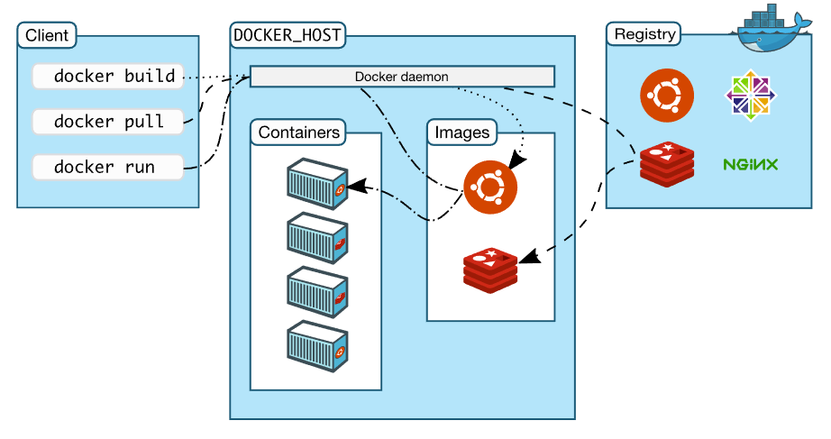
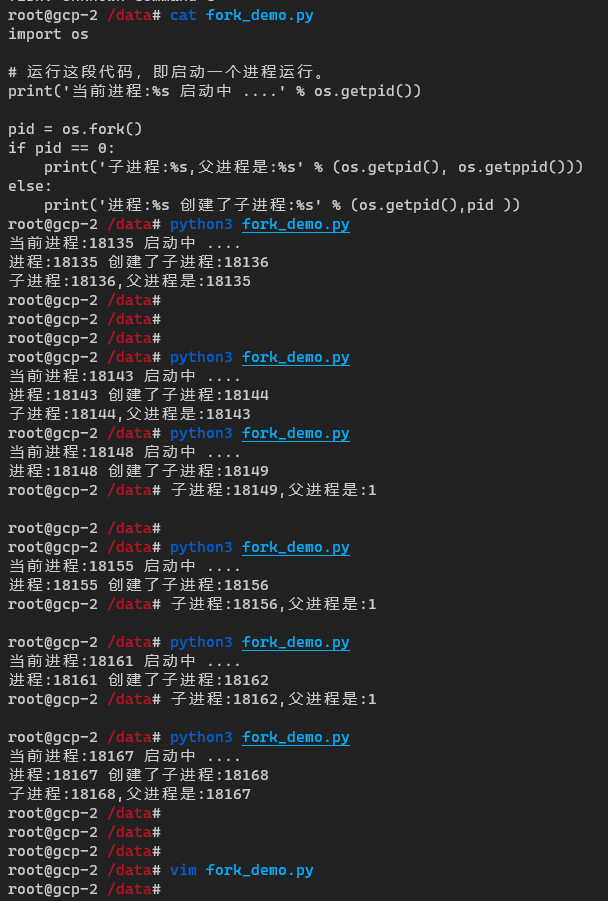

---

---

# Docker 概述


Docker 是一个开源项目，诞生于 2013 年初，最初是 dotCloud 公司内部的一个业余项目。它基于 Google 公司推出的 Go 语言实现。 

项目后来加入了 Linux 基金会，遵从了 Apache 2.0 协议，项目代码在 GitHub 上进行维护。

Docker 自开源后受到广泛的关注和讨论，以至于dotCloud 公司后来都改名为 Docker Inc。

Redhat已经在其 RHEL6.5 中集中支持 Docker；Google 也在其 PaaS 产品中广泛应用。

Docker是一个开发，运输和运行应用程序的开放平台。 Docker 使您可以将应用程序与基础架构分离，以便快速交付软件。

使用 Docker，您可以像管理应用程序一样管理基础架构。

通过利用 Docker 的方法快速发送，测试和部署代码，您可以显着减少编写代码和在生产中运行代码之间的延迟。

Docker提供了在称为容器的松散隔离环境中打包和运行应用程序的功能。隔离和安全性允许您在给定主机上同时运行多个容器。

容器是轻量级的，因为它们不需要管理程序的额外负载，而是直接在主机内核中运行。这意味着您可以在给定硬件组合上运行比使用虚拟机时更多的容器。您甚至可以在实际虚拟机的主机中运行Docker容器！

开发者可以根据配置文件将应用及依赖包放到一个可移植的容器中，然后发布到一定版本以上的任何流行的操作系统上，实现轻量级别的虚拟化。

容器完全使用沙箱机制，通过镜像来保证运行环境的一致性，启动速度秒级之内，可以更好的满足云计算的自动化以及弹性扩容等场景。

Docker 可以在容器内部快速自动化的部署应用，并通过操作系统内核技术( namespaces 、cgroups 等)为容器提供资源隔离与安全保障。

Docker 是以 Docker 容器为资源分割和调度的基本单位，封装整个软件运行时环境为开发者和系统管理员设计的，用于构建、发布和运行分布式应用的平台。

Docker 是一个跨平台、可移植并且简单易用的容器解决方案。

关于 Docker 中一些 更详细的描述和定义，可以参考下面这几篇网站：

> https://www.docker.com/
>
> http://guide.daocloud.io/dcs/docker-9153160.html
>
> https://www.163yun.com/help/documents/158369209000316928


## Docker VS VM

虚拟化定义：虚拟化是一种资源管理技术，是将计算机的各种实体资源，如CPU、内存、物理存储等，予以抽象、转换后呈现出来，打破实体结构间的不可切割的障碍，使用户可以比原本的配置更好的方式来应用这些资源。这些资源的新虚拟部分是不受现有资源的架设方式，地域或物理配置所限制。一般所指的虚拟化资源包括计算能力和数据存储。云计算的核心技术之一就是虚拟化技术。比如我们常见的阿里云腾讯云华为云等。虚拟化的典型技术有 KVM，OpenStack，XEN等。


系统虚拟化，Hypervisor Virtualization，全虚拟化。在 Host 中通过 Hypervisor 层实现安装多个 GuestOS，每个 GuestOS 都有自己的内核，和主机的内核不同，GuestOS 之间完全隔离。

容器虚拟化，Operating System Virtualization ，使用 Linux 内核中的 namespaces 和 cgroups 实现进程组之间的隔离。是用内核技术实现的隔离，所以它是一个共享内核的虚拟化技术。


容器虚拟化没有 GuestOS，使用 Docker 时下载的镜像，只是为运行 App 提供的一个依赖的环境，是一个删减版本的系统镜像。一般情况下系统虚拟化没有容器虚拟化的运行效率高，但是系统安全性高很多。


https://www.backblaze.com/blog/vm-vs-containers/

https://www.redhat.com/zh/topics/virtualization

### Docker 引擎

Docker Engine是一个客户端 - 服务器应用程序，包含以下主要组件：

- 服务端，是一种长时间运行的程序（守护进程），称为 docker daemon（dockerd命令）。
- REST API 接口，它指定程序可以用来与守护进程通信并指示它做什么的接口。
- 客户端命令行（ command line interface）（docker命令）。


docker 客户端命令或 REST API 可以与服务端通讯，向服务端的守护进程下达指令。

docker daemon 创建和管理Docker对象，例如镜像，容器，网络和数据卷等。

### Docker架构

Docker 使用的是 c/s 架构，Docker 客户端与 Docker 守护进程通讯，后者负责构建，运行，分发 Docker 容器。

Docker 客户端和守护进程可以在同一台机器，也可以用 Docker 客户端连接远端 docker 守护进程。

Docker自带的客户端程序是通过 Unix socket 套接字文件来与本地的 dockerd 服务端通讯，Docker 官方也提供了 REST 风格的 API，你也可以开发自己的客户端来使用 HTTP 协议来与服务端通讯。



<center>docker架构图</center>
#### docker 守护进程

Docker守护进程（`dockerd`）监听 Docker API 的请求，并对各种 Docker 对象进行管理，如镜像，容器，网络和卷的管理。

守护程序还可以与其他守护程序通信以管理 Docker 服务。


#### docker 客户端

Docker客户端（`docker`）是许多 Docker 用户与 Docker 交互的主要方式。当您使用诸如docker run之类的命令时，客户端会将这些命令发送到 `dockerd` ，后者将其执行。 `docker` 命令使用 Docker API 。 Docker 客户端可以与多个守护进程通信。

#### Docker Registry

Docker Registry 就是一个镜像商店，它里面可以包括各种镜像，可以分为私有镜像仓库和公有镜像仓库

（其中 docker hub 最为出名，它是由 docker 公司开发，国内有阿里云等镜像市场）。

我们常用的各种开源软件和运行时环境，基本上都可以在 dockerhub registry 上找到 docker 镜像。

一个 Docker Registry 中可以包含多个仓库（`Repository`）；每个仓库可以包含多个标签（`Tag`）；每个标签对应一个镜像。  

> 注意：docker registry是镜像站点，仓库是镜像商店内的软件，人们常说的搭建私有仓库，应该理解成搭建私有docker registry。
>
> 这与 maven 或者其他私有代码仓库的概念有些区别。

通常，一个仓库会包含同一个软件不同版本的镜像，而标签就常用于对应该软件的各个版本。

我们可以通过 `<仓库名>:<标签>` 的格式来指定具体是哪个软件哪个版本的镜像。如果不给出标签，将以 `latest` 作为默认标签。

以 [Ubuntu 镜像](https://store.docker.com/images/ubuntu) 为例，`ubuntu` 是仓库的名字，其内包含有不同的版本标签，如，`14.04`, `16.04`。

我们可以通过 `ubuntu:14.04`，或者 `ubuntu:16.04` 来具体指定所需哪个版本的镜像。

如果忽略了标签，比如 `ubuntu`，那将视为 `ubuntu:latest`。

```shell

docker pull registry-1.docker.io/distribution/registry:2.1

 docker run -d \
  -e REGISTRY_HTTP_ADDR=0.0.0.0:5001 \
  -p 5001:5001 \
  --name registry-test \
  -v /mnt/registry:/var/lib/registry \
  registry-1.docker.io/distribution/registry:2.1
  
  

https://hub.docker.com/r/joxit/docker-registry-ui
```


> 常用的公共 docker registry 服务 
>
> https://cr.console.aliyun.com/
>
> https://hub.docker.com/
>
> https://quay.io/ （红帽® Quay 容器镜像仓库）


#### 私有docker registry

在企业内部，我们可以创建一个本地镜像仓库供企业内部使用。

[`docker-registry`](https://docs.docker.com/registry/) 是官方提供的工具，可以用于构建企业内部的私有镜像仓库。docker registry 最大的缺点就是没有图形化管理界面。


```

```


#### Docker 对象

使用 Docker 时，将会创建和使用镜像，容器，网络，数据卷，插件和其他对象。这些介绍其中一些对象。

镜像：镜像是一个轻量级，独立的，可执行的软件包，它包括运行这个软件的一切：代码，运行时，系统等。

容器：容器就是运行启动起来的镜像。同一个镜像可以启动多个，可以简单理解为容器就是镜像的实例化。

关于容器和镜像的基本概念，可以参考[这篇文章](http://dockone.io/article/6051)，我认为这篇文章名副其实，把 docker 的基本概念介绍的非常清楚。

### 安装 docker

docker的安装见官网安装教程：

> https://docs.docker.com/install/


#### 第一个 docker 实例

看完一大堆理论，赶紧去运行你的第一个 docker 容器吧。docker的使用非常方便。 

一句命令就可以启动 一个 nginx ，感受一下 docker 的方便吧：

docker run -d -p 8080:80 nginx 

其中 -d 指后台运行，-p 将容器内的 80 端口映射到宿主机的 8080 端口上。

启动完访问宿主机的 8080 端口，就能见到熟悉的 nginx 欢迎界面了。


### 配置 docker 

#### 运行 docker

安装好 docker 之后，一般 docker 守护进程会自动启动，我们可以通过直接启动或系统服务的方式来启动 docker。 

##### 直接启动

直接执行 dockerd 命令就可以启动守护进程，它会在前台运行，输出启动日志到终端，使用 ctr+c 命令来停止进程。可以用这种方式来进行测试。

##### 开机启动

大多数当前的Linux发行版（RHEL，CentOS，Fedora，Ubuntu 16.04 及更高版本）使用 systemd 工具来管理系统启动时启动的服务。 

```shell
$ systemctl enable docker  #开机自启
$ systemctl disable docker #开机自启
$ systemctl start docker   #启动docker
$ systemctl restart docker #重启
$ systemctl stop docker    #重启
$ systemctl status docker  #查看状态
```

#### 服务端配置

dockerd 守护进程的配置，有两种方式指定：

- 通过在 dockerd 命令后面指定启动参数。
- 通过 dockerd  --config-file  来指定一个json 格式的配置文件 （默认在/etc/docker/daemon.json）

默认地，这个配置文件不存在，系统按照默认配置启动 docker ，如果想自定义，可以创建这个文件。下面是一个简单的示例：

```json
{
  "debug": true,
  "tls": true,
  "tlscert": "/var/docker/server.pem",
  "tlskey": "/var/docker/serverkey.pem",
  "hosts": ["tcp://192.168.59.3:2376"],
  // 设置阿里镜像
  "registry-mirrors": ["https://td520t0f.mirror.aliyuncs.com"] 
}
```

这个配置文件指定以调试模式启动，开启 TLS 安全传输协议，证书和密钥路径，并监听到 192.168.59.3:2376 。这与下面这个命令是一样的。

```shell
dockerd --debug \
  --tls=true \
  --tlscert=/var/docker/server.pem \
  --tlskey=/var/docker/serverkey.pem \
  --host tcp://192.168.59.3:2376
```

具体的配置选项可以参考 [dockerd reference doc](https://docs.docker.com/engine/reference/commandline/dockerd/) 或者使用 dockerd --help 来查看。

在 Linux 中，一般使用包管理器安装 docker , 默认的 dockerd 守护进程是通过 systemd 管理的。

```shell
# 在这两个文件中，一般都默认设置了 dockerd 的启动参数。
# Ubuntu的路径
/lib/systemd/system/docker.service 
# CentOS 的路径为
/usr/lib/systemd/system/docker.service

ExecStart=/usr/bin/dockerd -H fd:// --containerd=/run/containerd/containerd.sock  --ipv6=false       
ExecReload=/bin/kill -s HUP $MAINPID 
```


#### 远程访问

docker 守护进程使用 unix, tcp, fd 三种类型的 Socket 通信来监听 [Docker Engine API](https://docs.docker.com/develop/sdk/) 。

默认地，docker 会创建一个 /var/run/docker.sock 文件，它只允许本地的 root 权限的用户访问，或 docker 用户组。

这就是进程间通讯（IPC）。我们平时使用 docker ps 等命令就是这样操作的。

默认地，docker 没有开启远程访问，如果需要开启远程访问，需要开启 tcp socket 通讯，需要注意的是，默认安装没有启用对服务端访问的加密和认证。

也就是说一旦开启远程访问，任何人都可以通过 docker 客户端来访问并控制你的 docker 守护进程来进行创建删除容器等操作。

所以必须要开启加密认证或者在守护进程前面加上一个安全的代理。

> 注意：不要轻易开放远程访问，如果开放，要确认开放对象是可信赖的或者开启访问认证和加密传输。

譬如，docker 服务器的内网 ip 是 10.0.0.1，外网 ip 是 45.57.36.48 ：

- 使用 -H tcp://0.0.0.0:2375 来监听的所有网卡的 2375 端口
- 使用 -H tcp://45.57.36.48:2376 来监听45.57.36.48这个网卡的 2376 端口，
- 可以很方便的实现 2375 端口用于非加密访问（内网无须认证），2376 端口用于加密访问，然后通过防火墙规则限定 2375 端口对指定管理终端开放。

下面是一个简单的远程访问的例子：

两台服务器，都安装好 docker ，192.168.1.2 作为服务端，192.168.1.3 作为客户端。

服务端配置文件：

```json
// 三种类型，端口用于远程访问，本地的socker文件，fd用于Systemd based的操作系统
{
  "hosts": ["tcp://0.0.0.0:2375","unix:///var/run/docker.sock","-H fd://"]
}
```

重新加载服务端配置文件

```shell
# 修改配置文件时，要检查Docker服务启动文件传入的命令行参数和配置文件的命令行参数，是否冲突
# /usr/lib/systemd/system/docker.service

$ systemctl restart docker.service
```

在客户端，访问服务端的 docker 服务：

- 通过 http 连接 server ，访问服务端的 info 接口。

  ```shell
  curl http://192.168.1.2:2375/info 
  ```

- 通过 docker 客户端命令访问服务端：

  ```shell
  docker -H tcp://192.168.1.2:2375 info
  
  # 只要远端开了远程，就可以在客户端执行这种命令来访问远端的docker 
  docker -H tcp://192.168.2.85:2375 ps
  ```

默认地，在客户端执行 docker 命令是连接本地的守护进程，可以修改 DOCKER_HOST 环境变量来改变默认连接：

```shell
export DOCKER_HOST="tcp://192.168.1.2:2375"
```

通过将 DOCKER_HOST 置空来恢复本地连接：

```shell
export DOCKER_HOST=""
```


#### **Docker-API**

docker-API 的官网地址是 https://docs.docker.com/engine/api/

不仅仅是容器，还有网络，镜像，

```json
// 如果没有开启远程访问，在宿主机上，可以用 curl 通过 socket 文件来进行通讯，请求这些API

// 查看容器，返回json格式的数据
curl --unix-socket /var/run/docker.sock -X GET http://localhost/containers/json

// 创建容器
curl --unix-socket /var/run/docker.sock -X POST http://localhost/containers/create
{
	// 请求的数据体为json数据
}

// 启动容器
curl --unix-socket /var/run/docker.sock -X POST /containers/{id}/start


```


#### docker 命令

docker 命令主要是用来向服务端守护进程发送控制指令，来进行构建镜像，启动容器等一些列操作。

它包括一系列子命令。每个子命令都有其单独的选项，查看 docker --help 来看命令概述，通过 docker COMMAND --help 来看子命令详细用法。

下面是一些常见的 docker 命令：

```shell
$ docker --help  #查看帮助
$ docker version #查看版本
$ docker pull image #下载镜像
$ docker image ls # 列出所有镜像
$ docker run image #从镜像启动一个新的容器
$ docker ps  #查看运行中的容器，-a 查看所有容器
$ docker 


```


```shell
# docker支持很多子命令

docker run 


```


## docker-machine


# Docker 实战


### 镜像

docker 镜像的概念，前面已经大致讲过，这里不再赘述，容器的构建，一般会基于某个父镜像去构建。容器的构建方法一般有三种方式：

- 通过一个 Dockerfile 文件来描述镜像中的内容和操作，然后用 docker build 命令构建镜像。
- 启动一个容器后，在容器中通过一些基本操作做出改变后，用 docker commit 将容器提交为镜像。
- 按上述之一方式做好镜像后，推送到镜像仓库，下次使用时，可以直接从镜像仓库拉取到本地。

举个例子，我们在一台新电脑上安装操作系统时，主要步骤是去微软官网下载 windows iso 镜像，然后刻录到U盘，然后去电脑上安装，然后自己去安装各种开发环境，和常用软件。

我们可以在安装好软件后，通过工具创建镜像，这样下次通过自己制作的镜像安装操作系统，就会自带这些额外的软件，这就是第二种方式。

但是有人认为制作镜像还是要手工安装软件。于是写了一个文件，里面包含安装开发环境和常用软件的指令，执行这个文件就会自动创建自己制作的镜像，这就是第一种方式，这个文件就是 Dockerfile。

通常，使用 Dockerfile 文件来构建镜像是比较多的做法。Dockerfile 中有一系列指令来构建镜像。

docker 镜像的命名空间主要是 Registry/Users/Repository/Tag，分别表示 Registry地址/用户名称/仓库名称/标签。

默认地的  Registry 是 dockerhub ，如果通过 docker image ls 查看到某个镜像没有 Registry ，那就是来自docker hub。

一些大型软件 在docker hub 上的镜像，都是由官方（docker 官方或软件发行官方）维护，在 [docker hub](https://hub.docker.com/)上搜索可以看到 official 字样，这类镜像，一般没有用户名称，或者其名称为 library 。


主要分为以下几种情况

1. docker hub 上的官方镜像为默认Registry    ubuntu:16.04
2. docker hub 上用户空间下的镜像   fengzhao/nginx:latest
3. 私有 docker registry上的镜像   hub.mycompany.com/dev/nginx:latest 


#### 镜像命名规范

项目名，公共项目使用名称：base，并设置为公开；其它项目使用英文小写项目名，设置为私有。

镜像名中应该包含使用的组件名称及版本信息，使用`-`连接。

- 基础镜像命名规则
   基础镜像命名应按照操作系统大版本：版本号-构建版本的格式命名，例如：`base/rehl7:7.6-1`
- 公共镜像全名规则
   公共镜像命名应按照服务名-中间件-上级中间件：服务版本号-中间件
   版本号-上级中间件版本号-构建版本的格式命名，中间件名称可以包含大版本号，例如：`base/tomcat8-openjdk8:8.5.23-jre8u212-1`
- 应用命名规则
   使用格式：系统-模块:系统版本-模块版本-构建版本，例如：`sys/sys-rs:1.1-1.1-1`

同一应用镜像在以上标签的规则下，还可以根据发布流程设置多个标签，以满足部署时版本依赖的管理要求。例如`sys/sys-rs:v1`代表`v1.x`的最新版本。


每个镜像被下载到当前服务器内，都有一个唯一的镜像 id，我们可以给同一个镜像打多个标签，使用 docker tag命令来给镜像添加标签，docker tag 

docker tag 一般用于给镜像打标签，用于区分设置镜像的版本号。

#### 镜像管理

- 镜像仓库（Registry）                         					                        

  Docker 的镜像存储中心通常被称为 `Registry`。目前有 docker hub 和 阿里云镜像仓库，github packages  , https://quay.io/   等等。              

  当您需要获取您自己的私有镜像的时候，首先需要登录 `Registry`，然后拉取镜像。

  在您修改过镜像之后，您可以再次将镜像推送回 `Registry` 中去。或者在本地通过Docker镜像构建的功能生成镜像，再推送到`Registry` 中。                        

- Docker 的镜像地址                         					                        

  镜像地址示例（以容器服务的公共镜像为例）：

  `registry.cn-hangzhou.aliyuncs.com/acs/agent:0.8`

  - `registry.cn-hangzhou.aliyuncs.com` 是 Registry 的域名。                           
  - `acs` 是您所使用的命名空间的名称。                           
  - `agent` 是您所使用的仓库的名称。                           
  - `0.8` 是镜像标签（Tag）。非必须，默认为latest。                           

  组合以上概念还可以形成以下概念：

  - `registry.cn-hangzhou.aliyuncs.com/acs/agent` 称为仓库坐标。                           
  - `acs/agent` 称为仓库全名（通常在API中使用）。                           


docker image COMMAND 是镜像管理的基本命令，可以通过帮助命令，逐层查看其所有的子命令。下面仅列举一些常用的 docker 镜像管理命令：

```shell
# 从registry上拉取镜像，私有repo的可能需要docker login认证
$ docker pull  Registry/Users/Repository/Tag 
# 从dockerhub拉取busybox
$ docker pull busybox:latest

# 列出所有镜像
$ docker image ls
# 删除这个id的镜像，参数可以是id，也可以是repoistry+tag，
$ docker rmi  45fb1e3aa


# 给镜像添加额外的标签
$ docker tag busybox:latest  fengzhao/busybox:latest  


# docker 镜像导出
docker save spring-boot-docker  -o  /home/docker/spring-boot-docker.tar
# docker 加载本地镜像
docker load -i spring-boot-docker.tar  

```


#### Dockerfile 构建镜像

通过 docker build 命令来从 Dockerfile 和下文中构建镜像，上下文一般就是 Dockerfile 文件所在的路径， 其中包含一系列制作镜像的所需的原文件，上下文可以是本地操作系统磁盘中的某个路径，或者是某个 URL （一般是git repo）中。

上下文会被递归处理，所以路径下可以包含子文件夹。

构建过程是 docker daemon 来执行的，第一件事就是把整个上下文传给 daemon 。

在多数情况下，创建一个空文件夹来存放 Dockerfile 和构建镜像所必需的文件，把这个文件夹作为上下文。

也可以在任何位置执行 docker build 构建镜像，通过 -f 选项来指定 Dockerfile 文件。

```shell
$ docker build -f /path/to/a/Dockerfile 
```

-t  选项来指定 **用户空间:仓库名称:标签**，可以指定多个标签（tag）。

```shell
docker build -t shykes/myapp:1.0.2 -t shykes/myapp:latest .  # 最后的.表示以当前路径作为上下文开始构建
# 当我们使用 docker build 命令构建一个镜像的时候第一行日志就是 Sending build context to Docker daemon xx MB。
# 这一步是 docker cli 这个命令行客户端将我们当前目录（即构建上下文） build context 打包发送 Docker daemon 守护进程 （即 dockerd）的过程。
```


docker build 构建镜像的流程大概就是：

- 执行 `docker build -t <imageName:Tag> .`，可以使用 `-f` 参数来指定 Dockerfile 文件；
- docker 客户端会将构建命令后面指定的路径(`.`)下的所有文件打包成一个 tar 包，发送给 Docker 服务端;
- docker 服务端收到客户端发送的 tar 包，然后解压，接下来根据 Dockerfile 里面的指令进行镜像的分层构建；
- docker 下载 FROM 语句中指定的基础镜像，然后将基础镜像的 layer 联合挂载为一层，并在上面创建一个空目录；
- 接着启动一个临时的容器并在 chroot 中启动一个 bash，运行 `RUN` 语句中的命令：`RUN: chroot . /bin/bash -c "apt get update……"`；
- 一条 `RUN` 命令结束后，会把上层目录压缩，形成新镜像中的新的一层；
- 如果 Dockerfile 中包含其它命令，就以之前构建的层次为基础，从第二步开始重复创建新层，直到完成所有语句后退出；
- 构建完成之后为该镜像打上 tag；

以上就是构建镜像的大致流程，我们也可以通过 `docker history <imageName:Tag>` 命令来逆向推算出 docker build 的过程。


Dockerfile 包含一系列指令，它必须以 FROM 作为第一行，表示基于某个父镜像构建。


下面是一个 postgresql 的 Dockerfile 示例： 

```dockerfile
#
# example Dockerfile for https://docs.docker.com/engine/examples/postgresql_service/
#

# 基于ubuntu基镜像
FROM ubuntu

# 添加 PostgreSQL key 并验证其来源合法性
RUN apt-key adv --keyserver hkp://p80.pool.sks-keyservers.net:80 --recv-keys B97B0AFCAA1A47F044F244A07FCC7D46ACCC4CF8

# 添加 PostgreSQL 仓库
RUN echo "deb http://apt.postgresql.org/pub/repos/apt/ precise-pgdg main" > /etc/apt/sources.list.d/pgdg.list

# 安装``python-software-properties``, ``software-properties-common``, PostgreSQL 9.3
RUN apt-get update && apt-get install -y python-software-properties software-properties-common postgresql-9.3 postgresql-client-9.3 postgresql-contrib-9.3

# Note: The official Debian and Ubuntu images automatically ``apt-get clean``
# after each ``apt-get``

# Run the rest of the commands as the ``postgres`` user created by the ``postgres-9.3`` package when it was ``apt-get installed``
USER postgres

# Create a PostgreSQL role named ``docker`` with ``docker`` as the password and
# then create a database `docker` owned by the ``docker`` role.
# Note: here we use ``&&\`` to run commands one after the other - the ``\``
#       allows the RUN command to span multiple lines.
RUN    /etc/init.d/postgresql start &&\
    psql --command "CREATE USER docker WITH SUPERUSER PASSWORD 'docker';" &&\
    createdb -O docker docker

# Adjust PostgreSQL configuration so that remote connections to the
# database are possible.
RUN echo "host all  all    0.0.0.0/0  md5" >> /etc/postgresql/9.3/main/pg_hba.conf

# And add ``listen_addresses`` to ``/etc/postgresql/9.3/main/postgresql.conf``
RUN echo "listen_addresses='*'" >> /etc/postgresql/9.3/main/postgresql.conf

# Expose the PostgreSQL port
EXPOSE 5432

# Add VOLUMEs to allow backup of config, logs and databases
VOLUME  ["/etc/postgresql", "/var/log/postgresql", "/var/lib/postgresql"]

# Set the default command to run when starting the container
CMD ["/usr/lib/postgresql/9.3/bin/postgres", "-D", "/var/lib/postgresql/9.3/main", "-c", "config_file=/etc/postgresql/9.3/main/postgresql.conf"]
```


#### Dockerfile 安全


https://blog.csdn.net/boling_cavalry/article/details/93380447


默认情况下，容器中的进程以 root 用户权限运行，并且这个 root 用户和宿主机中的 root 是同一个用户。

> 虽然Linux有user namespace，但是docker默认没有开启namespace


##### 深入理解Linux用户权限

uid 和 gid 由 Linux 内核负责管理，并通过内核级别的系统调用来决定是否应该为某个请求授予特权。比如当进程试图写入文件时，内核会检查创建进程的 uid 和 gid，以确定它是否有足够的权限修改文件。

注意，**内核使用的是 uid 和 gid，而不是用户名和组名**。


很多同学简单地把 docker 容器理解为轻量的虚拟机，虽然这简化了理解容器技术的难度但是也容易带来很多的误解。事实上，与虚拟机技术不同：同一主机上运行的所有容器共享同一个内核(主机的内核)。

容器化带来的巨大价值在于所有这些独立的容器(其实是进程)可以共享一个内核。这意味着即使由成百上千的容器运行在 docker 宿主机上，但**内核控制的 uid 和 gid 则仍然只有一套**。

所以同一个 uid 在宿主机和容器中代表的是同一个用户(即便在不同的地方显示了不同的用户名)。


听起来是不是很可怕，虽然容器有所谓的隔离。因为这就意味着**一旦容器中的进程有了适当的机会，它就可以控制宿主机上的一切！这就是权限的溢出。**

docker 容器中运行的进程，如果以 root 身份运行的会有安全隐患，该进程拥有容器内的全部权限，更可怕的是如果有数据卷映射到宿主机。

那么通过该容器就能操作宿主机的文件夹了，一旦该容器的进程有漏洞被外部利用后果是很严重的。


**因此，容器内使用非 root 账号运行进程才是安全的方式，这也是我们在制作镜像时要注意的地方。**

**对于容器而言，阻止权限提升攻击(privilege-escalation attacks)的最好方法就是使用普通用户权限运行容器的应用程序。**


既然不能用 root 账号，那就要创建其他账号来运行进程了，以 redis 官方镜像的 Dockerfile 为例，来看看如何创建账号。

https://github.com/docker-library/redis/blob/master/6.2/Dockerfile


可见 redis 官方镜像第二行指令就是使用 groupadd 和 useradd 创建了名为 redis 的组合账号，接下来就是用 redis 账号来启动服务了，理论上应该是以下套路：

用 USER redis 将账号切换到 redis ；
在 docker-entrypoint.sh 执行的时候已经是 redis 身份了，如果遇到权限问题，例如一些文件只有 root 账号有读、写、执行权限，用 sudo xxx 命令来执行即可；

但事实并非如此！
在 Dockerfile 脚本中未发现 USER redis 命令，这意味着执行 docker-entrypoint.sh 文件的身份是 root；
其次，在 docker-entrypoint.sh 中没有发现 su - redis 命令，也没有 sudo 命令；

这是怎么回事呢？难道容器内的 redis 服务是用 root 账号启动的？


Rootless 模式允许以非 root 用户身份运行 **Docker 守护进程（dockerd）和容器**，以缓解 Docker 守护进程和容器运行时中潜在的漏洞。

Rootless 模式是在 Docker v19.03 版本作为实验性功能引入的，在 Docker v20.10 版本 GA。

Rootless 模式目前对 Cgroups 资源控制，Apparmor 安全配置，Overlay 网络，存储驱动等还有一定的限制，暂时还不能完全取代 “Rootful” Docker。

关于 Docker Rootless 的详细信息参见 Docker 官方文档 [[ Run the Docker daemon as a non-root user (Rootless mode)]](https://docs.docker.com/engine/security/rootless/#limiting-resources) 

Rootless 模式利用 user namespaces 将容器中的 root 用户和 Docker 守护进程（dockerd）用户映射到[宿主机](https://cloud.tencent.com/product/cdh?from=10680)的非特权用户范围内。

Docker 此前已经提供了 `--userns-remap` 标志支持了相关能力，提升了容器的安全隔离性。Rootless 模式在此之上，让 Docker 守护进程也运行在重映射的用户名空间中。


#### Dockerfile 中的指令


**FROM**

一个 `Dockerfile` 中 `FROM` 是必备的指令，并且必须是第一条指令。

在 [Docker Hub](https://hub.docker.com/search?q=&type=image&image_filter=official) 上有非常多的高质量的官方镜像，有可以直接拿来使用的服务类的镜像，如 [`nginx`](https://hub.docker.com/_/nginx/)、[`redis`](https://hub.docker.com/_/redis/)、[`mongo`](https://hub.docker.com/_/mongo/)、[`mysql`](https://hub.docker.com/_/mysql/)、[`httpd`](https://hub.docker.com/_/httpd/)、[`php`](https://hub.docker.com/_/php/)、[`tomcat`](https://hub.docker.com/_/tomcat/) 等；

也有一些方便开发、构建、运行各种语言应用的镜像，如 [`node`](https://hub.docker.com/_/node)、[`openjdk`](https://hub.docker.com/_/openjdk/)、[`python`](https://hub.docker.com/_/python/)、[`ruby`](https://hub.docker.com/_/ruby/)、[`golang`](https://hub.docker.com/_/golang/) 等。

可以在其中寻找一个最符合我们最终目标的镜像为基础镜像进行定制。


如果没有找到对应服务的镜像，官方镜像中还提供了一些更为基础的操作系统镜像。

如 [`ubuntu`](https://hub.docker.com/_/ubuntu/)、[`debian`](https://hub.docker.com/_/debian/)、[`centos`](https://hub.docker.com/_/centos/)、[`fedora`](https://hub.docker.com/_/fedora/)、[`alpine`](https://hub.docker.com/_/alpine/) 等，这些操作系统的软件库为我们提供了更广阔的扩展空间。


除了选择现有镜像为基础镜像外，Docker 还存在一个特殊的镜像，名为 `scratch`。这个镜像是虚拟的概念，并不实际存在，它表示一个空白的镜像。

**当你使用 `docker pull scratch` 命令来拉取这个镜像的时候会翻车哦**

对于 ubuntu 等最底层的基镜像，其 [Dockerfile](https://github.com/debuerreotype/docker-debian-artifacts/blob/dist-amd64/buster/Dockerfile) 就类似这样：

```dockerfile
# 第一行指令基镜像，表示空白镜像
FROM scratch

# 第二行的 ADD rootfs.tar.xz / 会自动把 rootfs.tar.xz 解压到 / 目录下，由此产生的一层镜像就是最终构建的镜像真实的 layer 内容
ADD ubuntu-focal-oci-amd64-root.tar.gz /

# 第三行 CMD ["bash"] 指定这镜像在启动容器的时候执行的应用程序，一般基础镜像的 CMD 默认为 bash 或者 sh
CMD ["bash"]
```

`ADD rootfs.tar.xz /` 中，这个 `rootfs.tar.xz` 就是经过一系列骚操作（一般是发行版源码编译，在这个例子中就是ubuntu）搓出来的根文件系统。

对这个过程感兴趣可以去看一下构建 debian 基础镜像的 Jenkins 流水线任务 [debuerreotype](https://doi-janky.infosiftr.net/job/tianon/job/debuerreotype/)，上面有构建这个 `rootfs.tar.xz` 完整过程。

或者参考 Debian 官方的 [docker-debian-artifacts](https://github.com/debuerreotype/docker-debian-artifacts) 这个 repo 里的 shell 脚本。


在这里往镜像里添加 `rootfs.tar.xz` 时使用的是 `ADD` 而不是 `COPY` ，因为在 Dockerfile 中的 ADD 指令 src 文件如果是个 tar 包，在构建的时候 docker 会帮我们把 tar 包解开到指定目录，使用 copy 指令则不会解开 tar 包。另外一点区别就是 ADD 指令是添加一个文件，这个文件可以是构建上下文环境中的文件，也可以是个 URL，而 COPY 则只能添加构建上下文中的文件，所谓的构建上下文就是我们构建镜像的时候最后一个参数啦。


Debian 发行版的 `rootfs.tar.xz` 可以在 [docker-debian-artifacts](https://github.com/debuerreotype/docker-debian-artifacts) 这个 repo 上找到，根据不同处理器 arch 选择相应的 branch ，然后这个 branch 下的目录就对应着该发行版的不同的版本的代号。

 Debian 官方是将所有 arch 和所有版本的 `rootfs.tar.xz` 都放在这个 repo 里的，以至于这个 repo 的大小接近 2.88 GiB。


**ARG**

Dockerfile 里面的 ARG 指令定义了一个变量，在运行 `docker build` 命令时使用 `--build-arg <varname> = <value>` 参数将其传递给构建器。

```Dockerfile
ARG <name>[=<default value>]

#　比如说在jenkins的dockerfile中，就可以容器中运行jenkins进程的用户名，暴露端口等等。
ARG user=jenkins
ARG group=jenkins
ARG uid=1000
ARG gid=1000
ARG http_port=8080
ARG agent_port=50000
ARG JENKINS_HOME=/var/jenkins_home
ARG REF=/usr/share/jenkins/ref
```

这种变量只存在于镜像构建的时候，一旦镜像构建完成就失效了，不要使用构建时变量来传递诸如 github 密钥，用户凭据等机密数据，构建时变量值可以使用 docker history 命令查看。

**`ARG` 就是专门为构建镜像而生的。**


**ENV**

Dockerfile 里面的 ENV 指令将环境变量设置为值 ，这个变量将在构建阶段中所有后续指令的环境中使用。


**RUN**

RUN 表示在构建镜像时，执行命令。有以下两种格式

- RUN <command>   :  shell风格，


比如说，在jenkins的[dockefile](https://github.com/jenkinsci/docker/blob/master/8/alpine/hotspot/Dockerfile)中，就有如下命令：

```dockerfile
#　在构建镜像时执行相关命令
RUN mkdir -p $JENKINS_HOME \
  && chown ${uid}:${gid} $JENKINS_HOME \
  && addgroup -g ${gid} ${group} \
  && adduser -h "$JENKINS_HOME" -u ${uid} -G ${group} -s /bin/bash -D ${user}
```


```dockerfile
RUN  COMMAND 1 ; COMMAND 2 
# 当 COMMAND 1 运行失败时会继续运行 COMMAND2 ，并不会退出。

RUN  COMMAND 1&& COMMAND 2
# 当 COMMAND 1 运行成功时才接着运行 COMMAND 2 ，COMMAND 1 运行失败会退出。
# 如果没有十足的把握保证每一行 shell 都能每次运行成功建议用 && ，这样失败了就退出构建镜像，不然构建出来的镜像会有问题。

# 如果一个RUN指令中要执行多次shell命令，可以用\换行
```


**COPY**


**ADD**

Dockerfile 中的 COPY 指令和 ADD 指令都可以将主机上的资源复制或加入到容器镜像中，都是在构建镜像的过程中完成的。

COPY 指令和 ADD 指令的唯一区别在于是否支持从远程URL获取资源。

COPY 指令只能从执行 docker build 所在的主机上读取资源并复制到镜像中。

而 ADD 指令还支持通过 URL 从远程服务器读取资源并复制到镜像中。

满足同等功能的情况下，推荐使用 COPY 指令。ADD 指令更擅长读取本地 tar 文件并解压缩。


**WORKDIR** 

WORKDIR指令设置 Dockerfile 中的任何 RUN，CMD，ENTRPOINT，COPY 和 ADD 指令的工作目录。

如果 WORKDIR 指 定的目录不存在，即使随后的指令没有用到这个目录，都会创建。


**ENTRYPONIT**


**CMD**


#### dockerfile多阶段构建


#### docker镜像制作教程

https://fuckcloudnative.io/posts/docker-images-part1-reducing-image-size/

https://fuckcloudnative.io/posts/docker-images-part2-details-specific-to-different-languages/

[编写高效的Dockerfile_容器镜像服务 SWR_最佳实践_华为云 (huaweicloud.com)](https://support.huaweicloud.com/bestpractice-swr/swr_bestpractice_0002.html)


#### 深入理解 base image

当我们在写 Dockerfile 的时候都需要用 `FROM` 语句来指定一个基础镜像，这些基础镜像并不是无中生有，也需要一个 Dockerfile 来构建成镜像。


下面我们拿来 [debian:buster](https://hub.docker.com/_/debian) 这个基础镜像的 [Dockerfile](https://github.com/debuerreotype/docker-debian-artifacts/blob/18cb4d0418be1c80fb19141b69ac2e0600b2d601/buster/Dockerfile) 来看一下基础镜像是如何炼成的：

```YAML
FROM scratch
ADD rootfs.tar.xz /
CMD ["bash"]
```

一个基础镜像的 Dockerfile 一般仅有三行。第一行 `FROM scratch` 中的`scratch` 这个镜像并不真实的存在。

当你使用 `docker pull scratch` 命令来拉取这个镜像的时候会翻车哦，提示 `Error response from daemon: 'scratch' is a reserved name`。

这是因为自从 docker 1.5 版本开始，在 Dockerfile 中 `FROM scratch` 指令并不进行任何操作，也就是不会创建一个镜像层；

接着第二行的 `ADD rootfs.tar.xz /` 会自动把 `rootfs.tar.xz` 解压到 `/` 目录下，由此产生的一层镜像就是最终构建的镜像真实的 layer 内容；

第三行 `CMD ["bash"]` 指定这镜像在启动容器的时候执行的应用程序，一般基础镜像的 CMD 默认为 bash 或者 sh 。

> As of Docker 1.5.0 (specifically, [`docker/docker#8827`](https://github.com/docker/docker/pull/8827)), `FROM scratch` is a no-op in the Dockerfile , and will not create an extra layer in your image (so a previously 2-layer image will be a 1-layer image instead).


```shell
# /var/lib/docker/image/overlay2/repositories.json
# 主要存放了镜像的元数据信息。主要是 image name 和 image id 的对应，digest 和 image id 的对应。
# 当 pull 了一个镜像的时候，docker 会更新这个文件。
# 当我们 docker run 一个容器的时候也用到这个文件去索引本地是否存在该镜像，没有镜像的话就自动去 pull 这个镜像。

cat /var/lib/docker/image/overlay2/repositories.json | jq


```


#### 镜像是怎么存放在本地的

当我们构建完一个镜像之后，镜像就存储在了我们 docker 本地存储目录，默认情况下为 `/var/lib/docker` 。


#### 镜像是怎么搬运的

当我们在本地构建完成一个镜像之后，如何传递给他人呢？

这就涉及到镜像是怎么搬运的一些知识，搬运镜像就像我们在 GitHub 上搬运代码一样，docker 也有类似于 git clone 和 git push 的搬运方式。

docker push 就和我们使用 git push 一样，将本地的镜像推送到一个称之为 registry 的镜像仓库，这个 registry 镜像仓库就像 GitHub 用来存放公共/私有的镜像，一个中心化的镜像仓库方便大家来进行交流和搬运镜像。

docker pull 就像我们使用 git pull 一样，将远程的镜像拉拉取本地。


## docker 文件系统


docker 镜像分层，一个新的镜像层的建立，其实就是用上一层的镜像启动容器，然后直接 dockerfile 指令，再它保存为一个新的镜像。

当 dockerfile 指令执行成功后，上一层的容器就会被删除。

由于每个指令的结果都是个静态的镜像，


```shell

# 默认地，当没有镜像和容器时，/var/lib/docker/overlay2/文件目录中是空的。仅有一个l目录，用于存放链接

# 一开始overlay路径下为空，用docker pull命令下载一个由3层镜像层组成的docker镜像(ubuntu):
root@fengzhao:~# docker pull ubuntu                                                                                        
Using default tag: latest                                                        
latest: Pulling from library/ubuntu                                                                          
d72e567cc804: Pull complete                                                                         
0f3630e5ff08: Pull complete                                                                       
b6a83d81d1f4: Pull complete                                                                 
Digest: sha256:bc2f7250f69267c9c6b66d7b6a81a54d3878bb85f1ebb5f951c896d13e6ba537    
Status: Downloaded newer image for ubuntu:latest                                                                  
docker.io/library/ubuntu:latest                                                                            
root@fengzhao:~# 

# 此时，在路径 /var/lib/docker/overlay2/ 下，每个镜像层都有一个对应的目录


root@fengzhao:~# tree -L 2 /var/lib/docker/overlay2/                                                                             
/var/lib/docker/overlay2/                                                                  
├── 251f5bb4a1f43d8d437d97b166e3112e6d3fd27724e7e09f03e7a700d3684285      
│   ├── committed                                                                     
│   ├── diff                                                                             
│   ├── link                                                                           
│   ├── lower                                                                         
│   └── work                                                                              
├── 2d1bbb653ff8e4d592f850dec47c35aef0da8754515dc54638cab3198b52f230       
│   ├── diff                                                               
│   ├── link                                                                    
│   ├── lower                                                                     
│   └── work                                                                    
├── bbc3cc6b589e3840f450ab623889ee00e0eba84b21dda83118644113ca723092
│   ├── committed                                                                        
│   ├── diff                                                                   
│   └── link                                                                      
└── l                                                                         
    ├── 2XZAHJTU7QZTYQ5J4X77ZHXXSH -> ../bbc3cc6b589e3840f450ab623889ee00e0eba84b21dda83118644113ca723092/diff                  
    ├── 7VAHNQQUOE4W2FE7CEWJAC2KDA -> ../251f5bb4a1f43d8d437d97b166e3112e6d3fd27724e7e09f03e7a700d3684285/diff
    └── RENSXZAHFGKKQVTIMEB77EPTTY -> ../2d1bbb653ff8e4d592f850dec47c35aef0da8754515dc54638cab3198b52f230/diff                                                                                                
12 directories, 7 files                                                                              
root@fengzhao:~# 


root@fengzhao:~# du -sch /var/lib/docker/overlay2/*                                                                                                                                                              
96K     /var/lib/docker/overlay2/251f5bb4a1f43d8d437d97b166e3112e6d3fd27724e7e09f03e7a700d3684285
32K     /var/lib/docker/overlay2/2d1bbb653ff8e4d592f850dec47c35aef0da8754515dc54638cab3198b52f230
79M     /var/lib/docker/overlay2/bbc3cc6b589e3840f450ab623889ee00e0eba84b21dda83118644113ca723092
16K     /var/lib/docker/overlay2/l                                           
80M     total                                                                       
root@fengzhao:~# 
```


玩过容器的同学肯定都知道，容器里所看到的文件系统和宿主机是不一样的。以docker为例，运行一个alpine的容器并进入：

```shell
# 默认地，当没有镜像和容器时，/var/lib/docker/overlay2/文件目录中是空的。仅有一个l目录，用于存放链接


[root@staight chmdocker]# ls /
bin  boot  cgroup  data  dev  etc  home  lib  lib64  lost+found  media  mnt  opt  proc  root  run  sbin  srv  sys  tmp  usr  var
[root@staight chmdocker]# docker run -it --name=alpine alpine
/ # ls
bin    dev    etc    home   lib    media  mnt    opt    proc   root   run    sbin   srv    sys    tmp    usr    var
```


可以看到两者的根文件系统是不同的。如果是虚拟机，虚拟化一个硬盘文件可以达到这一目的。

而在容器中，该文件系统则是真实存在于宿主机上的，可以使用`inspect`子命令查看:

```shell
[root@staight chmdocker]# docker inspect alpine | grep MergedDir
                "MergedDir": "/var/lib/docker/overlay2/16361198b12618b2234306c6998cd8eb1c55f577a02144913da60dba4ca0c6e5/merged",
[root@staight chmdocker]# ls /var/lib/docker/overlay2/16361198b12618b2234306c6998cd8eb1c55f577a02144913da60dba4ca0c6e5/merged
bin  dev  etc  home  lib  media  mnt  opt  proc  root  run  sbin  srv  sys  tmp  usr  var
```

如上，`/var/lib/docker/overlay2/id/merged`目录即是 alpine 容器使用的根文件系统。


不过，如果使用每个镜像都需要一个独立的根文件系统的话，那想必磁盘早已拥挤不堪了；

且一个镜像可以同时运行多个容器，每个容器对文件的改动该怎么办？


## 操作容器

容器的启动方式有两种：

- 基于镜像新建一个容器并启动
- 将在终止状态（`stopped`）的容器重新启动。


```shell
# docker run 

# Usage:  docker run [OPTIONS] IMAGE [COMMAND] [ARG...]

# docker run [启动参数]  镜像  [镜像中的命令]  [命令参数]

# 启动参数

-a, --attach 
# 把指定的数据流（STDOUT，STDERR）连接到终端。若未指定，则默认链接stdout和stderr。若数据流未指定，而容器以交互模式(-i)启动，则stdin也会被连接至终端。
# 此选项与-d不兼容。


-d, --detach  
# 使容器在“分离”模式下运行。容器会在后台运行，而命令的返回值是容器的ID。


-i,--interactive
# 保持stdin打开（即使它没有被连接至终端）。一般与-t同时使用。用作启动交互式会话的容器。例如： docker run -it debian /bin/bash
-t,--tty
# 分配一个伪终端，通常与-i使用，用来启动交互式容器

--rm 
# 容器退出时自动删除容器，不能与选项-d同时使用。

-h,--hostname NAME
# 设置容器的主机名为NAME。例如：docker run -h "myhost" debian 

--name NAME
# 设置容器的名称。以后其他docker命令可以使用这个名称来标识这个容器。


-v  hostdir:containerdir


```


容器重新启动


### 容器启动策略

docker run 有容器自动启动策略，当容器退出时可以自动再启动容器。

容器重启策略，可以让一组关联的容器按照相关顺序启动，docker 推荐给容器配上重启策略。

重启是通过 docker start 


## 网络概述


### 网络驱动

docker 网络子系统


### bridge网络

这是 docker 默认的网络驱动设置，大多数情况下都可以用这种方式来使用 docker 的网络。

在网络术语中，桥接是工作在链路层的，它在网络段之间转发流量。

网桥可以是运行在主机内核中的硬件设备或软件设备。在 docker 中，可以让所有的容器连接到 docker 网桥中。

可以理解为一个子网，然后使用 NAT 技术通过宿主机与外界通讯。

当 Docker 启动后，会自动创建一个默认的网桥 docker0 ，其IP地址默认为 172.17.0.1/16 。新启动的容器默认会加入到其中。


在宿主机中安装docker后，使用 ip addr 看到多了一块 docker0 的网卡。有了这样一块网卡，宿主机也会在内核路由表上添加一条到达相应网络的静态路由。

可以使用 ip route 命令看到这个路由。


```shell
# 查看所有网络
docker network ls
# 用户自定义bridge网络，后跟网络名字，可以理解为创建一个子网，新建的子网，会自动在内核中添加静态路由
docker network create my-net 


# 用户自定义bridge网络（也可以 -o 指定名字），自定义子网网段，自定义宿主机中的网卡名称
docker network create docker02 --subnet=172.30.0.0/16 -o com.docker.network.bridge.name=docker02

# 查看network基本信息，可以看到连接到这个网络的网段，连接到其中的容器。 
docker network inspect bridge

# 将容器从某个网络中移除
docker network disconnect network_name container_id
# 将容器加入到某个网络中，一个容器可以加入到多个网络中
docker network connect network_name container_id


# 启动两个容器，都加入到 docker02 这个桥接的网络中。

docker run -dit --name alpine1 alpine ash  --network=docker02

docker run -dit --name alpine2 alpine ash  --network=docker02


# 可以直接用容器名通讯

docker exec -it alpine1 sh

ping alpine2

64 bytes from 172.30.0.3: seq=0 ttl=64 time=0.134 ms
64 bytes from 172.30.0.3: seq=1 ttl=64 time=0.214 ms
64 bytes from 172.30.0.3: seq=2 ttl=64 time=0.218 ms
64 bytes from 172.30.0.3: seq=3 ttl=64 time=0.214 ms

```


**用户自定义 bridge 和 默认 bridge 的区别**

- 用户自定义 bridge 自动提供容器间的 DNS 解析，可以直接使用容器名称来进行网络通讯。

  - 使用默认 bridge 启动的容器只能通过 IP 地址互联，或者使用 --link 选项。这是一个历史遗留的选项，一般不建议使用默认 brige。
  - 在一个典型的 web 应用 和 db 数据库的场景，两个容器在连接到同一个网桥，它们之间可以直接使用容器名称来通讯。

- 用户自定义 bridge 提供更好的隔离性，所有没有使用 --network 选项的容器都会连到默认的 bridge 网络中。

- 在用户自定义 bridge 中的容器，可以随时把容器 disconnect 出来，再 connect 到其他的用户自定义 bridge 中。而不用关闭容器。

  而在默认 bridge 中的容器，必须要关闭重启才能为其设置其他网络选项。


**配置容器访问外部**

默认情况下，从容器发送到默认网桥的流量，并不会被转发到外部。要开启转发，需要改变两个设置。

这些不是 Docker 命令，并且它们会影响 Docker 宿主机的内核。

默认桥接网络被视为 Docker 的遗留细节，不建议用于生产用途。配置默认网桥是一个手动操作，并且它有技术上的缺点。

```sh
# 配置 Linux 内核来允许 IP 转发
sysctl net.ipv4.conf.all.forwarding=1

# 改变iptables的FORWARDDROP策略，从drop变为ACCEPT
sudo iptables -P FORWARD ACCEPT
```


**配置默认网桥**

要配置默认网桥，需要在 daemon.json 配置文件中指定选项。下面的例子声明了几个选项。只需要在文件中指定需要自定义的设置。

```json
{
  "bip": "192.168.1.1/24",                           
  "fixed-cidr": "192.168.1.5/25",
  "fixed-cidr-v6": "2001:db8::/64",
  "mtu": 1500,
  "default-gateway": "10.20.1.1",
  "default-gateway-v6": "2001:db8:abcd::89",
  "dns": ["10.20.1.2","10.20.1.3"]
}
```


### host网络

host 网络，其实就是去除网络隔离，让容器直接使用宿主机的网络。

从网络的角度看，这个进程就像直接运行在宿主机上一样。但是其他的存储，进程和用户空间，又跟宿主机进行隔离。

### overlay网络

overlay网络可以让两个运行在不同宿主机上的容器直接通讯，而不需要通过宿主机 OS 层面的路由。这是比较高阶的用法。

可以像创建 bridge 网络一样创建 overlay 网络，services 和 containers 可以同时加入不止一个网络。


> 前提条件
>
> 
>
> 防火墙要求
>
> - TCP port 2377 for cluster management communications
>
> - TCP and UDP port 7946 for communication among nodes
> - UDP port 4789 for overlay network traffic
>
> 
>
> 创建 overlay 网络之前，必须通过 docker swarm init 来创建 swarm manager ， 或者用 docker swarm join 加入到一个已存在的 swarm 
>
> 这会创建一个默认的名字为 ingress 的 overlay 网络 ，


```shell
# 创建一个swarm集群，

➜  ~ docker swarm init                                                                                
Swarm initialized: current node (slwgtq37q2d51739ln5up6f10) is now a manager.                                                                    To add a worker to this swarm, run the following command:                                                                                         docker swarm join --token SWMTKN-1-0evohu0bywvpdrmeqap5m2uwr4qpddkyilp3l60yv8u9dbobfm-bk6hc1kjjjayuequ2ugc9bvbu 192.168.2.83:2377                                                                                                                                                              To add a manager to this swarm, run 'docker swarm join-token manager' and follow the instructions.                                             ➜  ~  
```


**overlay网络上的加密传输**

swarm 中的服务的网络流量默认都是加密传输，使用 GCM 模式的 AES 算法。

**定义自己的 ingress 网络**

大多数用户，可能都不需要配置默认的 ingress 网络， docker 17.05 版本以上允许自定义。

当自动生成的子网跟你的网络有冲突时就可以自定义，或者在网络底层要自定义一些设置，例如 MTU。

自定义或者重建 ingress 网络，通常要在 swarm 中创建服务之前就要完成。（如果有服务占用端口，那么需要关闭才可以修改）


### macvlan网络

macvlan 可以给容器分配 mac 地址，在网络中就像一个物理设备一样。	


## docker-compose

docker-compose 是定义多个容器的编排工具。通过 yaml 文件来描述一组容器。

通过一个命令来管理一组应用中的容器。使用 docker-compose 的流程大致分为：

- 编写 Dockerfile 来定义环境，即定义要构造的 docker 镜像。
- 在 docker-compose.yml 文件中来定义服务。
- 使用 docker-compose 命令来管理服务中容器。


#### 编排

编排指根据被部署的对象之间的耦合关系，以及被部署对象对环境的依赖。

制定部署流程中各个动作的执行顺序，部署过程所需要的依赖文件和被部署文件的存储位置和获取方式，以及如何验证部署成功。

这些信息都会在编排工具中以指定的格式(比如配置文件或特定的代码)来要求运维人员定义并保存起来，从而保证这个流程能够随时在全新的环境中可靠有序地重现出来。


#### 部署

部署是指按照编排所指定的内容和流程，在目标机器上执行环境初始化，存放指定的依赖文件，运行指定的部署动作，最终按照编排中的规则来确认部署成功。

所以说，编排是一个指挥家，他的大脑里存储了整个乐曲此起彼伏的演奏流程，对于每一个小节每一段音乐的演奏方式都了然于胸。

而部署就是整个乐队，他们严格按照指挥家的意图用乐器来完成乐谱的执行。

最终，两者通过协作就能把每一位演奏者独立的演奏通过组合、重叠、衔接来形成高品位的交响乐。这也是 docker compose 要完成的使命。


docker-compose的安装

```shell
curl -L "https://github.com/docker/compose/releases/download/1.26.2/docker-compose-$(uname -s)-$(uname -m)" -o /usr/local/bin/docker-compose

# 国内镜像
curl -L https://get.daocloud.io/docker/compose/releases/download/1.23.2/docker-compose-`uname -s`-`uname -m` > /usr/local/bin/docker-compose


sudo chmod +x /usr/local/bin/docker-compose

# 自动补全的bash_completion文件
https://raw.githubusercontent.com/docker/compose/master/contrib/completion/bash/docker-compose 
# 自动补全的zsh_completion文件
https://raw.githubusercontent.com/docker/compose/master/contrib/completion/zsh/_docker-compose
```


#### 概念

**project**

通过 docker compose 管理的一个项目被抽象称为一个 project，它是由一组关联的应用容器组成的一个完整的业务单元。

简单点说就是一个 docker-compose.yml 文件定义一个 project。

我们可以在执行 docker-compose 命令时通过 -p 选项指定 project 的名称，如果不指定，则默认是 docker-compose.yml 文件所在的目录名称。

**service**

运行一个应用的容器，实际上可以是一个或多个运行相同镜像的容器。可以通过 docker-compose up 命令的 --scale 选项指定某个 service 运行的容器个数：

```shell
# 启动两个redis容器
docker-compose up -d --scale redis=2
```


**网络**


```yaml
version: '3'
services:
# 定义服务web
  web:
    # 
    build: .
    ports:
     - "5000:5000"

  redis:
    image: "redis:alpine"
```


## Docker 高级实践

<https://michaelyou.github.io/2017/09/07/%E6%B5%99%E6%B1%9F%E5%A4%A7%E5%AD%A6SEL%E5%AE%9E%E9%AA%8C%E5%AE%A4docker%E7%B3%BB%E5%88%97%E6%96%87%E7%AB%A0%E7%9B%AE%E5%BD%95/>


### 容器化思维 

一些人将 docker 是为轻量级虚拟机技术，如果你是混迹IT圈、经验十足的老手，也许会提出如下问题：

- sshd 如何配置 ？ 
- 如何备份容器 ？
- 如何进入容器内调试 ？
- 容器里是否应该默认存在一个公钥文件？


**要正确使用 docker ，就要建立容器化思维，从本质上理解容器，容器其实就是操作系统上的一个进程以及运行该进程所需的各种依赖。**

**要理解容器化思维，就是要意识到容器的本质是一个进程以及运行该进程所需要的各种依赖。**


### 数据持久化


在Docker中，要想实现数据的持久化（所谓Docker的数据持久化即***数据不随着 Container的结束而删除***），需要将数据从宿主机挂载到容器中。


docker 镜像是以 layer 概念存在的，一层一层的叠加，最终成为我们需要的镜像。

但该镜像的每一层都是 `ReadOnly` 只读的。只有在我们运行容器的时候才会创建读写层。文件系统的隔离使得：

- 容器不再运行时，数据将不会持续存在，数据很难从容器中取出。
- 无法在不同主机之间很好的进行数据迁移。
- 数据写入容器的读写层需要内核提供联合文件系统，这会额外的降低性能。

docker 为我们提供了三种不同的方式将数据挂载到容器中：volume、bind mount、`tmpfs`。


#### volume 方式

volume 是数据卷，一个可供一个或多个容器使用的特殊目录，

volume 方式是 docker 中数据持久化的最佳方式。

- volume 可以通过 `docker volume` 进行管理，如创建、删除等操作。
- docker 默认会在主机上（`/var/lib/docker/volumes/` ）存放 volume。
- 非 docker 进程不应该去修改该区域的文件。
- 当 volumes 被 mount 进 容器时，有点像 bind network 一样。一个 volume 可以同时被多个 container mount 
  - 有点像 Linux 文件系统里面的 mount 
- volume 在生成的时候如果不指定名称，会随机生成名称。
- 在容器停止或删除时，volume 会继续存在，如需删除需要显示声明。

```shell
$ ls /var/lib/docker/volumes
ff664768bfe64e1a8cae4369dd4a2e1929362e29580735480290684e38c8f140
ffa4846b581c1a50a01e7a12a6342ad2aaa442701a35ae56ef2f0e5d7888b22c
```

- 

```shell
$ docker rm -v <container_id>
$ docker volume rm <volume_name>
```


#### mount 方式

mount 方式可能是最常见最常用的方式了，可以放到宿主机的任何路径中，任何非 docker 进程都可以直接访问它。

当使用 bind mount , host machine 中一个文件或路径被  mount 进 container ，通过完整的路径名引用。甚至可以不存在这个路径名。


## Docker核心原理

### **docker 中的组件**

docker 底层有一些概念，可以进一步梳理一下。通过 ps 等命令可以查看到详细的关系

```shell
 # 启动两个alpine容器， 
root@pve /data#  docker run -dit --name alpine1 alpine ash  
root@pve /data#  docker run -dit --name alpine2 alpine ash  
root@pve /data#                                                                                               
root@pve /data# docker ps                                                                                                        
CONTAINER ID        IMAGE               COMMAND             CREATED             STATUS              PORTS               NAMES                                            
0a03403e05ef        alpine              "ash"               35 hours ago        Up 35 hours                             alpine2                                       
057b5a67bb89        alpine              "ash"               35 hours ago        Up 34 hours                             alpine1


# 通过 ps 可以看到docker daemon是通过dockerd这个二进制起来的，进程号是31377 
root@pve /data# ps -ef | grep docker
root       548 31386  0 Jul17 ?        00:00:07 docker-containerd-shim -namespace moby -workdir /var/lib/docker/containerd/daemon/io.containerd.runtime.v1.linux/moby/0a03403e05ef43ccccc3a80dd7961e4d8e27f4a203144c8a65ee91379baa470c -address /var/run/docker/containerd/containerd.so
ck -containerd-binary /usr/bin/docker-containerd -runtime-root /var/run/docker/runtime-runc                                                                                                                                                                                             
root      1132 31386  0 Jul17 ?        00:00:06 docker-containerd-shim -namespace moby -workdir /var/lib/docker/containerd/daemon/io.containerd.runtime.v1.linux/moby/057b5a67bb89b8cf5e3b8fada72d3a8c21c75732cb5dc95ebf352bae95a68e54 -address /var/run/docker/containerd/containerd.so
ck -containerd-binary /usr/bin/docker-containerd -runtime-root /var/run/docker/runtime-runc 
root     29615  2099  0 23:43 pts/4    00:00:00 grep --color=auto docker                                                                                                               root     31377     1  0 Jul14 ?        00:19:20 /usr/sbin/dockerd -H fd:// 
root     31386 31377  0 Jul14 ?        00:31:54 docker-containerd --config /var/run/docker/containerd/containerd.toml --log-level info  

root@pve /data#                                                                                                                                                                       
root@pve /data#   
root@pve /data#   
# 通过 pstree 可以查看到进程树的调用关系
root@pve /data# pstree  -l -a -A 31377                                                                                                                                                                                                                                                  
dockerd -H fd://                                                                                                                                                                                                                                                                        
  |-docker-containe --config /var/run/docker/containerd/containerd.toml --log-level info                                                                                                                                                                                                
  |   |-docker-containe -namespace moby -workdir /var/lib/docker/containerd/daemon/io.containerd.runtime.v1.linux/moby/0a03403e05ef43ccccc3a80dd7961e4d8e27f4a203144c8a65ee91379baa470c -address /var/run/docker/containerd/containerd.sock -containerd-binary /usr/bin/docker-container
d -runtime-root /var/run/docker/runtime-runc                                                                                                                                                                                                                                            
  |   |   |-ash                                                                                                                                                      
  |   |   `-9*[{docker-containe}]                                                                                                                                                                                                                                                       
  |   |-docker-containe -namespace moby -workdir /var/lib/docker/containerd/daemon/io.containerd.runtime.v1.linux/moby/057b5a67bb89b8cf5e3b8fada72d3a8c21c75732cb5dc95ebf352bae95a68e54 -address /var/run/docker/containerd/containerd.sock -containerd-binary /usr/bin/docker-container
d -runtime-root /var/run/docker/runtime-runc                                                                                                                                                                                                                                            
  |   |   |-ash                                                                                                                                                                                                                                                                         
  |   |   `-9*[{docker-containe}]                                                                                                                                                                                                                                                       
  |   `-19*[{docker-containe}]                                                                                                                                                                                                                                                          
  `-17*[{dockerd}]                                                                                                                                                                                                                                                                      
root@pve /data#    

```


可以看到，docker 的进程树大概是如下结构

```
----
```


### namespace资源隔离

<https://www.redhat.com/zh/topics/containers/whats-a-linux-container>

https://man7.org/linux/man-pages/man7/namespaces.7.html

很多人都知道 docker 底层其实就是 Linux 的容器技术。

> **docker 通过 namespace 实现资源隔离，通过 cgroups 实现了资源限制。**

实质上，Linux 内核实现 namespace 的主要目的，就是实现轻量级虚拟化（容器）服务。**namespace 是 Linux 内核用来隔离内核资源的方式。**

在同一个 namespace 下的进程可以感知彼此的变化，而对外界的进程一无所知。

这样就可以让容器中的进程产生错觉，仿佛自己置身于一个独立的系统环境中。以达到独立和隔离的目的。


具体的实现方式是把一个或多个进程的相关资源指定在同一个 namespace 中。

Linux namespaces 是对全局系统资源的一种封装隔离，使得处于不同 namespace 的进程拥有独立的全局系统资源，改变一个 namespace 中的系统资源只会影响当前 namespace 里的进程，对其他 namespace 中的进程没有影响。


网络隔离，进程隔离，用户隔离，权限隔离，文件隔离。


| namespace |      | 隔离内容                   |
| --------- | ---- | -------------------------- |
| UTS       |      | 主机名和域                 |
| IPC       |      | 信号量，消息队列，共享内存 |
| PID       |      | 进程编号                   |
| Network   |      | 网络设备，网络栈，端口等   |
| Mount     |      | 挂载点，（文件系统）       |
| User      |      | 用户和用户组               |


####  namespace API 

Linux 对 namespace 提供了四种API：

- 通过 clone() 在创建新进程的同时创建 namespace。
- 查看 /proc/pid/ns 目录，具体可以看内核文档  <https://linux.die.net/man/5/proc>
  -  /proc/pid/ns 里面其实是几个链接文件，其实就是指向不同 namespace 号的文件。
  -  如果两个进程指向的 namespace 号相同，那就说明它们在同一个 namespace 中。
  -  链接文件的作用是只要文件描述符存在，就算该 namespace 下的所有进程都结束，这个 namespace 也一直存在，也可以被其他进程加入进来。
  -  在 docker 中，通过文件描述符定位和加入一个存在的 namespace 是最基本的使用方式。
- 通过 setns() 加入一个已经存在的 namespace 


可以通过一个小例子，来验证一下这段话：

```shell
# 启动两个基于appine的docker容器，执行ash

root@pve /tmp# docker run -dit --name alpine1 alpine ash  
root@pve /tmp# docker run -dit --name alpine2 alpine ash  

# 然后在宿主机上 ps -ef | grep ash ,发现依然可以看到容器中执行的ash进程和进程号
root@pve /tmp#
root@pve /tmp# ps -ef | grep ash
root       724     1  0 Sep15 ?        00:00:15 /bin/bash /usr/sbin/ksmtuned
root     12569 12553  0 19:49 pts/0    00:00:00 ash
root     12692 12674  0 19:49 pts/0    00:00:00 ash
root     14659 27226  0 20:00 pts/0    00:00:00 grep --color=auto ash
root@pve /tmp#

# 然后在宿主机上查看当前shell的进程号
root@pve /tmp#
root@pve /tmp# ps -ef | grep fish
root     14837 27226  0 20:01 pts/0    00:00:00 grep --color=auto fish
root     27226 27192  0 17:54 pts/0    00:00:02 -fish
root@pve /tmp#

# 查看宿主机的init进程的ns号
root@pve /tmp# ls -al /proc/1/ns/

# 查看宿主机的fish进程的ns号
ls -al /proc/$fish_pid/ns/

# 分别查看两个容器中的ns号
ls -al /proc/12569/ns/
ls -al /proc/12692/ns/

# 结论是宿主机上的进程的ns号和容器进程的ns号都不同。
# 不同容器之间进程的ns号也互相不同。
# 这说明他们的ns是隔离的

```


从 3.8 版本的内核开始，用户就可以在 **/proc/[pid]/ns** 文件下看到指向不同 namespace 号的文件

```shell
root@pve:~# ps -ef | grep docker                                                                                    
root      7921 31025  0 00:05 pts/1    00:00:00 grep docker                                                                                 
root     31377     1  0 Jul14 ?        00:00:11 /usr/sbin/dockerd -H fd://                                                                                 
root     31386 31377  0 Jul14 ?        00:00:18 docker-containerd --config /var/run/docker/containerd/containerd.toml --log-level info                                               
root@pve:~#  
root@pve:~#
root@pve:~# ls -al /proc/31377/ns/
total 0
dr-x--x--x 2 root root 0 Jul 15 00:05 .
dr-xr-xr-x 9 root root 0 Jul 14 23:09 ..
lrwxrwxrwx 1 root root 0 Jul 15 00:05 cgroup -> 'cgroup:[4026531835]'
lrwxrwxrwx 1 root root 0 Jul 15 00:05 ipc -> 'ipc:[4026531839]'
lrwxrwxrwx 1 root root 0 Jul 15 00:05 mnt -> 'mnt:[4026531840]'
lrwxrwxrwx 1 root root 0 Jul 15 00:05 net -> 'net:[4026531992]'
lrwxrwxrwx 1 root root 0 Jul 15 00:05 pid -> 'pid:[4026531836]'
lrwxrwxrwx 1 root root 0 Jul 15 00:05 pid_for_children -> 'pid:[4026531836]'
lrwxrwxrwx 1 root root 0 Jul 15 00:05 user -> 'user:[4026531837]'
lrwxrwxrwx 1 root root 0 Jul 15 00:05 uts -> 'uts:[4026531838]'
root@pve:~#
root@pve:~#
root@pve:~# ls -al /proc/$$/ns/           <<-- $$ 在bash shell中表示当前shell的进程pid号 
root@pve:~# ls -al /proc/$fish_pid/ns/    <<-- 在fish shell中用 $fish_pid 来表示 
root@pve:~#

root@gcp-2 /data#
root@gcp-2 /data#
root@gcp-2 /data# ls -al /proc/$fish_pid/ns/
total 0
dr-x--x--x 2 root root 0 Sep 20 11:43 ./
dr-xr-xr-x 9 root root 0 Sep 20 11:34 ../
lrwxrwxrwx 1 root root 0 Sep 20 11:43 cgroup -> 'cgroup:[4026531835]'
lrwxrwxrwx 1 root root 0 Sep 20 11:43 ipc -> 'ipc:[4026531839]'
lrwxrwxrwx 1 root root 0 Sep 20 11:43 mnt -> 'mnt:[4026531840]'
lrwxrwxrwx 1 root root 0 Sep 20 11:43 net -> 'net:[4026531992]'
lrwxrwxrwx 1 root root 0 Sep 20 11:43 pid -> 'pid:[4026531836]'
lrwxrwxrwx 1 root root 0 Sep 20 11:43 pid_for_children -> 'pid:[4026531836]'
lrwxrwxrwx 1 root root 0 Sep 20 11:43 user -> 'user:[4026531837]'
lrwxrwxrwx 1 root root 0 Sep 20 11:43 uts -> 'uts:[4026531838]'
root@gcp-2 /data#
root@gcp-2 /data#
root@gcp-2 /data# ps -ef | grep nginx
root     11152     1  0 Sep19 ?        00:00:00 nginx: master process /usr/sbin/nginx -g daemon on; master_process on;
www-data 11153 11152  0 Sep19 ?        00:00:00 nginx: worker process
root     23292 23034  0 11:44 pts/0    00:00:00 grep --color=auto nginx
root@gcp-2 /data#
root@gcp-2 /data# ls -al /proc/11152/ns/
total 0
dr-x--x--x 2 root root 0 Sep 20 11:31 ./
dr-xr-xr-x 9 root root 0 Sep 19 16:23 ../
lrwxrwxrwx 1 root root 0 Sep 20 11:31 cgroup -> 'cgroup:[4026531835]'
lrwxrwxrwx 1 root root 0 Sep 20 11:31 ipc -> 'ipc:[4026531839]'
lrwxrwxrwx 1 root root 0 Sep 20 11:31 mnt -> 'mnt:[4026531840]'
lrwxrwxrwx 1 root root 0 Sep 20 11:31 net -> 'net:[4026531992]'
lrwxrwxrwx 1 root root 0 Sep 20 11:31 pid -> 'pid:[4026531836]'
lrwxrwxrwx 1 root root 0 Sep 20 11:31 pid_for_children -> 'pid:[4026531836]'
lrwxrwxrwx 1 root root 0 Sep 20 11:31 user -> 'user:[4026531837]'
lrwxrwxrwx 1 root root 0 Sep 20 11:31 uts -> 'uts:[4026531838]'
root@gcp-2 /data#
root@gcp-2 /data#
root@gcp-2 /data#

```

这些 namespace 文件都是链接文件。链接文件的内容的格式为 xxx:[inode number]。

其中的 xxx 为 namespace 的类型，inode number 则用来标识一个 namespace，我们也可以把它理解为 namespace 的 ID。

如果两个进程的某个 namespace 文件指向同一个链接文件，说明其相关资源在同一个 namespace 中。

一旦这些链接文件被打开，只要打开的文件描述符 (fd) 存在。即使这个namespace中的所有进程都已经结束，这个 namespace 还是会保留继续存在，后续的进程也可以添加进来。

在 docker 中，通过文件描述符定位和加入一个存在的 namespace 是最基本的方式。

```shell
#  把 /proc/xxxx/ns 目录文件使用 --bind 的方式挂载起来，就可以起到上述作用。
root@pve:~# touch ~/uts
root@pve:~#
root@pve:~#
root@pve:~# mount --bind /proc/16239/ns/uts ~/uts
root@pve:~#
root@pve:~#
root@pve:~# stat ~/uts
  File: /root/uts
  Size: 0               Blocks: 0          IO Block: 4096   regular empty file
Device: 4h/4d   Inode: 4026531838  Links: 1
Access: (0444/-r--r--r--)  Uid: (    0/    root)   Gid: (    0/    root)
Access: 2020-07-15 00:26:00.130037180 +0800
Modify: 2020-07-15 00:26:00.130037180 +0800
Change: 2020-07-15 00:26:00.130037180 +0800
 Birth: -
root@pve:~#
```


#### 通过 setns 加入一个已经存在的 namespace 

在进程结束的情况下，可以通过挂载的方式把 namespace 保留下来。保留 namespace 的目的是为后续的进程加入做准备。

在 docker 中，docker exec 是在运行着的容器中执行一个新命令，就需要用到该方法。

通过 setns() 系统调用，进程从原先的 namespace 加入到某个已存在的 namespace 中。


#### 内核调用


 fork, vfork, clone 都是 linux 中的系统调用，这三个函数分别调用了sys_fork、sys_vfork、sys_clone。

最终都调用了 do_fork 函数，差别在于参数的传递和一些基本的准备工作不同，主要用来linux创建新的子进程或线程。

（vfork创造出来的是线程）。

    进程的四要素：
       （1）有一段程序供其执行（不一定是一个进程所专有的），就像一场戏必须有自己的剧本。
       （2）有自己的专用系统堆栈空间（私有财产）
       （3）有进程控制块（task_struct）（“有身份证，PID”）
       （4）有独立的存储空间。
    
    # 缺少第四条的称为线程，如果完全没有用户空间称为内核线程，共享用户空间的称为用户线程。


##### fork() 调用

在 Linux 多进程中，系统函数 **fork()** 可以在父进程中创建一个子进程，并为其分配资源，例如存储数据和代码的空间。

  fork() 函数调用成功：返回两个值； 父进程：返回子进程的 PID ；子进程：返回 0；
                  失败：返回-1；

然后把原来进程的所有值都复制到新进程中。 fork 创造的子进程复制了父亲进程的资源（写时复制技术）

包括内存的内容 task_struct 内容（2个进程的 pid 不同）。

这里是资源的复制不是指针的复制。

在一个进程接到来自客户端新的请求时就可以复制出一个子进程让其来处理，父进程只需负责监控请求的到来，然后创建子进程让其去处理，这样就能做到并发处理。

```python
#!/usr/bin/env python
import os

print('当前进程:%s 启动中 ....' % os.getpid())
# 在 Linux 版本的 python 中，os模块才支持fork函数去调用操作系统的fork()函数。
pid = os.fork()
if pid == 0:
    print('子进程:%s,父进程是:%s' % (os.getpid(), os.getppid()))
else:
    print('进程:%s 创建了子进程:%s' % (os.getpid(),pid ))
    
    
# 程序输出      
# 当前进程:27223 启动中 ....
# 进程:27223 创建了子进程:27224
# 子进程:27224,父进程是:27223  

```


代码执行过程中，在语句  `pid = os.fork() ` 之前，只有一个进程在执行这段代码，在之后，就启动了子进程开始执行，这两个进程几乎完全相同。

将要执行的下一条语句都是 if 判断，fork 调用，可以返回两个值分别为父进程和子进程。

- 给父进程返回的是子进程的ID。
- 给子进程返回的是0

所以这段代码的判断语句的逻辑可以理解为:

- 通过判断 fork 返回值，来指定子进程中的代码和父进程中的代码。
- 在这里，上面一行代码是在子进程中执行的，下面一行是在父进程中执行的。

使用 fork 后，父进程有义务监控子进程的运行状态，并在子进程退出后自己才能正常退出。否则子进程就会成为 `孤儿进程`。





**可以看到，在 python 中调用 fork 函数时，并不总是异步的。**


**父子进程的执行顺序由操作系统来决定，相互之间没有任何时序上的关系。**

**所以在我们没有加入进程同步机制的代码的情况下，我们看到每次运行的结果都有可能与上次的运行结果不同。**


关于 fork 函数的细节，可以看这篇文章。<https://blog.csdn.net/qq_38898129/article/details/80827280>

fork函数启动一个新的进程，前面我们说过，这个进程几乎是当前进程的一个拷贝：

- 子进程和父进程使用相同的代码段；
- 子进程复制父进程的堆栈段和数据段。

这样，父进程的所有数据都可以留给子进程，但是，子进程一旦开始运行，虽然它继承了父进程的一切数据，但实际上数据却已经分开，

相互之间不再有影响了，也就是说，它们之间不再共享任何数据了。

在程序设计中，父进程和子进程都要调用 fork() 函数之后的代码，而我们就是利用 fork() 函数对父子进程的不同返回值用if...else...语句来实现让父子进程完成不同的功能，正如我们上面举的例子一样。

我们看到，上面例子执行时两条信息是交互无规则的打印出来的，这是父子进程独立执行的结果。

虽然我们的代码似乎和串行的代码没有什么区别。

如果一个大程序在运行中，它的数据段和堆栈都很大，一次fork就要复制一次，那么fork的系统开销不是很大吗？


**写时复制（copy on write）**

其实UNIX自有其解决的办法，大家知道，一般CPU都是以"页"为单位来分配内存空间的。

每一个页都是实际物理内存的一个映像，像 INTEL 的 CPU，其一页在通常情况下是 4086 字节大小。

而无论是数据段还是堆栈段都是由许多"页"构成的，fork 函数复制这两个段，只是"逻辑"上的，并非"物理"上的。

也就是说，实际执行fork时，物理空间上两个进程的数据段和堆栈段都还是共享着的，当有一个进程写了某个数据时。

这时两个进程之间的数据才有了区别，系统就将有区别的" 页"从物理上也分开。

系统在空间上的开销就可以达到最小。


关于 fork 系统调用，不得不提的就是 `fork炸弹` 这个经典的例子了。

#### UTS namespace

UTS(Unix Time-sharing System) namespace 提供了主机名和域名的隔离。这样每个 docker container 就拥有独立的主机名和域名了。

在网络上被视为一个独立的节点，而非宿主机上的进程。


#### IPC namespace 

进程间通讯(IPC) 涉及的 IPC 资源包括创建的 信号量，消息队列和共享内存。

申请 IPC 资源就申请一个全局唯一的 32 位 ID，所以 IPC namespace 中实际上包含了系统 IPC 标识符以及实现了 POSIX 消息队列的文件系统。

在同一个 IPC namespace 下的进程彼此可见，不同 IPC namespace 下的进程则互相不可见。


首先在 shell 中华使用 ipcmk -Q 命令创建一个消息队列。通过 ipcs -q 查看已经开启的消息队列和序号


#### PID namespace

pid namespace 隔离非常有用，它对进程 PID 重新标号，即两个不同namespace下的进程可以有相同的PID。

每个PID namespace 都有自己的计数程序。	

内核为所有 pid namespace 维护了一个树状结构，最顶层是系统初始化创建的，称为 root namespace 。

它创建的新 pid namespace 被称为子 namespace。

通过这种方式，不同的 namespace 会形成一个层次体系，父节点可以看到子节点中的进程，并可以通过信号等方式对子节点产生影响。

- 每个 pid namespace 的第一个进程 pid1 都像传统 Linux 中的 init 进程一样有特权，起特殊作用。
- 一个 namespace 中的进程，不能影响其父节点和兄弟节点中的进程。
- 在 root namespace 中，可以看到所有进程，并且递归包含子节点中的进程。

监控 docker 容器中的程序的方案之一，就是监控 docker daemon 所在 pid namespace 下的所有进程及其子进程，在进行筛选即可。


**PID namespace 下的 init 进程**

在传统的 Unix 系统中，PID 为 1 的进程是 init ，地位非常特殊。它作为所有进程的父进程，维护一张进程表，不断检查进程状态。

一旦发现某个子进程因为父进程错误而成了 `孤儿进程` 。init 就会回收资源并结束进程。

所以容器中的 init 进程，也需要实现类似的功能，维护所有后续进程的状态。

当系统中存在树状嵌套结构的 PID namespace 时，若某个子进程称为孤儿进程，回收该子进程的责任就应该由该子进程所属的 PID namespace 的 init 进程来处理。

所以我们在宿主机操作系统中，可以直接看到 docker 容器中的进程。


内核还为 PID namespace 中的 init 进程赋予了其他特权——信号屏蔽。如果 init 中没有编写处理某个信号的代码逻辑。

那么与 init 在同一个 PID namespace 下的进程（即使）。


当一个容器中存在多个进程时，容器内的 init 进程可以对信号进行捕获，当 SIGTERM 或者 SIGINT 等信号到来时。对其子进程做信息保存，资源回收等工作。

在 docker daemon 源码中可以看到类似的处理方式，当结束信号来领时，结束容器进程并回收相关资源。


**挂载  proc 文件系统**

前面提到，如果在新的 PID namespace 中使用 ps ，还是看到所有的进程。因为与 PID 直接相关的  /proc 文件系统没有挂载到与原 /proc 不同的位置。


#### mount namespace

mount namespace 通过隔离文件系统挂载点对隔离文件系统提供支持。

启动一个 alpine 容器

```sh
 docker run -dit --name alpine1 alpine ash  
 
 
```


#### network namespace

network namespace 是实现网络虚拟化的重要功能，它能创建多个隔离的网络空间，它们有独自的网络栈信息。

不管是虚拟机还是容器，运行的时候仿佛自己就在独立的网络中。

network namespace 主要提供了关于网络资源的隔离。能够隔离的Linux内核网络资源如下：

- 网络设备
- IPV4 和 IPV6 协议栈
- IP路由表
- 防火墙
- /proc/net 目录
- /sys/class/net 目录
- 套接字（socket端口）等。

**一个物理的网络设备最多存在于一个 network namespace 中，可以通过创建 veth pair 在不同的 network space 间建立通道并通讯。**

**一般情况下，物理网络设备都分配在最初的 network namespace 中（即系统默认的 namespace）。**

**Linux 系统启动即创建一个初始的网络命名空间（default），创建的任何进程默认都从属于该网络命名空间。用户可以使用 ip netns add ... 创建新的网络命名空间，该命令即是在/var/run/netns目录下创建同名的文件。**

它在网络段之间转发流量。网桥可以是运行在主机内核中的硬件设备或软件设备。


例如，对于**/proc/sys/net/ipv6/conf/all/forwarding **文件，不同的网络命名空间中有各自不同的值。

Linux系统启动即创建一个初始的网络命名空间（default），创建的任何进程默认都从属于该网络命名空间。用户可以使用**ip netns add ...**创建新的网络命名空间，该命令即是在**/var/run/netns**目录下创建同名的文件。


**Linux 虚拟网络的背后都是由一个个的虚拟设备构成的。虚拟化技术没出现之前，计算机网络系统都只包含物理的网卡设备，通过网卡适配器，线缆介质，连接外部网络，构成庞大的 Internet。**


```shell
# 管理 Linux network namespace

# 创建一个networkspace，
$ ip netns add nstest
# 删除
$ ip netns delete nstestnstest
# 查看所有ns
$ ip netns list
nstest
nstest2
# 在新建的namespace中执行命令 ip netns exec <namespace> <command>
$ ip netns exec nstest commad
# 例如:在nstest namespace 中显示网卡信息
$ ip netns exec nstest ip addr
1: lo: <LOOPBACK> mtu 65536 qdisc noop state DOWN group default qlen 1000 
	link/loopback 00:00:00:00:00:00 brd 00:00:00:00:00:00
$ exit # 退出nstest

# 每个 namespace 在创建的时候会自动创建一个回环接口 lo ，默认不启用，可以通过 ip link set lo up 启用。


# 在name space中启动一个shell方便
ip netns exec nstest bash 


# 为Linux network namespace配置网络

# 当使用ip命令创建一个network space后，默认创建一个回环设备lo，该设备默认不启动，用户最好将其启动
ip netns exec nstest ip link set dev lo up

# 在主机上创建两张虚拟网卡，veth-a和veth-b
ip link add veth-a type veth peer name veth-b

# 将 veth-b 设备添加到nstest这个network namespace中
ip link set veth-b netns nstest

# 现在 nstest这个network namespace就有了两块网卡 lo和veth-b，验证一下
ip netns exec nstest ip link  

# 为网卡分配IP并启动网卡
# 在 
```


在 network namespace 中，


#### user namespace


User namespace 是 Linux 3.8 新增的一种 namespace，用于隔离安全相关的资源，包括 **user IDs and group IDs**，**keys**, 和 **capabilities**。

同样一个用户的 user ID 和 group ID 在不同的 user namespace 中可以不一样(与 PID nanespace 类似)。

换句话说，一个用户可以在一个 user namespace 中是普通用户，但在另一个 user namespace 中是超级用户。


### cgroups 资源限制


> 官方定义
>
> cgroups 是 Linux 内核提供的一种机制，这种机制可以根据需求把一系列系统任务及其子任务整合（或分割）到按资源划分等级的不同组内，从而为系统管理提供一个统一的框架。
>
> 在 Linux 系统中，内核本身的调度不对进程和线程进行区分，只根据 clone 创建时传入的参数的不同。来从概念上区别进程和线程。


通俗的说，cgroups 可以限制，记录任务组所使用的物理资源（CPU，内存，IO等），

为容器实现虚拟化提供了基本保证。是构建 docker 等虚拟化管理工具的基石。

cgroup和namespace类似，也是将进程进行分组，但它的目的和 namespace 不一样，namespace 是为了隔离进程组之间的资源，而 cgroup 是为了对一组进程进行统一的资源监控和限制。

cgroup 当前包含了 v1， 以及 v2 版本，v2 版本相比 v1 在目录组织上更加清晰，管理更加方便。


cgroup 是 Linux 下的一种将进程按组进行管理的机制。

在用户层看来，cgroup 技术就是把系统中的所有进程组织成一颗一颗独立的树，每棵树都包含系统的所有进程，树的每个节点是一个进程组，而每颗树又和一个或者多个subsystem关联，树的作用是将进程分组，而subsystem的作用就是对这些组进行操作。


虽然 cgroup v2 早已在 linux 4.5 版本的时候就已经加入内核中了，而 centos 8默认也已经用了4.18作为其内核版本，但是系统中仍然默认使用的是cgroup v1。

- **资源限制：** cgroups 可以对任务使用的资源总额进行限制。如设定应用运行时使用内存的上限。一旦超出就发出 OOM（Out of Memory） 提示。
- **优先级分配**： 通过分配的 CPU 时间片数量及磁盘 IO 带宽的大小。实际上就控制了任务运行的优先级。
- **资源统计**：cgroups 可以统计系统资源使用量，如cpu使用时长，内存用量等。这个功能适用于在多租户的云计算环境中计费。
- 


> 参考
>
> https://segmentfault.com/a/1190000008268803
>
> http://wsfdl.com/linux/2015/05/21/%E7%90%86%E8%A7%A3control_group.html
>
> https://www.cnblogs.com/sparkdev/p/8296063.html
>
> https://segmentfault.com/a/1190000008125359
>
> https://openeuler.org/zh/blog/wangfengtu/2021-04-19-isulad-cgroupv2.html
>
> cgroup v1 官方文档  https://www.kernel.org/doc/Documentation/cgroup-v1/cgroups.txt
>
> cgroup v2 官方文档  https://www.kernel.org/doc/Documentation/cgroup-v2.txt


### 限制 docker 容器资源

默认情况下容器使用的资源是不受限制的。也就是可以使用主机内核调度器所允许的最大资源。

但是在容器的使用过程中，经常需要对容器可以使用的主机资源进行限制。

限制容器不能过多的使用主机的内存是非常重要的。对于 linux 主机来说，一旦内核检测到没有足够的内存可以分配，就会扔出 OOME(Out Of Memmory Exception)，并开始杀死一些进程用于释放内存空间。

糟糕的是任何进程都可能成为内核猎杀的对象，包括 docker daemon 和其它一些重要的程序。

更危险的是如果某个支持系统运行的重要进程被干掉了，整个系统也就宕掉了！

这里我们考虑一个比较常见的场景，大量的容器把主机的内存消耗殆尽，OOM 被触发后系统内核立即开始杀进程释放内存。

如果内核杀死的第一个进程就是 docker daemon 会怎么样？结果是没有办法管理运行中的容器了，这是不能接受的！

docker 尝试通过调整 docker daemon 的 OOM 优先级来进行缓解。

内核在选择要杀死的进程时会对所有的进程打分，直接杀死得分最高的进程，接着是下一个。

当 docker daemon 的 OOM 优先级被降低后(注意容器进程的 OOM 优先级并没有被调整)。

docker daemon 进程的得分不仅会低于容器进程的得分，还会低于其它一些进程的得分。

这样 docker daemon 进程就安全多了。


```shell
#!/bin/bash

# 遍历
for proc in $(find /proc -maxdepth 1 -regex '/proc/[0-9]+'); do
    printf "%2d %5d %s\n" \
        "$(cat $proc/oom_score)" \
        "$(basename $proc)" \
        "$(cat $proc/cmdline | tr '\0' ' ' | head -c 50)"
done 2>/dev/null | sort -nr | head -n 40


# /proc 目录下的数字文件夹都是表示进程号
# /proc/pid/oom_score  可以简单理解为进程得分

#　所以此脚本输出得分最高的 40 个进程，并进行了排序
```


#### 限制容器内存使用上限


```shell
# 从一个ubuntu镜像中启动一个容器：限制容器可以使用的最大内存为 300M。
# 设置 memory-swap 值为 -1，它表示容器程序使用内存的受限，而可以使用的 swap 空间使用不受限制(宿主机有多少 swap 容器就可以使用多少)。
# 并进入容器bash
docker run -it -m 300M --memory-swap -1 --name  con1 registry.cn-hangzhou.aliyuncs.com/fengzhao/u-stress:latest  /bin/bash

# 在容器中执行 stress 命令，会创建一个进程并通过 malloc 函数分配内存
stress --vm 1 --vm-bytes 500M

# 在宿主机通过 docker stats 命令查看实际情况
docker stats 
```


## docker-registry

当我使用 docker 对私有存储库执行docker login时，docker 会记住对应 registry的登陆用户名。

Docker 利用 docker login 命令来校验用户镜像仓库的登录凭证，实际并不是真正意义上的登录(Web Login)，仅仅是一种登录凭证的试探校验。

如果用户名密码正确，Docker则会把用户名、密码 以及仓库域名等信息进行base64编码保存在docker的配置文件中。

```shell
docker login -u username -p password  xxx.goharbor.io

echo "Test@123" | docker login 192.168.1.102:2019 -u test --password-stdin

# 登陆自己的阿里镜像仓库
sudo docker login --username=fengzhao1124@163.com registry.cn-hangzhou.aliyuncs.com
# 推到自己的命名空间
docker push   registry.cn-hangzhou.aliyuncs.com/fengzhao/etcd:3.4.9


# 其实这些
[root@node1 ~]# cat /root/.docker/config.json
{
        "auths": {
                "registry.cn-hangzhou.aliyuncs.com": {
                        "auth": "YWRtaW46YWRtaW4xMjM="
                }
        },
        "HttpHeaders": {
                "User-Agent": "Docker-Client/19.03.12 (linux)"
        }
}
[root@node1 ~]#
[root@node1 ~]#
```


在企业中，可以搭建自建的私服镜像仓库，可以使用 docker registry ，harbor  等

https://goharbor.io/docs/2.0.0/install-config/


> **Installation Prerequisites**
>
> harbor 是部署在
>
> docker 


推送镜像到harbor私服

```shell
# 打标签
docker tag  busybox:latest  demo.goharbor.io/test-demo/busybox:latest


docker login -u username -p password  xxx.goharbor.io

docker push demo.goharbor.io/test-demo/busybox


docker pull gotok8s/kube-apiserver:v1.19.0
docker pull gotok8s/kube-controller-manager:v1.19.0
docker pull gotok8s/kube-scheduler:v1.19.0
docker pull gotok8s/kube-proxy:v1.19.0
docker pull gotok8s/coredns:1.7.0
docker pull mirrorgcrio/pause:3.2
docker pull mirrorgcrio/etcd:3.4.9-1
docker pull mirrorgcrio/coredns:1.7.0

# 从其他地方下载镜像
docker pull registry.aliyuncs.com/google_containers/etcd:3.4.9
# 打自己命名空间的标签
docker tag registry.aliyuncs.com/google_containers/etcd:3.4.9  registry.cn-hangzhou.aliyuncs.com/fengzhao/etcd:3.4.9-1
# 登陆自己的阿里镜像仓库
sudo docker login --username=fengzhao1124@163.com registry.cn-hangzhou.aliyuncs.com
# 推到自己的命名空间
docker push   registry.cn-hangzhou.aliyuncs.com/fengzhao/etcd:3.4.9-1
```


```shell
docker pull registry:2


# https://github.com/docker/distribution-library-image
# https://hub.docker.com/_/registry
```


## docker 日志最佳实践


Docker 日志分为两类：

- docker engine 的日志
  - dockerd 守护进程一般是交由 systemd 来管理，所以 docker engine 的日志可以通过  journalctl -u docker 来查看

- 容器内的日志
  - 容器我们理解为一个普通的进程，进程就会有标准输入输出。


docker logs container 可以查看一个容器的日志，准确来说，这个命令是将容器进程的标准输出和标准错误重定向到标准输出（即当前终端）


在生产环境，如果应用的标准输出重定向到日志文件里，所以我们在使用 docker logs 一般收集不到太多重要的日志信息。

比如 tomcat 容器，日志就是写到文件中。

当日志量比较大的时候，我们使用 docker logs 来查看日志，会对 docker daemon 造成比较大的压力，容器导致容器创建慢等一系列问题。


### docker日志驱动


```shell
# docker daemon 一般会配置一个默认的日志驱动

# 查看当前daemon的默认日志驱动
docker  info | grep  "Logging Driver"
docker info --format '{{.LoggingDriver}}'


# 查看容器的日志驱动
docker inspect  -f '{{.HostConfig.LogConfig.Type}}'  containerID


```


#### local日志驱动

`local` 日志驱动 记录从容器的 `STOUT/STDERR` 的输出，并写到宿主机的磁盘。

默认情况下，local 日志驱动为每个容器保留 100MB 的日志信息，并启用自动压缩来保存。(经过测试，保留100MB 的日志是指没有经过压缩的日志)

local 日志驱动的储存位置 `/var/lib/docker/containers/容器id/local-logs/container.log` 

```json
// /etc/docker/daemon.json

{
 	"log-driver": "local",    // 全局设置：所有容器日志驱动都使用local，container进程原样记录写入日志
  	"log-opts": {
    	"max-size": "10m",    // 切割之前日志的最大大小，可取值为(k,m,g)， 默认为20m
        "max-file": "5",      // 可以存在的最大日志文件数。如果超过最大值，则会删除最旧的文件。**仅在max-size设置时有效。默认为5。
        "compress": "enable", // 是否压缩，默认开启
  	}
}    
```


```shell
#  运行一个后台容器 ，并设定日志驱动为local ，并运行命令 ping www.baidu.com

docker run  -itd  --log-driver  local --name ping_test   alpine  ping www.baidu.com 

# 查看容器日志驱动
docker inspect  -f '{{.HostConfig.LogConfig.Type}}'  ping_test

# 查看日志文件
ls -al /var/lib/docker/containers/ping_test_container_id/local-logs/

ls -al /var/lib/docker/containers/1e2c5f0a157d/local-logs/
 

```


#### json-file 驱动

`json-file` 日志驱动 记录从容器的 `STOUT/STDERR` 的输出 ，用 JSON 的格式写到文件中，日志中不仅包含着 输出日志，还有时间戳和 输出格式。

下面是一行 `ping www.baidu.com` 对应的 JSON 日志：

```json
{ 
    "log":"64 bytes from 104.193.88.123: seq=678 ttl=55 time=10.308 ms\r\n",
    "stream":"stdout",
    "time":"2020-11-26T03:50:39.104632506Z"
}
```

`json-file` 的 日志驱动支持以下选项:

| 选项        | 描述                                                         | 示例值                                   |
| :---------- | :----------------------------------------------------------- | :--------------------------------------- |
| `max-size`  | 切割之前日志的最大大小。可取值单位为(k,m,g)， 默认为-1（表示无限制）。 | `--log-opt max-size=10m`                 |
| `max-file`  | 可以存在的最大日志文件数。如果切割日志会创建超过阈值的文件数，则会删除最旧的文件。**仅在max-size设置时有效。**正整数。默认为1。 | `--log-opt max-file=3`                   |
| `labels`    | 适用于启动Docker守护程序时。此守护程序接受的以逗号分隔的与日志记录相关的标签列表。 | `--log-opt labels=production_status,geo` |
| `env`       | 适用于启动Docker守护程序时。此守护程序接受的以逗号分隔的与日志记录相关的环境变量列表。 | `--log-opt env=os,customer`              |
| `env-regex` | 类似于并兼容`env`。用于匹配与日志记录相关的环境变量的正则表达式。 | `--log-opt env-regex=^(os|customer).`    |
| `compress`  | 切割的日志是否进行压缩。默认是`disabled`。                   | `--log-opt compress=true`                |


json-file 日志的路径位于 `/var/lib/docker/containers/container_id/container_id-json.log`。


### 生产环境如何存储容器中的日志


# 容器标准规范


在几年之前 Docker 公司在容器技术领域强势崛起一家独大，Google、RedHat 这样的巨头们都产生了很大的危机感，因此他们想与 Docker 公司一起联合研发推进一个开源的容器运行时作为 Docker 技术的核心依赖。然而 Docker 公司很高冷的表示：我不干！巨头们听到这个反馈就很不爽啊，因此通过一些手段对 Docker 公司软硬兼施，使其将 libcontainer 捐给了开源社区，也就是现在的 runc，一个 low level 的容器运行时。此外巨头们又成立了 CNCF 去对抗 Docker 公司的一家独大，CNCF 成立的思路很明确：在容器领域干不过 Docker，那就搞容器上层的建设——容器编排，从此 K8s 诞生了。虽然 Docker 公司也尝试使用 Swarm 去对抗 K8s但最终也失败了。

自此K8s慢慢成为云原生领域的标配，其生态也越做越大、越做越完善。Docker 公司为了融入生态，开源了 Docker 的核心依赖 containerd 。

2019年2月28日containerd正式成为云原生计算基金会(Cloud Native Computing Foundation -CNCF)的一个毕业项目，

紧随`Kubernetes、Prometheus、Envoy和CoreDNS`之后,在从containerd1.5开始，Kubernetes容器运行时接口（CRI）的containerd插件已经合并到containerd中。

此外 K8s 为了对接下一层的容器，也因为其中立性搞了一个运行时接口，也就是 `CRI(Container Runtime Interface)`，runc、containerd 等运行时都去支持此接口。由于当时确实没有啥 high level 的 runtime，oci-o 虽然支持 CRI 接口，但其功能太弱；containerd 也尚未成熟，而且其当时的定位是嵌入到系统中，并非给终端用户使用；rkt 有自己的一套体系后来这个项目也失败了。只能暂时为了适配 Docker 搞了个 shim，将 CRI 转换为 Docker API。K8s 和 Docker 进入了冷静期，双方都在各自优化自己，互不干扰。然而平静之下仍是暗潮汹涌，CNCF 社区一直在不断完善 containerd，其定位也发生了改变，由原来的系统嵌入组件，变成了今天的`"工业标准容器运行时"`，并提供给终端用户使用。

直到2020年12月 K8s 宣布废弃使用 Docker，而改用 Containerd。

Kubernetes 在 1.24 版本里弃用并移除 docker shim，这导致 1.24 版本开始不在支持 docker 运行时。

此时大部分用户会选择使用 Containerd 做为Kubernetes运行时。

总结: 其实kubernetes宣布废弃dockershim，一方面是因为商业因素，而另一方面 K8s 已经提供了标准接口对接底层容器运行时，不再想单独维护一个类似于`Dockershim`的适配层去迎合不同的运行时。


## 开放容器计划

**[开放容器计划 (OCI)](https://opencontainers.org/)** 是一个轻量级、开放的治理结构（项目）

在 Linux 基金会的支持下，由于 2015 年 6 月 22 日由 Docker、CoreOS 和其他容器行业的领导者推出成立。旨在围绕容器格式和运行时创建开放的行业标准。

OCI标准规范的诞生，抛开它成立的商业目的不提，OCI本身存在的意义在于为社区提供一套围绕着容器镜像规范和runtime规范的工业级标准。

目前 OCI 主要有三个规范：

- **运行时规范** [runtime-spec](https://github.com/opencontainers/runtime-spec) ：运行时规范
- **镜像规范** [image-spec](https://www.github.com/opencontainers/image-spec) 
- **镜像仓库规范** [distribution-spec](https://github.com/opencontainers/distribution-spec) 


OCI 开放容器倡议，是一个由科技公司组成的团体，其目的是围绕容器镜像和运行时创建开放的行业标准。他们维护容器镜像格式的规范，以及容器应该如何运行。

OCI 背后的想法是，你可以选择符合规范的不同运行时，这些运行时都有不同的底层实现。

例如，你可能有一个符合 OCI 的运行时用于你的 Linux 主机，另一个用于你的 Windows 主机。这就是拥有一个可以由许多不同项目实施的标准的好处。

这种同样的 "一个标准，多种实现" 的方法其实还有很多都在使用，从蓝牙设备到 Java APIs


### OCI镜像规范

OCI镜像规范主要是[这个文件](https://github.com/opencontainers/image-spec/blob/main/spec.md)


- [Image Manifest](https://github.com/opencontainers/image-spec/blob/main/manifest.md)    
- [Image Index](https://github.com/opencontainers/image-spec/blob/main/image-index.md) 
- [Image Layout](https://github.com/opencontainers/image-spec/blob/main/image-layout.md) 
- [Filesystem Layer](https://github.com/opencontainers/image-spec/blob/main/layer.md) 
- [Image Configuration](https://github.com/opencontainers/image-spec/blob/main/config.md) 


```shell
root@fengzhao-ubuntu ~/docker-image#
root@fengzhao-ubuntu ~/docker-image# docker save ghcr.io/fengzhao/jenkins:2.3 -o jenkins.tar
root@fengzhao-ubuntu ~/docker-image#
root@fengzhao-ubuntu ~/docker-image#
root@fengzhao-ubuntu ~/docker-image# ls -al jenkins.tar
-rw------- 1 root root 349394432  5月 18 23:05 jenkins.tar
root@fengzhao-ubuntu ~/docker-image#
root@fengzhao-ubuntu ~/docker-image# tar -xf jenkins.tar
root@fengzhao-ubuntu ~/docker-image#
root@fengzhao-ubuntu ~/docker-image#
root@fengzhao-ubuntu ~/docker-image# ls -al
total 341308
drwxr-xr-x 19 root root      4096  5月 18 23:05 .
drwx------ 23 root root      4096  5月 18 23:02 ..
drwxr-xr-x  2 root root      4096  2月  7 02:06 00b42a0559af21eb4600f3d0f18b270a30a17dc4f61dfb1d3f2d39187266d5d4
drwxr-xr-x  2 root root      4096  2月  7 02:06 0594403923aad62dbf31e6fbefb4c067a798573edb80b2ed707cb201d4ecc805
drwxr-xr-x  2 root root      4096  2月  7 02:06 1a58e6937db044ef6f2e2962a0dc7bef16a6c33fdfc5a0318c39092612a1bd1a
drwxr-xr-x  2 root root      4096  2月  7 02:06 2d0935b43d8b22383b71a8734a9675a402d8306ccac15948a18745449670270a
drwxr-xr-x  2 root root      4096  2月  7 02:06 32e409b6511e33bf680acd8e74b8f9d00e2df1a19e94fe7e2bf95ed6c8dbebb4
drwxr-xr-x  2 root root      4096  2月  7 02:06 3be0c3039e188d65d9e0aaf5f9c078238583d97d2981a8cdd3cf65bcdc4b8419
drwxr-xr-x  2 root root      4096  2月  7 02:06 566ad6d99a2cf977ef8a25523c27fb42c7a5ab48168c910b36e8911ddcda7141
drwxr-xr-x  2 root root      4096  2月  7 02:06 794a0e75e9b54a16f36db81e71c27cafca3d886edfd907459f8f8df4b840cd97
drwxr-xr-x  2 root root      4096  2月  7 02:06 815921338a5f15cafc49e84a3b8ba74e77b68e26f66684675ec78d92b48f2a54
drwxr-xr-x  2 root root      4096  2月  7 02:06 8e7bcb15fe00312fbc67b4fb77a981c5d6342e63204246675a4ee3ad33c0d846
drwxr-xr-x  2 root root      4096  2月  7 02:06 98867178f60349f16652222772d086159a6d087fcd50bc32b9d75c23cd01ed8d
-rw-r--r--  1 root root     14902  2月  7 02:06 a669e88f84b927f9db853e6e118c9f0bec6b5d3d1d5c5abea0a1293afe957203.json
drwxr-xr-x  2 root root      4096  2月  7 02:06 a8ee30602eb07f8a63b1ab66e73c511bab67b539a9f91a4392baea160752fd7d
drwxr-xr-x  2 root root      4096  2月  7 02:06 bb9e0739b93d623e74909bc46434f0b27edf9b089437dfccb759a264b2c3fb48
drwxr-xr-x  2 root root      4096  2月  7 02:06 c12f86d2a60fc27a1d93d555944262fda4ed66e3a3172ac45cd861151a0dc6c1
drwxr-xr-x  2 root root      4096  2月  7 02:06 c3536d926535cc67cf3db2084f1aeb713bc3c5eb98550c71a647f494fd72b3fb
drwxr-xr-x  2 root root      4096  2月  7 02:06 d4744a6398dac17d197914022bdf3719075e75f35ad41486e6d6edbdfee1f33c
drwxr-xr-x  2 root root      4096  2月  7 02:06 e54bef723ddf73c174aca15d61c1886b0dcc9591fdfb0e66a216ab926484ca36
-rw-------  1 root root 349394432  5月 18 23:05 jenkins.tar
-rw-r--r--  1 root root      1449  1月  1  1970 manifest.json
-rw-r--r--  1 root root       104  1月  1  1970 repositories
root@fengzhao-ubuntu ~/docker-image#


# manifest.json 包含了镜像的顶层配置，它是一系列配置按顺序组织而成的。
root@fengzhao-ubuntu ~/docker-image# cat manifest.json | jq
[
  {
    "Config": "a669e88f84b927f9db853e6e118c9f0bec6b5d3d1d5c5abea0a1293afe957203.json",
    "RepoTags": [
      "ghcr.io/fengzhao/jenkins:2.3"
    ],
    "Layers": [
      "1a58e6937db044ef6f2e2962a0dc7bef16a6c33fdfc5a0318c39092612a1bd1a/layer.tar",
      "c12f86d2a60fc27a1d93d555944262fda4ed66e3a3172ac45cd861151a0dc6c1/layer.tar",
      "98867178f60349f16652222772d086159a6d087fcd50bc32b9d75c23cd01ed8d/layer.tar",
      "566ad6d99a2cf977ef8a25523c27fb42c7a5ab48168c910b36e8911ddcda7141/layer.tar",
      "d4744a6398dac17d197914022bdf3719075e75f35ad41486e6d6edbdfee1f33c/layer.tar",
      "32e409b6511e33bf680acd8e74b8f9d00e2df1a19e94fe7e2bf95ed6c8dbebb4/layer.tar",
      "a8ee30602eb07f8a63b1ab66e73c511bab67b539a9f91a4392baea160752fd7d/layer.tar",
      "e54bef723ddf73c174aca15d61c1886b0dcc9591fdfb0e66a216ab926484ca36/layer.tar",
      "00b42a0559af21eb4600f3d0f18b270a30a17dc4f61dfb1d3f2d39187266d5d4/layer.tar",
      "3be0c3039e188d65d9e0aaf5f9c078238583d97d2981a8cdd3cf65bcdc4b8419/layer.tar",
      "0594403923aad62dbf31e6fbefb4c067a798573edb80b2ed707cb201d4ecc805/layer.tar",
      "8e7bcb15fe00312fbc67b4fb77a981c5d6342e63204246675a4ee3ad33c0d846/layer.tar",
      "c3536d926535cc67cf3db2084f1aeb713bc3c5eb98550c71a647f494fd72b3fb/layer.tar",
      "bb9e0739b93d623e74909bc46434f0b27edf9b089437dfccb759a264b2c3fb48/layer.tar",
      "2d0935b43d8b22383b71a8734a9675a402d8306ccac15948a18745449670270a/layer.tar",
      "815921338a5f15cafc49e84a3b8ba74e77b68e26f66684675ec78d92b48f2a54/layer.tar",
      "794a0e75e9b54a16f36db81e71c27cafca3d886edfd907459f8f8df4b840cd97/layer.tar"
    ]
  }
]
root@fengzhao-ubuntu ~/docker-image#
root@fengzhao-ubuntu ~/docker-image#


```


- manifest.json 文件，Manifest 是一个 JSON 文件，其定义包括两个部分，分别是 [Config](https://github.com/opencontainers/image-spec/blob/master/config.md) 和 [Layers](https://github.com/opencontainers/image-spec/blob/master/layer.md)。Config 是一个 JSON 对象，Layers 是一个由 JSON 对象组成的数组。可以看到，Config 与 Layers 中的每一个对象的结构相同，都包括三个字段，分别是 digest、mediaType 和 size。其中 digest 可以理解为是这一对

# podman学习

https://podman.io/getting-started/installation

https://fuckcloudnative.io/posts/podman-sidecar/


# kubernetes


## k8s简介


## 核心概念

k8s集群


### master组件


#### kubectl 

用户通过 kubectl 发送指令，将管理容器的请求提交到 API server 

#### kube-apiserver

主节点上负责提供 Kubernetes API 服务的组件；它是 Kubernetes 控制面的前端。

kube-apiserver 在设计上考虑了水平扩缩的需要。 换言之，通过部署多个实例可以实现扩缩。

#### kube-controller-manager


#### kube-scheduler

从多个worker node 节点中选举一个来启动服务

#### etcd

k8s的数据库，用来注册节点、服务、记录、记录账号、记录节点的信息。


### node组件

#### kubelet

向 docker 发送指令管理 docker 容器的组件

#### kubeproxy

管理 docker 容器的网络


### pod

<https://kubernetes.io/zh/docs/concepts/workloads/pods/pod/>

kubernetes 中创建和管理的、最小的可部署的计算单元。kubernetes 中是无法直接操作容器的。

pod就是一组容器，这些容器共享存储、网络、以及怎样运行这些容器的声明。

在 [Docker](https://www.docker.com/) 体系的术语中，Pod 被建模为一组具有共享命名空间和共享文件系统[卷](https://kubernetes.io/docs/concepts/storage/volumes/) 的 Docker 容器。


## 生产安装


**集群规划**


**服务器初始化**


- 配置主机名
- 关闭selinux
- 关闭防火墙
- 禁用swap
- 设置时间同步
- 设置主机名解析


**证书颁发**

使用 cfssl 工具来进行颁发，cloudflare 出品的 ssl 证书，githup 地址是 <https://github.com/cloudflare/cfssl>

https://app.yinxiang.com/shard/s67/res/2eb07eec-ef64-4114-8a75-003b0fdca2ee/TLS.tar.gz


**etcd安装**


