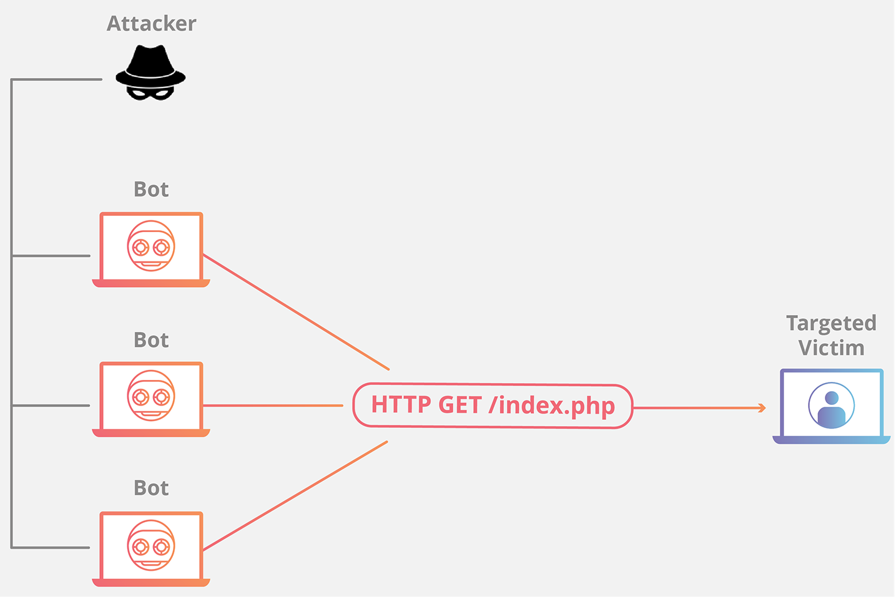

# DDOS攻击概述

DDOS攻击也叫做分布式拒绝服务攻击，其英文全称为Distributed Denial of Service attack。

DDOS攻击的主要目的是使目标电脑的网络或系统资源耗尽，使服务暂时中断或停止，导致其对目标客户不可用。

DDoS 就是分布式拒绝服务攻击，这种网络攻击形式尝试用恶意流量淹没网站或网络资源，从而导致网站或网络资源无法正常运行。

概括来说，**DDoS 或 DoS 攻击就如同成百上千个虚假拼车请求所导致的意外交通堵塞。**

这些请求在拼车服务看来似乎合法，因此服务会调度驾驶员接人，从而不可避免地使城市街道拥堵。这会导致正常的合法流量无法到达目的地。

针对一家公司的网站、Web 应用程序、API、网络或数据中心基础架构的发起的 DDoS 攻击会造成停机，导致合法用户无法购买产品、使用服务、获取信息或者进行其他正常访问。

## DDoS 攻击的工作原理是什么？ 

DDoS 攻击利用接入互联网上的设备构成的彼此连接的网络，切断用户与服务器或网络资源（比如用户经常访问的网站或者应用程序）的联系。

为了发动 DDoS 攻击，攻击者会使用恶意软件或利用安全漏洞，恶意感染机器和设备，并获得其控制权。每台电脑或者受到感染的设备都称之为“爬虫程序”或“僵尸”，它们能够进一步传播恶意软件并参与 DDoS 攻击。这些爬虫程序共同构成了称为“僵尸网络”的僵尸军团，利用数量优势扩大攻击规模。

此外，人们往往不会注意到物联网设备受感染，这很像是僵尸恐怖片里经常会有的那只麻烦的僵尸，主角们根本不知道它已经被感染了，而在物联网设备中，这会造成合法的设备所有者成为次要受害者或不知情的参与者，而受害企业仍然难以分辨攻击者的身份。

一旦攻击者建好僵尸网络，就能向每个爬虫程序发送远程指令，向目标系统发起 DDoS 攻击。在僵尸网络攻击某个网络或服务器时，攻击者会指示僵尸向受害者的 IP 地址发送请求。我们每个人都有着各自独特的指纹，而设备也有类似的特征，每台设备都有一个唯一的地址，可以用来在互联网或本地网络上识别它们。流量过大会造成拒绝服务，使正常流量无法访问网站、Web 应用、API 或网络。

有时，僵尸网络及其中的爬虫程序会通过“雇佣攻击”服务的形式出租给其他有意发起攻击的人。这让那些没有接受过训练、缺乏经验的恶意攻击者也能轻松自行发动 DDoS 攻击。

## 应用层攻击

此类攻击有时称为[第 7 层](https://www.cloudflare.com/zh-cn/learning/ddos/what-is-layer-7) DDoS 攻击（指 OSI 模型第 7 层），其目标是耗尽目标资源。

攻击目标是生成网页并传输网页响应 [HTTP](https://www.cloudflare.com/zh-cn/learning/ddos/glossary/hypertext-transfer-protocol-http) 请求的服务器层。

在客户端执行一项 HTTP 请求的计算成本比较低，但目标服务器做出响应却可能非常昂贵，因为服务器通常必须加载多个文件并运行数据库查询才能创建网页。

第 7 层攻击很难防御，因为难以区分恶意流量和合法流量。

#### HTTP 洪水

HTTP 洪水攻击类似于同时在大量不同计算机的 Web 浏览器中一次又一次地按下刷新 – 大量 HTTP 请求涌向服务器，导致拒绝服务。

这种类型的攻击有简单的，也有复杂的。

较简单的实现可以使用相同范围的攻击 IP 地址、referrer 和用户代理访问一个 URL。（相当于同一个网段内的 IP 不停的 F5 刷新页面访问网站）

复杂版本可能使用大量攻击性 IP 地址，并使用随机 referrer 和用户代理来针对随机网址。（相当于天猫双11，春运抢票，海量用户并发访问网站）

## ip-spoofing

让我们从一些背景开始：通过互联网传输的数据首先被分成多个数据包，这些数据包被独立发送并在最后重新组合。每个数据包都有一个 IP（互联网协议）标头，其中包含有关数据包的信息，包括源 IP 地址和目标 IP 地址。

在 IP 欺骗中，黑客使用工具修改数据包头中的源地址，使接收计算机系统认为数据包来自受信任的来源（例如合法网络上的另一台计算机），并接受它。

这发生在网络级别，因此没有外部篡改迹象。

在依赖联网计算机之间信任关系的系统中，IP 欺骗可用于绕过 IP 地址身份验证。这个概念有时被称为“城堡和护城河”防御，即网络外部的人被视为威胁，而“城堡”内的人受到信任。一旦黑客入侵网络并进入内部，就很容易探索系统。由于此漏洞，使用简单身份验证作为防御策略正越来越多地被更强大的安全方法所取代，例如具有多步身份验证的安全方法。

虽然网络犯罪分子经常使用 IP 欺骗来进行在线欺诈和身份盗窃或关闭公司网站和服务器，但有时也可用于合法用途。例如，组织可能会在网站上线前测试网站时使用 IP 欺骗。这将涉及创建数千个虚拟用户来测试网站，以查看该网站是否可以处理大量登录而不会被淹没。以这种方式使用 IP 欺骗并不违法。

最常被引用的 IP 欺骗攻击示例之一是[2018 年 GitHub 的 DDoS 攻击](https://www.wired.com/story/github-ddos-memcached/)。GitHub 是一个代码托管平台，2018 年 2 月，它遭到了被认为是有史以来规模最大的 DDoS 攻击。攻击者在一次大规模的协同攻击中欺骗了 GitHub 的 IP 地址，导致服务中断了近 20 分钟。GitHub 通过中间合作伙伴重新路由流量并清理数据以阻止恶意方，从而重新获得了控制权。

更早的一个例子发生在 2015 年，当时[欧洲刑警组织打击了整个大陆的中间人攻击。](https://www.europol.europa.eu/newsroom/news/international-operation-dismantles-criminal-group-of-cyber-fraudsters)该攻击涉及黑客拦截企业与其客户之间的支付请求。犯罪分子使用 IP 欺骗来获取对组织的公司电子邮件帐户的欺诈性访问。然后，他们窥探通信并拦截客户的支付请求，以便可以欺骗这些客户将付款发送到他们控制的银行账户。

IP 欺骗不是网络欺骗的唯一形式——还有其他类型，包括电子邮件欺骗、网站欺骗、ARP 欺骗、短信欺骗等等。

如何防范 IP 欺骗

IP 欺骗攻击旨在隐藏攻击者的真实身份，使其难以被发现。

但是，可以采取一些反欺骗措施来最大程度地降低风险。最终用户无法阻止 IP 欺骗，因为尽其所能阻止 IP 欺骗是服务器端团队的工作。

针对 IT 专业人员的 IP 欺骗防护

大多数用于避免 IP 欺骗的策略必须由 IT 专业人员开发和部署。防止 IP 欺骗的选项包括：

- 监控网络的非典型活动。
- 部署数据包过滤以检测不一致（例如源 IP 地址与组织网络上的地址不匹配的传出数据包）。
- 使用稳健的验证方法（即使在联网的计算机中）。
- 验证所有 IP 地址并使用网络攻击拦截器。
- 将至少一部分计算资源置于防火墙之后。防火墙将通过过滤带有欺骗性 IP 地址的流量、验证流量和阻止未经授权的外部人员的访问来帮助保护您的网络。

鼓励网页设计师将网站迁移到最新的互联网协议 IPv6。它通过包括加密和身份验证步骤来增加 IP 欺骗的难度。

全世界互联网流量的很大一部分仍然使用以前的协议 IPv4。

针对最终用户的 IP 欺骗防护

最终用户无法阻止 IP 欺骗。虽说如此，践行基本的网络卫生将有助于最大限度地提高您的在线安全。明智的预防措施包括：

**确保您的家庭网络设置安全**

这意味着更改家庭路由器和所有连接设备上的默认用户名和密码，并确保使用强密码。

强密码避免显而易见的问题，包含至少 12 个字符以及大小写字母、数字和符号的混合。

## SYN 洪水

协议攻击也称为状态耗尽攻击，这类攻击会过度消耗服务器资源和/或[防火墙](https://www.cloudflare.com/zh-cn/learning/security/what-is-a-firewall)和负载平衡器之类的网络设备资源，从而导致服务中断。

此类攻击利用 [TCP 握手](https://www.cloudflare.com/zh-cn/learning/ddos/glossary/tcp-ip)（两台计算机发起网络连接时要经过的一系列通信），通过向目标发送大量带有[伪造](https://www.cloudflare.com/zh-cn/learning/ddos/glossary/ip-spoofing)源 IP 地址的 TCP“初始连接请求”SYN 数据包来实现。

简单说，就是通过目标计算机响应每个连接请求，然后等待握手中的最后一步，但这一步确永远不会发生，因此在此过程中耗尽目标的资源。

TCP与UDP不同，它是基于连接的，也就是说：为了在服务端和客户端之间传送TCP数据，必须先建立一个虚拟链路，也就是TCP连接:

- 首先，请求端（客户端）发送一个包含SYN标志的TCP报文，SYN即同步（Synchronize），同步报文会指明客户端使用的端口以及TCP连接的初始序号；
- 第二步，服务器在收到客户端的SYN报文后，将返回一个SYN+ACK的报文，表示客户端的请求被接受，同时TCP序号被加1，ACK即（Acknowledgment）。
- 第三步，客户端也返回一个确认报文ACK给服务器端，同样TCP序列号被加1，到此一个TCP连接完成。

SYN攻击属于DDoS攻击的一种，它利用TCP协议缺陷，通过发送大量的半连接请求，使得被攻击方资源耗尽，无法及时回应或处理正常的服务请求。事实上SYN攻击并不管目标是什么系统，只要这些系统打开TCP服务就可以实施。

https://info.support.huawei.com/info-finder/encyclopedia/zh/SYN+Flood.html

### 常用的 DDos 攻击工具

## 如何防范 DDos 攻击

**若要缓解 DDoS 攻击，关键在于区分攻击流量与正常流量。真正的难点在于区分真实客户流量与攻击流量。**

例如，如果因发布某款产品导致公司网站涌现大批热情客户，那么全面切断流量是错误之举。

如果公司从已知恶意用户处收到的流量突然激增，或许需要尽量缓解攻击。

在现代 Internet 中，DDoS 流量以多种形式出现。流量设计可能有所不同，从非欺骗性单源攻击到复杂的自适应多方位攻击无所不有。

多方位 DDoS 攻击采用多种攻击手段，以期通过不同的方式击垮目标，很可能分散各个层级的缓解工作注意力。

一般而言，攻击越复杂，越难以区分攻击流量与正常流量 - 攻击者的目标是尽可能混入正常流量，从而尽量减弱缓解成效。

如果缓解措施不加选择地丢弃或限制流量，很可能将正常流量与攻击流量一起丢弃，同时攻击还可能进行修改调整以规避缓解措施。

**为克服复杂的破坏手段，采用分层解决方案效果最理想。**

### 速率限制

在高并发场景或者对外提供API的网站，都会

### WAF防火墙

### CDN

CDN 原本诞生其实就是缓存，让网站的一些资源缓存到离用户更近的节点。

目的就是能够更加快速的运转网站加速系统，让网站加速系统的功能性发挥到更加强大。

CDN 一般是由 CDN 厂商管理，一般有强大的带宽，单个的节点承受的能力是很强大的。还能够有效的针对网站进行突发情况流量管理，预防存在流量以及数量增加等相关状况出现。 

但是近几年，网络安全问题日益严峻，在这样的互联网环境下，高防CDN由此诞生了。

### Anycast