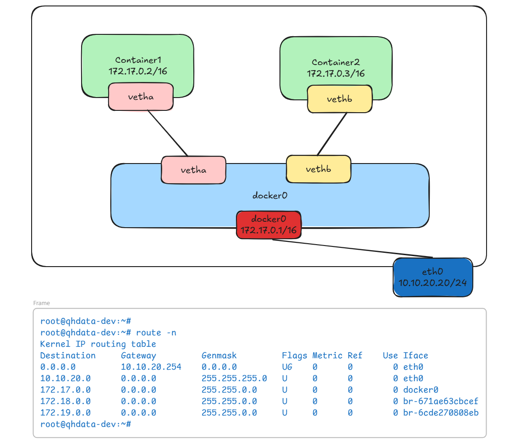
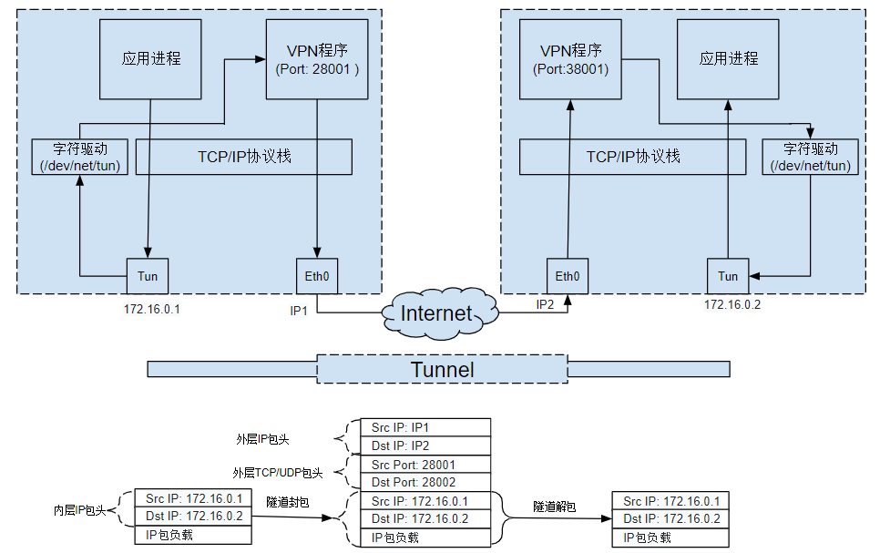

# Bridging

**==Linux Bridge==** 是 Linux kernel 2.2 版本开始提供的**==虚拟机二层转发工具==**。


与物理交换机机制一致，它能够接入任何二层的网络设备（无论是真实的物理设备，例如 eth0 。或者虚拟设备，例如 veth、tap 等）

不过 Bridge 与普通物理交换机有一点不同，普通交换机只会单纯地做二层转发，`Linux Bridge` 却还能把发给它的数据包再发送到主机的三层协议栈：

可以认为当使用 `brctl addbr br0` 新建一个 br0 网桥时。系统自动创建了一个同名的隐藏 `br0` 网络接口（这是个三层接口，可以配置IP地址）


# veth

**veth pair在 **Linux Kernel 2.6.24 版本中正式引入

==**veth pair 全称是 Virtual Ethernet Pair，好像是一根网点的两个端口一样，所有从这对端口一端进入的数据包都将从另一端出来，反之也是一样。**==

引入 `veth pair` 是为了在不同的 `Network Namespace` 直接进行通信，利用它可以直接将两个 `Network Namespace` 连接起来。


```bash
# 创建一个bridge时，其实内核做了两件事：
# 1、创建了一个名为br0的虚拟交换机：它维护一张MAC地址表，负责在连接到它的各个tap设备或物理网卡之间转发以太网帧。
# 2、创建了一个名为br0的三层接口：可以配置IP地址，

ip link add br0 type bridge


# 给br0这个接口配置IP地址
# br0一旦设置 IP 地址，就意味着这个隐藏的 br0 接口可以作为三层接口，参与 IP 层的路由选择(可以使用 `route -n` 查看最后一列 `Iface`)。
ip addr add 192.168.1.10/24 dev br0


# 创建ns1，并创建veth对，两端分别插在br0上和ns1上，并为ns1配置IP地址
ip netns add ns1														
ip link add veth1_ns1 type veth peer name veth1_br						
ip link set veth1_ns1 netns ns1											
ip link set veth1_br master br0											
ip link set veth1_br up
ip netns exec ns1 ip link set veth1_ns1 up
ip netns exec ns1 ip addr add 192.168.1.11/24 dev veth1_ns1

# 创建ns2，并创建veth对，两端分别插在br0上和ns2上，并为ns2配置IP地址
ip netns add ns2
ip link add veth2_ns2 type veth peer name veth2_br
ip link set veth2_ns2 netns ns2
ip link set veth2_br master br0
ip link set veth2_br up
ip netns exec ns2 ip link set veth2_ns2 up
ip netns exec ns2 ip addr add 192.168.1.12/24 dev veth2_ns2


# 场景 A：Namespace 之间互 ping (ns1 -> ns2)
ip netns exec ns1 ping -c 2 192.168.1.12


# 场景 B：Namespace ping 网桥 (ns1 -> br0)
ip netns exec ns1 ping -c 2 192.168.1.10			


# 查看这个虚拟交换机的MAC地址表。这个地方跟传统交换机稍微有点不同
root@starrocks-fe-0:~# brctl showmacs br0
port no mac addr                is local?       ageing timer
  1     3a:42:41:72:1b:67       no                15.32
  1     4a:50:1d:21:71:22       yes                0.00
  1     4a:50:1d:21:71:22       yes                0.00
  2     aa:49:23:1c:6e:dd       no               125.91
  2     ee:0c:dd:cf:92:5b       yes                0.00
  2     ee:0c:dd:cf:92:5b       yes                0.00
root@starrocks-fe-0:~#
```





https://excalidraw.com/#json=aYTRJm9FAmsV7WczgFtru,AOxUu6ht8EeIU-O2dTwWyA


```
# 对于挂在docker0网桥上的容器来说，它内部路由表长这样

bash-5.0# route -n
Kernel IP routing table
Destination     Gateway         Genmask         Flags Metric Ref    Use Iface
0.0.0.0         172.17.0.1      0.0.0.0         UG    0      0        0 eth0
172.17.0.0      0.0.0.0         255.255.0.0     U     0      0        0 eth0
bash-5.0#
bash-5.0#

# 对于第一条路由：目的地址为0.0.0.0，表示默认路由，默认路由发给网关(也就是docker0网桥上的"docker0这个特殊接口")。然后进入宿主机内核协议栈查宿主机路由表
# 对于第二条路由：在路由表中，0.0.0.0 作为网关意味着“不需要网关”。这表示目标 IP 就在当前链路上（On-link）。同网段通讯，直接走二层转发
```


# NAT

**Docker（或类似的容器引擎）在启动时会自动注入 NAT 规则。**

当你将容器连接到默认的 **Bridge** 网络（通常是 docker0）时，Docker 守护进程会利用 Linux 内核的 iptables 功能，自动为你搭建好这套“透明”的上网机制。


## SNAT

每当 Docker 启动时，它会向系统的 `iptables` 规则中添加 **MASQUERADE**（地址伪装）规则。

```
root@oneplatform-dataadmin:/data/qhdata/docker#
root@oneplatform-dataadmin:/data/qhdata/docker# iptables -t nat -L POSTROUTING -n
Chain POSTROUTING (policy ACCEPT)
target     prot opt source               destination
MASQUERADE  0    --  172.18.0.0/16        0.0.0.0/0
MASQUERADE  0    --  172.17.0.0/16        0.0.0.0/0
root@oneplatform-dataadmin:/data/qhdata/docker#
root@oneplatform-dataadmin:/data/qhdata/docker#
```

**这条规则的意思是：** 只要是从 `172.17.0.0/16`（容器网段）出来的流量，如果目的地是外部网络，就自动把源地址换成宿主机的网卡 IP。


## DNAT

当你运行了一个端口映射容器，比如 `docker run -p 8080:80 nginx`，你会看到类似下面的一行

```
root@oneplatform-dataadmin:/data/qhdata/docker#
root@oneplatform-dataadmin:/data/qhdata/docker# iptables -t nat -S DOCKER
-N DOCKER
-A DOCKER ! -i br-c022a16a148d -p tcp -m tcp --dport 8089 -j DNAT --to-destination 172.18.0.2:8089
-A DOCKER ! -i br-c022a16a148d -p tcp -m tcp --dport 19270 -j DNAT --to-destination 172.18.0.7:19270
-A DOCKER ! -i br-c022a16a148d -p tcp -m tcp --dport 19280 -j DNAT --to-destination 172.18.0.8:19280
-A DOCKER ! -i br-c022a16a148d -p tcp -m tcp --dport 19300 -j DNAT --to-destination 172.18.0.9:19300
-A DOCKER ! -i br-c022a16a148d -p tcp -m tcp --dport 19201 -j DNAT --to-destination 172.18.0.3:19201
-A DOCKER ! -i br-c022a16a148d -p tcp -m tcp --dport 19223 -j DNAT --to-destination 172.18.0.4:19223
-A DOCKER ! -i br-c022a16a148d -p tcp -m tcp --dport 19260 -j DNAT --to-destination 172.18.0.6:19260
-A DOCKER ! -i br-c022a16a148d -p tcp -m tcp --dport 24320 -j DNAT --to-destination 172.18.0.5:24320
-A DOCKER ! -i docker0 -p tcp -m tcp --dport 19000 -j DNAT --to-destination 172.17.0.2:19206
-A DOCKER ! -i docker0 -p tcp -m tcp --dport 19001 -j DNAT --to-destination 172.17.0.3:19206
-A DOCKER ! -i docker0 -p tcp -m tcp --dport 18862 -j DNAT --to-destination 172.17.0.4:80
-A DOCKER ! -i docker0 -p tcp -m tcp --dport 18861 -j DNAT --to-destination 172.17.0.5:80
root@oneplatform-dataadmin:/data/qhdata/docker#
```


# TAP/TUN

在计算机网络中，TUN与TAP是操作系统内核中的虚拟网络设备。

在时间上 tun/tap 出现得更早，在 `Linux Kernel 2.4` 版之后发布的内核都会默认编译 tun/tap 的驱动。

**不同于普通靠硬件网路板卡实现的设备，这些虚拟的网络设备全部用软件实现，并向运行于操作系统上的软件提供与硬件的网络设备完全相同的功能。**


在 Linux 中，TUN 设备是一种工作在三层（Network Layer）的虚拟网络设备。TUN 设备的功能非常简单，即：**在操作系统内核和用户应用程序之间传递 IP 包。**

- **TUN等同于一个三层设备**
  - TUN模拟了网络层设备，它操作第三层数据包比如IP数据包
  - 它从 `/dev/net/tun` 字符设备上读取的是 IP 数据包。写入的也只能是 IP 数据包，因此不能进行二层操作，如发送 ARP 请求和以太网广播。
  - 可以实现一个**==点对点==**隧道：
- **TAP等同于一个二层设备**
  - TUN模拟了链路层设备，操作第三层数据帧比如以太网数据帧
  - 它从 `/dev/net/tun` 字符设备上读取的是链路层数据帧，


从这点来看， TAP虚拟设备和真实的物理网卡的能力更接近，可以与物理网卡做 bridge


## 使用Tun/Tap创建点对点隧道


如下图所示：

1、左边主机上应用程序发送到Tun虚拟设备上的IP数据包被VPN程序通过字符设备接收。

2、然后再通过一个TCP或者UDP隧道从宿主机网卡发送到右端的VPN服务器上。

3、VPN服务器将隧道负载中的原始IP数据包写入字符设备，这些IP包就会出现在右侧的Tun虚拟设备上。

4、最后通过操作系统协议栈和socket接口发送到右侧的应用程序上。




## 使用TAP隧道桥接两个远程站点

操作系统通过`TUN/TAP`设备向绑定该设备的用户空间的程序发送数据，反之，用户空间的程序也可以像操作硬件网络设备那样，通过TUN/TAP设备发送数据。

在后种情况下，TUN/TAP设备向操作系统的网络栈投递（或“注入”）数据包，从而模拟从外部接受数据的过程。

tap 和 tun 虽然都是虚拟网络设备，但它们的工作层次还不太一样

| **特性**       | **TUN (Network Tunnel)**                  | **TAP (Network Tap)**                  |
| -------------- | ----------------------------------------- | -------------------------------------- |
| **工作层级**   | **网络层 (L3)**                           | **数据链路层 (L2)**                    |
| **数据包单位** | **IP 数据包** (IP Packet)                 | **以太网帧** (Ethernet Frame)          |
| **模拟对象**   | 虚拟的点对点设备 (Point-to-Point)         | 虚拟的以太网卡 (NIC)                   |
| **头部信息**   | 只有 IP 头，不含 MAC 地址                 | 包含 MAC 地址、帧头等完整以太网结构    |
| **处理协议**   | 仅限 IP (IPv4/IPv6)                       | 可处理 ARP、DHCP 等各种非 IP 协议      |
| **常见场景**   | **VPN、内网穿透** (如 OpenVPN, Tailscale) | **虚拟机网桥、容器网络** (如 QEMU/KVM) |
| **操作方式**   | 读写的是路由后的数据                      | 读写的是像接在交换机上的原始帧         |


# Flannel

[Flannel](https://github.com/flannel-io/flannel) 项目是 CoreOS 公司主推的容器网络方案。事实上，Flannel 项目本身只是一个框架，真正提供容器网络功能的，是 Flannel 的后端实现。

Flannel 是 Kubernetes 中常用的网络插件，用于实现 Pod 之间的跨节点通信。它支持多种工作模式，每种模式都有其特点和适用场景。


**==Flannel 的核心功能是为 Kubernetes 集群中的每个 Pod 分配一个唯一的 IP 地址，并确保 Pod 之间可以无缝通信==**。其底层原理主要包括以下几个方面：


1、全局子网分配：在全局创建用于分配给所有pod的地址池（例如 `10.244.0.0/16`），一般会写到ETCD持久化

2、节点子网分配：Flannel 为每个工作节点分配一个唯一的子网（例如节点一就分配 `10.244.1.0/24`），从节点内创建 Pod 时会从该子网中分配一个 IP 地址。

3、节点网络虚拟化：Flannel 会在每个节点创建虚拟化网桥 cni0 

​		**下方连接（容器端）：** 它连接着该节点上运行的所有 **Pod**。每个 Pod 里看到的 `eth0`，其实是通过 **veth-pair**（虚拟以太网对）插在 `cni0` 上的。

​		**上方连接（主机端）：** 它连接着宿主机的**网络栈**。`cni0` 作为一个 Linux Bridge（虚拟交换机），拥有一个 IP 地址（通常是该节点 Pod 网段的网关，如 `10.244.1.1`）。

4、路由设置：Flannel 在每个节点上设置路由规则，确保跨节点的流量可以正确路由到目标 Pod。这些路由规则存储在 etcd 中，并由 Flannel 动态维护。

- 如果目标地址是同节点的pod，出接口交给`cni0`网桥（同节点其实都）
- 如果目标地址是跨节点的pod，出接口则会交给`flannel.1`设备

5、创建


目前，Flannel 支持三种后端实现：


## UDP

Flannel UDP 模式提供的其实是一个三层的 Overlay 网络，即：

它首先对发出端的 IP 包进行 UDP 封装，然后在接收端进行解封装拿到原始的 IP 包，进而把这个 IP 包转发给目标容器。

这就好比，Flannel 在不同宿主机上的两个容器之间打通了一条“隧道”，使得这两个容器可以直接使用 IP 地址进行通信，而无需关心容器和宿主机的分布情况。


**==UDP 模式是 Flannel 最早支持的模式，但性能较差，已被废弃。==**它通过在用户态对数据包进行封装和解封装来实现跨节点通信。


1. **Pod 发起通信**：源 `Pod` 向目标 `Pod` 发送数据包，数据包首先到达源节点的 `cni0` 网桥。
2. **查找目标节点**：Flannel 根据目标 Pod 的 IP 地址，查询到目标节点的物理 IP 地址。
   - 如果目标地址是同一个工作节点内的pod，就在cni0网桥走二层转发
   - 如果目标地址不是同一个工作节点内的pod，
3. **数据封装**：Flannel 使用 `VXLAN` 协议将原始数据包封装在 UDP 报文中，并通过底层网络发送到目标节点。
4. **解封装数据包**：目标节点的 Flannel 接收到封装的数据包后，解封装并还原为原始数据包。
5. **目标 Pod 接收数据**：解封装后的数据包通过目标节点的 `cni0` 网桥，最终传递给目标 Pod。

VXLAN 模式适用于复杂的网络环境，例如节点跨子网或跨机房的场景。


## VXLAN

**==VXLAN（Virtual Extensible LAN）模式是 Flannel 的默认模式，也是最常用的模式==**。它通过封装数据包来实现跨节点通信，具体工作原理如下：

1. **Pod 发起通信**：源 `Pod` 向目标 `Pod` 发送数据包，数据包首先到达源节点的 `cni0` 网桥。
2. **查找目标节点**：Flannel 根据目标 Pod 的 IP 地址，查询到目标节点的物理 IP 地址。
3. **数据封装**：Flannel 使用 `VXLAN` 协议将原始数据包封装在 UDP 报文中，并通过底层网络发送到目标节点。
4. **解封装数据包**：目标节点的 Flannel 接收到封装的数据包后，解封装并还原为原始数据包。
5. **目标 Pod 接收数据**：解封装后的数据包通过目标节点的 `cni0` 网桥，最终传递给目标 Pod。

VXLAN 模式适用于复杂的网络环境，例如节点跨子网或跨机房的场景。


```bash

# 首先，在ETCD创建全局子网100.64.0.0/16，这个是全局用于分配给所有pod的地址池
etcdctl put /coreos.com/network/config '{"Network":"100.64.0.0/16", "Backend": {"Type": "udp"}}'


# 启动flanneld进程，指定ETCD，指定ETCD键名称，指定写入子网文件，并指定当前本机物理网卡
sudo ./flanneld  \
	--etcd-endpoints=http://127.0.0.1:2379 \
	--etcd-prefix=/coreos.com/network 	\
	--subnet-file=/run/flannel/subnet.env \
	--iface=eth0  


# 1、当每台宿主机的flanneld启动时，它内部其实会向ETCD写入一个属于自己的“可分配网段”（通常是 /24 网段）
# 比如宿主机1会这样分配：etcdctl put /coreos.com/network/subnets/100.64.10.0-24 '{"PublicIP":"192.168.1.10"}'
# 比如宿主机1会这样分配：etcdctl put /coreos.com/network/subnets/100.64.20.0-24 '{"PublicIP":"192.168.1.10"}'


# 2、他会在宿主机创建一个名为flannel0的tun设备


# 3、启动flanneld时，会在宿主机内写入子网信息
# root@qhdata-dev:~# cat /run/flannel/subnet.env
# FLANNEL_NETWORK=10.244.0.0/16
# FLANNEL_SUBNET=10.244.31.1/24
# FLANNEL_MTU=1472
# FLANNEL_IPMASQ=false


# 3、接下来就是创建cni0网桥了。
# 在 CNI 的世界里，流行“外包”。flannel 插件在读取了 .conflist 和 subnet.env 后，发现自己需要创建一个网桥，它会转头去调用另一个更基础的插件：bridge 插件。


```


`flanneld` 进程内部确实维护着一张逻辑上的“全网路由表”，它记录了 **Pod 网段（Subnet）与 宿主机 IP（Public IP）的映射关系**。

`flanneld` 并不是孤立运行的，它依赖一个**==中央数据库==**来保持集群中所有节点信息的一致性：

- **早期的 Flannel**：直接通过 `etcd` 存储。
- **现在的 Kubernetes 环境**：通常通过 `Kubernetes API Server` 存储在 `Nodes` 对象的 `Spec` 中。


# MACVLAN

==**macvlan 本身是 `Linxu kernel` 模块，其功能是允许在同一个物理网卡上配置多个 MAC 地址。即多个 interface，每个 interface 可以配置自己的 IP。**==

**macvlan 本质上是一种网卡（所谓的子接口）虚拟化技术(最大优点是性能极好)**


**==macvlan跟传统数通的VLANIF子接口（一般叫802.1Q子接口）还是有点区别==**。

macvlan 子接口和原来的主接口是完全独立的，可以单独配置 MAC 地址和 IP 地址。而 VLANIF 子接口和主接口共用相同的 MAC 地址。

VLAN 用来划分广播域，而 macvlan 共享同一个广播域。


```

```


MACVLAN模式


## VEPA

在 `VEPA` 模式下，所有从 Macvlan 接口发出的流量，不管目的地全部都发送给父接口，即使流量的目的地是共享同一个父接口的其它 Macvlan 接口


## private

这种模式下，同一主接口下的子接口之间彼此隔离，不能通信。即使从外部的物理交换机导流，也会被无情地丢掉。


```bash
# 基于物理接口创建两个macvlan子接口

ip link add link enp0s8 dev mac1 type macvlan mode bridge


ip netns add pod-a
ip link set eth0 netns pod-a
ip netns exec pod-a ip addr add 192.168.10.10/24 dev eth0
ip netns exec pod-a ip link set eth0 up
ip netns exec pod-a ip route add default via 192.168.10.1 dev eth0  


ip link add link enp0s8 dev mac2 type macvlan mode bridge


```


# IPVLAN


# 