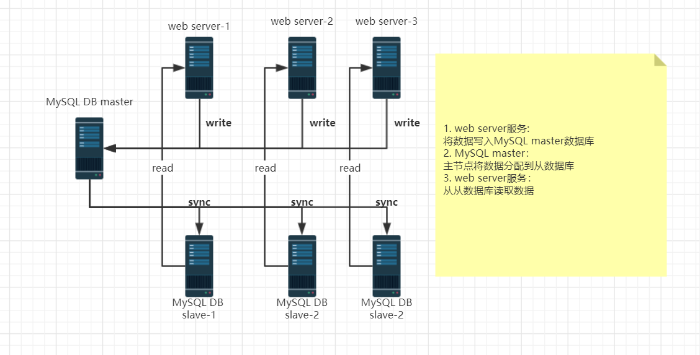

## MySQL读写分离

读写分离的基本原理：

- 让主数据库处理事务性增、改、删操作（`INSERT`、`UPDATE`、`DELETE`）,而从数据库处理`SELECT`查询操作。

- 通过主从复制被用来把事务性操作性操作导致的变更同步到集群中的从数据库。

读写分离架构图

为什么要使用读写分离：

面对越来越大的访问压力，单台的服务器的性能成为瓶颈需要分担负载：

1. 主从只负责各自的读和写，极大程度的缓解 X 锁和 S 锁争用
2. 从库可配置 myisam 引擎，提升查询性能以及节约系统开销
3. 增加冗余，提高可用性

## 读写分离的实现方式

**一般有两种方式实现：应用程序层实现和中间件层实现**

**应用层实现：即在代码层面实现，配置多个数据源，代码层面要对根据不同的类型数据库操作，来选择不同的数据源**

**程序层实现优点：**

1. **应用程序内部实现读写分离，安装即可以使用**
2. **减少一定部署难度**
3. **访问压力在一定级别以下，性能很好**

**程序层实现缺点：**

1. **架构一但调整，代码要跟着变**
2. **难以实现高级应用，如自动分库，分表**
3. **无法适用大型应用场景**

**中间件层实现是指在外部中间件程序实现读写分离，对应用来说比较透明**

**中间件优点：**

1. **架构设计更灵活**
2. **可以在程序上实现一些高级控制，如：透明化水平拆分，failover,监控**
3. **可以依靠技术手段提高MySQL性能**
4. **对业务代码的影响小，同时也安全**

**中间件缺点：**

1. **需要一定的开发运维团队的支持**

