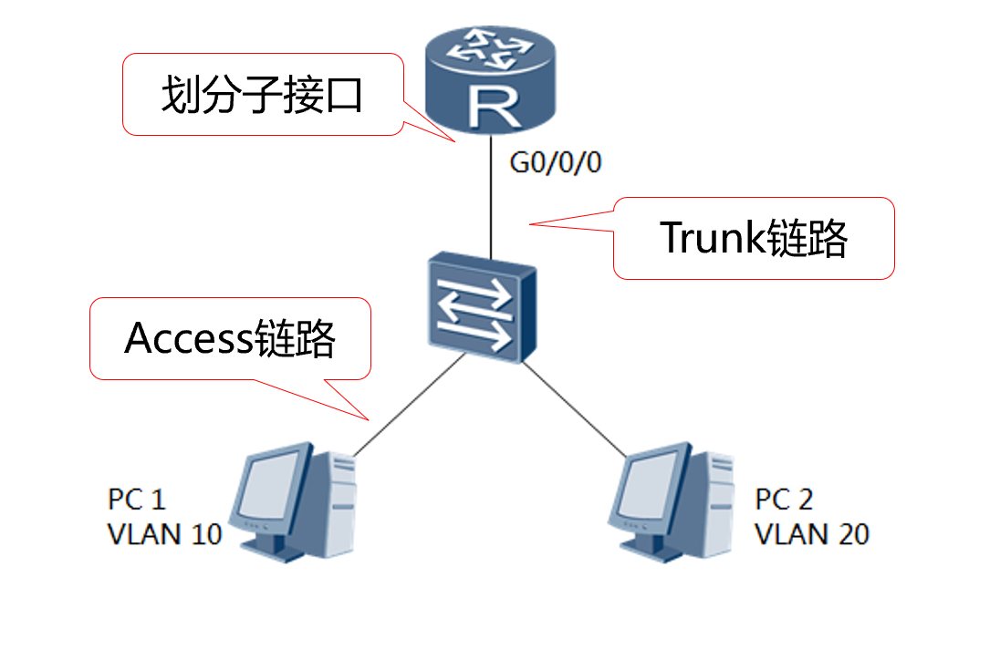

# 以太网概述

以太网最早是指由DEC（Digital Equipment Corporation）、Intel和Xerox组成的DIX（DEC-Intel-Xerox）联盟开发并于1982年发布的标准。

经过长期的发展，以太网已成为应用最为广泛的局域网，包括标准以太网（10 Mbit/s）、快速以太网（100 Mbit/s）、千兆以太网（1000 Mbit/s）和万兆以太网（10 Gbit/s）等。

IEEE 802.3规范则是基于以太网的标准制定的，并与以太网标准相互兼容。

在TCP/IP中，以太网的IP数据报文的封装格式由RFC894定义，IEEE802.3网络的IP数据报文封装由RFC1042定义。当今最常使用的封装格式是RFC894定义的格式，通常称为Ethernet_II或者Ethernet DIX。

以太网是当今现有局域网LAN（Local Area Network）采用的最通用的通信协议标准。该标准定义了在局域网中采用的电缆类型和信号处理方法。

以太网作为一种原理简单，便于实现同时又价格低廉的局域网技术已经成为业界的主流。而更高性能的千兆以太网和万兆以太网的出现更使其成为最有前途的网络技术。


## 共享型以太网与冲突域

最早期以太网采用的拓扑结构是**总线型拓扑**或以集线器为核心的星型网络，将一系列终端设备采用粗同轴电缆连接在一起。

当多台设备同时互相发送数据时，就会相互叠加干扰，这种干扰现象称为冲突。冲突的后果是每个发送方发送的数据都无法被接收方准确识别。

同时发送数据就会造成冲突的设备即处于同一个冲突域中。物理层所定义的线缆标准中有早期常见的三种标准线缆：

| 名称     | 电缆       | 最长有效距离 |
| -------- | ---------- | ------------ |
| 10BASE-5 | 粗同轴电缆 | 500m         |
| 10BASE-2 | 细同轴电缆 | 200m         |
| 10BASE-T | 双绞线     | 100m         |
| 10BASE-F | 光纤       | 2000m        |

其中，前两种同轴电缆采用物理为总线型拓扑以太网，只有最后一种双绞线采用物理的星型拓扑以太网。

而10BASE-T的核心物件就是`集线器[Hub]`，早期[网络互联](https://cloud.tencent.com/product/ccn?from_column=20065&from=20065)互通就是用的集线器来实现的，集线器的本质是总线型共享网络设备，负责将网络中的多个设备连接到一起，所以10BASE-T本质其实也是总线型，只不过在物理层面展现出来的就是一个星型拓扑结构。


10兆以太网线缆标准在IEEE802.3中定义，以太网线缆标准

| 名称     | 电缆       | 最长有效距离 |
| -------- | ---------- | ------------ |
| 10BASE-5 | 粗同轴电缆 | 500m         |
| 10BASE-2 | 细同轴电缆 | 200m         |
| 10BASE-T | 双绞线     | 100m         |
| 10BASE-F | 光纤       | 2000m        |


100兆以太网又叫**快速以太网FE（Fast Ethernet）**，在数据链路层上跟10M以太网没有区别，仅在物理层上提高了传输的速率。

| 名称       | 线缆               | 最长有效距离 |
| ---------- | ------------------ | ------------ |
| 100Base-T4 | 四对三类双绞线     | 100m         |
| 100Base-TX | 两对五类双绞线     | 100m         |
| 100Base-FX | 单模光纤或多模光纤 | 2000m        |


**千兆以太网**是对IEEE802.3以太网标准的扩展。在基于以太网协议的基础之上，将快速以太网的传输速率从100Mbit/s提高了10倍，达到了1Gbit/s。

| 名称        | 线缆                   | 最长有效距离 |
| ----------- | ---------------------- | ------------ |
| 1000Base-LX | 多模光纤和单模光纤     | 316m         |
| 1000Base-SX | 多模光纤               | 316m         |
| 1000Base-TX | 超5类双绞线或6类双绞线 | 100m         |

**万兆以太网**

| 名称       | 线缆          | 有效传输距离 |
| ---------- | ------------- | ------------ |
| 10GBASE-T  | CAT-6A或CAT-7 | 100m         |
| 10GBase-LR | 单模光纤      | 10km         |
| 10GBase-SR | 多模光纤      | 几百米       |

俗称的超六类网线，七类网线

**冲突域指的是会产生冲突的最小范围，在计算机和计算机通过设备互联时，会建立一条通道，如果这条通道只允许瞬间一个数据报文通过，那么如果同时有两个或更多的数据报文想从这里通过时就会出现冲突了。**

在使用集线器的以太网中，集线器将很多以太网设备集中 到一台中心设备上，这些设备都连接到集线器中的同一物理总线结构中。从本质上讲，以集线器为核心的以太网同原先的总线型以太网无根本区别。

**冲突域的大小可以衡量设备的性能，多口hub的冲突域也只有一个，即所有的端口上的数据报文都要排队等待通过。**

集线器（一个中心化的设备）让星型网络成为流行的以太网物理连接方式，集线器在数据转发层面与同轴电缆的总线型网络没有区别。

连接在一个集线器中的所有终端依旧处在同一个冲突域中。


**网桥和交换机**

网桥就是早期交换机的雏形。网桥上每个端口所连接的环境，单独构成一个冲突域。

交换机的核心作用：**隔离冲突域**

<aside> ➡️ 主要实现原理：交换机有能力查看数据帧的源和目标MAC地址，并将数据帧从相应的端口转发出去，而不是像集线器一样向不需要的接口发送数据帧。
</aside>


交换网技术是现代通信中最重要的技术之一，它实现信息从发送端到接收端传输。两点之间的信息传输，最简单的方式是用一条通信线路直接相连，实现点对点的通信。

当有多个终端要相互通信时，如果仍采用这种点对点的方式，则需要在任意两个终端间互联。这种点对点的互联方式，会随着终端数的增加，所需的互联线急剧增加。当有 N 个终端需要互联时，一共需要 N×（N-1）/2 条互联线。

例如，当有 100 个终端时，需要 4950 条互联线。为了解决大量互联线的问题，人们发明了一种终端间互联的设备，每个终端只需一根线连接到这个中心设备，通过它的自动连接功能，能够实现任意终端间的相互通信，它就是交换机（Switch）。

它将互联线的数量从 N×（N-1）/2条减少到 N 条，极大地降低了线路成本。


交换技术的发展，经历了共享总线式（Shared Bus Switch）、共享内存式（Shared Memory Switch）和交叉矩阵式（Crossbar Switch）三代。


### 交换机的重要参数

[路由技术](https://www.notion.so/6c36abd20f26471f9480dcc5fd014d5c?pvs=21)


## 交换机接口

常见的设备管理方式有SNMP、Web、Telnet以及通过Console口管理等。从技术的角度分析，网络管理可分为带外管理和带内管理。

所谓**带内管理**，是指网络中的管理数据和业务数据在相同的链路中传输。当管理数据的流量较少时，对整个网络的性能影响不明显，可采用带内管理。

所谓**带外管理**，是指网络中的管理数据与业务数据在不同的链路中传输。通过专门的网管通道实现对网络的管理可提高网络管理的效率与可靠性，也有利于提高网管数据的安全性。

用户要实现对设备的管理，首先要连接设备的管理接口。交换机当前支持的管理接口包括Console口、MiniUSB口、管理网口和业务口

在网络技术中，接口（Interface）大致有两种含义：

**一是物理接口**，意味着该接口在网络设备上有对应的、实际存在的硬件接口。这种接口也就是端口，例如，**interface gig 1/0/1**既是接口又是端口。这里 0/1 表示槽位号/端口号。

输入接口类型时，设备支持使用接口类型的全称和简称。

使用接口类型的全称时，支持不完整的字符输入；使用接口类型简称时，必须输入完整的简称。两种方式输入的接口类型均不区分大小写。

例如在输入**interface gigabitethernet 1/0/1**时，可以使用接口类型全称的不完整字符**interface gig 1/0/1**，也可以使用接口类型简称**interface ge 1/0/1**

```bash
# interface命令用来进入指定的接口视图。指定接口类型和接口编号。接口类型和接口编号之间可以输入空格也可以不输入空格
interface interface-type interface-number
```

非堆叠情况下，交换机采用“槽位号/子卡号/接口序号”的编号规则来定义物理接口。

- 槽位号：表示当前交换机的槽位，取值为0。
- 子卡号：表示交换机支持的子卡号。无子卡款型默认取值为0。
- 接口序号：表示交换机上各接口的编排顺序号。


## 交换型以太网与广播域

当局域网中 A 设备需要了解同处一个局域网中 B 设备的硬件地址（MAC地址）时。

A 设备就会以 B 设备的 IP 地址作为目标IP，以广播MAC地址 `FF-FF-FF-FF-FF-FF-FF` 作为目的MAC地址封装一个 ARP 请求数据包并发送出去。

交换机收到这样的数据帧时，就会将这个数据帧从其他所有接口转发出去。

诸如这种：

**一台设备向同一个局域网内其他所有设备发送消息的数据发送方式称为广播（broadcast）**

为了实现这种转发方式而以网络层或数据链路层广播地址封装的数据被称为广播数据包或广播帧，广播帧可达的区域称为广播域（broadcast domain）

广播域有二层广播域和三层广播域。（由于广播可达的区域传统上就是一个局域网的范围，因此一个局域网往往就是一个广播域）

举个例子，火车站广播找人，听到是自己就去服务台，不是自己就不管。

典型的广播场景：

- 第一次通信（ARP Request报文）
- DHCP（搜寻DHCP服务器）


单播是指网络设备进行一对一的通信。如果一台设备进行消息的发送，另外一台只负责接收，叫做半双工，如果两台设备同时在进行发送和接收，叫做全双工。

网络上绝大部分的数据都是以单播的形式进行传输的，比如我们在发送邮件、查看网页以及玩网络游戏时，都需要先与邮件服务器、网站web服务器和游戏服务器建立联系。


广播造成的问题

- 占用带宽

- 广播风暴

- 安全问题：信息泄露、伪装冒充。

但是广播是进行单播之前的重要条件。很多时候需要用到广播。所以我们既要保留广播，又要想办法解决广播带来的诸多问题。 

解决方法：

- 路由器：路由器可以有效的隔绝广播域；路由器的一个接口就是一个广播域。也是一个局域网。
- VLAN（虚拟局域网）
  通过配置，在逻辑上划分VLAN，在未经配置允许，不同的VLAN之间的主机不能通信。
  用路由器隔绝广播域的方法，成本高。路由器接口有限，广播域多的话就需要非常多的路由器，而路由器非常昂贵。 


## FC光纤交换机


光纤通道（FC）是为存储区域网络（SAN）设计的，是一种用于将计算机数据存储连接到服务器的高速网络技术。

光纤通道标准支持三种主要拓扑：点对点，仲裁环路和交换结构，以传递有序且无损的原始数据在。交换结构拓扑中（仅需一个交换机），所有设备都通过交换机连接和通信。


光纤通道交换机：即与光纤通道协议兼容的网络设备，并在光纤通道结构中具有高性能、低延时和无损传输的功能。光纤通道交换机被称为SAN中的主要组件之一。

在互联多个存储端口和服务器方面发挥着重要重要。光模块接口为SFP，是将千兆位电信号转为光信号的接口器件。


光纤通道交换机主要用于SAN，而以太网交换机则主要用于LAN。以下从技术特点、可靠性、传输速度和成本等几个方面进行分析它们之间的差异：


**技术特点**

FC交换机主要将磁盘阵列等存储设备和相关服务器连接起来，不但提供了对数据设备的高性能连接，提高了数据备份速度，还增加了对存储系统的冗余连接，提供了对高可用群集系统的支持。

以太网交换机主要是处理设备间的通信问题。所有端口平时都不连同，工作站需要通信时，交换式集线器或局域网交换机能同时连同许多端口，使每一对端口都能像独占通信媒体那样无冲突的传输数据，通信完成后断开连接。


**可靠性**

光纤通道交换机是无损的，而以太网交换机存在丢帧的风险。光纤通道通常比作以太网的一种无损协议。


**传输速率**

光纤通道交换机最初的最大的传输速率为1Gbps，现在它已经发展到128Gbps，且仍然可以使用8Gbps、16Gbps、32Gbps版本。

而以太网交换机的传输速率范围从快速以太网（10/100Mbps）、千兆以太网（10/100/1000Mbps）、万兆以太网（10/100/1000/10000Mbps）发展到甚至是40/100Gbps。

如今，大多数光纤通道网络的速度为8Gbps或16Gbps，而大多数以太网安装的家庭网络通常为1Gbps/10Gbps，数据中心网络为40Gbps/100Gbps。

总之，每种交换机的实际传输速率将取决于特定的工作环境。


**成本**

成本也是一个需要考虑的因素。在大多数情况下，以太网交换机比光纤通道交换机便宜得多。但是，光纤通道交换机主要用于数据中心存储环境，而以太网交换机可以在各种类型的网络中找到：从小型家庭，大型办公室到大型数据中心。

维护也是一个应该考虑的因素。在大型IT系统中，如果以太网交换机出现故障，大多数管理员都可以处理。但是，当光纤通道交换机出现问题时，企业则需要求助于制造商。


# MAC地址

MAC（Media Access Control）地址用来定义网络设备的位置。意译为媒体访问控制，或称为物理地址、硬件地址，用来定义网络设备的位置。在OSI模型中，第三层网络层负责 IP地址，第二层数据链路层则负责MAC地址。

MAC地址是由IEEE组织向各网络设备厂商有偿分配，其设计用意是因为网络连接过程中需要对网络设备进行唯一性识别，如此才能保证网络通信行为不会出现“错位”，网络空间的正常秩序才得以正常维系。

MAC地址由48bit、12位的16进制数字组成，其中从左到右开始，0到23bit是厂商向IETF等机构申请用来标识厂商的代码，24到47bit由厂商自行分派，是各厂商制造的所有网卡的一个唯一编号。

通俗的说，每一个网络设备的接口（俗称网卡，包括有线、无线、蓝牙等）上都有一个出厂时即设定进硬件的（即硬编码的）一组编码，全称“介质访问控制”（Media Access Control）地址。

它位于网络数据链路层中，即MAC地址。全球中的任何一个网络设备都有唯一的MAC地址。

MAC地址的表达格式示例：

```jsx
00-01-6C-06-A6-29 
00:01:6C:06:A6:29
```

常见的MAC地址的设备：

- 台式电脑/笔记本电脑中的有线网卡/无线网卡分别拥有不同的MAC地址。
- 移动手机上的无线网卡模块，手机SIM卡


IMEI（国际移动设备识别码）通常所说的手机“串号”，是用于标识GSM，WCDMA和iDEN移动电话以及某些卫星电话的唯一编号，相当于手机的身份证。

全球每部通过正规渠道销售的GSM手机均有唯一的IMEI码。IMEI码由GSMA协会统一规划，并授权各地区组织进行分配，在中国由工业和信息化部电信终端测试技术协会（TAF）负责国内手机的入网认证。

移动运营商通过IMEI码分辨用户设备，追踪用户地理位置，记录用户拨打电话、发送短信、上网等行为。如果丢失imei码部分手机会出现无法上网、重启等情况。


国际移动设备识别码一般贴于机身背面与外包装上，同时也存在于手机存储器中，通过输入*#06# 即可查询。


理论上无论是单卡手机还是双卡手机，都应该只有一个IMEI号，但是移动设备开发规范里面明确定义，IMEI和IMSI存在一一对应的关系，所以双卡手机应该有两个IMEI号。

一个IMEI对应两个IMSI （SIM卡）的情况是规范里没有定义的，所以两个IMEI相对安全一些。

如果两个IMSI（SIM卡）对应同一个IMEI，相当于有一个是不合法的。

有些地方，比如印度什么的，检查IMEI号，两个卡用同一个IMEI号就会出现问题。所以一般支持双卡的手机有两个IMEI号。


IMEI数字以17位或15位数字的顺序出现。当前使用的IMEI格式为AA-BBBBBB-CCCCCC-D

- 前6位（TAC）是型号核准号码，代表手机类型。
- 接着2位（FAC）是最后装配号，代表产地。
- 接着后6位（SNR）是串号，代表生产顺序号。
- 最后1位（SP）一般为0，是检验码，备用。


用于在移动电话网络中识别每一部独立的手机等移动通信设备，相当于移动电话的身份证。序列号共有15位数字，


MAC地址都是由IEEE的注册管理机构RA分配给网络设备制造厂商，分配时只分配前三个字节，后三个字节由各厂商自行分配。

MAC地址由IEEE组织统一管理，所有合法的MAC地址都可以通过IEEE官网查询到厂商。

IEEE组织会定期更新[oui](https://standards-oui.ieee.org/oui/oui.txt)文件，用于查询MAC地址厂商。oui文件包含了MAC地址的注册信息，包含MAC地址前缀（前三个字节）和公司名等。

oui文件包含了mac地址的注册信息，包含mac地址前缀（前三个字节）和公司名等，比如如苹果公司的mac地址注册信息，包含多个mac地址前缀，因为设备比较多，一个mac地址段不够用。

```jsx
84-74-60   (hex)		zte corporation
847460     (base 16)		zte corporation
						12/F.,zte R&D building ,kejinan Road,Shenzhen,P.R.China
						shenzhen  guangdong  518057
						CN

F0-76-6F   (hex)		Apple, Inc.
F0766F     (base 16)		Apple, Inc.
						1 Infinite Loop
						Cupertino  CA  95014
						US

40-98-AD   (hex)		Apple, Inc.
4098AD     (base 16)		Apple, Inc.
						1 Infinite Loop
						Cupertino  CA  95014
						US

6C-4D-73   (hex)		Apple, Inc.
6C4D73     (base 16)		Apple, Inc.
						1 Infinite Loop
						Cupertino  CA  95014
						US
```

很多抓包软件和终端设备识别软件，就是通过网络请求，获取局域网某台设备的MAC地址后与OUI文件比对，来识别设备品牌。

比如内网主机扫描软件`advanced ip scanner`就是通过这种方式识别设备品牌。

换言之，手机或者其他终端要使用 Wi-Fi 上网，必须使用一个唯一的网络地址在网络上标识自己，这个地址就是Wi-Fi 的MAC地址，而App要使用 WiFi 联网，自然需要使用到 MAC 地址。


**MAC地址最大的特点就是具备唯一性，且必须要被收集使用。**

因为唯一性特点，手机上的MAC地址和电话卡的关联在一起，被称为“手机身份证”，而这个特殊的身份证必须对外开放并被收集使用，才能维持网络的正常通信。

> IMEI是国际移动设备身份码的缩写，国际移动装备辨识码，是由15位数字组成的【电子串号】。它与每台移动电话是一一对应的关系，而且该码是全世界唯一的。 每一只移动电话机在组装完成后都将被赋予一个全球唯一的一组号码，这个号码从生产到交付使用都将被制造生产的厂商所记录；


苹果公司也是业内首家采用这种安全机制的公司。除此之外，Windows和安卓操作系统的各大手机制造商也在悄悄地试图赶上这一发展趋势。

所以，某些运行了Windows操作系统的设备目前也支持MAC地址随机化了。

微软首先在其Windows10操作系统中引入了MAC地址随机化技术。

不幸的是，只有当你的电脑中安装有WiFi无线网卡和相应驱动程序的情况下，你才可以使用这一功能。

比如说，如果你使用的是英特尔7265 AC，那么你必须在安装了最新版本的驱动程序之后，你才可以使用这一功能。

- 2014年，苹果在iOS 8中加入了一个旨在保护用户隐私的新功能“[MAC地址随机化](https://support.apple.com/zh-cn/HT211227)”；
- 2016年，微软在Windows 10系统也加入了该功能，从而帮助保护用户隐私，防止基于通过设备MAC地址进行用户追踪；
- Android对于MAC随机化比较特殊，在Android 5.0 Lollipop中也新增了这项新特性，但由于存在缺陷被大多数设备禁用。在Android P新版系统当中添加了此功能，但处于实验性功能，用户可以在开发者选项当中启用。

现行设备标识码体系与用户身份深度绑定，设备标识码已经成为用户个人信息的一部分。由于用户个人信息的高价值属性，用户个人信息未经授权即过度采集和滥的问题愈发严重。移动应用软件普遍存在大量收集用户个人信息，甚至通过隐瞒用户的手段窃取大量用户个人信息，同时结合设备标识码与用户身份的绑定关系，可用于分析特定用户的生活习惯和消费行为，形成个人画像，并在用户未知情的情况下用于“精准广告推送”、“精准信息流分发”、“个性化智能化服务”，甚至精准诈骗等。随着欧盟《一般数据保护》、我国《网络安全法》和《电信和互联网用户个人信息保护规定》等相关法律法规和《信息安全技术个人信息安全规范》等标准的实施，赋予用户更多的权利，个人信息保护要求越来越高，现有设备标识码已经被认定用户隐私的一部分，现有设备标识码的采集、使用将受到较大的制约。

2019年“3·15”晚会上，一种名为“Wi-Fi探针”的技术被曝光。Wi-Fi探针盒子通过识别AP(无线访问接入点)附近已开启Wi-Fi的智能手机或者Wi-Fi终端(笔记本，平板电脑等)，在消费者不知情、无感知的情况下获取设备MAC地址等设备唯一标识，通过大数据匹配获取手机用户的个人信息（如手机号、位置信息等），广泛用于房地产、汽车、金融、整形、教育等行业。据调研，MAC数据可以同各类已采集的数据进行深度融合，如消费数据、账户数据、营销数据、地理位置数据及线上数据等，通过将多维度的数据整合、挖掘勾画出完整的用户画像，如用户的姓名、年龄、兴趣偏好、消费特征、过往消费记录、学历等。基于这些数据再结合具体的应用，通过精准营销，从而释放出数据的“价值”。

设备标识码与用户身份的绑定，很多APP在注册或登录时会收集设备的标识（如IMEI号、MAC地址，手机版本等），以及用户的信息（如手机号码、职业、收入等）。设备标识缺乏匿名化防护，可以利用设备标识将不同APP收集的信息进行关联，对用户进行精准画像：用户画像内容可以精确到用户的年龄段、学历、职业、收入、婚姻状况、爱好、消费习惯、最喜欢登陆哪个APP等等。但是现有设备标识码防护手段不足，缺乏防护手段，存在易篡改和冒用的问题，被不法分子用于设备骗保、以旧换新、躲避风控，进行走私等，损害用户利益、企业利益和国家利益。


# 交换机的数据帧转发/二层交换原理

交换机具有多个端口，每个端口可以连接一台计算机。交换机的内部一般采用背板总线交换结构，为每一个端口提供一个共享介质。

二层交换设备工作在OSI模型的第二层，即数据链路层，它对数据包的转发是建立在MAC（Media Access Control ）地址基础之上的。


**二层交换设备不同的接口发送和接收数据独立，各接口属于不同的冲突域**。因此有效地隔离了网络中物理层冲突域，使得通过它互连的主机（或网络）之间不必再担心流量大小对于数据发送冲突的影响。

二层交换设备通过解析和学习以太网帧的源`MAC`来维护`MAC`地址与接口的对应关系（保存`MAC`与接口对应关系的表称为`MAC`表项），通过其目的`MAC`来查找`MAC`表决定向哪个接口转发。

交换机内部有一个MAC地址表（或者叫CAM表），这里面存放了很多行 "MAC地址——交换机上的物理端口号" 这样的键值对关系。


初始状态，MAC地址表是空的。

当交换机某个物理接口接收到一个数据帧时，就会把 "数据帧的源MAC——物理接口编号" 建立映射，存在自己的MAC地址表中。

（通过这种方式让交换机自动记录MAC地址表。存在老化时间，当长时间不发生通讯，MAC地址表中就删除这条记录，称为老化。老化时间可以通过交换机参数配置）

🔒 华为大多数二层交换机 MAC地址表项的老化时间默认5分钟，命令`mac-address aging-time` 可以修改MAC地址的老化时间。


思考一下，交换机上的连接的物理设备很少换，为什么要老化？不老化可以吗，会带来什么问题？可以手工清理释放某一条吗？

管理员也可以手工在交换机的MAC地址表中添加条目，其优先级高于交换机自动学习的。而且不受老化影响。


思考一下，如果管理员写错了，交换机允许添加进去吗？交换机会怎么对待写错的MAC条目？


交换机对外发数据帧时，根据以太网帧的目的MAC去查找MAC表，如果没有找到匹配表项，那么向所有接口转发（报文的入接口除外）；

如果目的MAC是广播地址，那么向所有接口转发（报文的入接口除外）；如果能够找到匹配表项，则向表项所示的对应接口转发。


**二层交换通过维护MAC表以及根据目的MAC查表转发，有效的利用了网络带宽，改善了网络性能、**

交换机拥有一条很高带宽的背部总线和内部交换矩阵。交换机的所有的端口都挂接在这条总线上，控制电路收到数据包以后，处理端口会查找内存中的地址对照表以确定目的MAC（网卡的硬件地址）的NIC（网卡）挂接在哪个端口上，通过内部交换矩阵迅速将数据包传送到目的端口，目的MAC若不存在则广播到所有的端口，接收端口回应后交换机会“学习”新的地址，并把它添加入内部MAC地址表中。

使用交换机也可以把网络“分段”，通过对照MAC地址表，交换机只允许必要的网络流量通过交换机。

通过交换机的过滤和转发，可以有效的隔离广播风暴，减少误包和错包的出现，避免共享冲突。

交换机在同一时刻可进行多个端口对之间的数据传输。每一端口都可视为独立的网段，连接在其上的网络设备独自享有全部的带宽，无须同其他设备竞争使用。

当节点A向节点D发送数据时，节点B可同时向节点C发送数据，而且这两个传输都享有网络的全部带宽，都有着自己的虚拟连接。

假使这里使用的是10Mbps的以太网交换机，那么该交换机这时的总流通量就等于2×10Mbps＝20Mbps，而使用10Mbps的共享式HUB时，一个HUB的总流通量也不会超出10Mbps。

**总之，交换机是一种基于MAC地址识别，能完成封装转发数据包功能的网络设备。**

交换机可以“学习”MAC地址，并把其存放在内部地址表中，通过在数据帧的始发者和目标接收者之间建立临时的交换路径，使数据帧直接由源地址到达目的地址。

```bash
# 华为交换机

# 查看mac地址表
display mac-address

# MAC地址表记录了交换机学习到的其他设备的MAC地址与接口的对应关系，以及接口所属VLAN等信息

# 手动往mac地址表中添加条目
# 管理员手动静态添加的mac条目优先级高于交换机动态学习到的MAC地址条目
mac-address static Actual-MAC-ADDRESS  interface-type interface-number vlan vlan-id  

display mac-address static  # 查看配置的静态MAC表项
																																																		

# 可以将非信任用户的MAC地址配置为黑洞MAC地址，过滤掉非法MAC地址。当设备收到目的MAC或源MAC地址为黑洞MAC地址的报文，直接丢弃。
mac-address blackhole mac-address [ vlan vlan-id ] #添加黑洞MAC表项。


# 设置mac地址老化时间，取值范围一般是10～1000000秒
# 老化时间越短，交换机对周边的网络变化越敏感，适合在网络拓扑变化比较频繁的环境；老化时间越长，交换机对周边的网络变化越不敏感，适合在网络拓扑比较稳定的环境。
mac-address aging-time 

# 查看系统当前的mac老化时间，一般默认是300秒，0表示动态MAC地址表项不老化。
display mac-address aging-time

# mac表的格式：mac地址，vlan，物理接口，类型（动态or静态）
<SZ_QHData_POE02>
<SZ_QHData_POE02>display mac-address
-------------------------------------------------------------------------------
MAC Address    VLAN/VSI/BD                       Learned-From        Type
-------------------------------------------------------------------------------
28de-e551-8030 1/-/-                             GE0/0/11            dynamic
28de-e551-8032 1/-/-                             GE0/0/11            dynamic
60d7-55a0-1528 1/-/-                             GE0/0/11            dynamic
8c68-3a12-5afb 1/-/-                             GE0/0/11            dynamic
a82b-cd89-3a5a 1/-/-                             GE0/0/11            dynamic
f4de-af62-0eb2 1/-/-                             GE0/0/11            dynamic
f4de-af62-1007 1/-/-                             GE0/0/11            dynamic
000c-2932-5011 20/-/-                            GE0/0/11            dynamic
000c-2947-5b65 20/-/-                            GE0/0/11            dynamic
000c-29f1-3de0 20/-/-                            GE0/0/11            dynamic
0050-5685-4ddf 20/-/-                            GE0/0/11            dynamic
28de-e551-8036 20/-/-                            GE0/0/11            dynamic
0026-7391-0951 30/-/-                            GE0/0/12            dynamic

# 交换机的一个接口可以对应多个MAC地址，可能说明这个接口对端也是一个交换机，挂了多个PC
```

当交换机接收到数据帧时，查看数据帧的二层头部信息（即MAC地址信息）。

1. 一方面是查看源MAC地址及学习记录MAC地址表。
2. 二是要查看目标MAC地址，从MAC地址表中匹配来决定从哪个接口转发。

转发分为三种情况：

1. 没有从MAC地址表中没有找到匹配这个数据帧的目的MAC地址。那么像上面说的一样，把数据帧广播出去。

   PC1这时候想往PC2发送数据，数据帧经过交换机的时候，交换机会把数据帧中的源mac地址和进入的端口号记录到mac表中;

   由于一开始mac表中没有PC2的mac地址和端口绑定，所以交换机会将这个数据帧进行全网转发，也就是所谓的广播，也叫泛洪。

   交换机将所有数据帧进行全网转发后，每台主机的协议栈会比对数据帧的目的mac地址是否和自身的一样，如果一样就进行应答，如果不一样，就进行丢弃

   (注意:那些mac地址不相同的主机网卡也会接收到数据帧，只是不予理会，对网卡进行抓包是能看到数据帧的)。

   这个时候，PC2接收到了数据帧，并进行应答。应答数据帧经过交换机的时候，交换机会将应答数据帧的源mac地址和端口号学习到mac表中，也就是PC2的mac地址和端口号绑定。

   交换机根据应答数据帧的目的mac地址，开始查询mac表，发现PC1的记录存在，就根据这绑定的端口号，直接将应答数据帧发给了PC1。这就是整个mac地址表的学习过程。

2. 第二次，PC1再给PC2发数据帧，这样就可以匹配到了，直接从对应的物理端口把数据帧转发出去。

   二层交换设备收到以太网帧，将其源MAC与接收接口的对应关系写入MAC表，作为以后的二层转发依据。如果MAC表中已有相同表项，那么就刷新该表项的老化时间。

   MAC表表项采取一定的老化更新机制，老化时间内未得到刷新的表项将被删除掉。

3. 源MAC跟目标MAC一样，丢弃


二层交换设备虽然能够隔离冲突域，但是它并不能有效的划分广播域。因为从前面介绍的二层交换设备转发流程可以看出，广播报文以及目的MAC查找失败的报文会向除报文的入接口之外的其它所有接口转发，当网络中的主机数量增多时，这种情况会消耗大量的网络带宽，并且在安全性方面也带来一系列问题。当然，通过路由器来隔离广播域是一个办法，但是由于路由器的高成本以及转发性能低的特点使得这一方法应用有限。基于这些情况，二层交换中出现了VLAN技术。


### MAC地址泛洪攻击

交换机中与MAC地址相关的参数和特性也是很多技术人员选型时考虑的因素。

由于上述机制，存在一种攻击风险，攻击者可以利用软件构造生成大量不同源MAC地址的数据帧，全部发给交换机，可以很轻松的把交换机的MAC表项填满。

其他新来的正常数据帧，根据之前描述的规则，这个数据帧就必须从接收端口之外的其他所有端口以广播形式发送出去。

攻击者就达到其另一个目的，可以收到本来不应该收到的数据帧。


某企业网络中，用户需要访问企业的服务器。如果某些非法用户从其他接口假冒服务器的MAC地址发送报文，则服务器的MAC地址将在其他接口学习到。

这样用户发往服务器的报文就会发往非法用户，不仅会导致用户与服务器不能正常通信，还会导致一些重要用户信息被窃取。


### 实施MAC地址泛洪攻击

```bash
apt-get install macof 
```


### 防御MAC地址泛洪攻击的措施

- 
- 限定交换机接入的端口的mac数量，一般高级的交换机都有这项功能。例如：设置交换机某端口最多学习 8个 Mac 地址，如果超过了 8个 Mac 地址就停止学习，自动丢弃后来的 Mac 地址。
- 从主机管理员的日常运维角度来说，主机应禁用 FTP、Telnet 等明文传输数据的不安全通讯协议，可使用 SFTP、SSH 协议替代。
- 从网站服务器开发者的角度来说，应对用户的敏感信息进行加密后再进行传输，最好直接使用HTTPS协议，而对于使用HTTP协议通信的站点，至少对用户的账号密码等敏感信息在前端做下加密后再传输。


- 应用在接入层设备，通过配置端口安全可以防止仿冒用户从其他端口攻击。

- 应用在汇聚层设备，通过配置端口安全可以控制接入用户的数量。


为防止非法用户伪造服务器MAC地址入侵Switch，在Switch上可配置MAC防漂移功能，设置合法用户的MAC学习优先级高于非法用户的MAC学习优先级，在非法用户攻击时就不会触发MAC地址出接口漂移。


#### **配置交换机MAC地址学习功能**

默认情况下，设备的MAC地址学习功能都是开启的。

在收到来自周边设备的数据帧时，会解析出数据帧的源MAC地址，然后与接收该数据帧的接口组合成一条MAC地址表项，添加到MAC地址表中。

以后设备接收到去往该目的MAC地址的数据帧时，则直接查询MAC地址表就可以得到正确的发送接口，避免广播。

若关闭MAC地址学习功能，设备在收到数据帧时将不会进行MAC地址的学习。

另外之前学习到的动态表项不会立即删除，需要等待老化时间到达后老化删除，或手工执行删除MAC命令进行删除。


#### **配置限制MAC地址学习数功能**

通过配置MAC地址学习数，可以控制用户的接入数，从而防止黑客对MAC地址的攻击。应用在汇聚层设备，通过配置端口安全可以控制接入用户的数量。

一些安全性较差的网络容易受到黑客的MAC地址攻击，由于MAC地址表的容量是有限的，当黑客伪造大量源MAC地址不同的报文并发送给交换机后，交换机的MAC表项资源就可能被耗尽。

当MAC表被填满后，即使它再收到正常的报文，也无法学习到报文中的源MAC地址。

配置限制MAC地址学习数，当超过限制数时不再学习MAC地址，同时可以配置当MAC地址数达到限制后对报文采取的动作，从而防止MAC地址表资源耗尽，提高网络安全性。


```bash
interface interface-type interface-number # 进入接口视图
mac-limit maximum max-num # 限制接口的MAC地址学习数
mac-limit action { discard | forward } # 配置当MAC地址数达到限制后，对报文应采取的动作
```


#### 配置接口 MAC 地址学习优先级


#### 配置MAC地址告警

通过配置MAC地址告警功能，可以在MAC地址使用率超过阈值，MAC地址变化和MAC地址Hash冲突时发送告警，从而使用户实时掌握MAC地址表的运行状态。

- MAC地址使用率超过阈值上报告警功能

- 


#### MAC地址hash

为了提升MAC转发性能，设备内的MAC地址表是使用Hash链保存的。当出现多个MAC地址根据Hash算法获取到同一个Key值时，就可能会出现有些MAC地址无法保存的现象，这种现象就是MAC地址Hash冲突。

`MAC Hash`冲突一般表现为大量的MAC地址无法学习到，到该MAC的流量只能通过广播方式发送，导致设备上的广播流量很大。

出现这种问题后，可以通过尝试配置更合适的MAC Hash算法的方式来降低冲突。

- MAC地址是随机分布在网络上的，因此无法确定最佳的哈希算法。通常，除非您有特殊要求，否则建议使用默认的MAC哈希算法。
- 适当的哈希算法可以减少哈希冲突，但不能阻止它们。
- 更改哈希算法后，请重新启动交换机以使配置生效。


# VLAN技术

## 交换机隔离广播域

交换机为什么要能够分割广播域？交换机在什么情况下要分割广播域？

交换机在不改变原来数据帧的转发方式时，如何实现分割广播域的？


以太网是一种基于CSMA/CD（Carrier Sense Multiple Access/Collision Detection）的共享通讯介质的数据网络通讯技术。当主机数目较多时会导致冲突严重、广播泛滥、性能显著下降甚至造成网络不可用等问题。

**业务痛点：通过交换机实现LAN互连虽然可以解决冲突严重的问题，但仍然不能隔离广播报文和提升网络质量。**


通过前面的学习，可以了解到，由若干台交换机以及这些交换机连接的所有终端所组成的网络称为**交换网络**。**一个交换网络就是一个广播域。**

假设交换机不能分割广播域，那么随着交换网络规模的扩大，广播域也会增大。网络安全问题也会变得更加严重。网络中的垃圾流量也会更多（比如动不动就发广播帧）。


> VLAN（Virtual Local Area Network）即虚拟局域网，是将一个物理的LAN在逻辑上划分成多个广播域的通信技术。 
>
> 在1996年3月，IEEE802.1Internetworking委员会结束了对VLAN初期标准的修订工作。
>
> 新出台的标准进一步完善了VLAN的体系结构，统一了Frame-Tagging方式中不同厂商的标签格式，并制定了VLAN标准在未来一段时间内的发展方向，形成的802.1Q的标准在业界获得了广泛的推广。
>
> 后来IEEE于1999年颁布了用于标准化VLAN实现方案的802.1Q协议标准草案。802.1Q的出现打破了虚拟网依赖于单一厂商的僵局，从一个侧面推动了VLAN的迅速发展。
>
> 
>
> IEEE 802.1Q（有时也叫dot1q）是VLAN的正式标准，它规定了，在传统的以太网数据帧基础上（**源MAC地址字段**和**协议类型字段**之间）增加4个字节的VLAN标签：`802.1Q Tag`
>
> 其中，数据帧中的VID（VLAN ID）字段用于标示该数据帧所属的VLAN，数据帧只能在所属VLAN内进行传输。


在这种情况下出现了VLAN技术，这种技术可以把一个LAN划分成多个逻辑的VLAN，每个VLAN是一个广播域，VLAN内的主机间通信就和在一个LAN内一样，而VLAN间则不能直接互通，这样，广播报文就被限制在一个VLAN内。

**在这样的背景下，哪些人应该同处在同一个广播域中进行通讯成了一个关键的问题。**

**一般结论是，当人们对通讯效率的考量重于对安全性的考量时，就会希望彼此同处一个广播域。**


VLAN技术（Virtual Local Area Network） 的根本作用就是让交换机具备分割广播域的能力。这里的LAN就专门指代广播域。

在讨论VLAN技术时，通常把分割前的一个整的物理局域网（分割前就是一个大广播域）称为LAN，把分隔后的每一个个小的广播域称为VLAN。

通过逻辑的方式，将各个交换机所连接的某些特定设备组成一个广播域，而无需考虑物理连接的是不是同一个交换机。这种通过逻辑手段重新分配物理资源的虚拟化技术，就是VLAN技术。


为了解决随着广播域扩大而带来的性能问题和安全性问题。为了更方便的把多个LAN连接在一起。VLAN技术应运而生。

VLAN（Virtual Local Area Network）即虚拟局域网，是将一个物理的LAN在逻辑上划分成多个广播域的通信技术。

VLAN内的主机间可以直接通信，而VLAN间不能直接互通，从而将广播报文限制在一个VLAN内。

VLAN技术能够在逻辑上把一个物理局域网分割为多个广播域。每个广播域称为一个“虚拟局域网（VLAN）”。

- 每台终端设备只能属于一个VLAN。
- 同一个VLAN的终端设备都在一个广播域内，它们之间可以通过二层直接通信。而不必借助IP路由功能。
- 不同VLAN的终端设备之间隔离，广播数据不能跨越VLAN传播，因此只能通过IP三层路由功能（三层交换机，路由器，防火墙等）才能够实现通信。
- VLAN中成员多基于交换机的接口分配，此时划分VLAN就是将交换机的接口分配到特定的VLAN中；另外，华为交换机也支持基于IP地址划分VLAN等其他VLAN划分方式。


## VLAN通讯原理


交换机将接收到的广播数据帧从除了该帧入口端口之外的其他所有端口发送出去，这句话实际上描述的是交换机上没有划分VLAN时的情形。

**如果交换机划分了多个VLAN，在交换机接收到广播数据帧时，它只会将这个数据帧从除了该数据帧的入站端口外，其他同vlan的所有端口发送出去。**


为了提高处理效率，交换机内部的数据帧一律都带有VLAN Tag，以统一方式处理。

当一个数据帧进入交换机接口时，如果没有带VLAN Tag，且该接口上配置了PVID（Port Default VLAN ID），那么，该数据帧就会被标记上接口的PVID。

如果数据帧已经带有VLAN Tag，那么即使接口已经配置了PVID，交换机不会再给数据帧标记VLAN Tag。


## VLAN和网段的区别


**子网划分是在网络层（三层）**

它的作用是隔离不同网段之间的三层通信，比如192.168.0.1/24与192.168.1.1/24是不能直接通信的。**注意这里是IP层的不通，数据链路层的报文是可达的，只不过在IP层被丢弃了。**


**vlan划分是在数据链路层（二层）**

它的作用是隔离不同vlan之间的以太网帧的通信。而我们经常说的广播一般就是指由arp、交换机转发时产生的以太网帧的广播，因此这种广播会被隔离在vlan内。


由于在IP层已经可以有效隔离通信，因此我们经常说vlan划分主要用于广播隔离。


==**划分VLAN的目的是为了阻断VLAN之间的通讯，VLAN划分之后从逻辑链路上阻断了不同VLAN之间的通讯，可以理解为划分成多个互不关联的虚拟的交换机**。==

==**划分IP子网的目的是为了便于IP协议选择数据包输送的路径，对目的地进行近邻和远程两级规划，减轻网关负担提高路由效率。**==


把各个VLAN都接入网关，由网关进行有选择的转发，跨VLAN的数据经由网关进行通讯。

为了便于管理和识别，子网划分和vlan划分经常做成一样的。比如公司内共有30个一级部门，您可以给每个部门划分一个子网和一个vlan，也可以给每个子网划分更多vlan，甚至可以给每个计算机划分一个vlan。

同vlan内划分不同子网，最常见的情况是：交换机不划分vlan，则可认为所有主机都在vlan1，此时即为同一vlan内划分多个网段。


**隔离广播域**是提升带宽利用率的重要手段；vlan划分取代子网划分理论上是可以，但是我认为并不实用，因为子网划分通过IP和掩码很轻易就能看出，这种易识别性在日常管理中是很重要的。

而vlan划分由交换机配置和主机的接入端口共同确定，难以观察识别，管理维护成本较高。

子网与vlan划分的都是为了隔离通信，只是vlan更底层，能够有效隔离我们通常意义上的广播。但是二者不存在必然的对应关系。

网络层IP协议在进行单播数据包的发送之前会进行选路。路由就是选路的意思。怎么选路呢？

终端设备选路的逻辑非常简单，若目的地是直连的网络邻居就把包直接送去，不是邻居就把包送给快递公司（网关）进行转发。


### 二层交换原理

以太网和无线局域网都是基于物理地址进行运作的**链路层网络协议**，设备必须拥有自己的MAC地址而且还要知道目的MAC地址才能正常工作，它们不认识不能处理IP地址。

二层交换设备通过解析和学习以太网帧的源MAC来维护MAC地址与接口的对应关系（保存MAC与接口对应关系的表称为MAC表），通过数据帧目的MAC来查找MAC表决定向哪个接口转发。

二层交换设备工作在OSI模型的第二层，即数据链路层，它对数据包的转发是建立在MAC（Media Access Control ）地址基础之上的。

二层交换设备不同的接口发送和接收数据独立，各接口属于不同的冲突域，因此有效地隔离了网络中物理层冲突域，使得通过它互连的主机（或网络）之间不必再担心流量大小对于数据发送冲突的影响。

依据本地接口IP地址、本地接口子网掩码和目的IP地址三个参数，系统可以判定目的IP地址和自身是否位于同一个IP子网。如果目标和自己在一个IP子网，路由表把这种情况叫做直连的网络。

如果目的IP地址与本地接口是直连网络关系，则直接发给目标，直接ARP请求并解析成目的MAC地址。比如说你自己家电脑192.168.1.2要发包给自己家打印机192.168.1.3，ARP解析192.168.1.3的对应MAC并封装数据帧发送即可达成通讯。


**不同VLAN之间大部分情况下都是不同的IP子网，因为网关是依据数据包的目的IP地址进行转发。**

1、A和B相同IP子网，相同VLAN（小型局域网）：可以正常通讯，单播和广播通讯都会送达。

2、A和B不同IP子网，相同VLAN：需要路由器才能单播通讯，但是会有广播跨IP子网互相干扰。

3、A和B相同IP子网，不同VLAN：完全无法通讯，即使有路由器也不行。

​	因为IP协议认为是发给近邻直连网络，数据不会路由给网关，会进行ARP请求广播，企图直接与目的主机通讯，可是由于B在另一个VLAN，网关不予转发ARP请求广播，B收不到ARP请求。

​	结局是网络层ARP无法解析获得数据链路层需要的目的MAC，通讯失败。

（除非：在路由器上对两个VLAN之间进行桥接；或者路由器上进行静态NAT转换；或者用物理办法拿一条网线把俩VLAN连上强行让它俩接入同一个广播域，若[生成树](https://www.zhihu.com/search?q=生成树&search_source=Entity&hybrid_search_source=Entity&hybrid_search_extra={"sourceType"%3A"answer"%2C"sourceId"%3A263300150})设置不当容易把交换机搞死千万别作）

4、A和B不同IP子网，不同VLAN：需要路由器才能进行单播通讯，不会有广播跨子网干扰。

假设有PC_A_192.168.1.2/24和PC_B_192.168.2.2/24在同一个VLAN里面（或者接入了同一台傻瓜交换机）。注意，**PC_A和PC_B位于同一VLAN但是不在同一个IP子网内**


## VLAN在实际网络中的应用

- 增加了广播域的数量，同时减小了广播域的规模，减少了每个广播域中终端设备的数量。
- 增强了网络安全性
- 提高了网络设计的逻辑性。

企业组网案例：

- 公司中每个部门各自配置自己独立的VLAN，各自形成一个广播域。部门内部员工通过二层交换机直接通讯。跨部门通讯需要通过三层IP路由功能。
  - 市场部
  - 人力部
  - 研发部
  - 财务部
  - 产品部

### 划分VLAN的方法

- 基于源接口划分VLAN：
  - 管理员绑定交换机接口与VLAN ID之间的映射关系。
- 基于源MAC划分VLAN：
  - 管理员手动绑定终端设备网卡MAC地址与VLAN ID的映射关系。
  - 
- 基于源IP划分VLAN：
  - 管理员手动绑定好IP子网地址和VLAN ID之间的关系。

| 划分方式       | 简介                                                         | 适用场景                                                 |
| -------------- | ------------------------------------------------------------ | -------------------------------------------------------- |
| 基于接口       | 根据交换机的接口来划分VLAN                                   | 适用于任何大小但位置比较固定的网络                       |
| 基于MAC地址    | 根据数据帧的源MAC地址来划分VLAN                              | 适用于位置经常移动但网卡不经常更换的小型网络             |
| 基于子网       | 据数据帧中的源IP地址和子网掩码来划分VLAN                     | 适用于对安全需求不高、对移动性和简易管理需求较高的场景中 |
| 基于网络层协议 | 根据数据帧所属的协议（族）类型及封装格式来划分VLAN           | 适用于需要同时运行多协议的网络                           |
| 基于匹配策略   | 根据配置的策略划分VLAN，能实现多种组合的划分方式，包括接口、MAC地址、IP地址等 | 适用于需求比较复杂的环境                                 |

交换机的物理接口默认都是**二层接口**。所谓的二层接口，简单的说就是**不能直接配置IP地址、不能隔绝广播、无法直接处理IP数据包三层头部的接口。**


这种接口只能根据数据帧的头部信息进行帧处理。


在华为的交换机上，二层接口的链路类型（Link type）有：Access、Trunk和hybrid三种。

以S9300交换机为例，其接口缺省为hybrid类型。


以太网链路包括接入链路（Access Link）和干道链路（Trunk Link）

- 接入链路：用于连接交换机和用户终端（如用户主机、服务器、傻瓜交换机等），只可以承载1个VLAN的数据帧。在接入链路上传输的帧都是Untagged帧。
- 干道链路：用于交换机间互连或连接交换机与路由器，可以承载多个不同VLAN的数据帧。在干道链路上传输的数据帧都是Tagged帧。

VLAN是二层交换机的一个底层技术，二层交换机工作的方方面面都可能与VLAN有关系，包括接口的工作。

我们需要根据实际需要，将交换机的接口设置为适当的类型。


### 链路类型

VLAN中有以下两种链路类型：

- **接入链路（Access Link）**：用于连接用户主机和交换机的链路。

  通常情况下，主机并不需要知道自己属于哪个VLAN，主机硬件通常也不能识别带有VLAN标记的帧。因此，绝大多数场景下主机发送和接收的帧都是untagged帧。**对于主机来说，它不需要知道VLAN的存在。**

- **干道链路（Trunk Link）**：用于交换机间的互连或交换机与路由器之间的连接。

  干道链路可以承载多个不同VLAN数据，数据帧在干道链路传输时，干道链路的两端设备需要能够识别数据帧属于哪个VLAN，所以在干道链路上传输的帧都是Tagged帧。

  交换设备接收到数据帧后，根据配置规则（如接口信息）判断出报文所属的VLAN后，再进行处理。

- 如果报文需要通过另一台交换机转发，则该报文必须通过干道链路透传到对端交换设备上。为了保证其它交换设备能够正确处理报文中的VLAN信息，在干道链路上传输的报文必须都打上了VLAN标记。

- 当交换设备最终确定报文出接口后，将报文发送给主机前，需要将VLAN标记从帧中删除，这样主机接收到的报文都是不带VLAN标记的以太网帧。

所以，一般情况下，干道链路上传输的都是tagged帧，接入链路上传送到的都是untagged帧。

这样处理的好处是：网络中配置的VLAN信息可以被所有交换设备正确处理，而主机不需要了解VLAN信息。

https://support.huawei.com/enterprise/zh/doc/EDOC1100086528

https://info.support.huawei.com/hedex/api/pages/EDOC1100277650/AZM1016J/04/resources/vrp/dc_vrp_vlan_cfg_0002.html


```bash
vlan 10						# 创建一个vlan10，等价于vlan batch 10
vlan batch 10 20 30			# 创建多个不连续的 VLAN
vlan batch 10 to 20			# 创建连续范围的 VLAN


d
```


## 缺省VLAN

**交换机内部处理的数据帧一律都带有VLAN标签，而现网中交换机连接的终端设备有些只会收发Untagged帧。**


**要与这些设备交互，就需要接口能够识别Untagged帧并在收发时给帧添加、剥除VLAN标签。**

同时，现网中属于同一个VLAN的用户可能会被连接在不同的交换机上，且跨越交换机的VLAN可能不止一个，如果需要用户间的互通，就需要交换机间的接口能够同时识别和发送多个VLAN的数据帧。


缺省VLAN又称PVID（Port Default VLAN ID），前面提到，交换机处理的数据帧都带Tag，当交换机收到Untagged帧时，就需要给该帧添加Tag。

实际具体添加什么Tag，就由接口上的缺省VLAN来决定。它的具体作用是：

- 当接口接收数据帧时：
  - 如果接口收到一个Untagged帧，交换机会根据PVID给此数据帧添加等于PVID的Tag，然后再交给交换机内部处理；
  - 如果接口收到一个Tagged帧，交换机则不会再给该帧添加接口上PVID对应的Tag。
- 当接口发送数据帧时，如果发现此数据帧的Tag的VID值与PVID相同，则交换机会将Tag去掉，然后再从此接口发送出去。


每个接口都有一个缺省VLAN。缺省情况下，所有接口的缺省VLAN均为VLAN1，但用户可以根据需要进行配置：

- 对于**Access接口**，缺省VLAN就是**它允许通过的VLAN**，修改接口允许通过的VLAN即可更改接口的缺省VLAN。
- 对于Trunk接口和Hybrid接口，一个接口可以允许多个VLAN通过，但是只能有一个缺省VLAN，修改接口允许通过的VLAN不会更改接口的缺省VLAN。


## VLAN接口类型

### **Access类型接口**

Access一般用于连接PC、服务器等终端设备（不能识别Tag的用户终端）。

**主机和交换机之间属于接入链路（Access），通常用于连接交换机和用户终端（如用户主机、服务器、无管理型交换机等），只可以承载1个VLAN的数据帧。**


但并不绝对，Access口也可以连接一台傻瓜交换机。


为了防止用户私自更改接口用途，接入其他交换设备，可以配置接口丢弃入方向带Tag的报文。

```bash
# 进入系统视图
<HUAWEI> system-view

# 进入接口视图，以GE0/0/1为例
[HUAWEI] interface gigabitethernet 0/0/1

# 配置端口类型为access
[HUAWEI-GigabitEthernet0/0/1] port link-type access

# 配置端口加入vlan 10 ， 其实就是为了端口配置PVID（Port Default VLAN ID）
[HUAWEI-GigabitEthernet0/0/1] port default vlan 10

# 配置端口只接受untagged报文（此为默认行为，但显式配置更清晰）
[HUAWEI-GigabitEthernet0/0/1] access-mode untagged
```

- **接收（Ingress）**：只接受不带标签的报文，并为其打上 PVID（即 `port default vlan 10` 配置的 VLAN 10）的标签。**任何带有 VLAN 标签的报文进入此端口都会被丢弃**。

- **发送（Egress）**：如果报文的 VLAN ID 与端口的 PVID 相同，就会剥离标签后再发送。


**Access接口只能加入一个VLAN，一旦加入特定VLAN后，该接口所连接的设备也就加入了该VLAN。**

Access端口默认的属于vlan1，所以他的缺省vlan就是他所在的vlan1，默认情况下是不用设置的。在交换机中默认情况下是不用设置缺省vlan的。

**Access接口大部分情况只能收发Untagged帧，且只能为Untagged帧添加唯一VLAN的Tag。但当Access接口收到带有Tag的帧，并且帧中VID与PVID相同时，Access接口也能接收并处理该帧。**


**Access口接收帧**（终端发数据给交换机）

  1.如果该帧是Untagged帧，则接收帧并打上接口的PVID（也就是该Access接口的`pvid`或缺省VLAN）；

  2.如果该帧是Tagged帧，则只有当数据帧的`VLAN-ID`与接口PVID相同时，才接收该帧，否则丢弃。**为了防止用户私自更改接口用途，接入其他交换设备，可以配置接口丢弃入方向带Tag的报文。**


**Access口发送帧**（交换机发数据给终端）

在发送数据帧时，剥离其Tag，发出的帧为原始以太网帧，也就是**Untagged帧**

由于Access接口通常用于连接终端设备，而终端设备通常是只能够识别Untagged帧的，因此Access接口在发送数据帧时，始终是不会携带标记的。

```bash
port link-type  access		# 设置接口属性为access口
port default vlan 10		# 设置access口的vlan

display port vlan   		# 命令用来查看VLAN中包含的接口信息
```


### **Trunk类型接口**

一般用于交换机之间连接的端口，**Trunk口可以加入多个VLAN，可以接收和发送多个VLAN的Tagged帧**。

当交换机的接口连接的对端设备（例如路由器或防火墙）的接口部署了以太网子接口，那么在这种场景下，交换机的接口也需配置为trunk类型（或者Hybrid类型）。

**干道链路通常用于交换机间互连或连接交换机与路由器，可以承载多个不同VLAN的数据帧。在干道链路上传输的数据帧必须都打上Tag。**

通过一个接口传输多个vlan的数据包。许多个VLAN的帧（带Tag标记）通过。


**Trunk口处理帧**

1. 如果收到的数据帧是Untagged帧，则为数据帧打上接口缺省PVID的标记，然后如果PVID在接口允许通行（**Allow-pass**）的VLAN ID列表里，则接收该帧，若PVID不在允许通行的VLAN列表里，则丢弃。
2. 如果收到的数据帧是打了VLAN tag的帧（说明是交换机通过trunk口发往外部），当`VLAN ID`在接口允许通过的VLAN ID列表里时，接收该报文。如果不允许，则丢弃。

- Hybird类型的接口可以用于交换机之间连接，也可以用于接用户的计算机，hybrid口可以属于多个VLAN，可以接收和发送多个VLAN的Tagged帧。

  可根据需求灵活设置特定VLAN的数据帧在发送时是否打标记（Trunk接口只能设置一个VLAN在发送数据帧时不打标记，而hybrid接口则可设置多个VLAN在发送数据帧时不打标记）


在一个VLAN交换网络中，以太网帧主要有以下两种形式：

- 有标记帧（Tagged帧）：加入了4字节VLAN标签的帧。
- 无标记帧（Untagged帧）：原始的、未加入4字节VLAN标签的帧。


要使交换机能够分辨不同VLAN的报文，需要在报文中添加标识VLAN信息的字段。

IEEE 802.1Q协议规定，在以太网数据帧的目的MAC地址和源MAC地址字段之后、协议类型字段之前加入4个字节的VLAN标签（又称VLAN Tag，简称Tag），用以标识VLAN信息。

一个众所周知的公有标准是**802.1q**，或者叫**Dot1q**，由于是公有标准，因此所有的交换机厂商都遵循该标准。


其中，数据帧中的VID（VLAN ID）字段标识了该数据帧所属的VLAN，数据帧只能在其所属VLAN内进行传输。

对于交换机来说，其内部处理的数据帧都带有VLAN标签，而现网中交换机连接的设备有些只会收发Untagged帧，要与这些设备交互，就需要接口能够识别Untagged帧并在收发时给帧添加、剥除VLAN标签。

同时，现网中属于同一个VLAN的用户可能会被连接在不同的交换机上，且跨越交换机的VLAN可能不止一个，如果需要用户间的互通，就需要交换机间的接口能够同时识别和发送多个VLAN的数据帧。

接口接收帧的行为，指的是一个数据帧从外部进入交换机接口的过程，而发送帧的行为则是交换机将一个数据帧从交换机内部发送出去的行为。

值得注意的是，所有的数据帧在交换机内部都是携带Tag的，这有助于交换机区分数据帧所属的VLAN。


```bash

sys
sysname s1
vlan batch 10 20 
 int g0/0/1 
 	port link-type access
 	port default vlan 10
  int g0/0/2
 	port link-type access
 	port default vlan 20	

  int g0/0/3
  	port link-type trunk 
  	port trunk allow-pass vlan 10 20   


sys
sysname s2
vlan batch 10 20 
 int g0/0/1 
 	port link-type access
 	port default vlan 10
  int g0/0/2
 	port link-type access
 	port default vlan 20	

  int g0/0/3
  	port link-type trunk 
  	port trunk allow-pass vlan 10 20   


sys
sysname s3
vlan batch 10 20 
 int g0/0/1 
 	port link-type trunk
 	port trunk allow-pass vlan 10 20 
  int g0/0/2
 	port link-type trunk
 	port trunk allow-pass vlan 10 20 

  interface VlanIF 10
  ip address 192.168.2.1 24  
  interface VlanIF 20
  ip address 192.168.3.1 24


[s3]dis ip routing-table  
Route Flags: R - relay, D - download to fib
------------------------------------------------------------------------------
Routing Tables: Public
         Destinations : 6        Routes : 6        

Destination/Mask    Proto   Pre  Cost      Flags NextHop         Interface

      127.0.0.0/8   Direct  0    0           D   127.0.0.1       InLoopBack0
      127.0.0.1/32  Direct  0    0           D   127.0.0.1       InLoopBack0
    192.168.2.0/24  Direct  0    0           D   192.168.2.1     Vlanif10
    192.168.2.1/32  Direct  0    0           D   127.0.0.1       Vlanif10
    192.168.3.0/24  Direct  0    0           D   192.168.3.1     Vlanif20
    192.168.3.1/32  Direct  0    0           D   127.0.0.1       Vlanif20


[s3]dis port vlan 
Port                    Link Type    PVID  Trunk VLAN List
-------------------------------------------------------------------------------
GigabitEthernet0/0/1    trunk        1     1 10 20
GigabitEthernet0/0/2    trunk        1     1 10 20
GigabitEthernet0/0/3    hybrid       1     -                                   
GigabitEthernet0/0/4    hybrid       1     -                                   
GigabitEthernet0/0/5    hybrid       1     -                                   
GigabitEthernet0/0/6    hybrid       1     -                                   
GigabitEthernet0/0/7    hybrid       1     -                                   
GigabitEthernet0/0/8    hybrid       1     -                                   
GigabitEthernet0/0/9    hybrid       1     -                                   
GigabitEthernet0/0/10   hybrid       1     -                                   
GigabitEthernet0/0/11   hybrid       1     -                                   
GigabitEthernet0/0/12   hybrid       1     -                                   
GigabitEthernet0/0/13   hybrid       1     -                                   
GigabitEthernet0/0/14   hybrid       1     -                                   
GigabitEthernet0/0/15   hybrid       1     -                                   
GigabitEthernet0/0/16   hybrid       1     -                                   
GigabitEthernet0/0/17   hybrid       1     -                                   
GigabitEthernet0/0/18   hybrid       1     -                                   
GigabitEthernet0/0/19   hybrid       1     -                                   
GigabitEthernet0/0/20   hybrid       1     -                                   
GigabitEthernet0/0/21   hybrid       1     -                                   
GigabitEthernet0/0/22   hybrid       1     -                                   
GigabitEthernet0/0/23   hybrid       1     -                                   
GigabitEthernet0/0/24   hybrid       1     -                                   
[s3]
[s3]
```


### Hybrid类型接口

Hybrid接口既可以用于连接不能识别Tag的用户终端（如用户主机、服务器等）和网络设备（如Hub、无管理型交换机），也可以用于连接交换机、路由器以及可同时收发Tagged帧和Untagged帧的语音终端、AP。

它可以允许多个VLAN的帧带Tag通过，且允许从该类接口发出的帧根据需要配置某些VLAN的帧带Tag（即不剥除Tag）、某些VLAN的帧不带Tag（即剥除Tag）。


Hybrid接口和Trunk接口在很多应用场景下可以通用，但在某些应用场景下，必须使用Hybrid接口。

比如在灵活QinQ中，服务提供商网络的多个VLAN的报文在进入用户网络前，需要剥离外层VLAN Tag，此时Trunk接口不能实现该功能，因为Trunk接口只能使该接口缺省VLAN的报文不带VLAN Tag通过。


## **VLAN及Trunk的基础配置**

**LAN的帧格式**

传统的以太网数据帧在目的MAC地址和源MAC地址之后封装的是上层协议的类型字段，如下图所示。

https://download.huawei.com/mdl/image/download?uuid=d3e11b9a706f46539307a1f7925508ac

IEEE 802.1Q是虚拟桥接局域网的正式标准，对Ethernet帧格式进行了修改，在源MAC地址字段和协议类型字段之间加入4字节的802.1Q Tag，如下图所示。

https://download.huawei.com/mdl/image/download?uuid=1a9303f73c2e489aa2b2c13cb2ea84a9

802.1Q帧格式

802.1Q Tag包含4个字段，各字段解释如[表5-1](https://support.huawei.com/enterprise/zh/doc/EDOC1100075491/1ffe4bd3#ZH-CN_CONCEPT_0141118017_mMcCpPsS_table_01)所示：

**表5-1**

802.1Q Tag各字段含义介绍

| 字段                                                         | 长度   | 名称                                                         | 解释                                                         |
| ------------------------------------------------------------ | ------ | ------------------------------------------------------------ | ------------------------------------------------------------ |
| TPID                                                         | 2bytes | Tag Protocol Identifier（标签协议标识符），表示帧类型。      | 取值为0x8100时表示802.1Q Tag帧。如果不支持802.1Q的设备收到这样的帧，会将其丢弃。 |
| PRI                                                          | 3bits  | Priority，表示帧的优先级。                                   | 取值范围为0～7，值越大优先级越高。用于当交换机阻塞时，优先发送优先级高的数据帧。主要用于QoS |
| CFI                                                          | 1bit   | Canonical Format Indicator（标准格式指示位），表示MAC地址是否是经典格式。 | CFI为0说明是经典格式，CFI为1表示为非经典格式。用于兼容以太网和令牌环网。在以太网中，CFI的值为0。 |
| VID                                                          | 12bits | VLAN ID，表示该帧所属的VLAN。                                | VLAN ID取值范围是0～4095。由于0和4095为协议保留取值，所以VLAN ID的有效取值范围是1～4094 |
| （4064～4094为设备缺省保留VLAN ID，通过命令vlan reserved可以将保留VLAN范围修改到其他VLAN区间）。 |        |                                                              |                                                              |

每台支持802.1Q协议的交换机发送的数据包都会包含VLAN ID，以指明交换机属于哪一个VLAN。因此，**在一个VLAN交换网络中，以太网帧有以下两种形式**：

- 有标记帧（tagged frame）：加入了4字节802.1Q Tag的帧
- 无标记帧（untagged frame）：原始的、未加入4字节802.1Q Tag的帧

交换机利用VLAN标签中的VID来识别数据帧所属的VLAN，广播帧只在同一VLAN内转发，这就将广播域限制在一个VLAN内。


## VLAN内通讯

### **VLAN内跨越交换机通信原理**

有时属于同一个VLAN的用户被连接在不同的交换机上。当VLAN跨越交换机时，就需要交换机间的接口能够同时识别和发送跨越交换机的VLAN报文。这时，需要用到**Trunk Link**技术。


为了让DeviceA和DeviceB之间的链路同时支持VLAN2和VLAN3内的用户通讯，需要配置接口同时加入两个VLAN。

即**应配置DeviceA的以太网接口Port2和DeviceB的以太网接口Port1同时加入VLAN2和VLAN3。**

当用户UserA发送数据给用户UserB时，数据帧的发送过程如下：

1. 数据帧首先到达DeviceA的接口Port4。

2. 接口Port4给数据帧加上Tag，Tag的VID字段填入该接口所属的VLAN的编号2。

3. DeviceA查询自己的MAC地址表中是否存在目的地址为DeviceB的MAC地址的转发表项。

   - 如果存在，DeviceA将数据帧转发给接口Port2。 
   - 如果不存在，DeviceA会将数据帧发送到本设备上除port4接口外的所有属于VLAN2的接口。

4. 接口Port2将帧转发到DeviceB上。

5. DeviceB收到数据帧后，会查询自己的MAC地址表中是否存在目的地址为UserB的MAC地址的转发表项。

   - 如果存在，DeviceB会将数据帧发送给出接口Port3。 
   - 如果不存在，DeviceB会将数据帧发送到本设备上除port1接口外的所有属于VLAN2的接口。

6. 接口Port3将数据帧发送给UserB。

   

- 用户主机的报文转发

  源主机在发起通信之前，会将自己的IP与目的主机的IP进行比较。

  - 如果两者位于同一网段，会获取目的主机的MAC地址，并将其作为目的MAC地址封装进报文；

  - 如果两者位于不同网段，源主机会将报文递交给网关，获取网关的MAC地址，并将其作为目的MAC地址封装进报文。

  

- 交换机内部的以太网交换交换机会**==根据接收报文的目的MAC地址+VID以及三层转发标志位==**来判断是进行二层交换还是进行三层交换：

  - 如果目的MAC地址+VID匹配自己的MAC表且三层转发标志置位，则进行三层交换，会根据报文的目的IP地址查找三层转发表项，如果没有找到会将报文上送CPU，由CPU查找路由表实现三层转发。
  - 如果目的MAC地址+VID匹配自己的MAC表但三层转发标志未置位，则进行二层交换，会直接将报文根据MAC表的出接口发出去。
  - 如果目的MAC地址+VID没有匹配自己的MAC表，则进行二层交换，此时会向所有允许VID通过的接口广播该报文，以获取目的主机的MAC地址。

  有关二、三层交换原理的详细描述请分别参见“[二层交换原理](https://support.huawei.com/enterprise/zh/doc/EDOC1000178154/ffc87a84#dc_fd_eth-basic_0042_3)”和“[三层交换原理](https://support.huawei.com/enterprise/zh/doc/EDOC1000178154/61acef27#dc_fd_eth-basic_0042_4)”。

- 设备之间（包括交换机与用户主机、交换机与交换机、交换机与其他网络设备）交互时，VLAN标签的添加和剥离

  交换机内部的以太网交换都是带Tag的，为了与不同设备进行成功交互，交换机需要根据接口的设置添加或剥除Tag。不同接口VLAN标签添加和剥离情况不同，具体请参见“[VLAN标签的添加和剥除](https://support.huawei.com/enterprise/zh/doc/EDOC1000178154/f9b8a34a#dc_cfg_vlan_1007)”。

从以太网交换原理可以看出，划分VLAN后，广播报文只在同一VLAN内二层转发，因此同一VLAN内的用户可以直接二层互访。根据属于同一VLAN的主机是否连接在不同的交换机，VLAN内互访有两种场景：同设备VLAN内互访和跨设备VLAN内互访。


## 端口组

当用户需要对多个以太网接口进行相同的配置时，如果对每个接口逐一进行配置，很容易出错，并且造成大量重复工作。

端口组功能可以解决这一问题。用户将这些以太网接口加入同一个端口组，在端口组视图下，用户只需输入一次配置命令，该端口组内的所有以太网接口都会配置该功能，完成接口批量配置，减少重复配置工作。


端口组分为如下两种方式：

- **==临时端口组==**。如果用户需要临时批量下发配置到指定的多个接口，可选用配置临时端口组。配置命令批量下发后，一旦退出端口组视图，该临时端口组将被系统自动删除。
- **==永久端口组==**。如果用户需要多次进行批量下发配置命令的操作，可选用配置永久端口组。即使退出端口组视图后，该端口组及对应的端口成员仍然存在，便于下次的批量下发配置。
  - 如果用户希望删除永久端口组，需要执行命令 `undo port-group { all | port-group-name }`，删除永久端口组。


```bash
# 临时端口组（创建并进入临时端口组视图）

# GigabitEthernet 0/0/1 to GigabitEthernet 0/0/10 标识0号口到10号口
# &<1-10>这是华为命令行中的特殊语法，表示前面的大括号 {...} 中的内容可以重复 1 到 10 次。也就是说，你可以在一条命令中指定 最多 10 个不连续的接口或接口范围。
port-group group-member { interface-type interface-number1 [ to interface-type interface-number2 ] } &<1-10>


# 永久端口组

# 创建并进入永久端口组视图
port-group port-group-name
# 将以太网接口添加到指定永久端口组中
group-member { interface-type interface-number1 [ to interface-type interface-number2 ] } &<1-10>


# 查看端口组成员，查看有哪些端口组
执行命令display port-group [ all | port-group-name ]，查看永久端口组的成员接口信息。
```


## 端口隔离

**==端口隔离==**可实现==**同一VLAN内端口之间的隔离**==，为用户提供了更安全、更灵活的组网方案。


为了实现报文之间的二层隔离，用户可以将不同的端口加入不同的VLAN，但这样会浪费有限的VLAN资源。

采用端口隔离功能，可以实现**==同一VLAN内端口之间的隔离==**。用户只需要将端口加入到隔离组中，就可以实现隔离组内端口之间二层数据的隔离。**==端口隔离==**功能为用户提供了更安全、更灵活的组网方案。

==**交换机的端口可以加入到特定的端口隔离组中，同一端口隔离组的端口之间互相隔离，不同端口隔离组的端口之间不隔离**。==


为了实现接口之间的二层隔离，可以将不同的接口加入不同的VLAN，但这样会浪费有限的VLAN资源。采用端口隔离特性，可以实现同一VLAN内接口之间的隔离。

用户只需要将接口加入到隔离组中，就可以实现==**隔离组内接口之间二层数据的隔离**==。端口隔离功能为用户提供了更安全、更灵活的组网方案。


- 如果用户希望隔离同一VLAN内的广播报文，但是不同端口下的用户还可以进行三层通信，则可以将隔离模式设置为**==二层隔离三层互通==**；

- 如果用户希望同一VLAN不同端口下用户彻底无法通信，则可以将隔离模式配置为**==二层三层均隔离==**即可。


```bash
system-view 
port-isolate mode { l2 | all }  				//可选，配置端口隔离模式。缺省情况下，端口隔离模式为二层隔离三层互通
interface interface-type interface-number		//进入以太网接口视图
port-isolate enable [ group group-id ]			//使能端口隔离功能，并将端口加入隔离组group-id。如果不指定group-id参数时，默认加入的端口隔离组为1。

# 同一端口隔离组的端口之间互相隔离，不同端口隔离组的端口之间不隔离


# 查看端口隔离组的配置信息
display port-isolate group { group-id | all }
```


https://support.huawei.com/enterprise/zh/doc/EDOC1000069491/4c8ff006


https://download.huawei.com/mdl/image/download?uuid=e3ba5463320b4c939eddcd0bb473f606&_t=ICS20251014172158


**软考案例分析题**

某计算考试教室，为了防止学生作弊，确保**==各学生PC终端==**不能通信，需要在接入交换机上配置什么功能？

如果该教室还有2台监考教师机，要确保教师机之间可以互访，学生机之间不能互访。而教师机可以访问学生机。且监考教师机和学生机都可以访问试卷服务器。写出实现技术重点和配置要点。


1、端口隔离

2、


**==隔离之后还要通讯==**


## VLAN间通信

在某小型企业网内部署一台AR路由器作为用户接入设备，为用户提供上网服务。

由于企业内用户数量较多时会导致数据通信冲突严重、广播泛滥、性能显著下降甚至造成网络不可用等问题。

因此将企业网内用户划分为多个不同的VLAN，企业希望同属于一个VLAN的用户可以互相通信，不同VLAN之间的用户也可以通信，但是二层的广播报文要在同一个VLAN之内。


**划分VLAN后，不同VLAN之间一开始是不能直接通信。**


VLAN是广播域，而广播域之间来往的数据包一般由路由器中继的。因此，VLAN间的通信通常要用到路由功能，这被称作"VLAN间路由"。**==VLAN间路由，可以使用普通的路由器，也可以使用三层交换机。==**

- 实际组网部署中，一般会将不**==同IP地址段==**划分到**==不同的VLAN==**
- 同VLAN且同网段的PC可直接通信，无需借助三层设备转发，该通信方式被称为**二层通信**
- VLAN之间需要通过**三层通信**实现互访，三层通信需借助**三层设备**


### **同VLAN不同网段通信**

某企业网络中，同一VLAN的主机分别属于两个网段10.1.1.1/24和10.1.2.1/24，要求这两个网段的主机都可以通过Switch访问Internet，且这两个网段中的主机能够互通。

针对上述需求，如果在Switch的VLANIF接口上只配置一个IP地址，则只有一个网段的主机能够通过Switch访问Internet。

为了使局域网内所有主机都能够通过Switch访问Internet，需要配置VLANIF接口的从IP地址。为了使两个网段中的主机能够互通，两个网段中的主机需要将此主从IP地址分别设置为网关。


VLANIF接口是一种三层的逻辑接口，可实现VLAN间的三层互通。它配置简单，是实现VLAN间互访常用的一种技术。

每个VLAN对应一个VLANIF，在为VLANIF接口配置IP地址后，该接口即可作为本VLAN内用户的网关，对需要跨网段的报文进行基于IP地址的三层转发。


**==一般情况下，一个VLANIF接口只需配置一个IP地址，但在有些特殊情况下需要配置多个IP地址。==**

**==每个VLANIF接口可以配置一个主IP地址和多个从IP地址，最多可配置31个从IP地址。==**


比如，一台设备通过一个接口连接了一个物理网络，但该物理网络的用户分别属于多个不同网段（如通过Hub接入多台PC，或一台PC通过双网卡接入等），为了使设备与物理网络中的所有用户通信，就需要在该接口上配置一个主IP地址和多个从IP地址。

可采用如下思路配置通过VLANIF实现同VLAN不同网段用户的通信：

1. 配置VLAN并将各接口加入VLAN。
2. 配置VLANIF接口及其IP地址，使两网段的主机间能够互通。
3. 配置上行路由，使主机可通过Switch访问Internet。


### 以太网三层子接口

**==以太网子接口就是在一个主接口上配置出来的多个逻辑上的虚拟接口，主要用于实现与多个远端进行通信。==**

**==以太网子接口共用主接口的物理层参数，又可以分别配置各自的链路层和网络层参数。用户可以禁用或者激活以太网子接口，这不会对主接口产生影响；==**

但主接口状态的变化会对以太网子接口产生影响，只有主接口处于连通状态时以太网子接口才能正常工作。


根据是否配置IP地址，以太网子接口可以分为二层以太网子接口和三层以太网子接口：

- **==二层以太网子接口==**：未配置IP地址，工作在数据链路层，可用于同一网段VLAN内跨隧道的报文转发，例如L2VPN。
- **==三层以太网子接口==**：配置IP地址（**该IP地址需作为本VLAN内终端设备的网关地址**，对需要跨网段的报文进行基于IP地址的三层转发。），工作在网络层，用于不同网段的报文转发。

具有三层特性的逻辑接口，通过配置VLANIF接口的IP地址，不仅可以实现VLAN间互访，还可以部署三层业务。


### **单臂路由**

单臂路由是指在路由器（或支持配置三层子接口的三层设备）的一个接口上通过配置子接口的方式，实现属于不同VLAN且位于不同网段的用户之间的互通。

单臂路由，即在路由器上设置多个逻辑子接口，每个子接口对应一个vlan。在每个子接口的数据在物理链路上传递都要标记封装。

Cisco设备支持ISL和802.1q（dot1Q）协议。华为只支持802.1q。

**单臂路由**（router-on-a-stick）是指**将路由器的物理接口在逻辑上划分为多个子接口（虚拟接口），每一个子接口都可以设置一个vlan网段的网关，对应一个vlan。**

https://bbs.huaweicloud.com/blogs/366635

这些逻辑子接口不能被单独的开启或关闭，也就是说，当物理接口被开启或关闭时，所有的该接口的子接口也随之被开启或关闭。


**优点**：

1. 实现不同vlan之间的相互通信。
2. 节约成本，规划错误应急使用。

**缺点**：

1. 单臂路由属于骨干链路，容易形成网络瓶颈。
2. 子接口依然依托于物理接口，应用不灵活。
3. vlan之间转发需要查看路由表，严重浪费设备资源。

某企业的A部门PC1和B部门PC2属于不同的VLAN且位于不同的网段。现需要实现互通，满足同时上网的需求。


### **配置思路**

- 交换机通过Trunk类型接口与Router的Eth1/0/0相连，通过Access类型接口与用户PC相连。
- 用户PC1与PC2属于不同的VLAN。
- Router的Eth1/0/0创建两个子接口，**子接口的IP地址作为用户所在VLAN的网关地址**，报文采用802.1Q方式封装。

**三层以太网子接口时会借用设备上对应的主接口的MAC地址作为自己的MAC地址**

PC1和PC2的通信过程如下:

1. PC1将PC2的IP地址和自己所在网段进行比较，发现PC2和自己不在同一个子网。
2. PC1发送ARP请求给自己的网关Router，请求网关的MAC地址。
3. Router收到该ARP请求后，返回ARP应答报文，报文中源MAC地址为VLAN10对应三层子接口（）的MAC地址。
4. PC1学习到网关的MAC地址。
5. PC1向网关发送目的MAC为三层子接口MAC地址、目的IP为PC2的IP地址的报文。
6. Router收到该报文后进行三层转发，发现PC2的IP地址为直连路由，报文将通过VLAN20关联的三层子接口进行转发。
7. Router作为VLAN20内主机的网关，向VLAN20内发送一个ARP广播，请求PC2的MAC地址。
8. 主机PC2收到网关发送的ARP广播后，对此请求进行ARP应答。
9. 网关收到主机PC2的应答后，就把主机PC1的报文发送给主机PC2。主机PC1之后要发给PC2的报文都先发送给网关，由网关做三层转发。

要配置单臂路由器，有四个主要的关键配置：

1. 在路由器上配置逻辑接口，使能ARP广播，使逻辑接口能够初始发送ARP请求报文。
2. 将交换机接口配置为Trunk 接口，使多个VLAN 可以通过与路由器相连的接口。
3. 在交换机上创建 VLAN，这样流量就不会被丢弃。
4. 配置连接PC的接口加入相应的VLAN。


配置命令：

```jsx
sysname Router

interface Ethernet1/0/0.1            			//interface interface-type interface-number.subnumber  创建以太网子接口，并进入以太网子接口视图
control-vid 1 dot1q-termination      			//标识终结子接口，终结类型为dot1q，V200R002C01及之后版本不支持该命令
description GigabitEthernet1/0/1.1 Interface    //设置以太网子接口的描述字符串。缺省情况下，描述字符串为"该接口的接口名 Interface"，例如：GigabitEthernet1/0/1.1 Interface
dot1q termination vid 10             			//处理VLAN ID为10的报文
ip address 10.10.10.1 255.255.255.0  			//子接口VLAN 10的网关地址
arp broadcast enable                 			//接口可以处理ARP广播报文，V200R003C01及之后版本缺省情况下已使能ARP广播功能

interface Ethernet1/0/0.2
control-vid 2 dot1q-termination
dot1q termination vid 20              
ip address 10.10.20.1 255.255.255.0  
arp broadcast enable

<HUAWEI> vlan batch 10 20                                     //创建vlan
<HUAWEI> system-view                                          //进入系统视图

[HUAWEI] interface gigabitethernet0/0/1                       //进入接口GE0/0/1视图（千兆以太网接口）
[HUAWEI-gigabitethernet0/0/1] port link-type access           //配置接口链路类型为acess
[HUAWEI-gigabitethernet0/0/1] port default vlan 10            //配置接口默认vlan为20

[HUAWEI] interface gigabitethernet0/0/2                       //进入接口GE0/0/1视图（千兆以太网接口）
[HUAWEI-gigabitethernet0/0/2] port link-type access           //配置接口链路类型为acess
[HUAWEI-gigabitethernet0/0/2] port default vlan 20            //配置接口默认vlan为20
```


## VLAN MAPPING

VLAN Mapping即VLAN映射，通过修改报文携带的VLAN Tag来实现不同VLAN的相互映射。


1、路由器收到带Tag的数据报文后，根据配置的VLAN Mapping方式，决定替换外层Tag中的VLAN ID或优先级；

2、然后进入MAC地址学习阶段，根据源MAC地址+映射后的VLAN ID刷新MAC地址表项；

3、根据目的MAC+映射后VLAN ID查找MAC地址表项，如果没有找到，则在VLAN ID对应的VLAN内广播，否则从表项对应的接口转发。


每个家庭用户的不同业务（HSI、IPTV、VoIP）分别采用不同的VLAN进行传输。但是相同业务规划了相同的CVLAN，为了区分不同的家庭用户，需要在楼道[交换机](https://info.support.huawei.com/info-finder/encyclopedia/zh/交换机.html)处将不同家庭用户的相同业务采用不同的VLAN进行发送，即进行1 to 1的VLAN Mapping。这样，就需要提供大量的VLAN来隔离不同用户的不同业务，而汇聚层网络接入设备可以提供的VLAN数量有限，所以需要在[园区交换机](https://info.support.huawei.com/info-finder/encyclopedia/zh/交换机.html)上完成VLAN的汇聚功能，将由多个VLAN发送的不同用户的相同业务采用同一个VLAN进行发送（N to 1的VLAN Mapping）。


## VLAN聚合

Super VLAN，也叫VLAN聚合（VLAN Aggregation）指在一个物理网络内，用多个VLAN（称为Sub-VLAN）隔离广播域，并将这些Sub-VLAN聚合成一个逻辑的VLAN（称为Super-VLAN）

它的核心任务是把多个子VLAN（Sub-VLAN）聚合成一个“大VLAN”，让它们共享同一个IP子网和默认网关，从而达到节约IP地址的目的。

这些Sub-VLAN使用同一个IP子网和缺省网关，达到节约IP地址资源的目的。

https://support.huawei.com/enterprise/zh/doc/EDOC1000069579/12ce1b02

组网需求：

**某公司拥有多个部门且位于同一网段，为了提升业务安全性，将不同部门的用户划分到不同VLAN中，VLAN 2和VLAN 3属于不同部门。**

**各部门均有访问Internet需求，同时由于业务需要，不同部门间的用户需要互通。**


假设一个公司有10个部门，每个部门一个Sub-VLAN。如果传统方式给每个VLAN配一个子网，得用掉10个网段。

而Super VLAN一出，直接把这10个Sub-VLAN聚合到一个Super-VLAN里，共享一个网段，瞬间省下9个子网。


Super VLAN简直是为“大场面”量身定制的，以下几个场景尤其适合它大展身手：

- **大型企业网络**：企业里部门多、楼层多，每个部门都需要独立的VLAN来隔离广播。但如果每个VLAN都配一个子网，IP地址很快就被用光了。
  - Super VLAN一招搞定，既隔离了广播，又节约了IP资源。
- **ISP网络**：互联网服务提供商（ISP）面对海量用户时，可以用Super VLAN把用户的VLAN聚合起来，共享IP地址，既省钱又高效。
- **校园网**：学校里学生宿舍、教学楼、图书馆各需要一个VLAN，但IP资源有限，Super VLAN完美解决问题。


Super VLAN的运作机制可以用“分工合作”来形容，咱们一步步拆解：

- **Sub-VLAN（子VLAN）**：

  - 这些是接入层，负责承载用户设备。每个Sub-VLAN内部的设备可以愉快地聊天，但Sub-VLAN之间是隔离的，互不干扰。
  - 只包含物理接口，不能建立三层VLANIF接口，用于隔离广播域。每个Sub-VLAN内的主机与外部的三层通信是靠Super-VLAN的三层VLANIF接口来实现的。

  

- **Super-VLAN（超级VLAN）**：

  - 这是“大Boss”，它不直接接用户，而是给所有Sub-VLAN提供一个共享的IP子网和默认网关。Super-VLAN上配置了三层接口（VLANIF接口），而Sub-VLAN则没有三层接口。
  - 只建立三层VLANIF接口，不包含物理接口，与子网网关对应。
  - 与普通VLAN不同的是，它的VLANIF接口的Up不依赖于自身物理接口的Up，而是只要它所含Sub-VLAN中存在Up的物理接口就Up。

  

- **通信流程**：当Sub-VLAN里的设备需要跨VLAN通信（也就是三层通信）时，它们会把数据包扔给Super-VLAN的VLANIF接口。

  - 这个接口的IP地址就成了所有Sub-VLAN设备的默认网关。这样，多个Sub-VLAN共享一个IP网段，IP地址利用率蹭蹭上涨！
  - VLAN隔离特性：Sub-VLAN 之间在二层（数据链路层）是相互隔离的。
  - 三层路由的必要性：虽然都是同一网段，但是这些SubLAN属于不同VLAN（即不同的二层广播域），因此必须通过三层设备进行转发


**==代理ARP==**


1、主机 A（VLAN 10，IP=192.168.100.2）和主机 B（VLAN 11，IP=192.168.100.3）**在同一 IP 网段**。

2、所以 A 会直接发 **ARP 广播请求**：“谁有 192.168.100.3？”  

3、ARP广播数据到了交换机，只会在VLAN10内泛洪。因此主机B在另一个 Sub-VLAN，**收不到这个 ARP 广播**（因为二层隔离）→ 通信失败。 

4、核心发现**==所以此时交换机要开启ARP代理，交换机帮忙转发ARP请求。==**


## VLANIF

VLANIF是一个逻辑三层接口，配置IP地址后可实现网络层互通。VLANIF接口可部署在三层交换机或路由器上。

==**为每个VLAN创建对应的逻辑接口VLANIF（给这个vlanif配置IP地址后，该接口即可作为本VLAN内用户的缺省网关）**==

**==VLANIF就好像物理接口一样，配置IP地址后，即可自动生成直连路由==**


**通过VLANIF接口实现VLAN间互通**


三层交换技术，将路由技术与交换技术合二为一的技术，在交换机内部实现了路由，提高了网络的整体性能。

三层交换机通过路由表传输第一个数据流后，会产生一个MAC地址与IP地址的映射表。

当同样的数据流再次通过时，将根据此表直接从二层通过而不是通过三层，从而消除了路由器进行路由选择而造成的网络延迟，提高了数据包转发效率。


这即是所谓的**"一次路由，多次交换"**。一次路由（首包CPU转发并建立三层硬件表项）、多次交换（后续包芯片硬件转发）


为了保证第一次数据流通过路由表正常转发，路由表中必须有正确的路由表项。因此必须在三层交换机上部署三层接口并部署路由协议，实现三层路由可达。

VLANIF是一种三层逻辑接口，可以配置在三层交换机或路由器上，具有三层特性。通过配置VLANIF接口的IP地址，**可以实现VLAN间的互访**。


VLANIF通常与其关联的VLAN-ID对应（例如VLANIF10对应VLAN10，VLANIF10作为一个三层逻辑接口，可以与同属于VLAN10的设备直接进行二层通信）

每个VLAN中的终端设备的网关地址就是所对应的VLANIF接口的IP地址。

显然，使用VLANIF接口方法的一个主要缺点就是比较耗费IP地址资源，这是因为每一个不同的VLAN都必须对应一个不同的VLANIF接口，而每个不同的VLANIF接口都必须配置一个不同的IP地址。VLAN间的通信。也可以通过使用VLAN聚合的方法来实现。


vlanif接口配置

https://support.huawei.com/enterprise/zh/doc/EDOC1100277014/433bc017


## 三层交换机VLAN间通信

```js
//配置vlanif
<HUAWEI> interface VlanIF 10
<HUAWEI> ip address 192.168.10.254 24  
<HUAWEI> interface VlanIF 20
<HUAWEI> ip address 192.168.20.254 24

// VLANIF接口是一种三层的逻辑接口，通过在VLANIF接口上配置IP地址可以实现VLAN间的三层互通。如果VLANIF接口已经存在，interface vlanif命令只用来进入VLANIF接口视图。
 
// 当VLANIF接口作为telnet连接设备的管理VLANIF时，用户接入VLAN和管理VLAN不能共用，否则可能会导致设备telnet连接不上。

//VLANIF接口会自动生成直连路由

// 删除vlanif接口
<HUAWEI> undo interface vlanif vlan-id
```


## 以太网子接口


## 路由器物理接口


# QINQ

QinQ是指在802.1Q VLAN的基础上增加一层802.1Q VLAN标签，从而拓展VLAN的使用空间。

QinQ报文有固定的格式，就是在802.1Q的标签之上再打一层802.1Q标签，QinQ报文比802.1Q报文多四个字节。

# VXLAN

https://info.support.huawei.com/info-finder/encyclopedia/zh/VXLAN.html


任何技术的产生，都有其特定的时代背景与实际需求，VXLAN正是为了解决云计算时代虚拟化中的一系列问题而产生的一项技术。

那么我们先看看 VXLAN 到底要解决哪些问题。

- **虚拟机规模受网络设备表项规格的限制**

  对于同网段主机的通信而言，报文通过查询MAC表进行二层转发。服务器虚拟化后，数据中心中VM的数量比原有的物理机发生了数量级的增长，伴随而来的便是虚拟机网卡MAC地址数量的空前增加。一般而言，接入侧二层设备的规格较小，MAC地址表项规模已经无法满足快速增长的VM数量。

- **传统网络的隔离能力有限**

  虚拟化（虚拟机和容器）的兴起使得一个数据中心会有动辄上万的机器需要通信，而传统的 VLAN 技术在标准定义中只有12比特，也就只能支持 4096 个网络上限，已经显然满足不了不断扩展的数据中心规模。

- **虚拟机迁移范围受限**

  虚拟机迁移，顾名思义，就是将虚拟机从一个物理机迁移到另一个物理机，但是要求在迁移过程中业务不能中断。要做到这一点，需要保证虚拟机迁移前后，其IP地址、MAC地址等参数维持不变。这就决定了，虚拟机迁移必须发生在一个二层域中。而传统数据中心网络的二层域，将虚拟机迁移限制在了一个较小的局部范围内。此外，解决这个问题同时还需保证二层的广播域不会过分扩大，这也是云计算网络的要求。


传统“二层+三层”的网络在应对这些要求时变得力不从心，虽然通过很多改进型的技术比如堆叠、SVF、TRILL等可以构建物理上的大二层网络，可以将虚拟机迁移的范围扩大。

但是，构建物理上的大二层，难免需要对原来的网络做大的改动，并且大二层网络的范围依然会受到种种条件的限制。

为了解决这些问题，有很多方案被提出来，VxLAN就是其中之一。VxLAN 是 VMware、Cisco 等一众大型企业共同推出的。


#### 定义

VXLAN（Virtual eXtensible Local Area Network，虚拟扩展局域网），是由IETF定义的NVO3（Network Virtualization over Layer 3）标准技术之一，是对传统VLAN协议的一种扩展。

**VXLAN的特点是将L2的以太帧封装到UDP报文（即L2 over L4）中，并在L3网络中传输。**


VXLAN本质上是一种隧道技术，在源网络设备与目的网络设备之间的IP网络上，建立一条逻辑隧道，将用户侧报文经过特定的封装后通过这条隧道转发。

从用户的角度来看，接入网络的服务器就像是连接到了一个虚拟的二层交换机的不同端口上（可把蓝色虚框表示的数据中心VXLAN网络看成一个二层虚拟交换机），可以方便地通信。


为什么需要VXLAN呢？这和数据中心服务器侧的虚拟化趋势紧密相关，一方面服务器虚拟化后出现了虚拟机动态迁移，要求提供一个无障碍接入的网络；另一方面，数据中心规模越发庞大，租户数量激增，需要网络提供隔离海量租户的能力。

采用VXLAN可以满足上述两个关键需求。


虚拟机迁移等需求，导致需要让服务器跨vlan二层通讯。这就跟VLAN本身的隔离广播域的需求冲突了。

同一台[二层交换机](https://info.support.huawei.com/info-finder/encyclopedia/zh/交换机.html)可以实现下挂服务器之间的二层通信，而且服务器从该二层交换机的一个端口迁移到另一个端口时，IP地址是可以保持不变的。这样就可以满足虚拟机动态迁移的需求了。


VXLAN提供一套方法论，在IP网络基础上，当源和目的之间有通信需求时，便在IP网络之上创建一条虚拟的隧道，透明转发用户数据。

任意两点之间都能通过VXLAN隧道来通信，忽略底层网络的结构和细节。

**从服务器的角度看，VXLAN为它们将整个基础网络虚拟成了一台巨大的“二层交换机”，所有服务器都连接在这台虚拟二层交换机上。而基础网络之内如何转发都是这台“巨大[交换机](https://info.support.huawei.com/info-finder/encyclopedia/zh/交换机.html)”内部的事情，服务器完全无需关心。**


**租户数量激增，要求提供一个可隔离海量租户的网络**

在传统的[VLAN](https://info.support.huawei.com/info-finder/encyclopedia/zh/VLAN.html)网络中，标准定义所支持的可用VLAN数量只有4000个左右。服务器虚拟化后，一台物理服务器中承载了多台虚拟机，每个虚拟机都有独立的IP地址和MAC地址，相当于服务器成倍扩大了。

例如，[公有云](https://info.support.huawei.com/info-finder/encyclopedia/zh/公有云.html)或其它大型虚拟化云[数据中心](https://info.support.huawei.com/info-finder/encyclopedia/zh/数据中心.html)动辄需容纳上万甚至更多租户，VLAN的能力显然已经力不从心。

VXLAN如何来解决上述问题呢？VXLAN在VXLAN帧头中引入了类似VLAN ID的网络标识，称为VXLAN网络标识VNI（VXLAN Network ID），由24比特组成，理论上可支持多达16M的VXLAN段，从而满足了大规模不同租户之间的标识、隔离需求。


VXLAN本质上在两台[交换机](https://info.support.huawei.com/info-finder/encyclopedia/zh/交换机.html)之间构建了一条穿越基础[IP](https://info.support.huawei.com/info-finder/encyclopedia/zh/IPv4.html)网络的虚拟隧道，将IP基础网络虚拟成一个巨型“[二层交换机](https://info.support.huawei.com/info-finder/encyclopedia/zh/交换机.html)”，即大二层网络，满足虚拟机大范围动态迁移的需求。


VXLAN采用MAC in UDP封装方式的一种隧道技术，通过对原始IP报文增加VXLAN报头，实现对虚拟机数据报文隔离、虚拟机动态迁移、大二层网络等需求。


# 交换机MAC表项

MAC地址表项是**在交换机收到数据帧时**，解析出数据帧的源MAC地址和VLANID，然后和接收数据帧的端口组合成的。如下图所示就是一条MAC地址表项。


# 环路问题

参与网络通信的各种主体可以抽象成一张 **图** （ *graph* ），每个主体是图的 **节点** （ *node* ），连接关系则是图的 **边** （ *edge* ）。

**环** （ *cycle* ），一种首尾相连的特殊路径，是图论中重点研究的对象。那么，数据帧有没有可能陷入环形的路径，在回路中空转呢？


为了提高网络可靠性，交换网络中通常会使用冗余链路。然而，冗余链路会给交换网络带来环路风险，并导致广播风暴以及MAC地址表不稳定等问题，进而会影响到用户的通信质量。

冗余链路虽然增强了网络的可靠性，但是也会产生环路，而环路会带来一系列的问题，继而导致通信质量下降和通信业务中断等问题。


**MAC地址漂移**

MAC地址漂移是指设备上一个VLAN内有两个或者三个端口学习到同一个MAC地址，后学习到的MAC地址表项覆盖原MAC地址表项的现象。

通常认为第一个学习到MAC地址的接口是正确的出接口，称为源端口（Original Port），后学习的端口是漂移端口（Move Port），漂移端口通常是在环路上或者下挂网络中有环路的端口。

正常情况下，网络中不会在短时间内出现大量MAC地址漂移的情况。

出现这种现象一般都意味着网络中存在**环路**或**非法用户进行网络攻击**，可以通过查看告警信息和漂移记录，快速定位和排除环路。


**广播风暴**

**1、不合理的网络划分。**比如很多客户机处于同一个网段内。由于ARP、DHCP都是广播包的形式，那么有时候就会产生广播风暴。

**2、环路**。环路时，数据包会不断的重复传输，也一样会产生广播风暴。

这两者中，环路的情况比较恶性，需要网管人员立即进行排除；而网段划分引起的广播风暴比较良性，一般对网络的影响较小。


根据交换机的转发原则，如果交换机从一个端口上接收到的是一个广播帧，或者是一个目的MAC地址未知的单播帧，则会将这个帧向除源端口之外的所有其他端口转发。如果交换网络中有环路，则这个帧会被无限转发，此时便会形成广播风暴，网络中也会充斥着重复的数据帧。

本例中，主机A向外发送了一个单播帧，假设此单播帧的目的MAC地址在网络中所有交换机的MAC地址表中都暂时不存在。SWB接收到此帧后，将其转发到SWA和SWC，SWA和SWC也会将此帧转发到除了接收此帧的其他所有端口，结果此帧又会被再次转发给SWB，这种循环会一直持续，于是便产生了广播风暴。交换机性能会因此急速下降，并会导致业务中断。


多帧复制


**如何判断当前是否出现了二层广播风暴：**

1、成片区域上网特别卡(延迟时间100-300ms） PC通过console线登录到交换机，通过命令行的方式发现交换机的CPU利用率特别 高（95%-100%）

2、查看MAC地址表，出现了MAC地址偏移的现象（一个相同的 MAC 地址在不同的接口学习到）

3、查看 0/8 和 0/1接口的速率统计，从设备开机到现在，接口一共收到了多少 广播包，一分钟，再看这个接口收到了多少广播包，看一分钟之内增加了多少广播 包，成百上千的话肯定是产生了二层广播风暴。

4、查看机房交换机接口的状态灯，正常情况下是绿色且定期的闪烁（有流量在传输），如果说其中有一个接口呈黄色且快速闪烁，很难判断。

​		但如果是所有的接口呈黄色且快速闪烁，基本上可以判断产生了二层广播风暴。


某企业网络中，用户需要访问企业的服务器。如果某些非法用户从其他接口假冒服务器的MAC地址发送报文，则服务器的MAC地址将在其他接口学习到。

这样用户发往服务器的报文就会发往非法用户，不仅会导致用户与服务器不能正常通信，还会导致一些重要用户信息被窃取。


## 解决环路的思路

对于企业网的三层架构来说，经常会使用到冗余结构来保证可靠性，这就在物理上导致二层可能会出现的环路，引起广播风暴。


这时就需要STP协议来，逻辑的阻塞一些端口，来达到无环结构，这些接口只接收，不发送流量。

当最佳路径故障时，自动打开部分阻塞端口，来实现备份的作用。

在一个复杂的网络环境中，由于冗余备份的需要，网络设计者都倾向于在设备之间部署多条物理链路，其中一条作主用链路，其他链路作备份，偶然或必然中都会导致环路产生。

环路会产生广播风暴，最终导致整个网络资源被耗尽，网络瘫痪不可用。环路还会引起MAC地址表震荡导致MAC地址表项被破坏。

为了解决交换网络中的环路问题，IEEE提出了基于802.1D标准的生成树协议STP（Spanning Tree Protocol）。

STP是局域网中的破环协议，运行该协议的设备通过彼此交互信息来发现网络中的环路，并有选择地对某些端口进行阻塞，最终将环形网络结构修剪成无环路的树形网络结构，达到破除环路的目的。

另外，如果当前活动的路径发生故障，STP还可以激活冗余备份链路，恢复网络连通性。

而随着局域网规模的不断增长，STP拓扑收敛速度慢的问题逐渐凸显，因此，IEEE在2001年发布了802.1w标准，定义了快速生成树协议RSTP（Rapid Spanning Tree Protocol），RSTP在STP的基础上进行了改进，可实现网络拓扑的快速收敛。


**STP协议**

STP技术可以有效的解决环路问题，将彼此交互信息发现网络中的环路，将部分冗余链路强制为阻塞状态，其他链路处于转发状态。

最终将环形网络结构修剪成无环路的树形网络结构，从而防止报文在环形网络中不断增生和无限循环，避免设备由于重复接收相同的报文造成处理能力下降。


STP是一个用于局域网中消除环路的管理协议，用于二层网络的环路检测和预防。STP可阻塞二层网络中的冗余链路，将网络修剪成树状，达到消除环路的目的。

它的标准是IEEE 802.1D。STP是数通的基本特性，交换机、路由器、WLAN等产品均支持配置STP。

运行该协议的设备通过彼此交互信息而发现网络中的环路，STP将部分冗余链路强制为阻塞状态，其他链路处于转发状态。

当处于转发状态的链路不可用时，STP重新配置网络，并激活合适的备用链路状态。

由于局域网规模的不断增长，生成树协议已经成为当前最重要的局域网协议之一。

### STP协议工作原理

在以太网二层网络中的环路问题，造成广播风暴、MAC地址震荡和数据帧重复等问题，为了解决交换网络中的问题，提出STP，STP主要作用：

​	1）消除环路：通过阻断冗余链路来消除网络中可能存在的环路；
 2）链路备份：当活动链路出现问题，激活备份链路使用，恢复网络连通性；


### **STP拓扑**

**桥** ：早期的交换机被称为“桥(Bridge ) "，或者“网桥”。

受限于当时的技术，早期交换机的接口数量少得可怜，通常只有两个接口，交换机仅能实现数据帧在这两个接口之间的交换，这也是“桥”这一称呼的由来。

在运行STP协议的网络中，一台设备被称为一个网桥，或简称桥。

每个桥都有一个桥ID（Bridge ID，即BID），IEEE 802.1d标准中规定BID是由桥优先级（Bridge Priority）与桥MAC地址构成。BID桥优先级占据高16位，其余的低48位是MAC地址。


桥的MAC地址（Bridge Mac Address）：一个交换机有多个接口，**交换机设备MAC地址是指交换机背板的MAC地址**。

桥ID（Bridge Identifier）：STP中的每个交换机都有BID：**BID由16位的桥优先级+48位的桥MAC地址构成。**


**三要素选举**

**根桥（Root Bridge）**

STP协议破环的关键在于生成一个树形的网络结构，而树形的网络结构必须有树根，于是STP引入了根桥的概念。

对于一个STP网络，根桥就是网桥BID最小的桥，在全网中只有一个，它是整个网络的逻辑中心，但不一定是物理中心。根桥会根据网络拓扑的变化而动态变化。

**桥优先级值越小优先级越高。**

**STP中，桥优先级取值范围是0-65535（必须是4096的倍数，可以手动调整），也是值越小优先级越高，默认值为32768。如果所有设备的优先级一样，那么mac地址最小的优先级越高。**

在实际工作中，在配置STP过程中，建议手动配置根桥和备份根桥。

请配置最核心的交换设备为根桥，以保证STP二层网络的稳定性，否则新接入设备可能会触发STP根切换，从而导致业务短暂中断。

当现有的根桥设备故障时，非根桥设备之间会交互信息并重新选举根桥，交互的这种信息叫BPDU，BPDU包含了交换机在参加STP计算所有参数信息。


**路径开销**

路径开销的意思，就是当其他非根桥交换机有多个接口和多个链路可以到达根桥交换机时，根据各个链路的速度计算路径开销。速度越高开销越小。

设备可以自动计算端口的缺省路径开销，用户也可以直接配置端口的路径开销。

缺省路径开销的计算标准有以下三种，用户可以通过本配置来改变设备自动计算端口的缺省路径开销时所采用的计算标准：

- **dot1d-1998**：表示按照IEEE 802.1D-1998标准来计算缺省路径开销。
- **dot1t**：表示按照IEEE 802.1t标准来计算缺省路径开销。
- **legacy**：表示按照私有标准来计算缺省路径开销。

同一网络内所有交换设备的端口路径开销应使用相同的计算方法

https://www.h3c.com/cn/d_201801/1057516_30005_0.htm#_Toc503376283


**根端口（Root Port）**

根端口就是在非根交换机上去往根桥路径开销最小的端口，根端口负责向根桥方向转发数据，这个端口的选择标准是依据根路径开销判定。

很显然，在一个运行STP协议的设备上根端口有且只有一个，根桥上没有根端口。

用户可以在接口视图下，执行命令 `**stp** [ **process** *process-id* ] [ **instance** *instance-id* ] **cost** *cost*，配置端口的路径开销值。

如果端口所处链路的速率值越大，建议将该端口的路径开销值在指定范围内设置越小。

**指定桥（Designated Bridge）与指定端口（Designated Port）**

| 分类               | 指定桥                                         | 指定端口                         |
| ------------------ | ---------------------------------------------- | -------------------------------- |
| 对于一台设备而言   | 与本机直接相连并且负责向本机转发配置消息的设备 | 指定桥向本机转发配置消息的端口   |
| 对于一个局域网而言 | 负责向本网段转发配置消息的设备                 | 指定桥向本网段转发配置消息的端口 |

STP采用的协议报文是BPDU（Bridge Protocol Data Unit），也称为配置消息。STP通过在设备间传递BPDU报文来确定网络的拓扑结构，并完成生成树的计算。BPDU报文被封装在以太网数据帧中，目的MAC是组播MAC：01-80-C2-00-00-00。

端口ID：

**交换机每两秒发送BPDU报文，BPDU的老化时间为20秒；BPDU包含：BID，RID，PORT-ID；** BPDU的发送间隔时间、BPDU的老化时间、转发延迟时间（15秒）、MAX age、flags等。 通过互相发送的BPDU里面的BID参数选择根桥，而BID由优先级和MAC地址（交换机背板mac地址或管理mac地址）组成，优先级默认为32768；先比较优先级，如优先级相同在比较MAC地址，数值越小越优先； 注：1、根桥上面所有接口为指定端口（DP）。

```
2、交换机每一个vlan拥有一个mac地址，同属一个vlan则mac地址相同，在交换机接口所属的vlan 中，谁的mac地址最小，交换机就把这个最小的mac地址当作背板mac 地址（管理mac地址），也就是BID中的mac地址
```

此外，交换设备和端口都有ID，分别是桥ID（BID）和端口ID（PID）。端口ID由端口优先级和端口号组成。

桥ID由桥优先级和桥MAC两部分组成，在STP网络中，桥ID最小的设备会被选举为根桥。

一旦根桥、根端口、指定端口选举成功，则整个树形拓扑建立完毕。在拓扑稳定后，只有根端口和指定端口转发流量，其他的非根、非指定端口都处于阻塞（Blocking）状态，它们只接收STP协议报文而不转发用户流量。

### **三要素选举**

从环形网络拓扑结构到树形结构，总体来说有三个要素：根桥、根端口和指定端口。

- 根桥：

- 根端口：去往根桥路径开销最小的端口，根端口负责向根桥方向转发数据，这个端口的选择标准是依据路径开销判定。在一台设备上所有使能STP的端口中，根路径开销最小者，就是根端口。很显然，在一个运行STP协议的设备上根端口有且只有一个，根桥上没有根端口。

- 指定端口：指定桥向本设备转发配置消息（BPDU报文）的端口或者指定桥向本网段转发配置消息的端口，如[图1](https://support.huawei.com/enterprise/zh/doc/EDOC1100087026#fig197884424011)所示：

  AP1、AP2、BP1、BP2、CP1、CP2分别表示设备S1、S2、S3的端口。

  - S1通过端口AP1向S2转发配置消息，则S2的指定桥就是S1，指定端口就是S1的端口AP1。
  - 与局域网LAN相连的有两台设备：S2和S3，如果S2负责向LAN转发配置消息，则LAN的指定桥就是S2，指定端口就是S2的BP2。

https://www.cnblogs.com/hongliang888/p/16305412.html


## BPDU报文格式

BPDU（Bridge Protocol Data Unit）报文是二层协议报文。它采用IEEE802.3封装，以组播的形式发送。

BPDU报文通常用来在用户网络中传递STP（Spanning Tree Protocol）、MSTP（Multiple Spanning Tree Protocol）信息。BPDU报文在运营商网络透明传输的路径称为Layer2 Protocol Tunnel或者BPDU Tunnel。


## 交换机的基本设置

- 半双工：任意时刻只能接收数据或者发送数据。

- 全双工：接口可以同时接收和发送数据，最大吞吐量可达到双倍速率，且消除了半双工的物理距离限制。


在交换型以太网中，如果交换机的一个端口通过线缆连接了一台设备（网络适配器，PC，交换机，其他）。那么这个交换机端口默认工作在全双工模式。没有冲突域。

**交换机和对端设备**可以互相同时发送传输数据。此时这个端口的载波侦听多路访问机制也不会启用。

如果交换机的一个端口连接的是共享型介质，比如集线器/HUB等。那么这个交换机的端口就会工作在半双工模式下，存在冲突。这个端口的载波侦听多路访问机制也会启用。


**以太网自协商**

最早的以太网都是10M半双工的，所以需要CSMA/CD等一系列机制保证系统的稳定性。随着技术的发展，出现了全双工，接着又出现了100M，以太网的性能大大改善。但是随之而来的问题是：如何保证原有以太网络和新以太网的兼容？

**==自动协商的主要功能就是使物理链路两端的设备通过交互信息自动选择同样的工作参数。自动协商的内容主要包括双工模式、运行速率以及流控等参数。==**

一旦协商通过，链路两端的设备就锁定在同样的双工模式和运行速率。**自动协商是网络设备间建立连接的一种方式。它允许一个网络设备将自己所支持的工作模式信息传达给网络上的对端，并接受对端可能传递过来的信息。**

设备双方根据彼此工作模式信息的交集，按照双方都支持的最优工作模式建立连接。

以太网速率双工自协商在如下标准中定义：

- 百兆以太网标准：IEEE 802.3u

  IEEE 802.3u规范将自协商作为可选功能。

- 千兆以太网标准：IEEE 802.3z

  IEEE 802.3z规范将自协商作为强制功能，所有设备必须遵循并且必须默认启用自协商。


```bash
# 执行命令system-view，进入系统视图。
# 执行命令interface interface-type interface-number，进入接口视图。
# 执行命令negotiation auto，配置以太网接口工作在自协商模式。
# 缺省情况下，以太网接口工作在自协商模式。
# 任意视图下执行命令display interface [ interface-type [ interface-number ] ]，或接口视图下执行命令display this interface，查看接口当前运行状态信息。具体可查看回显信息中的Negotiation字段。
```


**自动协商原理**

自动协商是网络设备间建立连接的一种方式。它允许一个网络设备将自己所支持的工作模式信息传达给网络上的对端，并接受对端可能传递过来的信息。

设备双方根据彼此工作模式信息的交集，按照双方都支持的最优工作模式建立连接。

对于使用双绞线连接的以太网，如果没有数据传输时，链路并不是一直空闲，而是每隔16ms发送一个高脉冲，用来维护链路层的连接，这种脉冲成为NLP（Normal Link Pulse）码流。

在NLP码流中再插入一些频率更高的脉冲，可用来传递更多的信息，这串脉冲成为FLP（Fast Link Pulse）码流，如[图1-3](https://support.huawei.com/enterprise/zh/doc/EDOC1100301700/606a2db#fig_dc_fd_eth-basic_004301)所示。

自协商功能的基本机制就是将协商信息封装进FLP码流中，以达到自协商的目的。

除双工模式外，传输介质两侧端口的工作速率也要一致，否则无法通信。参考 [华为园区交换机配置调测](https://support.huawei.com/enterprise/zh/doc/EDOC1100098006)


如果网络中链路两端的设备都是华为设备，通常管理员不需要分别配置两个设备的端口速率。这种情况交换机的以太网接口会执行自动协商机制。链路两端的端口会相互协商通信采用最佳的速率和双工模式。

在华为设备中，如果出于需要，也可以手动调整接口速率，双工模式等。可以使用 display interfaces 命令查看接口的速率和双工模式，以及是否允许协商。

设置交换机接口速率与双工模式是交换机最基本的操作，应当熟练掌握。


# 交换机分割广播域

交换机为什么要能够分割广播域？交换机在什么情况下要分割广播域？交换机在不改变原来数据帧的转发方式时，如何实现分割广播域的？

通过前面的学习，可以了解到，由若干台交换机以及这些交换机连接的所有终端所组成的网络称为交换网络。一个交换网络就是一个广播域。

假设交换机不能分割广播域，那么随着交换网络规模的扩大，广播域也会增大。

网络安全问题也会变得更加严重。网络中的垃圾流量也会更多（动不动就发广播帧）

VLAN技术（Virtual Local Area Network） 的根本作用就是让交换机具备分割广播域的能力。这里的LAN就专门指代广播域。

在讨论VLAN技术时，通常把分割前的一个整的物理局域网（分割前就是一个大广播域）称为LAN，把分隔后的每一个个小的广播域称为VLAN。

为了解决随着广播域扩大而带来的性能问题和安全性问题。为了更方便的把多个LAN连接在一起。[VLAN](https://www.notion.so/VLAN-9424ff127ab64995b4b1cff69f2b2c8e?pvs=21)技术应运而生。

二层交换技术是发展比较成熟，二层交换机属**数据链路层**设备，可以识别数据包中的**MAC地址**信息，根据MAC地址进行转发，并将这些MAC地址与对应的端口记录在自己内部的一个地址表中。

**从二层交换机的工作原理可以推知以下三点：**

（1） 由于交换机对多数端口的数据进行同时交换，这就要求具有很宽的交换总线带宽，如果二层交换机有N个端口，每个端口的带宽是M，交换机总线带宽超过N×M，那么这交换机就可以实现线速交换；

（2） 学习端口连接的机器的MAC地址，写入地址表，地址表的大小（一般两种表示方式：一为BEFFER RAM，一为MAC表项数值），地址表大小影响交换机的接入容量；

（3） 还有一个就是二层交换机一般都含有专门用于处理数据包转发的ASIC芯片，因此转发速度可以做到非常快。由于各个厂家采用ASIC不同，直接影响产品性能。


在Switch上执行以下命令

```jsx
<Quidway> **system-view**
[Quidway] **sysname Switch**
[Switch] **vlan batch 10 20**
[Switch] **interface gigabitethernet 0/0/2**
[Switch-GigabitEthernet0/0/2] **port link-type access   //配置接口接入类型为access**
[Switch-GigabitEthernet0/0/2] **port default vlan 2     //配置接口加入VLAN 2**
[Switch-GigabitEthernet0/0/2] quit
[Switch] **interface gigabitethernet 0/0/3**
[Switch-GigabitEthernet0/0/3] **port link-type access**
[Switch-GigabitEthernet0/0/3] **port default vlan 3**   
[Switch-GigabitEthernet0/0/3] quit
```

路由器配置

```jsx
<Huawei> **system-view**
[Huawei] **sysname Router**
[Router] **vlan batch 2 3**   
[Router] **interface gigabitethernet 0/0/1.10                 //创建子接口并进入**          
[Router-GigabitEthernet0/0/1.1] **dot1q termination vid 2**     //**配置子接口Dot1q终结的单层VLAN ID  ，参考https://support.huawei.com/enterprise/zh/doc/EDOC1000128396/c51dda43**
[Router-GigabitEthernet0/0/1.1] **ip address 192.168.1.1 24   //给子接口配置IP地址为192.168.2.2/24**
[Router-GigabitEthernet0/0/1.1] **arp broadcast enable        //缺省状态下，AR路由器终结子接口的ARP广播功能在V200R003C01之前版本处于未使能状态，在V200R003C01及之后版本处于使能状态**
[Router-GigabitEthernet0/0/1.1] **quit**                         
[Router] **interface gigabitethernet 0/0/1.2**
[Router-GigabitEthernet0/0/1.2] **dot1q termination vid 3**   
[Router-GigabitEthernet0/0/1.2] **ip address 192.168.2.1 24**
[Router-GigabitEthernet0/0/1.2] **arp broadcast enable**    
[Router-GigabitEthernet0/0/1.2] **quit**
```


# 二层交换机

一个中小型的园区网，二层交换机的数量往往是上百台，这些设备在刚刚在客户现场被拆箱后，一般是由工程师现场用Console线缆一台台的调试的。

这些交换机在调试好之后，就会被安装到客户现场的各个机房或者弱电间去，一切妥当后就正式上线运行。


二层交换机的物理接口是不能直接配置IP地址的，这些接口被称为二层接口，二层接口要么是access类型，要么是trunk类型。

然而二层交换机除了物理接口外，还有逻辑接口，一种非常重要的**逻辑接口就是Vlan-Interface**，VLAN接口我们也称为SVI交换式虚拟接口，是跟VLAN对应的一个逻辑的、虚拟的接口。


一台二层交换机，只能够给一个VLAN接口分配IP地址。

**如果用户要通过Telnet、网管等方式对以太网交换机进行远程管理，则交换机上必须要设置IP地址**。

PC要想Telnet交换机，首先PC要能ping通交换机，其次交换机上要激活VTY并配置密码。


那么我们在二层交换机上创建一个VLAN10，将F0/1口划入VLAN10，同时给二层交换机的VLAN10的逻辑接口配置一个IP，与PC在同一个网段的IP。

这样一来，PC就能访问到交换机了。可是问题来了，这样一来PC与交换机就在同一个网段，同一个VLAN了，万一下面有PC配置的IP地址与交换机有冲突那可就麻烦了。

因此我们可以考虑给交换机划分一个单独的VLAN，用于管理这些交换机，这个VLAN适用于整个交换网络，统一的VLAN统一的IP规划，它就是**管理VLAN**。因此管理VLAN并不必须是一个特定的VLAN，更不一定必须是VLAN1，这是许多人的误解。

一般情况下，我们会使用一个较为“生僻的”VLAN ID和IP编制，例如本实验中的VLAN255，以及网段192.168.255.0/24。

例如，我们在交换机上有VLAN10，然后我们为交换机的Vlan-Interface 10配置一个IP地址：

```jsx
interface vlan 10

ip address 192.18.10.100 255.255.255.0
```

配置很简单对吧？这样一来交换机自身就拥有了一个IP地址192.168.10.100/24，而且这个IP地址与VLAN10捆绑，这样，如果在VLAN10内有其他PC或路由器，他们只要使用相同的IP网段，即可与交换机进行IP通信。

给交换机弄一个单独的设备管理VLAN固然可以起到与用户VLAN隔离的作用，但是这样一来用户不就无法访问到交换机了么（PC与交换机无法进行二层通信）？这就需要借助三层设备—例如路由器了。

与此同时，由于二层交换机没有路由功能，无法像路由器哪样拥有一个IP路由表，因此，你还需给交换机配置一个默认网关，就像你用路由器。

PC——>SWITCH——>GATEWAY


当PC（假设是VLAN10的PC）要管理交换机时（例如要Telnet 交换机时），可telnet 192.168.255.1，这个数据包会被发送给PC自己的网关，该网关其实在Router的子接口FA0/0.10上的，路由器通过路由表的查询，发现目的网络就在本地直连（子接口FA0/0.255），于是将数据包从该子接口发送出去，最终到达交换机。有一点值得提醒的是，为了让数据能回来，我们还要给这台二层交换机配个默认网关，否则无法正常管理。


## 二层交换机的MAC地址

MAC（Media Access Control）地址用来定义网络设备的位置。

MAC地址由48比特长、12位的16进制数字组成，其中从左到右开始，0到23bit是厂商向IETF等机构申请用来标识厂商的代码，24到47bit由厂商自行分派，是各个厂商制造的所有网卡的一个唯一编号。

MAC地址可以分为3种类型：

- 物理MAC地址：这种类型的MAC地址唯一的标识了以太网上的一个终端，该地址为全球唯一的硬件地址；

- 广播MAC地址：全1的MAC地址（FF-FF-FF-FF-FF-FF）为广播地址，用来表示局域网上的所有终端设备；

- 组播MAC地址：除广播地址外，第8bit为1的MAC地址为组播MAC地址（例如01-00-00-00-00-00），用来代表局域网上的一组终端。

  其中以01-80-c2开头的组播MAC地址叫BPDU MAC，一般作为协议报文的目的MAC地址标示某种协议报文。


二层交换机自身的MAC地址是可有可无的，二层交换机可分为"可网管"和"不可网管"两种类型。

- 对于"可网管"的交换机，我们可以对其进行参数配置；

- "不可网管"交换机，则不能对其进行配置。 


因为二层交换机只是用来转发数据帧，不对帧进行拆封打包，所以对转发数据来说，交换机接口自身的MAC地址是无用的。

但是有时候我们需要对交换机进行配置管理，这也就是说我们需要与交换机进行通信，此时它就需要一个MAC地址，相应此时的交换机就相当于平时通信的一台主机功能而已。

**交换机不是必须要有MAC。二层交换的工作本身没有要求交换机这个角色需要MAC，但是具体到产品，为了支撑上层的服务，一般都会给自身设置MAC。**


**以太网接口工作在二层模式时使用的MAC地址为系统MAC地址。**


实际上在思科的交换机中端口1存在一个MAC地址，之后的端口依次将1的MAC地址加1作为本端口的MAC。

**二层交换机属于数据链路层设备，每个交换机端口都有MAC地址，一个交换机内的所有Ethernet端口的MAC是连续的。二层交换机不具备三层设备的路有功能，但是可以配置1个telnet ip，便于配置管理**。


为什么这么说？例如：我们知道交换机支持STP协议的情况下，一般要选举根桥，交换机不断交互配置BPDU根据BID选举根桥。

BID就是由16位的桥优先级（Bridge Priority）和48位的**MAC地址**构成。


交换机支持的MAC地址分为系统MAC和接口MAC两种。

- 接口MAC又包括管理网口MAC、VLANIF接口MAC、二层物理接口MAC、三层以太网主接口MAC、子接口MAC、二层Eth-Trunk接口MAC、三层Eth-Trunk接口MAC。
- 系统MAC也就是我们所说的设备MAC，可以通过命令**display bridge mac-address**查看。（设备一般只有一个MAC）


管理网口MAC、子接口MAC、二层物理接口MAC和二层Eth-Trunk接口MAC是相同的，使用的就是系统MAC。

其他接口MAC与系统MAC不一致，具体MAC地址可以通过命令`display interface`查看。


https://www.xj123.info/1636.html


# 三层交换机

不同vlan间通信，就必须需要有路由功能，不同VLAN之间相互通信的两种方式（单臂路由、三层交换机）。

三层交换技术的前身是单臂路由，三层交换机就是具有部分路由器功能的交换机，工作在OSI网络标准模型的第三层：网络层。


三层交换机的最重要目的是加快大型局域网内部的数据交换，所具有的路由功能也是为这目的服务的，能够做到一次路由，多次转发。

对于小型的网络，单臂路由可以应付，但随着VLAN之间流量的不断增加，很可能导致路由器成为整个网络的瓶颈，出现掉包、或者通信堵塞。为了解决上述问题，三层交换机应运而生。

三层交换是交换机的高级产品，自带三层转发功能，其中有三层引擎来进行数据转发，三层引擎转发过程只经过一次路由，其他全部都是在硬件层面上转发，所以效率很高。

路由属于OSI参照模型中第三层网络层的功能，因此带有第三层路由功能的交换机才被称为“三层交换机”。


MLS（MultiLayer Switching，多层交换）为交换机提供基于硬件的第三层高性能交换。它采用先进的专用集成电路（ASIC）交换部件完成子网间的IP包交换，可以大大减轻路由器在处理数据包时所引起的过高系统开销。

MLS是一种用硬件处理包交换和重写帧头，从而提高IP路由性能的技术。Cisco多层交换技术支持所有传统路由协议，而原来由路由器完成的帧转发和重写功能现在已经由交换机的硬件完成。

MLS将传统路由器的包交换功能迁移到第三层交换机上。当然，这首先要求交换的路径必须存在。


## 三层交换原理

早期的网络中一般使用二层交换机来搭建局域网，而不同局域网之间的网络互通由路由器来完成。那时的网络流量，局域网内部的流量占了绝大部分，而网络间的通信访问量比较少，使用少量路由器已经足够应付了。

随着数据通信网络范围的不断扩大，网络业务的不断丰富，网络间互访的需求越来越大，而路由器由于自身成本高、转发性能低、接口数量少等特点无法很好的满足网络发展的需求。

因此出现了三层交换机这样一种能实现高速三层转发的设备。

路由器的三层转发主要依靠CPU进行，而三层交换机的三层转发依靠硬件完成，这就决定了两者在转发性能上的巨大差别。

当然，三层交换机并不能完全替代路由器，路由器所具备的丰富的接口类型、良好的流量服务等级控制、强大的路由能力等仍然是三层交换机的薄弱环节。


**三层交换机就是具有部分路由器功能的交换机，工作在OSI网络标准模型的第三层：网络层。**

三层交换机的最重要目的是加快大型局域网内部的数据交换，所具有的路由功能也是为这目的服务的，能够做到一次路由，多次转发。

因此三层交换机可以做核心交换机，也可做汇聚交换机，还可做接入交换机。


对于数据包转发等规律性的过程由硬件高速实现，而像路由信息更新、路由表维护、路由计算、路由确定等功能，由软件实现。


## **三层转发的原理**

目前的三层交换机一般是通过VLAN来划分二层网络并实现二层交换，同时能够实现不同VLAN间的三层IP互访。不同网络的主机之间互访的流程简要如下：

1. 源主机在发起通信之前，将自己的IP与目的主机的IP进行比较，如果两者位于同一网段（用网络掩码计算后具有相同的网络号），那么源主机直接向目的主机发送ARP请求，在收到目的主机的ARP应答后获得对方的物理层（MAC）地址，然后用对方MAC地址作为报文的目的MAC地址进行报文发送。
2. 当源主机判断目的主机与自己位于不同网段时，它会通过网关（Gateway）来递交报文，即发送ARP请求来获取网关IP地址对应的MAC，在得到网关的ARP应答后，用网关MAC作为报文的目的MAC发送报文。此时发送报文的源IP是源主机的IP，目的IP仍然是目的主机的IP。
3. PC A首先检查出**目的IP地址10.2.1.2（PC B）\**与自己不在同一网段，因此它发出请求\**网关地址10.1.1.1**对应MAC的ARP请求；
4. L3 Switch收到PC A的ARP请求后，检查请求报文发现被请求IP是自己的三层接口IP，因此发送ARP应答并将自己的三层接口MAC（MAC Switch）包含在其中。同时它还会把PC A的IP地址与MAC地址对应（10.1.1.2与MAC A）关系记录到自己的ARP表项中去（因为ARP请求报文中包含了发送者的IP和MAC），然后将报文的源MAC+VLAN ID和出接口记录到MAC表项中去；
5. PC A得到网关（L3 Switch）的ARP应答后，组装ICMP请求报文并发送，报文的目的MAC（即DMAC）＝MAC Switch、源MAC（即SMAC）＝MAC A、源IP（即SIP）＝10.1.1.2、目的IP（即DIP）＝10.2.1.2；
6. L3 Switch收到报文后，根据报文的目的MAC＋VLAN ID查找MAC地址表，发现匹配了自己三层接口MAC的表项，说明需要作三层转发，于是继续查找交换芯片的三层表项；
7. 交换芯片根据报文的目的IP去查找其三层表项，由于之前未建立任何表项，因此查找失败，于是将报文送到CPU去进行软件处理；
8. CPU根据报文的目的IP去查找其软件路由表，发现匹配了一个直连网段（PC B对应的网段），于是继续查找其软件ARP表，仍然查找失败。然后L3 Switch会在目的网段对应的VLAN 3的所有接口发送请求地址10.2.1.2对应MAC的ARP请求；
9. PC B收到L3 Switch发送的ARP请求后，检查发现被请求IP是自己的IP，因此发送ARP应答并将自己的MAC（MAC B）包含在其中。同时，将L3 Switch的IP与MAC的对应关系（10.2.1.1与MAC Switch）记录到自己的ARP表中去；
10. L3 Switch收到PC B的ARP应答后，将其IP和MAC对应关系（10.2.1.2与MAC B）记录到自己的ARP表中去，并将PC A的ICMP请求报文发送给PC B，报文的目的MAC修改为PC B的MAC（MAC B），源MAC修改为自己的MAC（MAC Switch）。同时，在交换芯片的三层表项中根据刚得到的三层转发信息添加表项（内容包括IP、MAC、出口VLAN、出接口），这样后续的PC A发往PC B的报文就可以通过该硬件三层表项直接转发了；
11. PC B收到L3 Switch转发过来的ICMP请求报文以后，回应ICMP应答给PC A。ICMP应答报文的转发过程与前面类似，只是由于L3 Switch在之前已经得到PC A的IP和MAC对应关系了，也同时在交换芯片中添加了相关三层表项，因此这个报文直接由交换芯片硬件转发给PC A；
12. 这样，后续的往返报文都经过查MAC表到查三层转发表的过程由交换芯片直接进行硬件转发了。


三层交换机正是充分利用了“一次路由（首包CPU转发并建立三层硬件表项）、多次交换（后续包芯片硬件转发）”的原理实现了转发性能与三层交换的完美统一。


| 名称 | 三层交换机 |      |
| ---- | ---------- | ---- |
| 硬件 |            |      |
|      |            |      |


路由器是Internet网络中为IP数据包找到路径的设备，如同邮政系统中的邮件分发中心，只不过路由器的操作对象不是邮件而是数据包。

路由器的核心功能可以归纳为四个字，即“寻址转发”

邮政系统为了实现邮件的正确分发，首先要具备一个“邮件收集中心”，将需要分发的邮件汇总收集，同时还需要具备一个“邮件查询分发中心”，能够按照邮件的不同目的地查询地址后归类分发。

“邮件收集中心”相当于一个数据平面，主要负责邮件的传递；

“邮件查询分发中心”相当于一个控制平面，负责邮件的寻址和分发。


- **数据平面**：或也叫转发平面，将进入该路由器输入端的数据报（网络层分组）**转发**给该路由器上的某个输出端。
- **控制平面**：决定如何选择数据被转发的路径。
- 

|                   |                                                              |
| ----------------- | ------------------------------------------------------------ |
| 管理平面          | 管理平面的安全重点在于确保设备能够被合法管理，具体指哪些用户可以登录设备，登录到设备上的用户又可以进行哪些操作。 |
| 控制平面          | 通过基于CPU的软件处理进行硬件整体控制。                      |
| 数据平面/转发平面 | ASIC芯片用于完成二层和三层的转发，内部包含用于二层转发的MAC地址表和用于IP转发的三层转发表。 |
|                   |                                                              |


在物理架构上，**数据平面的转发功能主要由上下行业务接口板以及交换网板实现**，**控制管理平面和监控平面的监控管理功能主要由主控板以及各单板上的控制管理单元组成**


三层交换机的**构成要素**有：控制平面、数据平面、背板和物理接口。高端路由器和防火墙也是同样的架构。

三层交换机把硬件设备内部分成两个区域，即以路由选择、管理功能为主的**控制平面**和以数据转发功能为主的**数据平面**，从而实现高速转发分组的系统架构。

- 数据平面的工作就是将进入该设备输入端的数据**转发**给该设备上的某个输出端
- 


当硬件内部结构分为控制平面和数据平面时，分组的传输需要使用 FIB（转发信息库）和邻接表的信息。这种利用 FIB 和邻接表信息的 IP 分组传输方式叫做**特快转发**。

路由器使用 CPU 完成分组转发，而三层交换机使用 ASCI 代替 CPU ，分组的转发更快。

三层交换机将 FIB 和邻接表合并成一个表项，这个表项叫做 FDB（转发数据库），注册在内存中并通过硬件处理完成高速检索。

三层交换机功能：尽管各个厂家的三层交换机提供的功能不同，但是这些功能大致有几个类别：认证类、管理类、路由选择协议、QoS 、IP 隧道、VLAN 、STP 等。


# 华为交换机


华为企业网的交换机目前包含

- **园区交换机（S系列）**
- **数据中心交换机（CE系列）**
- **华为数通智选交换机** 

"华为数通智选"（Huawei CloudEngine）和"华为"（Huawei）指的是华为技术有限公司的两个不同领域推出的概念。


> 华为（Huawei）： 华为技术有限公司是一家中国的全球领先的信息和通信技术（ICT）解决方案供应商。
>
> 华为提供各种产品和服务，包括智能手机、平板电脑、计算机、网络设备、云计算、数据中心解决方案等等。华为也是全球领先的5G技术供应商之一。


> 华为数通智选（Huawei CloudEngine）： 华为数通智选是华为旗下的一个网络设备产品系列，根据华为官网描述“华为数通智选是华为面向企业市场推出的认证品牌”可知，“华为数通智选”是一种华为的产品认证。
>
> 主要专注于数据中心网络解决方案。该系列包括各种交换机和路由器，适用于构建大规模、高性能和可靠的数据中心网络。
>
> 华为数通智选产品致力于提供高吞吐量、低时延和高可靠性的网络连接，以满足云计算、大数据、人工智能等应用对网络性能的要求。


## 园区交换机系列

华为园区交换机就是S系列交换机，即Sx700系列。包括S1700、S2700、S3700、S5700、S6700、S7700和S9700。S9300系列是目前主流高端交换机系列。


> - 交换机的上行接口指连接到上一级设备（如路由器）的接口。
>
> - 下行接口则指连接到下一级设备（如计算机或其他网络设备）的接口
>
> **上行和下行接口指的是接口推荐的用法，不代表对应接口只能用于下行或上行。**


Sx700系列，其中“7”代表产品大系号，“x”代表不同的产品系列。

- S1700、S2700属于百兆二层交换机，主用于中小型网络的接入层；

  - 在企业网络和园区网中，S2750通过百兆接口接入终端用户，上行通过千兆接口接入汇聚层交换机。
  - S2750提供PoE、Voice VLAN、NAC等功能，可以轻松的提供多样化的桌面接入功能。

- S3700及以上各大系均属于三层交换机系列，S3700属于百兆三层交换机（支持千兆上行）。

  - S3700可以看成支持部分三层特性的S2700，下行是也百兆接口，2014年已经不出新版本了

- S5700属于全千兆三层交换机（支持万兆上行），定位于大中型网络的汇聚层，实现多业务的汇聚与转发；

  S5700系列以太网交换机是华为公司为满足大带宽接入和以太多业务汇聚而推出的新一代绿色节能的全吉比特高性能以太交换机。S5700系列交换机可用于大型网络的接入层。

- S6700属于万兆三层交换机，定位于中型网络的核心层、大中型网络的汇聚层，实现多业务的汇聚与转发，高性能服务器的万兆接入等；

- S7700、S9300和S9700属于T比特路由交换机，提供极高性能的业务数据处理和路由性能，借助于CSS（Cluster Switch System，集群交换系统）实现业界最高性能的交换机集群。


https://forum.huawei.com/enterprise/zh/thread/580888687057715201


同一系列交换机可能分为“精简版（LI）”、“标准版（SI）”、“增强版（EI）”和“高级版（HI）”。**==这里的版本不是指交换机的软件版本，而是指不同的硬件型号。各系交换机均采用统一的VRP平台。==**


用户定位：1、数据中心交换机；2、核心交换机；3、汇聚交换机；4、接入交换机。


从产品功能上来看，S1700、S2700、S5700LI是二层交换机；而S3700、S5700（S5700LI除外）、S6700是三层交换机。 

（P.S.三层交换机与二层交换机相比，多支持了动态路由协议等三层特性。)


**盒式交换机** 

（1）盒式交换机皆可以理解成一个铁盒子，一般情况下盒式交换机是固定配置，固定端口数量，固定电源模块、风扇等；因此盒式交换机不具备扩展性。 

（2）为了提高扩展性，盒式交换机可以支持堆叠技术，可以将多台盒式交换机逻辑上组成一台交换机。

（3）正常情况下，盒式交换机应用在一个网络的接入层或者汇聚层。 

S盒式系列以太网交换机是华为公司推出的集接入和传送功能于一体的以太网交换机，满足企业对多业务可靠接入、汇聚和高质量传输的要求。

S盒式系列以太网交换机采用集中式硬件平台，硬件系统由机箱、电源、风扇及交换主控单元SCU（Switch Control Unit）组成。


**框式交换机** 

框式交换机基于机框，接口板卡、交换板卡、电源模块等都可以按照需求独立配置，框式交换机的扩展性一般基于槽位数量。

框式交换机一般应用在一个网络的核心位置。


主控单板、交换网板、接口单板是华为的名称，其他品牌各有自己的名称，如思科的名称是、管理引擎、交换矩阵、线卡。

虽然名称不一样但是都是同类部件，这些概念都是针对框式交换机，即机框+可插拔板卡形式的交换机。


1、背板：

是机框背部内侧的一块板子，背板是框式交换机用于连接引擎、交换矩阵、线卡、风扇、电源等的PCB板。

类似计算机的主板(显卡、声卡等都插入主板)，提供插卡的供电、数据、管理、控制平面的各种通道。

背板技术每家又大不相同，华为的主控单板、交换网板、接口板都插在同一侧属于平行结构，而思科等交换机品牌最大的特点就是业务线卡和交换矩阵采用了正交硬件架构技术，正交架构最大的特点就是业务线卡和交换矩阵通过背板90°直接连接。

相对于传统的无源铜背板技术，正交硬件架构大大缩短了业务线卡与交换矩阵卡之间的高速信号传输距离，为交换机的高速信号稳定传输提供了硬件架构基础。

现在的交换机，为了提高背板器件可用性，一般不会在背板上设计芯片，而全部是硬件链路，将器件故障率降低。


2、主控单板：

提供设备的管理和控制功能以及数据平面的协议处理功能，负责处理各种通信协议；

作为用户操作的代理，根据用户的操作指令来管理系统、监视性能，并向用户反馈设备运行情况；对接口板、交换模块、风扇、电源进行监控和维护。


3、交换网板：

主要是负责跨接口单板卡之间的数据转发交换，负责各接口板之间报文的交换、分发、调度、控制等功能。通常交换单元采用高性能的ASIC芯片，提供线速转发

从接口单板A到接口单板B的数据转发路径是接口单板A->背板->交换网板->背板->接口单板B。

交换网板上一般会有一个或者多个交换芯片，交换机芯片通过交换网板内部链路、背板与各个接口单板相连，提供接口单板之间的数据交换。


4、接口单板

LPU的全称是`Line Processing Unit`，也叫**接口板**。接口多的接口板就是接口板。通过接口板接收和发送数据包。通讯电缆必须连接到接口板的接口上。

也称为接口单元或业务处理板，提供业务传输的外部物理接口，完成报文接收和发送。对于分布式系统，承担部分协议处理和交换/路由功能。


电源模块：插入机框，给机框中的各个模块正常工作供电，从输入电流类型角度划分的话，包括交流电源模块、直流电源模块、高压直流电源模块、交流&高压直流电源模块等；

从散热风道角度划分的话，包括后前风道散热（B：back-to-front，电源面板侧出风）和前后风道散热（F：front-to-back，电源面板侧进风）；从供电功率角度划分的话，包括350W、600W、1000W、1200W等。


风扇模块：机框和各个模块正常工作时会产生热量，风扇模块是将这些热量从机框中带出，保证机框和各个模块能在一个正常温度范围内工作。

从散热风道角度划分的话，包括后前风道散热（B：back-to-front，风扇面板侧出风）和前后风道散热（F：front-to-back，风扇面板侧进风）。


**万兆接口时代，67肩负重任**

随着网络进入万兆接口时代，华为在S5700的基础之上，推出了S6700EI。S6700是业内最高性能的交换机之一，同时提供最多48个全线速万兆接口。

- 在数据中心中，S6700作为接入层交换机提供万兆服务器接入方案。

   

- 在企业网络和园区网中，S6700下行可将万兆口协商成千兆接口连接接入交换机，提供高性能大容量交换，上行通过万兆光口接入核心交换机，构成万兆骨干、百兆到桌面的企业网全网解决方案，满足用户高带宽、多业务的需求。 


## VRP系统

**VRP（Versatile Routing Platform，通用路由平台）**

是华为公司数据通信产品的**通用操作系统平台**，应用于包括路由器、交换机、防火墙、WLAN等众多系列产品。


作为华为公司从低端到核心的全系列路由器、以太网交换机、业务网关，WLAN等产品的软件核心引擎。

**能对VRP熟练地进行配置和操作，是一名网络工程师的基本素养。**


它以IP业务为核心，采用组件化的体系结构，在实现丰富功能特性的同时，还提供了基于应用的可裁剪和可扩展的功能，使得路由器和交换机的运行效率大大增加。


VRP版本

| 版本   | 特点                            | 应用设备                |
| ------ | ------------------------------- | ----------------------- |
| VRP1~3 | 集中式 → 分布式，核心路由器支持 | 早期设备                |
| VRP5   | 组件化、高性能                  | AR/S/NE/CE 系列部分设备 |
| VRP8   | 多进程、多核、多框架            | 新一代AR/S系列设备等    |

VRP5是一款分布式网络操作系统，具有高可靠性、高性能、可扩展的架构设计。目前安装了VRP5的网络设备服务于全球50多个运营商，其特点是特性丰富，稳定性经过市场的严格考验。


VRP8是新一代网络操作系统，具有分布式、多进程、组件化架构，支持分布式应用和虚拟化技术，能够适应未来的硬件发展趋势和运营商急剧膨胀的业务需求，满足运营商未来5～10年的需求。


**VRP文件系统**

| 类型     | 后缀        | 描述                           |
| -------- | ----------- | ------------------------------ |
| 系统软件 | `.cc`       | 启动必需软件                   |
| 配置文件 | `.cfg/.zip` | 保存命令配置                   |
| 补丁文件 | `.pat`      | 修复特定问题                   |
| PAF文件  | `.bin`      | 控制系统功能开关和资源占用优化 |


**存储设备类型**

| 存储类型 | 描述                             |
| -------- | -------------------------------- |
| SDRAM    | 动态内存，设备运行时使用         |
| Flash    | 非易失性存储，保存系统/配置/补丁 |
| NVRAM    | 用于日志缓存                     |
| SD Card  | 大容量可移动存储，一般在主控板   |
| USB      | 外接存储，用于文件升级和日志导出 |
| 硬盘     |                                  |


### VRP命令系统和软件系统

VRP命令行提示符“HUAWEI”是VRP系统缺省的主机名（sysname），可以通过命令改变。

VRP的命令行界面定义了**各种命令视图（View）**，要对特定协议或者功能进行配置就需要进入到相应的视图。

视图的定义使得命令行的配置更模块化也更严谨、更层次化。


在VRP系统中，命令行视图是分层次的，要进行各种功能配置，必须先进入系统视图，然后从系统视图下再进入对应功能视图才可以配置。

有些功能配置，不能直接在对应功能的主视图下进行，还必须再进入功能主视图下面的对应子视图才能进行。


### **视图**

交换机按功能分类将命令分别注册在不同的命令行视图下。配置某一功能时，需首先进入对应的命令行视图，然后执行相应的命令进行配置。

**通过提示符可以判断当前所处的视图**，例如：`<HUAWEI>`表示用户视图，`[HUAWEI]` 表示系统视图，`[HUAWEI-]` 表示系统视图下的其他子视图。

有些在系统视图下可以执行的命令，在其他视图下也可以执行，但最终该命令功能的作用范围与所执行该命令的视图密切相关。


如有些功能实现命令既可在系统视图下执行，又可在具体接口视图下执行。

但在两个视图下配置的生效范围是不一样的，系统视图下的配置是全局生效的，而接口下的配置仅在对应接口上生效。

例如 **lldp enable **命令在系统视图表示使能全局的LLDP功能，在接口视图下，表示使能某一接口的LLDP功能。


**缺省情况下，命令行具有智能回退功能。**

在当前视图下执行某条命令，如果命令行匹配失败，会自动退到上一级视图进行匹配，如果仍然失败则继续退到上一级视图匹配，直到退到系统视图为止。

| 视图名称         | 作用                               | 进入                            | 提示符                          |
| ---------------- | ---------------------------------- | ------------------------------- | ------------------------------- |
| 用户视图         | 查看交换机的简单运行状态和统计信息 | 与交换机建立连接，默认立即进入  | `<Huawei>`                      |
| 系统视图         | 配置系统参数参数                   | 在用户视图下键入：`system-view` | `[Huawei]`                      |
| 以太网端口视图   | 配置以太网端口参数                 | `interface gigabitether 0/0/1`  | `[Huawei-GigabitEthernet0/0/1]` |
| NULL接口视图     | 配置NULL接口参数                   |                                 |                                 |
| Tunnel接口视图   | 配置隧道接口视图参数               |                                 |                                 |
| LoopBack接口视图 |                                    |                                 |                                 |
|                  | 配置Eth-Trunk接口参数              |                                 |                                 |
| 本地用户视图     |                                    |                                 |                                 |
|                  |                                    |                                 |                                 |
|                  |                                    |                                 |                                 |
|                  |                                    |                                 |                                 |
|                  |                                    |                                 |                                 |
|                  |                                    |                                 |                                 |
|                  |                                    |                                 |                                 |
|                  |                                    |                                 |                                 |


**AAA视图**

AAA是Authentication（认证）、Authorization（授权）和Accounting（计费）的简称。它提供对用户进行认证、授权和计费三种功能。

AAA通常采用“客户端-服务器”结构。这种结构既具有良好的可扩展性，又便于集中管理用户信息。

AAA支持以下认证方式：

- 本地认证：将用户信息（包括本地用户的用户名、密码和各种属性）配置在网络接入服务器上。
  - 本地认证的优点是速度快，可以为运营降低成本；缺点是存储信息量受设备硬件条件限制。
- 远端认证：将用户信息（包括本地用户的用户名、密码和各种属性）配置在认证服务器上。

15.高级ACL视图
作用：定义高级ACL的子规则（取值：3000-3999）

提示符：[Huawei-acl-adv-3000]

进入命令：在系统视图下键入acl number 3000
16.二层ACL视图
作用：定义二层ACL的子规则（取值：4000-4999）

提示符：[Huawei-acl-L2-4000]

进入命令：在系统视图下键入acl number 4000
17.用户自定义ACL视图
作用：定义用户自定义ACL的子规则（取值：5000-5999）

提示符：[Huawei-acl-user-5000]

进入命令：在系统视图下键入acl number 5000
大多数display命令可以在任意视图下执行，以方便查看功能配置和设备管理


### VRP快捷键


**系统快捷键**：系统快捷键是系统中为特定功能固定设置的，其功能不能由用户定义。

| 功能键          | 作用                               |
| --------------- | ---------------------------------- |
| <Ctrl+A>        | 将光标移动到当前行的开头           |
| <Ctrl+B>        | 将光标向左移动一个字符             |
| <Ctrl+C>        | 停止当前正在执行的功能             |
| <Ctrl+D>        | 删除当前光标所在位置的字符         |
| <Ctrl+E>        | 将光标移动到最后一行的末尾         |
| <Ctrl+F>        | 将光标向右移动一个字符             |
| <Ctrl+H>        | 删除光标左侧的一个字符             |
| <Ctrl+K>        | 在连接建立阶段终止呼出的连接       |
| <Ctrl+N>或↓光标 | 显示历史命令缓冲区中的后一条命令   |
| <Ctrl+P>或↑光标 | 显示历史命令缓冲区中的前一条命令   |
| <Ctrl+T>        | 输入问号“?”                        |
| <Ctrl+W>        | 删除光标左侧的一个字符串（字）     |
| <Ctrl+X>        | 删除光标左侧所有的字符             |
| <Ctrl+Y>        | 删除光标所在位置及其右侧所有的字符 |
| <Ctrl+Z>        | 返回到用户视图                     |
| <Ctrl+]>        | 终止呼入的连接或重定向连接         |
| <Esc+B>         | 将光标向左移动一个字符串（字）     |
| <Esc+D>         | 删除光标右侧的一个字符串（字）     |
| <Esc+F>         | 将光标向右移动一个字符串（字）     |


| 功能键 | 含义                          | 功能                                           |
| ------ | ----------------------------- | ---------------------------------------------- |
| Ctrl+G | display current-configuration | 显示当前配置                                   |
| Ctrl+L | display ip routing-table      | 显示IP路由表信息                               |
| Ctrl+O |                               |                                                |
| Ctrl+U |                               | 默认值为空，其功能为清除当前输入的字符或命令。 |
|        |                               |                                                |
|        |                               |                                                |
|        |                               |                                                |
|        |                               |                                                |
|        |                               |                                                |
|        |                               |                                                |
|        |                               |                                                |
|        |                               |                                                |
|        |                               |                                                |
|        |                               |                                                |
|        |                               |                                                |
|        |                               |                                                |
|        |                               |                                                |


### 基本配置

```bash
# 查看设备版本信息
[SZ_QHDATA_AS02]display version
Huawei Versatile Routing Platform Software
VRP (R) software, Version 5.170 (S5720 V200R011C10SPC600)
Copyright (C) 2000-2018 HUAWEI TECH Co., Ltd.
HUAWEI S5720S-52P-LI-AC Routing Switch uptime is 26 weeks, 3 days, 1 hour, 10 minutes

ES5D2T52S006 0(Master)  : uptime is 26 weeks, 3 days, 1 hour, 9 minutes
DDR             Memory Size : 512   M bytes
FLASH Total     Memory Size : 512   M bytes
FLASH Available Memory Size : 238   M bytes
Pcb           Version   : VER.B
BootROM       Version   : 020b.0a05
BootLoad      Version   : 020b.0a06
CPLD          Version   : 0106 
Software      Version   : VRP (R) Software, Version 5.170 (V200R011C10SPC600)
FLASH         Version   : 0x20b0a06
[SZ_QHDATA_AS02]
[SZ_QHDATA_AS02]

# 设置时间
<HUAWEI> clock timezone BJ add 08:00:00        # 其中BJ为设置的时区名称。08:00:00表示当地时间是在系统默认的UTC时区基础上加8。
<HUAWEI> clock datetime 10:10:00 2024-12-29    # 设置当前时间和日期。设置当前时间前，请务必确认所在时区，设置正确的时区偏移时间，以保证本地时间正确。
<HUAWEI> system-view
[HUAWEI] sysname ictstu   					   # 配置网络设备名称为ictstu。
```


**时间**

```bash
# 查看当前设备时间
[HUAWEI]display clock  
2025-08-27 01:14:15+08:00
Wednesday
Time Zone(Beijing,Chongqing,Hongkon,Urumqi) : UTC+08:00
[HUAWEI]

# 设置时间
<HUAWEI> clock timezone BJ add 08:00:00      # 其中BJ为设置的时区名称。08:00:00表示当地时间是在系统默认的UTC时区基础上加8。
<HUAWEI> clock datetime 10:10:00 2024-12-29  # 设置当前时间和日期。设置当前时间前，请务必确认所在时区，设置正确的时区偏移时间，以保证本地时间正确。

# 更专业的情况，要配置NTP
[HUAWEI]display ntp-service ?
  event       NTP event
  sessions    NTP session information
  statistics  NTP statistical information
  status      NTP status and configuration information
  trace       NTP time synchronization trace information

# 查看状态，未同步
[HUAWEI]display ntp-service status 
 clock status: unsynchronized 
 clock stratum: 16 
 reference clock ID: none
 nominal frequency: 100.0000 Hz 
 actual frequency: 100.0000 Hz 
 clock precision: 2^18
 clock offset: 0.0000 ms 
 root delay: 0.00 ms 
 root dispersion: 0.00 ms 
 peer dispersion: 0.00 ms 
 reference time: 00:00:00.000 UTC Jan 1 1900(00000000.00000000)
[HUAWEI]

# 默认未启用NTP，开启
[HUAWEI]undo ntp-service server disable
[HUAWEI]
[HUAWEI]ntp-service unicast-peer 120.25.115.20 port 123  
[HUAWEI]

# 查看状态，已同步
[HUAWEI]display ntp-service status 
 clock status: synchronized 
 clock stratum: 3 
 reference clock ID: 120.25.115.20
 nominal frequency: 100.0000 Hz 
 actual frequency: 100.0000 Hz 
 clock precision: 2^18
 clock offset: -1.6867 ms 
 root delay: 12.36 ms 
 root dispersion: 1.65 ms 
 peer dispersion: 10.41 ms 
 reference time: 01:05:14.422 UTC Aug 28 2025(EC5A29CA.6C3B3E9A)
 synchronization state: clock set but frequency not determined 
[HUAWEI]
```

**用户**

```

```


### 用户管理/命令级别

用户对设备的常见管理方式主要有**CLI命令行**方式和**Web网管**方式两种。

- Web网管方式可以通过HTTP和HTTPS协议以WEB的方式登录设备。

  Web网管方式通过图形化的操作界面，实现对设备直观方便地管理与维护，但是此方式仅可实现对设备部分功能的管理与维护。 

- 命令行方式可以通过Console口、Telnet或 SSH方式登录设备

  命令行方式需要用户使用设备提供的命令行 对设备进行管理与维护，此方式可实现对设备的精细化管理，但是要求用户熟悉命令行。
  


对于一台新出厂的设备，如果希望进入它的命令行界面完成基本业务配置，必须先使用Console口、MiniUSB口或Web网管完成首次登录。

本地登录以后，完成设备名称、管理IP地址和系统时间等基本配置，并配置Telnet用户的级别和认证方式实现远程登录，为后续配置提供基础环境。


系统支持的用户界面有**Console用户界面**和**VTY用户界面**。

当用户通过CLI方式登录设备的时候，系统会分配一个用户界面用来管理、监控设备和用户间的当前会话。


每个用户界面有对应的用户界面视图（User-interface view），在用户界面视图下网络管理员可以配置一系列参数，比如认证模式、用户级别等。

当用户使用该用户界面登录的时候，将受到这些参数的约束，从而达到统一管理各种用户会话连接的目的。

- Console用户界面：设备提供Console口，户终端的串行口可以与设备Console口直接连接，实现对设备的本地访问。
- 虚拟类型终端VTY（Virtual Type Terminal）用户界面：用来管理和监控通过VTY方式登录的用户。
  - 用户通过终端与设备建立Telnet或STelnet连接后，即建立了一条VTY通道。目前每台设备最多支持15个VTY用户同时访问。


**用户界面与用户并没有固定的对应关系**

用户界面的管理和监控对象是使用某种方式登录的用户，虽然单个用户界面某一时刻只有一个用户使用，但它并不针对某个用户。

用户登录时，系统会根据用户的登录方式，自动给用户分配一个当前空闲的、编号最小的某类型的用户界面，整个登录过程将受该用户界面视图下配置的约束。


```
https://support.huawei.com/enterprise/zh/doc/EDOC1100410526/ef3268dd
```


**用户管理和本地认证**

如果选用本地方式进行认证授权，需要配置用户的认证和授权信息，如用户名、密码、级别、接入连接数限制、连续认证失败次数限制等。

在本地方式进行认证和授权中，用户信息（包括本地用户的用户名、密码和各种属性）都配置在设备上。

本地方式进行认证和授权的优点是速度快，可以降低运营成本，缺点是存储信息量受设备硬件条件限制。


```bash
# 进入AAA视图
[Huawei] aaa
[Huawei-aaa] 
# 查看用户，列出当前所有本地用户
[Huawei-aaa]display local-user
  ----------------------------------------------------------------------------
  User-name                      State  AuthMask  AdminLevel
  ----------------------------------------------------------------------------
  admin                          A      TMSH      15
  qhdata                         A      FTMSDH    15
  qhdataadmin                    A      S         15
  ----------------------------------------------------------------------------
  Total 3 user(s)
[Huawei-aaa]

# 创建名为qhdata的本地用户，设置其登录密码为Sj36668182。V200R003之前的版本，不支持irreversible-cipher，仅支持cipher关键字。
[Huawei-aaa] local-user qhdata password  { cipher | irreversible-cipher } Sj36668182 

# 修改用户管理级别
[Huawei-aaa] local-user qhdata privilege level 15 

# 修改用户的服务类型
[Huawei-aaa] local-user qhdata  service-type http ssh telnet terminal ftp 

# 指定本地用户为网管用户：如果当前VTY用户达到最大用户数时，网管用户可以通过网管预留编号VTY 16~VTY 20来登录。
[Huawei-aaa] local-user qhdata user-group netmanager


```


执行命令 `display local-user username`，查询设备上配置的本地用户的`Service-type`。其中，字段`Service-type-mask`表示本地用户的Service-type。

包括以下几种：

- T：Telnet用户。
- M：终端用户，通常指Console用户。
- S：SSH用户。
- F：FTP用户。
- H：HTTP用户。
- 组合类型：例如MH，表示用户既可以是终端用户，也可以是HTTP用户。

1. 在AAA视图下，执行命令**local-user** *username* **service-type** *type*修改本地用户的Service-type为管理员的实际接入类型。


**用户认证方式**

配置用户界面的用户认证方式后，用户登录设备时，系统对用户的身份进行认证。

对用户的认证有三种方式：AAA认证、Password认证和None认证。

- AAA认证：登录时需输入用户名和密码。设备根据配置的AAA用户名和密码验证。用户输入的信息是否正确，如果正确，允许登录，否则拒绝登录。
- Password认证：也称密码认证，登录时需输入正确的认证密码。如果用户输入的密码与设备配置的认证密码相同，允许登录，否则拒绝登录。
- None认证：也称不认证，登录时不需要输入任何认证信息，可直接登录设备。


无论何种验证方式，当用户登录设备失败时，系统会启动延时登录机制。

首次登录失败后，延时5秒才可再次登录，后续登录失败次数每增加一次，延时时间增加5秒，即第2次登录失败延时10秒，第3次登录失败延时15秒。


VRP系统将命令和用户进行了分级，每条命令都有相应的级别，每个用户也都有自己的权限级别，并且用户权限级别与命令级别具有一定的对应关系。

具有一定权限级别的用户登录后，只能执行等于或低于自己级别的命令。

VRP命令级别分为0-3级：

- 0级（参观级）网络诊断类命令属于参观级命令，用于测试网络是否联通等。

- 1级（监控级）监控级命令用于查看网络状态和设备基本信息。

- 2级（配置级）对设备进行业务配置时，需要用到配置级命令。

- 3级（管理级）对于一些特殊的功能，如上传或下载配置文件，则需要用到管理级命令。

| 命令级别      | 描述                                                         |      | 可访问该级别命令的用户级别 |
| ------------- | ------------------------------------------------------------ | ---- | -------------------------- |
| 0级（参观级） | 网络诊断类命令属于参观级命令，用于测试网络是否联通等。`ping`  `tracert` |      | 所有级别（0-15）           |
| 1级（监控级） | 监控级命令用于查看网络状态和设备基本信息。一系列`display`命令 |      |                            |
| 2级（配置级） | 对设备进行业务配置时，需要用到配置级命令。业务配置命令       |      |                            |
| 3级（管理级)  | 对于一些特殊的功能，如上传或下载配置文件，则需要用到管理级命令。 |      |                            |


**用户级别**

为了限制用户对设备的访问权限，系统对用户进行了分级管理。

**用户的级别与命令级别对应，不同级别的用户登录后，只能使用等于或低于自己级别的命令，从而保证了设备的安全性。**


用户权限分为0-15共16个级别。

默认情况下，3级用户就可以操作VRP系统的所有命令，也就是说4-15级的用户权限在默认情况下是与3级用户权限一致的。

4-15级的用户权限一般与提升命令级别的功能一起使用，例如当设备管理员较多时，需要在管理员中再进行权限细分，这时可以将某条关键命令所对应的用户级别提高，如提高到15级，这样一来，缺省的3级管理员便不能再使用该关键命令。

```bash
local-user test password cipher 123456			# 添加一个普通用户test，密码为123456
local-user test service-tpye telnet				# 	   	


local-user test privilege level 3 				# 配置用户级别
```


**配置**

在命令中指定过滤方式：在命令行中通过输入begin、exclude或include关键字加正则表达式的方式来过滤显示。

begin 关键字是显示特定行和其以后的所有行，该特定行必须包含指定正则表达式；

exclude 关键字用来显示不包含指定正则表达式的所有行；

include 关键字用来指定只显示包含指定正则表达式的所有行。


### 用户接口

当用户登录设备命令行界面时，系统会分配一个用户界面(`user interface`)用来管理、监控设备和用户间的当前会话。

每个**用户界面**有对应的用户界面视图（User-interface view），在用户界面视图下网络管理员可以配置一系列参数，比如认证模式、用户级别等。

当用户使用该用户界面登录的时候，将受到这些参数的约束，从而达到统一管理各种用户会话连接的目的。


- Console用户界面
  - 用来管理和监控通过Console口登录的用户。设备提供Console口，用户终端的串行接口可以与设备Console口直接连接，实现对设备的本地访问。

- 虚拟类型终端VTY（Virtual Type Terminal）用户界面
  - 用来管理和监控通过VTY方式登录的用户。用户通过终端与设备建立Telnet或STelnet连接后，即建立了一条VTY通道。
  - 目前每台设备最多支持15个VTY用户同时访问。


当用户首次通过Console口登录设备时，终端会提示设置登录密码，登录设备后，用户可以使用此命令重新设置验证方式。

不建议将验证方式配置为**none**，此种方式没有安全保证。建议配置AAA验证或密码验证方式来增加设备的安全性。


当网络管理员使用Console口、Telnet方式或者SSH方式登录设备的时候，系统会根据用户的登录方式分配一个当前空闲的、编号最小的某类型的用户界面用来管理、监控设备和用户间的当前会话。每个用户界面有对应的用户界面视图，在用户界面视图下网络管理员可以配置一系列参数，比如用户登录时的认证方式、用户登录后的级别等，当用户使用该用户界面登录的时候，将受到这些参数的约束，从而达到统一管理各种用户会话连接的目的。

```bash
[Huawei] user-interface console 0 							# 进入console视图
[Huawei-ui-console0] authentication-mode aaa				# 配置用户认证方式为AAA认证
[Huawei-ui-console0] user privilege level 15 				# 配置用户级别为15级

[Huawei] ser-interface maximum-vty 15						# 修改最大vty为15

[Huawei] user-interface vty 0 14			 				# 进入0-14的vty视图
[Huawei-ui-vty0-14]	user privilege level 15    				# 配置用户级别为15级
[Huawei-ui-vty0-14]	authentication-mode aaa    				# 配置用户认证方式为AAA认证

# 注意，在vty里面配置是配置vty这个user interface中的用户级别。跟aaa里面的用户级别不是一回事

[Huawei] telnet server enable								# 启用telnet功能
[Huawei] stelnet server enable								# 启用SSH功能

[Huawei] aaa												# 进去AAA视图

# 创建名为qhdata的本地用户，设置其登录密码为Sj36668182。V200R003之前的版本，不支持irreversible-cipher，仅支持cipher关键字。
[Huawei-aaa] local-user qhdata password  { cipher | irreversible-cipher } Sj36668182 

# 修改用户管理级别
[Huawei-aaa] local-user qhdata privilege level 15 

# 修改用户的服务类型
[Huawei-aaa] local-user qhdata  service-type http ssh telnet terminal ftp 

# 指定本地用户为网管用户：如果当前VTY用户达到最大用户数时，网管用户可以通过网管预留编号VTY 16~VTY 20来登录。
[Huawei-aaa] local-user qhdata user-group netmanager


# 在任意设备上登录数通设备
ssh -o KexAlgorithms=+diffie-hellman-group14-sha1 qhdata@10.10.99.251 
```


### 查看配置

```shell

# 当用户在某一视图下完成一组配置之后，需要验证是否配置正确，则可以执行display this命令来查看当前生效的参数。
# 对于某些正在生效的配置参数，如果与缺省工作参数相同，则不显示；对于某些参数，虽然用户已经配置，但如果这些参数所在的命令没有成功提交，则不予显示。


display this # 命令用来查看系统当前视图的运行配置。 This view's current configuration

display this [ include-default ]

	# 不选择include-default，则只显示用户配置的信息。
	# 选择include-default，显示信息中除了用户配置的信息，还会显示设备缺省的配置信息。

# 显示的配置前面带星号“*”，表示此配置为离线配置。

```


### 系统架构

华为VRP系统包括“**软件系统**”和“**配置文件**”两大部分。华为S系列交换机的VRP软件系统包括"BootROM软件"或"BootLoad软件"和"系统软件"两部分。

用PC来类比的话：PC机主板芯片上固化的BIOS系统和硬盘中安装的各种操作系统。

#### BootROM

**BootROM（Boot Read-Only Memory）程序是一组固化在设备主板上ROM芯片中的程序，它保存着设备最重要的基本输入输出的程序、系统设置信息、开机后自检程序和系统自启动程序。BootROM菜单是设备BootROM程序提供的一系列功能选项。**


设备上电后，先运行**BootROM/BootLoad **软件，初始化硬件并显示设备的硬件参数，然后运行系统软件。

系统软件一方面提供对硬件的驱动和适配功能，另一方面实现业务特性。

BootROM/BootLoad软件与系统软件是设备启动、运行的必备软件，为整个设备提供支撑、管理、业务等功能。


必须使用Console口登录设备才能看见设备的启动过程，然后按提示输入快捷键，进入对应BootROM菜单。

交换机的BootROM菜单主要由以下两部分组成：

- BootROM 主菜单：设备启动过程中，使用快捷键 Ctrl+B 或 Ctrl+E 进入，是BootROM程序的主菜单，提供了丰富的功能，包括文件传输、启动文件设置、文件管理、BootROM和Console口密码修改等

- 诊断菜单：在BootROM主菜单下，使用快捷键Ctrl+E进入，主要为生产、组建时调试设备使用。建议用户在技术人员指导下使用此菜单。


设备在升级时包括升级BootROM/BootLoad软件和升级系统软件。

目前设备的系统软件（.cc）中已经包含了BootROM/BootLoad软件，在升级系统软件的同时即可自动升级BootROM/BootLoad。

正因如此，现在所说的 VRP 系统软件其实就代表了整个 VRP软件系统。


华为VRP系统软件版本分为“**核心版本**（或者“内核版本”）”和“**发行版本**”两种。


#### **核心版本**

一般所说的系统软件是指**产品版本的 VRP 系统软件（即发行版本）。**

**VRP 系统软件的文件扩展名为“.CC”，如V200R002C00.CC，如果针对特定产品子系列，则在前面还会加子系列名，如 S5700HI-V200R002C00.CC。**

在华为公司网站下载的文件是.zip 格式的压缩文件，解压后才能上传到交换机存储器中使用。

比如，在交换机flash根目录中，还有着一个 `s5720si-v200r011c10spc600.cc` 文件。

```
<SZ_QHData_Core>dis version                
Huawei Versatile Routing Platform Software
VRP (R) software, Version 5.170 (S5720 V200R011C10SPC600)
Copyright (C) 2000-2018 HUAWEI TECH Co., Ltd.
HUAWEI S5720-28P-SI-AC Routing Switch uptime is 22 weeks, 1 day, 8 hours, 28 minutes

ES5D2T28S005 0(Master)  : uptime is 22 weeks, 1 day, 8 hours, 27 minutes
DDR             Memory Size : 512   M bytes
FLASH Total     Memory Size : 512   M bytes
FLASH Available Memory Size : 241   M bytes
Pcb           Version   : VER.B
BootROM       Version   : 020b.0a05
BootLoad      Version   : 020b.0a06
CPLD          Version   : 010f 
Software      Version   : VRP (R) Software, Version 5.170 (V200R011C10SPC600)
FLASH         Version   : 0x0
PWR1 information
Pcb           Version   : PWR VER.A
<SZ_QHData_Core>
<SZ_QHData_Core>
<SZ_QHData_Core>

```


其中**核心版本**是用来开发具体交换机VRP系统的基础版本，也就是通常所说的VRP 5.x、8.x版本等；

- VRP5是一款分布式网络操作系统，具有高可靠性、高性能、可扩展的架构设计，目前安装了VRP5的网络设备服务于全球50多个运营商，其特点是特性丰富，稳定性经过市场的严格考验。

- VRP8是新一代网络操作系统，具有分布式、多进程、组件化架构，支持分布式应用和虚拟化技术，能够适应未来的硬件发展趋势和运营商急剧膨胀的业务需求，满足运营商未来5～10年的需求。


VRP系统的**核心版本**由一个小数来表示，小数点前面的数字表示主版本号，仅当发生比较全面的功能或者体系结构修改时才会发布新的主版本号；

小数点后面第1位数字表示次版本号，仅当发生重大或者较多功能修改时才会发布新的次版本号；

后面1～2位数字为修订版本号，只要发生修改就会发布新的修订版本号。如VRP 5.120中的主版本号为5，次版本号为1，20为修订版本号。

比如，上面这个命令显示VRP核心版本是 5.170


#### 发行版本

**发行版本**则是在核心版本的基础上针对具体的产品系列（如有S系列交换机系列、AR/NE系列路由器系列等）而发布的VRP系统版本。

华为VRP系统的**发行版本**是以V、R、C 3个字母（代表3种不同的版本号）进行标识的，基本格式为VxxxRxxxCxx，其中的x是一些具体的数字。

V、R部分为必须部分，C根据版本的性质而确定，可能出现也可能不出现。V、R、C这3个字母的定义如下。


① V版本是指**==产品所基于的软件或者硬件平台版本==**。Vxxx标识产品/解决方案主力产品平台版本的变化，称为V版本号。

​		其中xxx从100开始，并以100为单位递增编号。仅当产品的平台发生变化，V版本号才会发生变化。

② R版本是**==面向客户发布的通用特性集合==**，是产品在特定时间的具体体现形式。

​		Rxxx标识是面向所有客户发布的通用版本，称为R版本号。其中xxx从001开始以1为单位递增编号。

​		目前华为S系列交换机最新版本为V200R013


上述V版本号和R版本号独立编号，互不影响，也就是它们之间并没有从属关系。

例如产品平台发生变化，而功能特性不变，如原VR版本号为V100R005，则新的VR版本号为V200R005。当然，也可以产品功能特性发生变化，平台却不变。

根据这一原则可以得出，基于V100R005升级的后一个版本的版本号只可能是V100R006、V200R005、V200R006中的任意一种。


③ C版本是基于R版本开发的快速满足不同类型客户需求的客户化版本。在同一R版本下，C版本号中的xx从00开始以1为单位递增编号。

​	如果R版本号发生变化，C版本号下的xx又从01开始重新编号，如V100R001C01、V100R001C02。V100R002C01。


```
<SZ_QHData_Core>display version
Huawei Versatile Routing Platform Software
VRP (R) software, Version 5.170 (S5720 V200R011C10SPC600)   
Copyright (C) 2000-2018 HUAWEI TECH Co., Ltd.
HUAWEI S5720-28P-SI-AC Routing Switch uptime is 10 weeks, 0 day, 12 hours, 55 minutes

ES5D2T28S005 0(Master)  : uptime is 10 weeks, 0 day, 12 hours, 53 minutes
DDR             Memory Size : 512   M bytes
FLASH Total     Memory Size : 512   M bytes
FLASH Available Memory Size : 241   M bytes
Pcb           Version   : VER.B
BootROM       Version   : 020b.0a05
BootLoad      Version   : 020b.0a06
CPLD          Version   : 010f 
Software      Version   : VRP (R) Software, Version 5.170 (V200R011C10SPC600)
FLASH         Version   : 0x0
PWR1 information
Pcb           Version   : PWR VER.A
<SZ_QHData_Core>
<SZ_QHData_Core>

VRP核心版本是5.170
S5720 V200R011C10SPC600 是 S5720系列交换机的VRP发行版本
```


- SPC代表system patch cold冷补丁
- SPH代表system patch hot热补丁
- CP代表cold patch紧急冷补丁
- HP代表hot patch紧急热补丁


### VRP文件系统

文件系统管理就是用户对交换机中存储的文件和目录的访问管理。

用户可以通过命令行对文件或目录进行创建、移动、复制、删除等操作，并可对交换机存储器进行管理。 它们都是在用户视图下进行的。


**嵌入式设备中可能的存储介质**

- SDRAM（同步动态随机存取内存）系统运行内存，相当于电脑的内存。

- NVRAM（Non-Volatile Random Access Memory，非易失性随机访问存储器)

  日志写入FLASH操作是耗时耗CPU的操作，因此采用缓存机制，即日志产生后，先存入缓存，定时器超时或缓存满后再写入Flash；

- Flash (快闪存储器)与SD Card
  属于非易失存储器，配置文件与系统文件存放于flash或SD Card中

- BootROM（Boot Read-Only Memory）BootFlash
  一组固化到设备内主板上ROM芯片中的程序，它保存着设备最重要的基本输入输出的程序、系统设置信息、开机后自检程序和系统自启动程序。

- SD Card
  外置的SD存储卡，用来扩展。USB是接口，用于外接大容量存储设备，主要用于设备升级，传输数据；


VRP系统是基于Linux操作系统平台进行二次开发的，所以它的文件系统管理命令和操作方法与我们常用的Linux系统中对应的操作方法几乎完全一样

（其实许多命令与早期的DOS系统是一样的）

文件系统是指对存储器中文件、目录的管理，功能包括查看、创建、重命名和删除目录，拷贝、移动、重命 名和删除文件等。

掌握文件系统的基本操作，对于网络工程师高效管理设备的配置文件和VRP系统文件至关重要。

VRP文件系统实现两类功能：==**管理存储器（包括flash：和cfcard：存储器）**==和==**管理保存在存储器中的文件**==。

==**VRP系统中的文件名都是字符串形式，不支持空格，不区分大小写。VRP系统的文件有两种表示方式：文件名、路径+文件名。**==

- 如果直接使用文件名，则表示当前工作路径下的文件，文件名的长度范围是1～64。

- “路径+文件名”方式的文件格式为：drive+path+filename，总长度范围是1～160，不区分大小写。其中filename就是VRP系统中某文件的名称。

- **drive**：drive是指设备中的具体存储器，不同类型和安装位置的存储器。

```bash
<SZ_QHDATA_CORE>
<SZ_QHDATA_CORE>dir
Directory of flash:/

  Idx  Attr     Size(Byte)  Date        Time       FileName
    0  drw-              -  Aug 19 2020 12:31:56   dhcp
    1  drw-              -  Aug 19 2020 12:31:09   user
    2  -rw-         13,432  Aug 19 2020 12:32:05   default_ca.cer
    3  -rw-             36  Aug 19 2020 12:33:14   $_patchstate_reboot
    4  drw-              -  Aug 19 2020 12:31:12   security
    5  -rw-          3,684  Aug 19 2020 12:33:14   $_patch_history
    6  -rw-          1,407  Aug 19 2020 12:32:23   default_local.cer
    7  drw-              -  Sep 21 2025 23:50:50   logfile
    8  -rw-          2,897  Sep 22 2025 17:24:34   vrpcfg.zip
    9  drw-              -  Aug 19 2020 12:31:08   pmdata
   10  drw-              -  Aug 19 2020 12:30:42   $_install_mod
   11  -rw-            836  Feb 24 2025 07:53:42   rr.bak
   12  -rw-            836  Feb 24 2025 07:53:42   rr.dat
   13  -rw-          9,027  Jan 11 2022 14:17:47   config.cfg
   14  -rw-          1,217  Feb 24 2025 07:53:20   private-data.txt
   15  drw-              -  Jun 10 2025 10:00:10   localuser
   16  drw-              -  Dec 10 2020 18:54:42   $_backup
   17  -rw-            200  Aug 19 2020 12:32:23   ca_config.ini
   18  -rw-      1,158,453  Feb 24 2025 14:31:57   help.web
   19  -rw-     10,664,064  Oct 05 2014 07:06:47   s5720si-v200r011sph015.pat
   20  -rw-     69,449,940  Jul 20 2018 16:49:31   s5720si-v200r011c10spc600.cc

246,916 KB total (127,240 KB free)

<SZ_QHDATA_CORE>


# 如果文件名或目录名用“[ ]”括住了，则表示该文件或目录是在当前存储器的回收站中.
<SZ_QHData_AC>dir /all
Directory of flash:/

  Idx  Attr     Size(Byte)  Date        Time(LMT)  FileName 
    0  -rw-          2,082  Dec 10 2020 23:11:00   Actalis_CA.cer
    1  -rw-    115,575,040  Sep 13 2020 11:45:18   airengine9700s-s_v200r019c00spc300.cc
    2  -rw-          2,353  Mar 11 2023 08:10:03   bak_vrpcfg.zip
...
---- More ----
<SZ_QHData_AC>

<SZ_QHData_Core>pwd
flash:
<SZ_QHData_Core>


<SZ_QHData_FW>pwd
hda1:
<SZ_QHData_FW>

# 这些命令都跟Linux基本的文件操作命令差不多
cd mkdir rmdir pwd more  dir more move copy rename zip unzip  delete undelete  

# 在 PC 机中经常要进行磁盘的维护与管理，如格式化磁盘、修复文件系统，在网络交换机中同样需要类似的管理，那就是对它们的存储器进行维护和管理。

# 格式化存储器的方法与 DOS 下的格式化命令一样，也是 format，就是直接在用户视图下执行format drive命令。参数drive是指要格式化的存储器名称

# 在S2700、S3700、S5700和S6700等盒式交换机系列中只有flash
# 在S7700、S7900、S9700和S12700等框式交换机系列中有主控板闪存flash，备用主控板闪存slave#flash，除此之外还有主控板CF卡cfcard，备用主控板CF卡slave#cfcard

# 对于盒式系列的堆叠交换机，flash存储器要通过“堆叠ID#flash:”格式指定堆叠设备中某设备的flash存储器根目录。
```


#### VRP系统配置文件

VRP 系统配置文件是 VRP 命令行的集合，用户可将当前配置保存到配置文件中，以便在交换机重启后这些配置能够继续生效。

用户通过命令行接口可以修改交换机当前配置，为了使当前配置能够作为交换机下次启动时的起始配置，需要使用 save 命令保存当前配置到缺省存储器中，形成配置文件。

配置文件支持包含30000条命令行。如果超过了30000条，在交换机进行升级时，不能保证所有命令在升级后兼容。

如果使用不完整的格式进行配置，由于命令保存到配置文件中时使用的是完整格式，可能导致配置文件中存在长度超过510个字符的命令（系统可正确执行的命令长度最大为510个字符）。系统重启时，这类命令将无法恢复。


另外，通过配置文件，用户可以非常方便地查阅配置信息，也可以将配置文件上传到其他交换机，实现交换机的批量配置。

常见配置文件后缀名为：(.cfg, .zip , .dat)。配置文件为文本文件，具有以下文件命名和编写规则。


① 以命令格式保存。

② 为了节省空间，只保存非缺省的参数。

③ 以命令视图为基本框架，同一命令视图的命令组织在一起，形成一节，节与节之间通常用空行或注释行隔开（以“#”开始的为注释行）。

​		空行或注释行可以是一行或多行。

④ 文件中各节的顺序安排通常为全局配置、接口配置、各种协议配置和用户界面配置。

⑤ 配置文件必须以“.cfg”或“.zip”作为扩展名，而且必须存放在设备存储器的根目录下。

​		.cfg为纯文本格式，可直接查看其内容。指定为配置文件后，启动时系统对里面的命令逐条进行恢复。

​		.zip是cfg的压缩格式，占用空间较小。指定为配置文件后，启动时先解压成“.cfg”格式，然后逐条恢复。

⑥配置文件中，命令表达式必须是完全格式书写（不管配置时输入的是什么格式），请勿使用缩写。

⑦ 配置文件中，每行命令使用“\r\n”换行，禁止使用其他形式不可见的字符换行。

⑧ 配置文件传输至设备时，推荐使用FTP的binary模式。


##### **管理配置文件**

用户可以进行**保存配置文件**（即把当前配置以文件形式保存起来）、**备份配置文件**（备份已有的配置文件）、**恢复配置文件**（恢复使用其他配置文件）、指定下次启动的启动文件（包括配置文件）等操作。


**保存**

```bash
# 在用户视图下，执行save目录，将当前配置持久化到flash:/vrpcfg.zip中
<SZ_QHData_Core> save
The current configuration will be written to flash:/vrpcfg.zip.
Are you sure to continue?[Y/N]Y
Now saving the current configuration to the slot 0.......
Save the configurat
```

用户通过命令行修改交换机的当前配置，而这些配置在设备重启后将失效；

如果要使当前配置在系统下次重启时仍然有效，在重启交换机前需要将当前配置保存到配置文件中。

可以采用“**自动保存配置**”和“**手动保存配置**”两种方法保存配置文件。


自动保存配置文件分两种情况：一种是自动保存配置文件在本地交换机存储器中，另一种自动保存配置文件在远程服务器上。

本地自动保存配置文件的方法需要先在**系统视图**下使用

```bash
# 本地定期自动保存配置
set save-configuration  [interval interval|cpu-limit cpu-usage|delay delay-interval]
set save-configuration  interval  30  cpu-limit 50  delay 5

# 设置备份/保存到远程的FTP服务器上
set save-configuration backup-to-server server 10.10.20.35 transport-type ftp user admin password  QHdata@123  path  /network_devops/SZ_QHData_Core/vrpcfg.zip

# 手动保存
save all 
```


命令配置系统定时保存配置文件。命令中的参数说明如下。

① interval：可多选参数，指定定时保存配置的时间间隔（即每隔这个时间自动保存一次配置文件），取值范围为（30～43200）整数分钟。缺省值是30min。

②cpu-usage：可多选参数，指定定时自动保存时的CPU占用率阈值（高于这个阈值即取消当前自动进行配置文件保存操作），取值范围是1～60的整数值，代表对应的百分比，缺省值为50%。这是为了防止自动保存影响系统的性能。

③delay-interval：可多选参数，指定配置发生变更后系统自动备份配置的延时时间（即在发生配置文件更改后多少时间自动进行配置文件的保存），取值范围为（1～60）整数分钟，但其取值必须小于同时设置的interval参数值。缺省值是5min


配置了系统定时自动保存功能后，会把配置文件保存在下次启动配置文件中，配置文件内容可能会因配置变化而变化。

如果没有配置本命令，则系统不启动自动保存功能。

但是系统在定时保存配置之前会比较配置文件，如果配置没有改变则不会执行定时保存，即使符合了本命令设置的各参数值条件。


**手动保存**

如果没有设置自动保存配置文件，或者刚发生的配置更改很重要，需要立即保存，则可进行手动保存配置文件。

手动保存仅会保存在交换机本地存储器中，方法是执行`save  all  configuration-file` 配置，保存当前配置。

-  all：可选项，选择它后将保存所有的配置，包括不在位的板卡的配置。
- configuration-file：可选参数，指定所保存的配置文件名称（包括路径），绝对路径的长度范围为5～64个字符。在第一次保存配置文件时，如果不指定可选参数configuration-file，则交换机将提示是否将文件名保存为“vrpcfg.zip”。“vrpcfg.zip”是系统缺省的配置文件，初始状态是空配置。


将当前配置保存到指定文件时，文件必须以“.zip”或“.cfg”作为扩展名，而且系统启动配置文件必须存放在存储交换机的根目录下。

.cfg为纯文本格式，可直接查看里面的内容，指定为配置文件后，启动时系统对里面的命令逐条进行恢复；

.zip 是 .cfg的压缩，占用空间较小，指定为配置文件后，启动时要先解压成*.cfg格式，然后逐条恢复。


**备份配置文件**

为防止交换机或者配置文件意外损坏而导致配置文件无法恢复。可以通过以下5种方法进行配置文件的备份。

- 直接屏幕复制

  在命令行界面上，执行display currentconfiguration命令并复制所有显示信息到TXT文本文件中，从而将配置文件备份到维护终端的硬盘中。配置过长被终端显示换行的要恢复成一行。

备份配置文件到存储器中。

通过FTP、TFTP、FTPS、SFTP和SCP备份配置文件。

通过执行命令行进行备份。

通过执行命令行实时备份当前配置。


##### 利用配置文件恢复

如果用户进行了错误的配置，或者原来的配置文件已损坏，将导致交换机的某些功能异常，此时可以通过以下两种方法进行配置文件的恢复。

- 从存储器恢复配置文件。
- 通过FTP、TFTP、FTPS、SFTP和SCP恢复配置文件。


将存储在交换机存储器（可以是flash：或cfcard:）中的备份配置文件恢复成当前系统运行的配置文件。在交换机正常工作时，可使用如下命令恢复配置文件。

```BASH

# 假设原来的备份配置文件名是保存在cfcard：存储器根目录下的backup.cfg
<HUAWEI> copy cfcard:/backup.cfg cfcard:/config.cfg

# startup命令指定复制的配置文件为下次启动时所用的配置文件
startup saved-configuration configuration-file
```


#### VRP系统补丁文件

补丁是一种与交换机VRP系统软件兼容的软件，用于解决交换机系统软件少量且急需解决的问题，就像各种操作系统（如 Windows 系统）、应用软件陆续发布的补丁文件一样。

在交换机的运行过程中，有时需要对交换机系统软件进行一些适应性和排错性的修改，如改正系统中存在的缺陷、优化某功能以适应业务需求等。补丁通常以补丁文件的形式发布，一个补丁文件可能包含一个或多个补丁，不同的补丁具有不同的功能。当补丁文件被用户从存储器加载到内存补丁区中时，补丁文件中的补丁将被分配一个在此内存补丁区中唯一的单元序号，用于标志、管理和操作补丁。常见补丁文件后缀名为：(.pat)。


根据补丁生效对业务运行的影响，分成热补丁和冷补丁。

- 热补丁（HP,Hot Patch）：补丁生效不中断业务，不影响业务运行，同时可以降低设备升级成本，避免升级风险。
- 冷补丁（CP,Cold Patch）：要使补丁生效需要重启设备，影响业务的运行。

根据补丁间的依赖关系，可分为增量型补丁和非增量型补丁。

- 增量型补丁：是指对在其前面的补丁有依赖性的补丁。一个新的补丁文件必须包含前一个补丁文件中所有的补丁信息。用户可以在不卸载原补丁文件的情况下直接安装新的补丁文件。

- 非增量型补丁：只允许当前系统安装一个补丁文件。如果用户安装完补丁之后希望重新安装另一个补丁文件，则需要先卸载当前的补丁文件，然后再重新安装并运行新的补丁文件。

  

目前，产品发布的补丁类型都为热补丁与增量型补丁。在后续的描述中如无特别说明，都是指此类补丁。


### 开局

对于支持Web网关功能的设备，用户一般也可以通过Web方式登录设备并对设备进行管理和维护。

用户可以通过命令行配置设备的管理IP地址，上传并加载Web网页文件，创建Web网管帐号及配置Web网管各项参数以实现通过Web网管登录及维护设备。

用户也可以使用设备出厂缺省配置直接登录Web网管对设备进行管理和维护。


**上传及加载Web网页文件**

设备的系统软件中已经集成了Web网页文件并完成了加载。如果设备上传新的系统软件，则无需进行以下的操作。

特殊情况下，华为公司会发布配套某些系统版本的独立的Web网页文件，用户获取到此Web网页文件后，可通过SFTP等方式上传Web网页文件并进行加载。


## 物理结构


框式系列交换机主要包括以下模块：

- 机框：是一个壳体、物理容器，可以插入电源模块、风扇模块、各种类型的单板等。我们称呼的“框式交换机”可以理解为“机框+插入的各种模块”的一个组合、一个整体。
- 单板：是交换机处理各种数据报文重要的模块单元，是核心单元，按照功能的不同，包括主控板、交换网板、接口板、监控板等。
  - 主控板负责系统的控制、管理和监控工作；
  - 交换网板负责系统数据平面的数据线速交换；
  - 接口板负责系统数据包的处理和流量管理；
  - 监控板，早期主控板没有集成监控功能时，由监控板独立负责系统的监控工作。
- 电源模块：插入机框，给机框中的各个模块正常工作供电，从输入电流类型角度划分的话，包括交流电源模块、直流电源模块、高压直流电源模块、交流&高压直流电源模块等；从散热风道角度划分的话，包括后前风道散热（B：back-to-front，电源面板侧出风）和前后风道散热（F：front-to-back，电源面板侧进风）；从供电功率角度划分的话，包括350W、600W、1000W、1200W等。
- 风扇模块：机框和各个模块正常工作时会产生热量，风扇模块是将这些热量从机框中带出，保证机框和各个模块能在一个正常温度范围内工作。从散热风道角度划分的话，包括后前风道散热（B：back-to-front，风扇面板侧出风）和前后风道散热（F：front-to-back，风扇面板侧进风）。


**主控板**

框式交换机是分布式系统，各块单板由独立的系统构成。接口板之间独立运行互不影响，接口板由主用主控板统一管理控制。

如果主控板故障会导致接口板复位，但框式交换机采用两块主控板备份机制，一般情况下主用主控板故障会自动切换到备用主控板，而原先的主控板自动复位之后成为新的备用主控板，所以双主控情况下一块主控板复位一般不会导致所有单板都复位。


### 存储

存储设备包括：SDRAM、Flash、NVRAM 、SD Card、USB

- SDRAM是系统运行内存，相当于电脑的内存； 

- NVRAM非易失存储器，日志写入FLASH操作是耗时耗CPU的操作，因此采用缓存机 制，即日志产生后，先存入缓存，定时器超时或缓存满后再写入Flash； 

  

- Flash与SD Card属于**非易失存储器**，VRP系统的配置文件与系统文件一般都存放于flash或SD Card中， 具体设备参考产品文档； 

  - 对于交换机和路由器上的非易失存储器，通常都是flash和sd卡。
    - 主控板CF卡          		   `cfcard:`  `slave#cfcard: ` 进入主用主控板CF卡存储器根目录。  进入备用主控板 CF 卡存储器根目录。
    - 主控板Flash存储器  `flash:` `slave#flash:`    进入主用主控板Flash存储器根目录。进入备用主控板Flash存储器根目录

- SD Card是外置的SD存储卡，用来扩展。

- USB是接口，用于外接大容量存储设备，主 要用于设备升级，传输数据；  补丁文件和PAF文件由维护人员上传可自行指定放置。


## 接口


在网络技术中，接口是该设备与网络中的其他设备交换数据并相互作用的部件，分为物理接口和逻辑接口两类：

- **物理接口**是真实存在、有器件支持的接口。
- **逻辑接口**是指能够实现数据交换功能但物理上不存在、需要通过配置建立的接口。


**一是物理接口**，意味着该接口在网络设备上有对应的、实际存在的硬件接口。

这种接口也就是端口，例如，**interface** **gigabitethernet** 0/2/0既是接口又是端口。这里 0/1 表示槽位号/端口号。

输入接口类型时，设备支持使用接口类型的全称和简称。使用接口类型的全称时，支持不完整的字符输入；使用接口类型简称时，必须输入完整的简称。两种方式输入的接口类型均不区分大小写。

例如在输入**interface gigabitethernet 1/0/1**时，可以使用接口类型全称的不完整字符**interface gig 1/0/1**，也可以使用接口类型简称**interface ge 1/0/1**


**二是逻辑接口**


华为路由器接口编号命名：槽位号/子卡号/接口序列号，核心设备可以插入多个接口板卡，编号从0开始，子卡号路由器固定为0，接口序列根据设备写的编号这样排列，通常编号`GigabitEthernet0/0/0`开始

华三路由器接口编号命名：槽位号/接口序列号，对比华为，省去了子卡号，通常编号 `GigabitEthernet0/0`开始

华为交换机接口编号命名：

（1）盒式交换机统一为堆叠号/子卡号/接口序号，默认为`GigabitEthernet 0/0/1`开始

（2）框式交换机为槽位号/子卡号/接口序列号，如果做了集群变成框号/槽位号/子卡号/接口序号，比如一号槽位的编号1/0/1，二号槽位的2/0/1开始。

华三交换机接口编号命名：

（1）盒式交换机统一为堆叠号/子卡号/接口序号，默认为GigabitEthernet 1/0/1开始

（2）框式交换机为槽位号/子卡号/接口序列号，如果做了集群变成框号/槽位号/子卡号/接口序号，比如一号槽位的编号1/0/1，二号槽位的2/0/1开始。

**盒式交换机**指的是固定的接口数量，无法在进行扩展，用于中小型网络。

**框式交换机**指的是有需要扩展槽位，能够通过接口板卡形式进行扩展，用于中大型网络。


接口是设备与网络中的其它设备交换数据并相互作用的部件，分为物理接口和逻辑接口两类，其中：

- 物理接口

  物理接口是真实存在、有器件支持的接口。物理接口（除管理接口外）需要承担业务传输。物理接口分为五种：

  - LAN侧接口：交换机可以通过它与局域网中的网络设备交换数据。
  - 管理接口：管理接口主要为用户提供配置管理支持，也就是用户通过此类接口可以登录到设备，并进行配置和管理操作。
    - Console口：绝大多数华为S系列交换机都会提供一个Console口（基本上均为RJ-45接口类型，在接口下面会有一个CONSOLE字样），用户终端（如PC）的串行端口（俗称COM口）可 以通过随机提供的专门 Console 电缆与交换机的 Console 口直接连接。随即用xshell，securecrt等终端软件即可连接
  - USB接口：USB接口是一种数据传输接口，交换机可以通过它对交换机进行U盘开局。
  - MiniUSB接口：MiniUSB接口是一种数据传输接口，交换机可以通过它实现对第一次上电的设备进行基本配置和管理。
  - 监控口：监控口是一种位于交换机上，用于监控机柜门、设备电源或备用电源等设备的接口。

| LAN侧接口类型                             | 描述                                                         |
| ----------------------------------------- | ------------------------------------------------------------ |
| 百兆以太网FE（Fast Ethernet）接口         | LAN侧FE接口工作在数据链路层，处理二层协议，实现二层快速转发，FE接口支持的最大速率为100Mbit/s。说明： |
| 千兆以太网GE（Gigabit Ethernet）接口      | LAN侧GE接口工作在数据链路层，处理二层协议，实现二层快速转发，GE接口支持的最大速率为1000Mbit/s。（1 Gbps） |
| 万兆以太网10GE（Ten-GigabitEthernet）接口 | LAN侧10GE接口工作在数据链路层，处理二层协议，实现二层快速转发，10GE接口支持的最大速率为10000Mbit/s。（10 Gbps） |
| 多千兆以太网MultiGE接口                   | LAN侧MultiGE接口工作在数据链路层，处理二层协议，实现二层快速转发，MultiGE接口支持的最大速率为10000Mbit/s。 |
| 25GE接口                                  | LAN侧25GE接口工作在数据链路层，处理二层协议，实现二层快速转发，25GE接口支持的最大速率为25000Mbit/s。 |
| 40GE接口                                  | LAN侧40GE接口工作在数据链路层，处理二层协议，实现二层快速转发，40GE接口支持的最大速率为40000Mbit/s。40GE接口可以作为一个单独的接口使用，也可以拆分成四个10GE接口。 |


根据接口的电器属性，交换机的以太网接口可以分为：

- 电接口
- 光接口

根据接口的处理报文的转发方式，交换机的以太网接口可以分为：

- 二层以太网接口：是一种物理接口，工作在数据链路层。它只能对接收到的报文进行二层交换转发，也可以加入VLAN，通过VLANIF接口对接收到的报文进行三层路由转发。
- 三层以太网接口：是一种物理接口，工作在网络层，可以配置IP地址。它可以对接收到的报文进行三层路由转发，即可以收发源IP和目的IP处于不同网段的报文。

### 物理接口


#### 以太网接口


根据接口支持的速率，交换机的以太网接口可以分为：

| 接口类型 | 接口属性 |                                                              | 速率    |
| -------- | -------- | ------------------------------------------------------------ | ------- |
| FE       | 电接口   | FE接口是指Fast Ethernet  快速以太网/百兆网端口               |         |
| GE       |          | GE端口指的是Gigabit Ethernet 千兆网以太网端口                | 125MB/s |
| 10GE/XGE |          | 目前是指10GE接口或ACU2单板上的20GE接口                       |         |
| 25GE     |          | 俗称2.5G网口，介于千兆网口和万兆网口之间，2.5 Gbps的传输速度，是千兆网口的2.5倍。 | 325MB/s |
| 40GE     |          |                                                              |         |
| 100GE    |          |                                                              |         |
| 400GE    |          |                                                              |         |


千兆网口的主要优点是速度快、稳定性高和成本相对较低。它可以满足大多数家庭和小型办公室的网络需求，可以处理高清视频流、在线游戏和常见的网络任务。

此外，千兆网口的设备和网络线材广泛可用，成本相对较低。然而，千兆网口的主要限制是其传输速度有上限。对于需要更高速度的场景，千兆网口可能无法满足需求。

例如，如果你需要同时传输大量数据或处理高带宽应用程序，千兆网口可能会成为瓶颈，限制了网络性能。

2.5G网口是一种介于千兆网口和5G网口之间的新型网口类型。它提供的传输速度为2.5千兆位每秒（2.5 Gbps），比千兆网口快2.5倍，但比5G网口慢一半。2.5G网口的出现是为了填补千兆网口和5G网口之间的速度差距，提供更好的性能选择。


**万兆网口**

万兆口一般都是光口，也可以使用网线，不过需要使用超六类网线或者七类网线，价格比同速率的光纤线贵不少，稳定性确不如。超六类的网线即可满足最低需求，长距离另说。

**万兆电口模块**是一种更高速的光转电模块，也被称为**10G SFP+电口模块**，此模块专为高速通信链路而设计。

相对于普通光模块来说，万兆光转电模块的功耗是普通光模块的二分之一，且性能稳定，可通过网线实现10G的传输网络，被广泛应用于万兆以太网中。它们可以通过电缆将数据传输速度提高到万兆级别。


对于像 S1700/2700/3700/5700/6700系列的盒式（也称“集中式”）交换机，物理接口的命名规则要区分堆叠和非堆叠两种不同场景。

① 在非堆叠场景下，交换机采用“槽位号/子卡号/接口序号”的编号规则来定义。

- 槽位号：表示当前交换机的槽位，在盒式交换机中固定取值为0。
- 子卡号：表示业务接口板支持的子卡号（当接口不是位于某子卡时，子卡号也固定为0）。
- 接口序号：表示交换机上各物理接口的编排顺序号。

盒式交换机上一般有两排物理接口，左下接口从1起始编号，依据先从下到上，再从左到右的规则依次递增编号。


②在堆叠场景下，交换机采用“堆叠号/子卡号/接口序号”的编号规则来定义物理接口。

与前面的非堆叠场景中的物理接口编号规则相比，他们之间的唯一区别就是原来的“槽位号”变成了“堆叠号”，表示接口所在设备在堆叠系统中分配的堆叠 ID，取值为0～8，其余两部分与非堆叠场景下一样。


**Combo接口**

Combo接口是一个**光电复用接口**，一个Combo接口对应设备面板上一个GE电接口和一个GE光接口，而**在设备内部实际上只有一个转发接口。**

电接口与其对应的光接口是光电复用关系，两者不能同时工作（例如，当激活光接口时，对应的电接口就自动处于禁用状态）


### 接口基本配置


```bash
system-view # 进入系统视图
interface interface-type interface-number # 进入接口视图，其中，interface-type为接口类型，interface-number为接口编号。

# 为了方便管理和维护设备，可以配置接口的描述信息，描述接口所属的设备、接口类型和对端网元设备等信息。例如：“当前设备连接到设备B的GE0/0/1接口”可以描述为：To-[DeviceB]GE-0/0/1。
description description # 配置接口的描述信息


# 当需要检查网络状况或处理网络故障时，用户可以基于接口来使能对IPv4或IPv6报文的统计功能，并查看接口下的报文统计信息，实现对端口流量的监控。
{ ipv4 | ipv6 } * statistic enable { both | inbound | outbound } # 使能接口的IPv4或IPv6报文统计功能

# 任意视图下执行命令display counters [ interface interface-type interface-number ] protocol [ rate ]，查看接口下的IPv4和IPv6报文统计信息。


display interface[interface-type[interface-number]]：
# 查看所有或具体接口的当前运行状态和统计信息，包括接口当前的运行状态、接口基本配置和报文通过接口的转发情况。

display interface brief：# 查看各接口（可以是各种类型接口）的状态和配置的简要信息，包括接口的物理状态、协议状态、接收方向最近一段时间的带宽利用率、发送方向最近一段时间的带宽利用率、接收的错误报文数和发送的错误报文数。、
# 当要监控接口的状态或检查接口的故障原因时，可执行此命令，根据这些信息进行接口的故障诊断等。

display ip interface[interface-type interface-number] # 查看接口与IP相关的配置和统计信息，包括接口接收和发送的报文数、字节数和组播报文数，以及接口接收、发送、转发和丢弃的广播报文数。

display ip interface brief[interface-type[interface-number]]# 查看接口（仅可为三层接口）与IP相关的摘要信息，包括IP地址、子网掩码、物理链路和协议的Up/Down状态以及处于不同状态的接口数目。
display interface description[interface-type[interface-number]] # 查看指定或所有接口的描述信息。

display counters[inbound|outbound][interface interface-type[interface-number]] # 查看接口的流量统计。
display counters rate[inbound|outbound] [interface interface-type [interface-number ]] # 查看接口的入方向或出方向的流量速率。

reset counters interface[interface-type[interface-number]] # 清除指定接口的流量统计信息。如果需要统计接口在一段时间内的流量信息，必须在统计开始前使用本命令清除它原有的统计信息，使它重新进行统计。

reset counters if-mib interface[interface-type[interface-number]]
# 清除指定或者所有接口的流量（如Web流量和SNMP流量）统计信息。但执行本命令不会影响displayinterface命令显示的接口流量统计信息。当需要清除display interface命令查看到的接口统计信息时，可以执行前面介绍的reset counters interface命令。


# 配置端口组功能，可快速完成多个接口的批量配置，减少重复配置工作。当用户需要对多个以太网接口进行相同的配置时，如果对每个接口逐一进行配置，很容易出错，并且造成大量的重复工作。端口组功能可以解决这一问题。

# 物理接口和子接口均可配置端口组，但同一个组中必须是相同类型的接口（即要么同是物理接口，要么同是子接口），但可以同时包含光接口和电接口。


# 以太网接口的基本属性包括 Combo 接口工作模式、接口速率、自协商功能、网线类型、双工模式、流量控制、超大帧支持、能效以太网支持、二/三层模式切换等。它们都可直接在对应的以太网接口视图下进行配置的。


```


### 逻辑接口

逻辑接口是指能够实现数据交换功能但物理上不存在、需要通过配置建立的接口。逻辑接口需要承担业务传输。

| 接口类型                             | 描述                                                         |
| ------------------------------------ | ------------------------------------------------------------ |
| Eth-Trunk接口                        | 具有二层特性和三层特性的逻辑接口，把多个以太网接口在逻辑上等同于一个逻辑接口，比以太网接口具有更大的带宽和更高的可靠性。 |
| Tunnel接口                           | 具有三层特性的逻辑接口，隧道两端的设备利用Tunnel接口发送报文、识别并处理来自隧道的报文。 |
| VLANIF接口                           | 具有三层特性的逻辑接口，通过配置VLANIF接口的IP地址，实现Vlan间互访。 |
| 以太网子接口                         | 以太网子接口就是在一个主接口上配置出来的虚拟接口，主要用于实现与多个远端进行通信。说明：仅S6720EI、S6720S-EI、S5720HI和S5720EI支持以太网子接口。 |
| Loopback接口                         | 主要应用其接口状态永远是Up和可以配置32位子网掩码的特性。     |
| NULL接口                             | 因为任何送到该接口的网络数据报文都会被丢弃，主要用于路由过滤等特性。 |
| NVE接口                              | 用于与其他NVE设备建立VXLAN隧道的逻辑口。说明：仅S6720EI、S6720S-EI和S5720HI支持NVE接口。 |
| VBDIF接口                            | 基于BD广播域的虚接口，支持三层特性。可以实现不同BD之间、BD与非BD网络之间以及BD与三层网络之间的通信。说明：仅S6720EI、S6720S-EI和S5720HI支持VBDIF接口。 |
| 虚拟以太网VE（Virtual-Ethernet）接口 | 主要用于以太网协议承载其它数据链路层协议。支持创建VE子接口，用于L2VPN接入L3VPN。说明：仅S5720HI支持VE接口。 |


### 以太网子接口

以太网子接口（Ethernet Sub-interface）是通过将单个物理接口划分为多个逻辑接口实现的，每个子接口可以独立配置 **VLAN、协议、ACL** 等参数。

子接口是将一个物理接口通过协议和技术配置成多个逻辑接口：

> 1、即建立一个物理接口与多个逻辑接口之间的关联，这些逻辑接口可共用物理接口的物理层参数，但也有各自的链路层和网络层参数配置。
>
> 2、用户可以禁用或者激活以太网子接口，这不会对主接口产生影响；
>
> 3、但主接口状态的变化会对以太网子接口产生影响，特别是只有主接口处于连通状态时以太网子接口才能正常工作。
>
> 4、在以太网子接口上关联VLAN后，可以实现VLAN间通信，主要应用于Dot1q终结、QinQ终结、VXLAN等场合。


当一个子接口被配置为**处理二层（Layer 2）流量**时，它就被称为二层以太网子接口。它主要用于 VLAN 的封装和解封装。

通常，这些接口配置了 `dot1q` 封装，用来识别和处理带 VLAN 标签的数据包。


**终结**（Termination）是指路由器或三层交换机在收到数据包后，**移除其 VLAN 标签**，并对其进行**三层路由处理**（即根据 IP 地址进行转发）。

VLAN终结是指设备对接收到的报文中的VLAN标签进行识别，根据后续的转发行为对报文中的单层或双层VLAN标签进行剥除，然后进行三层转发或其他处理。

也就是这些VLAN标签只在终结之前生效，之后的三层转发或其他处理不再依据报文中的这些标签。

VLAN终结的实质包含两个方面：

- 对接口接收到报文，剥除VLAN标签后进行三层转发或其他处理。
- 对接口发出的报文，又将相应的VLAN标签添加到报文中后再发送。


其典型应用是"单臂路由"，通过子接口来实现 VLAN 间通信

- 配置二层以太网子接口
- 执行命令 **undo portswitch **切换为三层接口后，支持配置三层以太网子接口。


配置子接口实现VLAN间通信的示例

在某运营商用户接入场景中，当接入用户数量较多时会导致数据通信冲突严重、广播泛滥、性能显著下降甚至造成网络不可用等问题，为了有效减少以上问题，在组网中对接入的用户根据企业需要划分到不同的VLAN中，使得同VLAN之间的用户可以二层通信，不同VLAN之间的用户通过Router上的子接口进行三层通信，且广播报文限制在同VLAN之内。

- 交换机通过**Trunk类型接口**与Router的**Eth1/0/0**相连，通过**Access类型接口**与用户PC相连。
- 用户PC1与PC2属于不同的VLAN。
- Router的Eth1/0/0创建两个子接口，子接口的IP地址为用户所在VLAN的网关地址，报文采用802.1Q方式封装。





https://www.cnblogs.com/HByang/p/16287110.html

### LoopBack接口

LoopBack接口是一种虚拟接口，它在创建后会将其物理层状态永久保持在up状态。

这意味着，除非手动关闭LoopBack接口，否则它将一直保持在线状态。这一特性使得LoopBack接口在网络中具有重要的作用。


### 串行接口

串行通信进行数据传送时是将要传送的数据按二进制位，依据一定的顺序逐位发送到接收方。其有两种通信方式：异步通信和同步通信。

通过Console口登录交换机是指使用专门的Console通信线缆，将**==用户PC的串口==**与**==交换机的Console口==**相连，在进行相应的配置后实现在本地管理交换机。

该方式是登录交换机的最基本方式，也是其他登录方式（如：Telnet、STelnet）的基础，适用于首次登录交换机或无法远程登录交换机的场景。


## 堆叠

华为交换机中的 `iStack` 功能就是通常所说的交换机堆叠功能。

通过交换机虚拟化技术，既可以在逻辑上集成多台物理连接的交换机，实现拓宽虚拟交换机带宽、提升转发效率的目的，也可以在逻辑上将一台物理交换机虚拟为多台虚拟交换机，实现业务隔离、提升可靠性的目的。

堆叠、M-LAG是目前广泛应用的两种横向虚拟化技术，通过将多台交换设备虚拟为一台设备，共同承担数据转发任务，提升了网络的可靠性。堆叠与M-LAG经常被用于提升接入设备的可靠性，二者有哪些不同点，各自具有哪些优势，应该如何选择？


在华为盒式系列交换机中支持，可把多台交换机配置成一台交换机来使用和管理，主要目的是解决单一交换机端口不足的问题，同时也可以提高单台交换机的可靠性。


华为交换机中的CSS功能就是通常所说的交换机集群，在华为框式系列交换机中支持。

目前最多可把两台交换机配置成一台交换机来使用和管理，主要目的是解决单一交换机性能不足的问题，同时也可提高单台交换机的可靠性。


> 一般框式交换机堆叠称为CSS，盒式交换机堆叠称为iStack，都可以称为堆叠。两者只是叫法和实现有些差异，但是功能是一样的。


交换机堆叠技术是将多台支持堆叠特性的交换机组合在一起，从逻辑上组合成一台整体交换机，这样不仅可以通过一个命令行界面、一个IP地址对这些交换机进行集中管理，还可以提高单台交换机的转发性能和可靠性，实现各成员交换机间的负载均衡


iStack具有如下特性：

- 高可靠性：堆叠系统中的多台成员交换机之间可实现冗余备份，同时，iStack堆叠支持跨设备的链路聚合功能，故又可实现跨设备的链路冗余备份。
- 强大的网络扩展能力。通过增加成员交换机，可以轻松地扩展堆叠系统的端口数、带宽和处理能力。
  - 同时支持成员交换机的热插拔，新加入的成员交换机可自动同步主交换机的配置文件和系统软件版本。
- 简化设备配置和管理：
  - 一方面，用户可以通过任何一台成员交换机登录堆叠系统，对堆叠系统所有成员交换机进行统一的配置和管理；
  - 另一方面，堆叠形成后，不需要配置复杂的二层破环协议和三层保护倒换协议，简化了网络配置。

二层破环是指当堆叠中的各成员交换机之间形成环形结构时消除二层环路。


### 角色

堆叠系统中所有的单台交换机都称为成员交换机，按照功能不同，可以分为三种角色：

- 主交换机（Master）

  主交换机负责管理整个堆叠。一个堆叠系统中只有一台主交换机。

- 备交换机（Standby）

  备交换机是主交换机的备份交换机。一个堆叠系统中只有一台备交换机。当主交换机故障时，备交换机会接替原主交换机的所有业务。

- 从交换机（Slave）

  从交换机用于业务转发，堆叠系统中可以有多台从交换机。从交换机数量越多，堆叠系统的转发带宽越大。

  除主交换机和备交换机外，堆叠中其他所有的成员交换机都是从交换机。当备交换机不可用时，从交换机承担备交换机的角色。

主交换机、备交换机和从交换机都可以进行业务流量的转发。添加、移除或替换堆叠成员交换机，都可能导致堆叠成员角色的变化。


### 堆叠ID

**堆叠ID**用来标识堆叠成员交换机，是成员交换机的槽位号（Slot ID），取值范围是0～8，默认是0。每个堆叠成员交换机在堆叠系统中具有唯一的堆叠ID。


未加入堆叠系统并且未修改堆叠ID时，交换机堆叠ID缺省为0。

堆叠时由**堆叠主交换机**对成员交换机的堆叠ID进行管理，当堆叠系统有新成员加入时，如果新成员与已有成员堆叠ID冲突，则堆叠主交换机从0～最大的堆叠ID进行遍历，找到第一个空闲的ID分配给该新成员。新建堆叠或堆叠成员变化时，如果不在堆叠前手动指定各交换机的堆叠ID，则由于启动顺序等原因，最终堆叠系统中各成员的堆叠ID是随机的。因此，在建立堆叠时，建议提前规划好交换机的堆叠ID，或通过特定的操作顺序，使交换机启动后的堆叠ID与规划的堆叠ID一致。


- 对于堆叠新建，可以使用下面三种方法进行操作。

  | 操作方法1                                                    | 操作方法2                                                    | 操作方法3                                                    |
  | ------------------------------------------------------------ | ------------------------------------------------------------ | ------------------------------------------------------------ |
  | 堆叠前逐台配置好堆叠ID：1.先摆放好堆叠成员交换机；2.逐台配置交换机的堆叠ID为期望值；3.用堆叠线将各交换机连接建立堆叠。 | 先建立堆叠，再修正堆叠ID：1.先摆放好堆叠成员交换机；2.用堆叠线将各交换机连接建立堆叠；3.登录堆叠系统，修改各成员交换机的堆叠ID为期望值并重启成员交换机使配置生效。 | 通过成员交换机上电顺序，来控制成员堆叠ID为期望值：1.先摆放好堆叠成员交换机；2.用堆叠线将各交换机连接；3.逐台给堆叠成员上电。 |

- 对于堆叠扩容，可以使用下面三种方法进行操作。

  | 操作方法1                                                    | 操作方法2                                                    | 操作方法3                                                    |
  | ------------------------------------------------------------ | ------------------------------------------------------------ | ------------------------------------------------------------ |
  | 扩容前逐台配置好堆叠ID：先摆放好堆叠成员交换机，登录新交换机并配置新交换机的堆叠ID；将新交换机断电，连好堆叠线；给新交换机上电。 | 先加入堆叠，再修正堆叠ID：先摆放好堆叠成员交换机；用堆叠线将各交换机连接，新交换机上电加入堆叠，堆叠ID自动协商；登录堆叠系统，修正新成员堆叠ID为期望的值并重启新成员交换机使配置生效。 | 将新交换机连线后再上电：先摆放好堆叠成员交换机；将新交换机与已有的堆叠系统连线；逐台给新交换机上电。 |


当堆叠成员从堆叠系统中移除时，会继续使用堆叠系统使用的堆叠ID，可以执行命令**stack slot** *slot-id* **renumber** **0**手动恢复堆叠ID为缺省值0。

如果不手动恢复堆叠ID，该交换机再次加入其它堆叠系统，和新堆叠系统的堆叠ID冲突时，才会被重新分配新的堆叠ID。


### 堆叠优先级

**堆叠优先级**用于在堆叠角色选举过程中确定主交换机和备交换机的角色。优先级值越大表示优先级越高，优先级越高当选为主交换机和备交换机的可能性越大。


堆叠卡堆叠是各成员交换机间采用专用堆叠卡上的接口和专用堆叠线缆进行连接，但因堆叠卡分为独立的堆叠插卡和设备集成的堆叠卡两种情形，故堆叠卡堆叠方式又分为以下两种情况：


**堆叠卡堆叠**是各成员交换机间采用专用堆叠卡上的接口和专用堆叠线缆进行连接，但因堆叠卡分为独立的堆叠插卡和设备集成的堆叠卡两种情形，故堆叠卡堆叠方式又分为以下两种情况。


业务口堆叠指的是交换机之间通过与逻辑堆叠端口绑定的普通业务端口连接，不需要采用专用的堆叠插卡连接。


**物理成员端口**

**物理成员端口**是成员交换机之间用于堆叠连接的物理端口，是普通的业务端口，用于转发需要跨成员交换机的业务报文或成员交换机之间的堆叠协议报文。


**逻辑堆叠端口**

**逻辑堆叠端口**是专用于堆叠的逻辑端口，但需要和前面介绍的物理成员端口进行绑定才能起作用。

堆叠的每台成员交换机上支持两个逻辑堆叠端口，分别为stack-port n/1和stack-port n/2，其中n为成员交换机的堆叠ID，以便实现成员交换机间的冗余链路连接，可提高堆叠连接的可靠性，但也可以仅通过一条链路连接。


要成功组建一个堆叠系统，需要按照以下流程进行。

1. 物理连接：根据网络需求，按照上节的介绍选择适当的堆叠连接方式和连接拓扑，组建堆叠网络。
2. 主交换机选举：在一个堆叠系统中只有一台交换机可成为主交换机。主交换机是通过选举确定的。
3. 拓扑收集和备交换机选举：堆叠系统的主交换机确定后，主交换机会收集所有成员交换机的拓扑信息，并向所有成员交换机分配堆叠ID，之后选出堆叠系统的备交换机。
4. 稳定运行：主交换机将整个堆叠系统的拓扑信息同步给所有成员交换机，成员交换机同步主交换机的系统软件和配置文件，之后进入稳定的运行状态。


## 链路聚合

Eth-trunk通过将多条以太网物理链路捆绑在一起成为一条逻辑链路，从而实现增加链路带宽的目的。捆绑在一起的链路通过相互间的动态备份，可以有效地提高链路的可靠性。

Eth-Trunk又叫以太网[链路聚合](https://info.support.huawei.com/info-finder/encyclopedia/zh/LACP.html)Eth-Trunk，它通过将多条以太网物理链路捆绑在一起成为一条逻辑链路。达到增加链路带宽的目的。

在实现增大带宽目的的同时，Eth-Trunk采用备份链路的机制，可以有效的提高设备之间链路的可靠性。每个聚合组唯一对应着一个逻辑接口，这个逻辑接口称之为链路聚合接口或Eth-Trunk接口。

链路聚合接口可以作为普通的以太网接口来使用，与普通以太网接口的差别在于：转发的时候链路聚合组需要从成员接口中选择一个或多个接口来进行数据转发。


- 聚合组（Link Aggregation Group，LAG）：若干条链路捆绑在一起所形成的的逻辑链路。每个聚合组唯一对应着一个逻辑接口，这个逻辑接口又被称为链路聚合接口或Eth-Trunk接口。
- 成员接口和成员链路：组成Eth-Trunk接口的各个物理接口称为成员接口。成员接口对应的链路称为成员链路。
- 活动接口和活动链路：活动接口又叫选中（Selected）接口，是参与数据转发的成员接口。活动接口对应的链路被称为活动链路（Active link）。
- 非活动接口和非活动链路：又叫非选中（Unselected）接口，是不参与转发数据的成员接口。非活动接口对应的链路被称为非活动链路（Inactive link）。
- 聚合模式 ：根据是否开启LACP（Link Aggregation Control Protocol，链路聚合控制协议），链路聚合可以分为手工模式和LACP模式。


链路聚合接口可以作为普通的以太网接口来使用，与普通以太网接口的差别在于：转发的时候链路聚合组需要从成员接口中选择一个或多个接口来进行数据转发。

一个聚合组内要求成员接口以下参数相同：

- 接口速率

- 双工模式

- VLAN配置：接口类型都是Trunk或者Access，如果为Access，接口的`default VLAN`需要一致，如果为Trunk接口，接口放通的VLAN、缺省VLAN需要一致。


### 手工模式

Eth-Trunk的建立、成员接口的加入均由手动配置，双方系统之间不使用LACP进行协商。（当聚合的两端设备中存在一个不支持LACP协议时，可以使用手工模式）

正常情况下所有链路都是活动链路，该模式下所有活动链路都参与数据的转发，平均分担流量，如果某条活动链路故障，链路聚合组自动在剩余的活动链路中平均分担流量。


- 手动模式下，设备只能通过物理层状态判断对端接口是否正常工作。


```
interface eth-trunk 1   					//创建ID为1的Eth-Trunk接口
trunkport gigabitethernet 0/0/1 to 0/0/3    //在Eth-Trunk1接口中加入GE0/0/1到GE0/0/3三个成员接口

[SwitchA] interface eth-trunk 1							//就像在物理接口一样，进来配置
[SwitchA-Eth-Trunk1] port link-type trunk   			//设置接口链路类型为trunk，接口缺省链路类型不是trunk口
[SwitchA-Eth-Trunk1] port trunk allow-pass vlan 10 20
[SwitchA-Eth-Trunk1] load-balance src-dst-mac   		//配置Eth-Trunk1基于源MAC地址与目的MAC地址进行负载分担
[SwitchA-Eth-Trunk1] quit
```


### LACP模式

采用LACP协议的一种链路聚合模式。设备间通过==**链路聚合控制协议数据单元（Link Aggregation Control Protocol Data Unit，LACPDU）**==进行交互，通过协议协商确保对端是同一台设备、同一个聚合接口的成员接口。

**==LACPDU报文中包含设备优先级、MAC地址、接口优先级、接口号等。==**


## Web网管

通过Web方式管理设备就是Web网管。使用Web管理交换机时，交换机相当于一台Web服务器，只是网页并不储存在硬盘里面，而是在交换机的RAM里面，通过程序可以把RAM里面的Web程序升级。当管理员在浏览器中输入交换机的IP地址时，交换机就像一台服务器一样把网页传递给电脑，此时给你的感觉就像在访问一个网站一样。


网页上能直观的看到交换机端口的使用情况、设备名称、运行时间、软件版本等，同时，对于CPU占用率、内存使用率、温度、风扇状态等也能直观显示。


V200R006及之后的系统软件中已经集成了Web网管软件并已完成加载，不需要单独下载。

V200R006之前版本系统软件和Web网管软件为两个独立文件，Web网管软件需要单独加载，区分版本。


## 设备管理


在日常的设备维护中，经常要查看设备的相关状态信息，如查看设备硬件及运行信息、设备软/硬件版本信息、CPU和内存占用率等信息。


```bash
# 每台设备的序列号ESN（Equipment Serial Number）是唯一的。当用户需要设备售后服务时，都需要提供设备的序列号。

# 查看设备整机序列号。设备（盒式设备）或主控板（框式设备）的序列号。
display esn /all 

display device manufacture-info ?

display device[slot slot-id] 
# 命令后输出信息中的Type字段值可查看设备或单板（对应Slot字段的序号）类型和子卡（对应Sub字段的序号）类型。
# 如以上该命令输出中插槽0（slot 0）显示的S5720-56C-PWR-EI代表设备型号，子卡1（Sub 1）显示的ES5D21X02T01是插槽0主空板上安装的子卡型号。

# 电子标签用来标识设备的硬件信息，包括序列号、生产日期、设备型号、硬件描述信息等。
# 当用户硬件返修需要提供序列号时，或者需要了解硬件的生产日期等硬件信息时，可通过查看电子标签来获取到这些信息。


# 从执行display device slot slot-id命令后输出信息中的Port Type字段可以查看各端口的类型，括号中F表示端口是光口，C表示端口是电口


# 查看电源
# 如果命令回显中电源状态为NotSupply，则表示电源不供电，请检查电源是否插稳或者电源开关是否打开。一个设备可以多电源

# 通过命令display power查看电源信息，Mode为AC时表示交流电源，为DC时表示直流电源。
# Power为电功率60W
<SZ_QHData_FW>display power        
2024-03-25 16:10:56.332 +08:00
--------------------------------------------------------------------------
 PowerID  Online  Mode   State      Current(A)   Voltage(V)   RealPwr(W)  
--------------------------------------------------------------------------
 2        Absent  -      -          -            -            -
 3        Present AC     Supply     5            12           60
<SZ_QHData_FW>
<SZ_QHData_FW>


# 风扇的正常运转是保证设备正常工作的前提。设备散热不正常会引起设备温度升高，并可能损坏硬件。可通过以下命令查看风扇状态，确定风扇运行是否正常。
# 交换机设备根据硬件形态的差异，带风扇的情况也不相同。有的设备带有插卡风扇，有的设备带有内置风扇，有的设备则为自然散热设备，不带风扇。
# 带风扇的设备，无论是插卡风扇还是内置风扇，缺省情况下，都采用风扇智能调速策略，根据设备当前的温度按照自身的调速策略自动调节风扇转速。
<SZ_QHData_FW>display fan
2024-03-25 16:13:25.852 +08:00
-------------------------------------------------------------------------------
     FanID   FanNum   Online   Register      Speed        Mode    Airflow      
-------------------------------------------------------------------------------
     FAN1     [1]     Present  Registered    35%(6205)    AUTO    Front-to-Back
<SZ_QHData_FW>
<SZ_QHData_FW>

# 如果执行命令display device查看设备信息时，没有显示FAN相关的信息，但是执行命令display fan查看风扇信息时，显示有风扇在位，则表明该设备没有插卡风扇，有内置风扇，执行命令display fan显示的即是内置风扇的信息。


```


## FC交换机

FC交换机是一种用于光纤通道网络的专用交换机，用于连接存储设备和主机，通过光纤通道协议进行数据传输，提供高速、可靠的存储连接。

网络交换机是一种用于局域网或广域网的交换设备，用于连接计算机、服务器、打印机等网络设备。


FC交换机主要用于SAN网络,网络交换机主要用于LAN网络。FC交换机的传输是无损的，而网络交换机在传输过程中很容易丢帧。

FC交换机在工作过程中可以平滑地传输数据，不会丢帧，并且会按一定的顺序传输。

FC交换机在与其他设备连接、传输数据时，会发送使这些设备停止发送帧的信号，以免在传输数据时丢帧。


网络交换机在遇到网络拥堵时，就会产生丢帧，只能依靠上层协议来保障传输。


**==FC交换机的最大速率已从最初的1Gbps，发展到现在的128Gbps。目前应用最广泛的FC交换机的速率分别是8Gbps、16Gbps和32Gbps。==**

**==网络交换机的传输速率从快速（10/100Mbps）、千兆（10/100/1000Mbps）、万兆（10/100/1000/10000Mbps)，到现在的40/100Gbps。==**

大多数FC交换机使用的光纤通道网络速率为8Gbps或16Gbps,而大多数家庭用的网络交换机的速率为1Gbps/10Gbps。


# 带外管理


BMC全称为**Baseboard Management Controller**，基板管理控制器。

是用于监控和管理服务器的专用控器，普通PC没有，服务器产品必配，相比于普通PC，服务器在稳定性、可靠性、安全性、性能、可管理性等方面都要求更高更严酷，这时候就需要BMC来管控服务器。


BMC的主要功能包括：

- 设备信息管理：记录服务器型号、制造商、日期、各部件生产和技术信息、机箱信息、主板信息等、BMC信息（服务器主机名、IP、BMC固件版本等信息）;
- 服务器状态监控管理：对服务器各个部件（CPU、内存、硬盘、风扇、机框等）的温度、电压等健康状态进行检测;
- 服务器的远程控制管理：服务器的开关机、重启、维护、固件更新、系统安装等；
- 维护管理：日志管理、用户管理、BIOS管理、告警管理等。


IPMI全称是**Intelligent Platform Management Interface**，智能平台管理接口。它是由Intel、DELL、HP及NEC于1998年共同提出，同时，由IPMI论坛创建了IPMI标准依赖。各大厂商的IPMI接口叫法不一样：


| 厂商 | IPMI的不同叫法 |
| :--- | :------------- |
| 戴尔 | iDRAC          |
| 浪潮 | IPMI           |
| 惠普 | iLO            |
| H3C  | HDM            |
| 超微 | HPMI           |
| 联想 | XCC            |
| 华为 | iBMC           |
| IBM  | IMM            |


IPMI包含了一个以BMC为主的控制器和其他分布在不同系统模块（被称为“卫星”控制器）的管理控制器，卫星控制器包含了相同的架构透过IPMB(Intelligent Platform Management Bus/Bridge) - 一个I²C(Inter-Integrated Circuit)加强实现的系统接口链接到基板管理控制器(BMC)，基板管理控制器(BMC) 也能与远程管理控制协议(RMCP) ， 一个在此规格内的特殊有线协议一同被管理，实现带外管理。

一个实地替换单元FRU拥有可替换设备的详细清单（如：供应者ID、制造商），一个感应器资料记录(SDR) 则记录了板上个别感应器提供的属性资料，例如：板上可能包含了感应温度、风扇速、电流的感应器。

