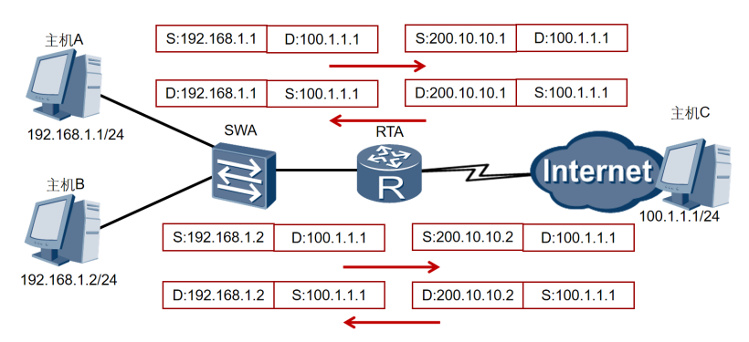

# IPv4协议和NAT的由来

IPv4即网际网协议第4版——Internet Protocol Version 4的缩写。IPv4定义一个跨越异种网络互连的超级网，它为每个网际网的节点分配全球唯一IP地址。

如果我们把Internet比作一个邮政系统，那么IP地址的作用就等同于包含城市、街区、门牌编号在内的完整地址。IPv4地址使用32bits整数表达一个地址，地址最大范围就是2的三十二次方，约为43亿。

以IPv4协议创始时期可被联网的设备来看，这样的一个空间已经很大，很难被短时间用完。然而，事实远远超出人们的设想，计算机网络在此后的几十年里迅速壮大，网络终端数量呈爆炸性增长。

全球 IPv4 地址早已不够用，因此人们发明了 NAT（网络地址转换）来缓解这个问题。

简单来说，大部分机器都使用**私有 IP 地址**，如果它们需要访问公网服务，那么，

- 出向流量：需要经过一台 NAT 设备，它会对流量进行 SNAT，将私有 srcIP+Port 转换成 NAT 设备的公网 IP+Port（这样应答包才能回来），然后再将包发出去；
- 应答流量（入向）：到达 NAT 设备后进行相反的转换，然后再转发给客户端。

整个过程对双方透明。

> 更多关于 NAT 的内容，可参考 [(译) NAT - 网络地址转换（2016）](https://arthurchiao.art/blog/nat-zh/)。 译注。

[RFC2663](https://datatracker.ietf.org/doc/html/rfc2663#section-4.0) 把 NAT 分成了四类：传统 NAT、双向 NAT、两次 NAT、多宿主 NAT。

**有状态防火墙**

无论是终端，服务器，路由器，防火墙。实际上，**大部分 NAT 设备都自带了一个有状态防火墙**

有状态防火墙具体有很多种类型，有些你可能见过：

- Windows Defender firewall
- Ubuntu’s ufw (using iptables/nftables)
- BSD/macOS `pf`
- AWS Security Groups（**安全组**）

以上防火墙的配置都是很灵活的，但大部分配置默认都是如下行为：

1. **允许所有出向连接**（allows all “outbound” connections）
2. **禁止所有入向连接**（blocks all “inbound” connections）

可能有少量例外规则，例如 allowing inbound SSH。

连接（connection）和方向（direction）都是协议设计者头脑中的概念，到了 **物理传输层，每个连接都是双向的**；允许所有的包双向传输。 那**防火墙是如何区分哪些是入向包、哪些是出向包的呢**？ 

这就要回到**“有状态”（stateful）**这三个字了：有状态防火墙会记录它 看到的每个包，当收到下一个包时，会利用这些信息（状态）来判断应该做什么。

## Traditional NAT (or) Outbound NAT

### Basic NAT

Basic NAT方式属于一对一的地址转换，在这种方式下只转换IP地址，而对TCP/UDP协议的端口号不处理，一个公网IP地址不能同时被多个用户使用。

如果一个内部主机唯一占用一个公网IP，这种方式被称为一对一模型。此种方式下，转换上层协议就是不必要的，因为一个公网IP就能唯一对应一个内部主机。

- NAT设备收到私网侧主机发送的访问公网侧服务器的报文。

- NAT设备从地址池中选取一个空闲的公网IP地址，建立与私网侧报文源IP地址间的NAT转换表项（正反向），并依据查找正向NAT表项的结果将报文转换后向公网侧发送。

- NAT设备收到公网侧的回应报文后，根据其目的IP地址查找反向NAT表项，并依据查表结果将报文转换后向私网侧发送。

可以认为 NAT 设备是一个**增强版的有状态防火墙**，

> 由于Basic NAT这种一对一的转换方式并未实现公网地址的复用，不能有效解决IP地址短缺的问题，因此在实际应用中并不常用。
>
> 显然，这种方式对节约公网IP没有太大意义，主要是为了实现一些特殊的组网需求。比如用户希望隐藏内部主机的真实IP，或者实现两个IP地址重叠网络的通信。
>
> 

### Network Address Port Translation (NAPT)

NAT最典型的应用场景，一个组织网络，在出口位置部署NAT网关，所有对公网的访问表现为一台主机。这就是所谓的一对多模型。**这种方式下，出口设备只占用一个由Internet服务提供商分配的公网IP地址。**

面对私网内部数量庞大的主机，如果NAT只进行IP地址的简单替换，就会产生一个问题：当有多个内部主机去访问同一个服务器时，从返回的信息不足以区分响应应该转发到哪个内部主机。

此时，需要NAT设备根据传输层信息或其他上层协议去区分不同的会话，并且可能要对上层协议的标识进行转换，比如TCP或UDP端口号。

这样NAT网关就可以将不同的内部连接访问映射到同一公网IP的不同传输层端口，通过这种方式实现公网IP的复用和解复用。

这种方式也被称为端口转换PAT、NAPT或IP伪装，但更多时候直接被称为NAT，因为它是最典型的一种应用模式。

在许多小区、学校和企业的私网规划中，由于公网地址资源有限，通常给私网用户分配私网IPv4地址。此时，可以配置源NAT来实现私网用户访问Internet。用户可以根据自己拥有的公网IPv4地址的个数，选择使用NAPT或者Easy IP。

**对于消费级路由器，会将所有设备的（私有） IP 地址映射为单个连接到公网的 IP 地址。**

在许多小区、学校和企业的私网规划中，由于公网地址资源有限，通常给私网用户分配私网IPv4地址。此时，可以配置源NAT来实现私网用户访问Internet。用户可以根据自己拥有的公网IPv4地址的个数，选择使用NAPT或者Easy IP。

NAPT方式属于多对一的地址转换，它通过使用“IP地址＋端口号”的形式进行转换，使多个私网用户可共用一个公网IP地址访问外网，因此是地址转换实现的主要形式。

## 双向NAT

**Bi-directional NAT (or) Two-Way NAT**

## Twice NAT

## Multihomed NAT

### 一对一的NAT

如果一个内部主机唯一占用一个公网IP，这种方式被称为一对一模型。此种方式下，转换上层协议就是不必要的，因为一个公网IP就能唯一对应一个内部主机。

显然，这种方式对节约公网IP没有太大意义，主要是为了实现一些特殊的组网需求。比如用户希望隐藏内部主机的真实IP，或者实现两个IP地址重叠网络的通信。

### 一对多的NAT

一个组织网络，在出口位置部署NAT网关，所有对公网的访问表现为一台主机。这就是所谓的一对多模型。

这种方式下，出口设备只占用一个由Internet服务提供商分配的公网IP地址。面对私网内部数量庞大的主机，如果NAT只进行IP地址的简单替换，就会产生一个问题：当有多个内部主机去访问同一个服务器时，从返回的信息不足以区分响应应该转发到哪个内部主机。

此时，需要NAT设备根据传输层信息或其他上层协议去区分不同的会话，并且可能要对上层协议的标识进行转换，比如TCP或UDP端口号。这样NAT网关就可以将不同的内部连接访问映射到同一公网IP的不同传输层端口，通过这种方式实现公网IP的复用和解复用。这种方式也被称为端口转换PAT、NAPT或IP伪装，但更多时候直接被称为NAT，因为它是最典型的一种应用模式。

根据NAT转换是对报文中的源地址进行转换还是对目的地址进行转换，NAT可以分为SNAT、DNAT和双向NAT

### SNAT

源NAT在NAT转换时，仅对报文中的源地址进行转换，主要应用于私网用户访问公网的场景。当私网用户主机访问Internet时，私网用户主机发送的报文到达NAT设备后，设备通过源NAT技术将报文中的私网IPv4地址转换成公网IPv4地址，从而使私网用户可以正常访问Internet。

### 基本NAT

现在一般都是分配私有IP给普通用户。可以看看自己的路由器WAN口是不是属于10.0.0.0/8，172.16.0.0/12、192.168.0.0/16或100.64.0.0/10。

如果是，那运营商分配给你的就是私有地址。

但是互联网主要发展于欧美，因此许多欧美的组织与机构在初期被分配了大量的 IPv4 资源，而后入场的中国分配到的 IPv4 地址就不太能匹配上我们的人口。 

因此相比欧美，中国的 IPv4 地址是非常短缺的，即使使用上述这样的网络架构——也就是给每个家庭（或组织）分配一个 IPv4 地址——都有点捉襟见肘了。 

于是中国电信等国内运营商不得不再加一层 NAT，让多个家庭共用同一个 IP 地址，这时网络架构会变成这样：

「家庭局域网」=>「家庭 NAT 网关」=>「运营商广域网」=>「运营商 NAT 网关」=>「公共因特网」。 

由于此架构通过两层 NAT 网关串联了三个不同的 IPv4 网络，它也被形象地称为 NAT444 技术。

对于IPv4业务，通过两级NAT44实现承载，级NAT44是在家庭网络CPE侧，实现用户私有IPv4地址到运营私有IPv4地址的映射，模式是1:1映射，第二级NAT44是在网络的LSN(Large Sacle NAT)，实现运营私有IPv4地址到公网IPv4地址的映射，模式是N:1映射