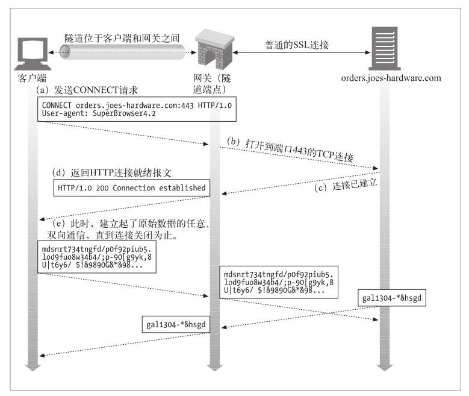

## 代理


代理是一种存在于网络中间的实体，提供各式各样的功能。现代网络系统中，代理无处不在。

其功能就是代理网络用户去取得网络信息。形象的说：它是网络信息的中转站。

- 对于客户端来说，代理扮演的是服务器的角色，接收请求报文，返回响应报文；
- 对于web服务器来说，代理扮演的是客户端的角色，发送请求报文，接收响应报文。


代理具有多种类型，如果是根据网络用户划分的话，可以划分为正向代理和反向代理：

- 正向代理：客户端访问服务端时，先访问代理服务器，随后代理服务器再访问服务端。此过程需客户端进行代理配置，对服务端透明。

- 反向代理：将服务端作为网络用户。访问过程与正向代理相同，不过此过程对客户端透明，需服务端进行代理配置（也可不配置）。


<center>正向代理<center/>


<center>反向代理</center>


## HTTP 代理


HTTP 代理，顾名思义，他做为一个中间人，可以代理客户端的 HTTP 请求。

http代理可以承载http协议，https协议，ftp协议等等。对于不同的协议，客户端和代理服务器间的数据格式略有不同。

> HTTP 客户端向代理发送请求报文，代理服务器需要正确地处理请求和连接（例如正确处理 Connection: keep-alive），同时向服务器发送请求，并将收到的响应转发给客户端。


假如我通过代理访问 A 网站，对于 A 来说，它会把代理当做客户端，完全察觉不到真正客户端的存在，这实现了隐藏客户端 IP 的目的。

给浏览器显式的指定代理，需要手动修改浏览器或操作系统相关设置，或者指定 PAC（Proxy Auto-Configuration，自动配置代理）文件自动设置。

还有些浏览器支持 WPAD（Web Proxy Autodiscovery Protocol，Web 代理自动发现协议）。


客户端请求发送给代理，代理拿着请求去请求远端服务器，然后将结果返回给客户端。

- 在客户端浏览器上F12看到的是 **远端IP** 是代理的地址。
- 在服务器端 netstat 看到 TCP 连接的另外 Foreign Address 也是代理的地址。


**使用这种代理的特点，即可以修改 TCP 连接四元组中的源地址。**

**主要使用场景**

- **爬虫（代理自己的请求，让服务端不知道真正的请求是哪里发出来的，无法封杀）**
- **DDos 攻击。（使用海量的 HTTP 代理，向服务端发起并发请求，其实跟爬虫很像，爬虫目的为了爬取数据和资源，DDos只是为了组织网站提供服务）**
- **保护（可以设置某些网站仅对某些地址开放，其他人需要访问，都可以配上相应的 HTTP 代理）**


```javascript
var http = require('http');
var net = require('net');
var url = require('url');

function request(cReq, cRes) {
    var u = url.parse(cReq.url);

    var options = {
        hostname : u.hostname, 
        port     : u.port || 80,
        path     : u.path,       
        method     : cReq.method,
        headers     : cReq.headers
    };

    var pReq = http.request(options, function(pRes) {
        cRes.writeHead(pRes.statusCode, pRes.headers);
        pRes.pipe(cRes);
    }).on('error', function(e) {
        cRes.end();
    });

    cReq.pipe(pReq);
}

http.createServer().on('request', request).listen(8888, '0.0.0.0');
```


以上代码运行后，会在本地 `8888` 端口开启 HTTP 代理服务，这个服务从请求报文中解析出请求 URL 和其他必要参数，新建到服务端的请求，并把代理收到的请求转发给新建的请求，最后再把服务端响应返回给浏览器。修改浏览器的 HTTP 代理为 `127.0.0.1:8888` 后再访问 HTTP 网站，代理可以正常工作。

普通的 HTTP 代理，有一个最大的限制，就是无法访问 HTTPS 网站，答案很简单，这个代理提供的是 HTTP 服务，根本没办法承载 HTTPS 服务。

显然，这种代理本质上只是一个中间人，而 HTTPS 网站的证书认证机制是中间人劫持的克星。普通的 HTTPS 服务中，服务端不验证客户端的证书，中间人可以作为客户端与服务端成功完成 TLS 握手；但是中间人没有证书私钥，无论如何也无法伪造成服务端跟客户端建立 TLS 连接。当然如果你拥有证书私钥，代理证书对应的 HTTPS 网站当然就没问题了。


HTTP 抓包神器 Fiddler 的工作原理也是在本地开启 HTTP 代理服务，通过让浏览器流量走这个代理，从而实现显示和修改 HTTP 包的功能。如果要让 Fiddler 解密 HTTPS 包的内容，需要先将它自带的根证书导入到系统受信任的根证书列表中。一旦完成这一步，浏览器就会信任 Fiddler 后续的「伪造证书」，从而在浏览器和 Fiddler、Fiddler 和服务端之间都能成功建立 TLS 连接。而对于 Fiddler 这个节点来说，两端的 TLS 流量都是可以解密的。

如果我们不导入根证书，Fiddler 的 HTTP 代理还能代理 HTTPS 流量么？实践证明，不导入根证书，Fiddler 只是无法解密 HTTPS 流量，HTTPS 网站还是可以正常访问。


头部 


```
// 直接连接
GET / HTTP/1.1
Host: staight.github.io
Connection: keep-alive

// http代理
GET http://staight.github.io/ HTTP/1.1
Host: staight.github.io
Proxy-Connection: keep-alive


```

当客户端和服务端存在一个或多个中间实体（如代理）时，每个请求报文都会从客户端（通常是浏览器）开始，逐跳发给服务器；服务器的响应报文，也会逐跳返回给客户端。

通常，即使通过了重重代理，请求头都会原封不动的发给服务器，响应头也会原样被客户端收到。

但 Connection，以及 Connection 定义的其它 Header，只是对上个节点和当前节点之间的连接进行说明，必须在报文转给下个节点之前删除，否则可能会引发后面要提到的问题。

其它不能传递的 Header 还有Prxoy-Authenticate、Proxy-Connection、Transfer-Encoding 和 Upgrade。


「close」表示操作完成后需要关闭当前连接；Connection 还允许任何字符串作为它的值，如「my-connection」，用来存放自定义的连接说明。

HTTP/1.0 默认不支持持久连接，很多 HTTP/1.0 的浏览器和服务器使用「Keep-Alive」这个自定义说明来协商持久连接：浏览器在请求头里加上 Connection: Keep-Alive，服务端返回同样的内容，这个连接就会被保持供后续使用。对于 HTTP/1.1，Connection: Keep-Alive 已经失去意义了，因为 HTTP/1.1 除了显式地将 Connection 指定为 close，默认都是持久连接。


## 隧道代理


> WEB隧道，这种方式可以通过 HTTP 应用程序访问使用非 HTTP 协议的应用程序。
>
> Web 隧道允许用户通过 HTTP 连接发送非 HTTP 流量，这样就可以在 HTTP 上捎带其他协议数据了。
>
> 
>
> 使用 Web 隧道最常见的原因就是要在 HTTP 连接中嵌入非 HTTP流量，这样，这类流量就可以穿过只允许 Web 流量通过的防火墙了。
>
> 
>
> **HTTP 客户端通过 CONNECT 方法请求隧道代理创建一条到达任意目的服务器和端口的 TCP 连接，并对客户端和服务器之间的后继数据进行盲转发。**
>
> HTTP权威指南


### CONNECT 方法


Web 隧道是用 HTTP 的 CONNECT 方法建立起来的。CONNECT 方法并不是 HTTP/1.1 核心规范的一部分，但却是一种得到广泛应用的扩展。





假如我通过代理访问 A 网站，浏览器首先通过 CONNECT 请求，让代理创建一条到 A 网站的 TCP 连接；一旦 TCP 连接建好，代理无脑转发后续流量即可。所以这种代理，理论上适用于任意基于 TCP 的应用层协议，HTTPS 网站使用的 TLS 协议当然也可以。

这也是这种代理为什么被称为隧道的原因。对于 HTTPS 来说，客户端透过代理直接跟服务端进行 TLS 握手协商密钥，依然是安全的。