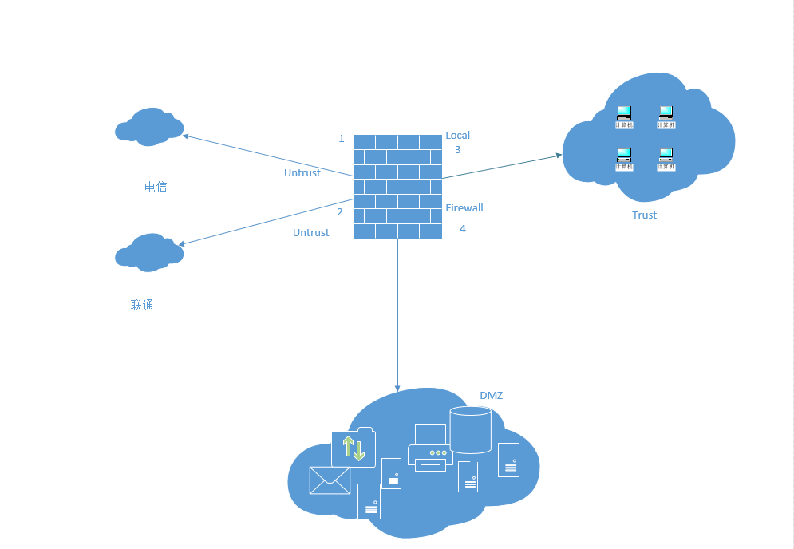

# 起源


防火墙，顾名思义，阻挡的是火，此词起源于建筑领域，正是用来隔离火灾，阻止火势从一个区域蔓延到另一个区域。

引入到通信领域，防火墙也正是形象化地体现了这一特点：防火墙这一具体设备，通常用于两个网络之间的隔离。

当然，这种隔离是高明的，**隔离的是“火”的蔓延，而又保证“人”的穿墙而过。这里的“火”是指网络中的各种攻击，而“人”是指正常的通信报文。**

用通信语言来定义，防火墙主要用于保护一个网络区域免受来自另一个网络区域的网络攻击和网络入侵行为。

因其隔离、防守的属性，灵活应用于 **网络边界**、**子网隔离** 等位置，具体如企业网络出口、大型网络内部子网隔离、数据中心边界等等。


防火墙与路由器、交换机是有区别的：

- 路由器用来连接不同的网络，通过路由协议保证互联互通，确保将报文转发到目的地；

- 交换机则通常用来组建局域网，作为局域网通信的重要枢纽，通过二层/三层交换快速转发报文；

- 而防火墙主要部署在网络边界，对进出网络的访问行为进行控制，安全防护是其核心特性。路由器与交换机的本质是**转发**，防火墙的本质是**控制**。


现阶段中低端路由器与防火墙有合一趋势，主要也是因为二者互相功能兼具，变成 all in one 的目标，华为也发布了一系列此中低端设备。


# 防火墙的历史

最早的防火墙可以追溯到上世纪80年代末期，距今已有二十多年的历史。在这二十多年间，防火墙的发展过程大致可以划分为下面三个时期：


**1989年至1994年**

- 1989年产生了包过滤防火墙，实现简单的访问控制，我们称之为第一代防火墙。
- 随后出现了代理防火墙，在应用层代理内部网络和外部网络之间的通信，属于第二代防火墙。代理防火墙安全性较高，但处理速度慢，而且对每一种应用开发一个对应的代理服务是很难做到的，因此只能对少量的应用提供代理支持。
- 1994年CheckPoint公司发布了第一台基于状态检测技术的防火墙，通过动态分析报文的状态来决定对报文采取的动作，不需要为每个应用程序都进行代理，处理速度快而且安全性高。状态检测防火墙被称为第三代防火墙。


**1995年至2004年**

- 在这一时期，状态检测防火墙已经成为趋势。除了访问控制功能之外，防火墙上也开始增加一些其他功能，如VPN。
- 同时，一些专用设备也在这一时期出现了雏形。例如，专门保护Web服务器安全的WAF（Web Application Firewall，Web应用防火墙）设备。
- 2004年业界提出了UTM（United Threat Management，统一威胁管理）的概念，将传统防火墙、入侵检测、防病毒、URL过滤、应用程序控制、邮件过滤等功能融合到一台防火墙上，实现全面的安全防护。


**2005年至今**

- 2004年后，UTM市场得到了快速的发展，UTM产品如雨后春笋般涌现，但面临新的问题。首先是对应用层信息的检测程度受到限制，举个例子，假设防火墙允许“男人”通过，拒绝“女人”通过，那么是否允许来自星星的都教授（外星人）通过呢？此时就需要更高级的检测手段，这使得DPI（Deep Packet Inspection，深度报文检测）技术得到广泛应用。其次是性能问题，多个功能同时运行，UTM设备的处理性能将会严重下降。
- 2008年Palo Alto Networks公司发布了下一代防火墙，解决了多个功能同时运行时性能下降的问题。同时，还可以基于用户、应用和内容来进行管控。
- 2009年Gartner对下一代防火墙进行了定义，明确下一代防火墙应具备的功能特性。随后各个安全厂商也推出了各自的下一代防火墙产品，防火墙进入了一个新的时代。


从防火墙的发展历史中我们可以看到以下三个最主要的特点：


- 第一点是访问控制越来越精确。从最初的简单访问控制，到基于会话的访问控制，再到下一代防火墙上基于应用、用户和内容来做访问控制，都是为了实现更有效更精确地访问控制。
- 第二点是防护能力越来越强。从早期的隔离功能，到逐渐增加了入侵检测、防病毒、URL过滤、应用程序控制、邮件过滤等功能，防护手段越来越多，防护的范围也越来越广。
- 第三点是性能越来越高。随着网络中业务流量爆炸式增长，对性能的需求也越来越高，各个防火墙厂商通过对硬件和软件架构的不断改进，使防火墙的处理性能与业务流量相匹配。


# **NGFW**


NGFW 的全称是 Next-Generation Firewall，即下一代防火墙。早在2007年，著名咨询机构 Gartner 就提出了 NGFW 的概念。

2009年，Gartner 正式发布了《Defining the Next-Generation Firewall》。

没错，NGFW 是由一个咨询公司定义、得到众多安全厂商支持的概念和产品形态，是防火墙的新发展。


Gartner 把 NGFW 看做不同信任级别的网络之间的一个线速（wire-speed）实时防护设备，能够对流量执行深度检测，并阻断攻击。

Gartner 认为，NGFW 必须具备以下能力：


- **传统防火墙的功能**：NGFW是新环境下传统防火墙的替代产品，必须前向兼容传统防火墙的基本功能，包括包过滤、协议状态检测、NAT、VPN等。
- **IPS与防火墙的深度集成**：且实现与防火墙功能的深度融合，实现1+1>2的效果。Gartner特别强调IPS与防火墙的“集成”而不仅仅是“联动”。
  - 例如，防火墙应根据IPS检测到的恶意流量自动更新下发安全策略，而不需要管理员的介入。换言之，集成IPS的防火墙将更加智能。
  - Gartner发现，NGFW产品和独立IPS产品的市场正在融合，尤其是在企业边界的部署场景下，NGFW正在吸收独立IPS产品的市场。
- **应用感知与全栈可视化**
  - 具备应用感知能力，并能够基于应用实施精细化的安全管控策略和层次化的带宽管理手段，是NGFW引进的最重要的能力。
  - 传统的状态检测防火墙工作在二到四层，不会对报文的载荷进行检查。NGFW能对七层检测，可以清楚地呈现网络中的具体业务，并实行管控。

- **利用防火墙以外的信息，增强管控能力**
  - 防火墙能够利用其他IT系统提供的用户信息、位置信息、漏洞和网络资源信息等，帮助改进和优化安全策略。
  - 例如，通过集成用户认证系统，实现基于用户的安全策略，以应对移动办公场景下，IP地址变化带来的管控难题。


防火墙从诞生那一天起，就是紧跟着网络演进的步伐亦步亦趋的。NGFW的出现，正是来自时代的呼唤。


传统防火墙时代，互联网的功能刚刚从互联互通发展到以静态网页浏览、Email、FTP下载为主的信息共享时代。

网络办公与休闲之间的应用界限还比较清晰。网络流量主要是上述“存储-转发”类的应用，应用和端口、协议之间还有着相对清晰的映射关系。

端口和协议是主要管控对象，防火墙基于端口来过滤网络流量就够了。


此后，以 QQ 为代表的IM、P2P、VoIP、游戏、网络视频等等新应用迭出，更有一枚不同寻常的苹果激发了移动互联网时代的到来。

这一路发展下来，当真是突飞猛进。今天，互联网已经渗透到生活的方方面面，成为一种“生活必需品”了。


互联网的发展，不仅丰富了人们的沟通和生活（好像有点眼熟），也提升了工作效率。不过，网络毕竟是无边界的，工作与生活也没那么容易分开了。

要是有员工在上班时间玩玩游戏，看看视频，或者跟同学好友聊天闲谈，就不仅是影响工作效率了。

带宽滥用、敏感信息泄露、针对应用的攻击等等都成为威胁企业网络安全的重要问题。

就像每个美丽的城市都有不堪入目的小巷一样，移动互联网和社交网络中的热门应用多隐藏着漏洞，恶意软件和互联网犯罪日益猖獗，给企业带来新的威胁。

简而言之，网络中可能包括协作类应用、即时消息、电话会议、流媒体、文件共享、在线存储、VoIP、P2P、游戏、娱乐等等各种应用。

**企业必须正确区分合法应用、风险应用和带宽占用类应用，保证正常业务的带宽，限制甚至阻断社交媒体和游戏娱乐类应用，并消除潜在的威胁。**

这一切都落在了防火墙的肩上，这是时代对防火墙提出的新要求。

传统的状态检测防火墙显然不能承担这个重任。


# 华为防火墙


华为防火墙产品主要包括 USG2000、USG5000、USG6000 和 USG9500 四大系列，涵盖低、中、高端设备，型号齐全功能丰富，完全能够满足各种网络环境的需求。

其中，USG2000和USG5000系列定位于UTM产品，USG6000系列属于下一代防火墙产品，USG9500系列属于高端防火墙产品。


**USG2110**

首先出场的是小盒子USG2110，别看它个头小，功能可不差。USG2100集防火墙、UTM、VPN、路由、无线（WIFI/3G）等十八般武艺于一身，即插即用，配置方便，为客户提供安全、灵活、便捷的一体化组网和接入解决方案。

USG2110物美价廉，在节省客户花销的同时，能有效降低运维成本，是中小企业、连锁机构、SOHO企业之必备神器。


**USG6600**

接下来出场的是超高人气产品USG6600，它出身于USG6000家族，作为华为面向下一代网络环境的防火墙产品，USG6600提供以应用层威胁防护为核心的下一代网络安全，让网络管理员重新掌控网络，看得更清、管得更细、用得更易。

说它人气超高一点也不为过，IT风云榜CIO信赖优秀产品、IT168年度技术卓越奖、网络世界NGFW横向测评多项第一、Forrester“网络隔离网关”报告高度评价等等，USG6600发布后就获得了各个方面的关注和好评，足以证明它的超高人气。


**USG9500**

最后登场的是大块头USG9500，大块头有大智慧，大体格有大心脏。作为业界首款T级数据中心防火墙，USG9500刚刚成功通过业界权威第三方安全测评机构美国NSS实验室的测试，获评为业界最快的防火墙！

USG9500采用分布式软硬件设计，融合了多种行业领先的专业安全技术，将交换、路由、安全服务整合到统一的设备中，在大型数据中心、大型企业、教育、***、广电等行业和典型场景得到广泛应用。


天下武功，唯快不破。在以高速网络为基石的云计算时代，USG9500系列作为华为最高端的防火墙产品，如磐石屹立不倒，似大海吸纳百川，从容应对海量访问和数据洪流。至强性能扛万斤重担，应云而生保万全之策，正是USG9500系列防火墙产品的真实写照。


# 防火墙基础知识


防火墙通俗讲是用于控制网络之间的隔离，专业讲是用于保护一个安全区域免受另外一个安全区域的网络攻击和入击行为。

从防火墙的定义中可以看出防火墙是基于安全区域的，其它厂商（Cisco，Juniper，H3C 等）都是有这个概念的。什么是安全区域呢？

在防火墙上引入了一个重要的概念：**安全区域（Security Zone），又简称为区域（Zone）**。

**区域是一个逻辑概念，用于管理防火墙设备上安全需求相同的多个接口，也就是说它是一个或多个接口的集合。**

**管理员将安全需求相同的接口进行分类，并划分到不同的安全域，能够实现安全策略的统一管理。**


安全区域是一个或多个接口的集合，是防火墙区别于路由器的主要特性。

防火墙通过安全区域来划分网络、标识报文流动的“路线”，当报文在不同的安全区域之间流动时，才会触发安全检查。


华为防火墙默认预定义了四个固定的安全区域，分别为：

- Trust:该区域内网络的受信任程度高，通常用来定义内部用户所在的网络。（）

- Untrust:该区域代表的是不受信任的网络，通常用来定义Internet 等不安全的网络。

- DMZ（Demilitarized非军事区）:该区域内网络的受信任程度中等，通常用来定义内部服务器(公司OA系统，ERP系统等)所在的网络。

  > 说明：DMZ这一术语起源于军方，指的是介于严格的军事管制区和松散的公共区域之间的一种有着部分管制的区域。

- Local：防火墙上提供了Local 区域，代表防火墙本身。

  - 比如防火墙主动发起的报文（我们在防火墙执行ping测试）以及抵达防火墙自身的报文（我们要网管防火墙telnet、ssh、http、https）。
  - Local区域中不能添加任何接口，但防火墙上所有接口本身都隐含属于Local区域。
  - 也就是说，报文通过接口去往某个网络时，目的安全区域是该接口所在的安全区域；报文通过接口到达防火墙本身时，目的安全区域是Local区域。


**注意：默认的安全区域无需创建，也不能删除，同时安全级别也不能重新配置。USG防火墙最多支持32个安全区域。**

Local 区域中不能添加任何接口，但防火墙上所有接口本身都隐含属于Local 区域。

也就是说，报文通过接口去往某个网络时，目的安全区域是该接口所在的安全区域；报文通过接口到达防火墙本身时，目的安全区域是Local 区域。




如图是一个简单的企业组网，两条ISP线路，trust是企业内网。DMZ是服务器所在区域。


- 防火墙1号接口和2号接口连接到两个不同的运营商（电信和联通）。它们属于同一个安全区域 Untrust。
- 防火墙3号接口属于 Trust 安全区域。（企业内网）
- 防火墙4号接口属于DMZ安全区域。（企业内部服务器）


- 当内部用户访问互联网时，源区域是Trust，目的区域是Untrust；
- 当互联网用户（通过防火墙的NAT）访问 DMZ 服务器时，源区域是Untrust，目的区域是DMZ;
- 当互联网用户网管防火墙时，源区域是 Untrust，目的区域是Local;
- 当防火墙向 DMZ 服务器发起 ICMP 流量时，源区域是 Local，目的区域是DMZ。


**相关命令**

```shell
# 查看安全区域 display zone

<SZ_QHData_FW>display zone
2021-07-08 00:28:25.430 +08:00
local
 priority is 100
 interface of the zone is (0):
#
trust
 priority is 85
 interface of the zone is (2):
    GigabitEthernet0/0/1
    MEth0/0/0
#
untrust
 priority is 5
 interface of the zone is (4):
    Dialer0
    Dialer1
    WAN0/0/0
    WAN0/0/1
#
dmz
 priority is 50
 interface of the zone is (0):
#
<SZ_QHData_FW>
<SZ_QHData_FW>
<SZ_QHData_FW>
```


# 安全策略实践


