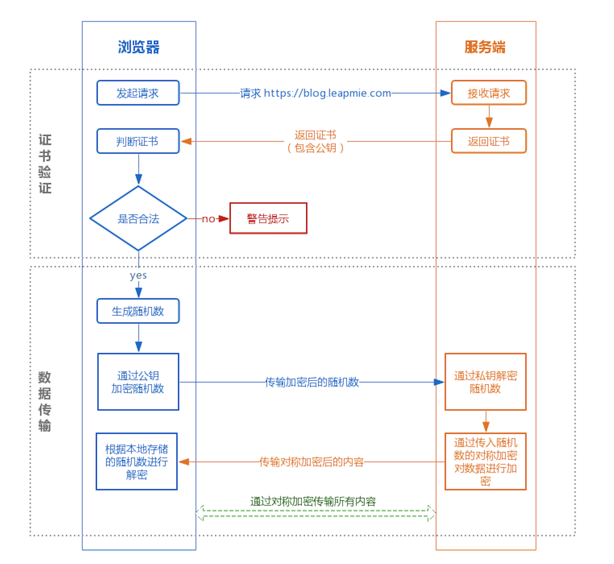

# 深入浅出HTTPS

人们在最初早期设计互联网时，很少考虑到信息安全。这样的结果就是，核心通信协议本质上是不安全的，只能依靠所有参与方的诚信。

互联网的核心是建立在 TCP/IP 协议簇之上。这些协议将数据分割成小数据包进行传输。这些数据包在全世界范围内经历数千公里的传输，在此期间要经历许多国家各种设备。

由于协议本身不提供任何保障，任何有权访问通信链路的人都可以获得通信数据，并且可以在不被察觉的情况下修改这些数据。

由此，曾经的 Netscape 公司开发 SSL 协议。

不使用SSL/TLS的HTTP通信，就是不加密的通信。所有的信息明文传播，带来了三大风险：

- 窃听风险（eavesdropping）：第三方可以获知通信内容。
- 篡改风险（tampering）：第三方可以修改通信内容。 
- 冒充风险（pretending）：第三方可以冒充他人身份参与通信。

安全套接字层(SSL)是最初的协议，用于以HTTPS的形式为HTTP通信提供加密。

SSL有两个公开发布的版本——版本2和版本3。这两种方法都有严重的密码弱点，不应再使用。

由于各种原因，该协议的下一个版本(有效的SSL 3.1)被命名为传输层安全(TLS)版本1.0。随后又发布了TLS 1.1、1.2和1.3版本。SSL协议有大量的弱点，在任何情况下都不应使用。

- 为什么用了 HTTPS 就是安全的？
- HTTPS 的底层原理如何实现？
- 用了 HTTPS 就一定安全吗？
- 什么是TLS双向认证？
- 客户端是如何确保服务端身份？
- 服务端如何确保客户端身份？HTTPS报文在传输过程被篡改了怎么办？
- 如何保证安全呢？你说安全就安全吗，究竟是怎么实现的呢？绝对安全吗？

## 背景介绍

### CA 机构

CA: 证书授权中心 (certificate authority)

类似于国家出入境管理处一样，给别人颁发护照；也类似于国家工商管理局一样，给公司/企业颁发营业执照。

为了让服务端的公钥被大家信任，服务端的证书都是由 CA （Certificate Authority，证书认证机构）签名的。

CA 就是网络世界里的公安局、公证中心，具有极高的可信度，所以由它来给各个公钥签名，信任的一方签发的证书，那必然证书也是被信任的。

CA（Certificate Authority）即数字证书颁发机构，主要负责发放和管理数字证书，SSL证书就是CA机构颁发的。

目前市场上大部分用户使用的SSL证书都是国外品牌。常见CA机构：

- 沃通CA 
- DigiCert
- GlobalSign
- letsencrypt

默认地，这些

在 HTTP 里面，各种**HTTPS证书**都是由**CA**来签发给**域名持有人（服务器）**的。

第一个问题：我是 google.com 的域名持有者，我要向CA机构申请一个 https://www.google.com 的 https 证书。我如何证明我持有这个域名？

​						即，域名持有者向CA申请时，如何自证自己是真正持有域名？

第二个问题：域名持有者，向CA机构申请HTTPS证书，如何确认通讯过程是真正的CA。

​						即，CA签发证书，如何自证是真正的CA？

CA 签发证书的过程：

1）准备 CSR 文件：

我自己的网站，需要使用 https 通信，那么我向 "证书CA机构" 申请数字证书的时候，就需要向他们提供相应的信息，这些信息要以特定文件格式(.csr)提供的。

这个文件就是"证书请求文件"；

为了确保我提供的信息在互联网的传输过程中不会被有意无意的被破坏或篡改，有如下的机制来对传输的内容进行保护：

首先在本地生成一个密钥对，利用这个私钥对"我们需要提供的信息（域名）"进行加密，从而生成 证书请求文件(.csr)，这个证书请求文件其实就是私钥对应的公钥证书的原始文件，里面含有对应的公钥信息；

同时根据 pub_svr 生成请求文件 csr，提交给 CA 机构，csr 中含有申请者的公钥、组织信息、个人信息（域名）等信息。（注意：只提交公钥。不提交私钥）

[什么是CSR文件](https://cloud.tencent.com/document/product/400/5367)

[如何制作CSR文件](https://support.huaweicloud.com/scm_faq/scm_01_0059.html)

[在线制作CSR](https://myssl.com/csr_create.html)

> 注：
>
> 手动CSR：上述过程用户自己生成。
>
> 自动CSR：在很多公有云中申请SSL证书，它们都自动在线帮你生成CSR文件了。大大简化操作。
>
> 公有云会帮你生成这个密钥对，并用公钥

2)  域名验证：按照CA中心的规范，申请数字证书，必须配合完成域名授权验证来证明您对所申请绑定的域名的所有权。

- DNS验证：CA指定一条DNS记录，你去你的域名商处添加一条DNS解析，CA来验证。

- 文件验证：将CA指定的 txt 文件部署到你的域名下，CA来验证。

- 邮箱验证：

  

  [域名验证方式](https://cloud.tencent.com/document/product/400/4142)

2）审核信息：CA 机构通过线上、线下等多种手段验证申请者提供信息的真实性，如组织是否存在、企业是否合法，是否拥有域名的所有权等。

3）签发证书：如信息审核通过，CA 机构会向申请者签发认证文件：HTTPS证书。

- HTTPS证书包含以下信息：
  - 申请者公钥、申请者的组织信息和个人信息、签发机构 CA 的信息、有效时间、证书序列号等信息的明文。
  - 同时包含一个签名（CA自证这个证书是这个CA签发的）

- 这个签名算法：

  - 首先，使用散列函数计算公开的明文信息的信息摘要，得到HASH值，然后用 **CA 的私钥** 对信息摘要进行加密，密文即签名。

    

> 我们可以拿到证书之后，可以在线查看证书的信息。
>
> [证书信息查看](https://myssl.com/cert_decode.html)

### 数字证书

- 证书文件：CA机构返回的证书文件，包含很多种格式和形式。包括 nginx , tomcat , apache 等等。
  - 1_domain._bundle.crt        

- 证书私钥文件
  - 自动CSR：
  - 手动CSR：自己要保留好自己的证书私钥文件。

### HTTPS请求

#### TLS握手阶段

- 浏览器发起 HTTPS 请求

- 服务端返回 HTTPS CA 证书

- 客户端验证证书是否合法，如果不合法则提示告警

  - 通常浏览器和操作系统中集成了各大 CA 的公钥信息，浏览器收到证书后可以使用 CA 的公钥解密 Certificate Signature 内容，得到一个 Hash 值 H2 ；
  - 
  
  

总结：

- CA签发证书，用私钥加密。这就叫签名，可以证明这个证书是我这个CA签发的。
- 公钥解密，
  - 其他人拿到这个证书，放到自己的服务器上，那其他人也可以伪造这个域名？

### CA证书链

有些网站因为各种原因，使用的证书可能是某个未被浏览器信任的CA机构签发的，或者是自己签发的自签名证书，这种情况下需要自己导入根证书才能访问该网站，比如曾经的12306网站（现在12306已经使用商业证书了）， 这么做的潜在风险是导入之后你将信任该CA机构签发的所有证书，更大的问题是，该CA可以伪造任何网站的证书，如果他们想干点坏事，就防不胜防了，所以强烈建议各位土豪朋友不要随意导入根证书，或是使用完及时删除。

各个顶级CA机构的根证书都内置在浏览器或者操作系统的发行包中，这些根证书当然可以使用来给客户签发证书请求，但实际中很少有CA机构这么干，原因在于如果某个根证书有问题，比如私钥泄露，基本上是灾难性的， 对应的CA根证书很快就会被各大浏览器和操作系统厂商移除，基本上不倒闭也去了半条命。所以绝大部分的顶级CA机构会用自己的根证书私钥签署一些二级（或多级）CA证书，然后用这些二级（或多级）CA证书的私钥给客户签发证书请求， 当某个二（多）级CA证书出幺蛾子的时候，只要把该二（多）级证书吊销就可以，波及面也不会那么大。

## 加密算法

- 空间身份防假冒（冒充服务提供者，去诈骗用户，冒充信息发送方，去诈骗接收方，比如假传圣旨，伪造圣旨等）

- 信息防泄密（盗取用户信息，用户数据，防止信息在传输过程中被第三方读取到，比如战争时期的无线电监听，电文破译等）

- 内容防篡改（信息传输过程防止被第三方篡改）

- 行为抗抵赖（防止抵赖）

**通信，信息从发送方出产生，通过各种媒介传输到接收方，中间的各种传输信道一般被认为是不可信的。**

比如以前的信件，无线电报，现在的互联网通信等，都有可能被截取或被篡改。所以加密这个需求自然而然就诞生了。

密码学的诞生，就是为了运用在战场，在公元前，战争之中出现了秘密书信。

在中国历史上最先的加密算法的记载出自于周朝兵书《六韬.龙韬》中的《阴符》和《阴书》。

在西方，在希罗多德（Herodotus）的《历史》中记载了公元前五世纪，希腊城邦和波斯帝国的战争中，普遍使用了移位法进行加密处理战争通信信息。

相传凯撒大帝为了防止敌人窃取信息，就使用加密的方式传递信息。

那么当时的加密方式很是的简单，就是对二十几个罗马字母创建一张对照表，将明文对应成为密文。

这种方式其实持续了好久。甚至在二战时期，日本的电报加密就是采用的这种原始加密方式。

在计算机诞生之前，以前就有通信需求，在古代，我们是通过书信等方式通讯。

一战二战时期电报兴起，电报是通过无线电波和电磁波来发送和传递信息的。只要电磁波频率和波长被捕获，电磁波中携带的信息就可以被接收。

### 对称加密算法

1976年以前，所有的加密方法都是同一种模式：

- 信息的发送方，选择某一种加密规则（比如说密码本，汉字与字符的映射表等），对信息进行加密，然后进行发送；
- 接收方使用同一种规则，对信息进行解密。

**这种方式被称为对称加密，加密规则被称为密钥**。

这种加密模式有一个最大弱点：甲方必须把加密规则告诉乙方，否则无法解密。保存和传递加密规则（密钥），就成了最头疼的问题。

### 非对称加密

1976年，两位美国计算机学家Whitfield Diffie 和 Martin Hellman，提出了一种崭新构思，能够在不直接传递密钥的状况下，完成解密。

这被称为"Diffie-Hellman密钥交换算法"。也正是由于这个算法的产生，人类终于能够实现非对称加密了：

以A要给B发送信息为例，过程大概如下：

1）B要先生成两把密钥（公钥和私钥）。公钥是公开的，任何人均可以得到（任何人都可以通过这个公钥来来加密信息，然后发送出去，自然只有B手上有密钥能解密），私钥则是保密的。

2）A获取B的公钥，而后用它对信息加密。

3）B获得加密后的信息，用自己私钥解密。

理论上若是公钥加密的信息只有私钥解得开，那么只要私钥不泄漏，通讯就是安全的。

#### RSA加密算法

1977年，三位数学家Rivest、Shamir 和 Adleman 设计了一种算法，可以实现非对称加密。

这种算法用他们三个人的名字命名，叫做RSA算法。从那时直到现在，RSA算法一直是最广为使用的"非对称加密算法"。

毫不夸张地说，只要有计算机网络的地方，就有RSA算法。

RSA加密算法是一种非对称加密算法，所谓非对称，就是指该算法加密和解密使用不同的密钥，即使用加密密钥进行加密、解密密钥进行解密。

在RAS算法中，加密密钥（即公开密钥）PK是公开信息，而解密密钥（即秘密密钥）SK是需要保密的。加密算法E和解密算法D也都是公开的。

虽然解密密钥SK是由公开密钥PK决定的，由于无法计算出大数n的欧拉函数phi(N)，所以不能根据PK计算出SK。

也就是说，对极大整数做因数分解的难度决定了RSA算法的可靠性。理论上，只要其钥匙的长度n足够长，用RSA加密的信息实际上是不能被解破的。

RSA算法通常是先生成一对RSA密钥，其中之一是保密密钥，由用户保存；另一个为公开密钥，可对外公开。

为提高保密强度，RSA密钥至少为500位长，一般推荐使用1024位。这就使加密的计算量很大。

为减少计算量，在传送信息时，常采用传统加密方法与公开密钥加密方法相结合的方式，即信息采用改进的DES或IDEA密钥加密，然后使用RSA密钥加密对话密钥和信息摘要。对方收到信息后，用不同的密钥解密并可核对信息摘要。

https://zhuanlan.zhihu.com/p/100389013