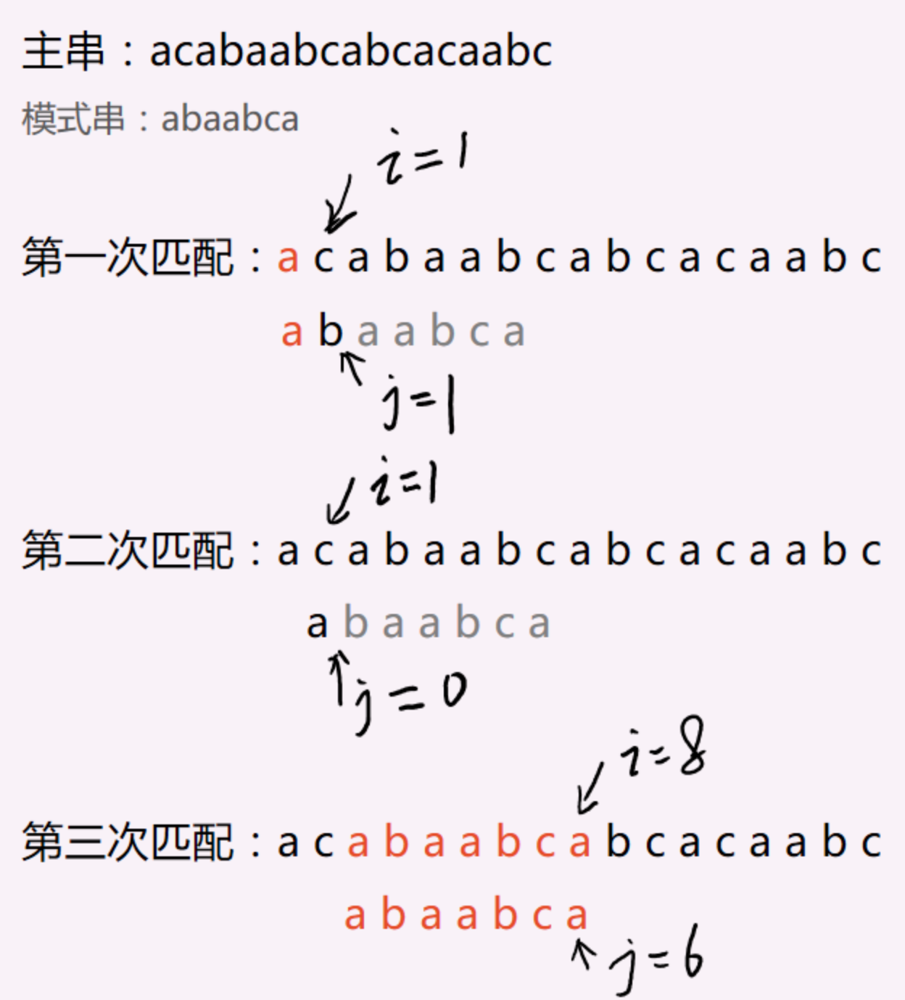

# 背景


一个很简单的问题，给定一个字符串 txt 和一个模式串 pat ，写一个函数 search 确认pat 是否是 txt 的一部分。

比如：

```go
txt="this is a test text"
pat="text"
```


# BF算法


> 术语：主串和模式串。简单来说，我们要在字符串 A 中查找子串 B，那么 A 就是主串，B 就是模式串。
>
> BF 是 Brute Force 的缩写，中文译作暴力匹配算法，也叫朴素匹配算法。


**这个算法思想可以归纳为一句话：我们只要暴力穷举所有 txt 中所有长度等于 len(pat) 的子串，并判断其是否和 pat 相等即可。**

如果主串长度为 `n`，模式串长度为 `m`，我们在主串中检查起始位置分别是 0、1、2…n-m 且长度为 `m` 的 `n-m+1` 个子串，看有没有跟模式串匹配的。

**在判断子串是否和 pat 相等时，我们需要逐位去比较。**





结合上图，具体来说，就是每次拿模式串和主串对齐，然后从左到右依次比较每个字符，如果出现不相等，则把模式串往后移一个位置，再次重复上述步骤，直到模式串每个字符与对应主串位置字符都相等，则返回主串对应下标，表示找到，否则返回 -1，表示没找到。


```go
package main
import "fmt"

// BF 算法实现函数
func bfSearch(s, p string) int {
    begin := 0
    i, j := 0, 0
    n, m := len(s), len(p)  // 主串、子串长度
    for i = 0; i < n; begin++ {
        // 通过 BF 算法暴力匹配子串和主串
        for j = 0;j < m; j++ {
            if i < n && s[i] == p[j] {
                // 如果子串和主串对应字符相等，逐一往后匹配
                i++
            } else {
                // 否则退出当前循环，从主串下一个字符继续开始匹配
                break
            }
        }
        if j == m {
            // 子串遍历完，表面已经找到，返回对应下标
            return i - j
        }
        // 从下一个位置继续开始匹配
        i = begin
        i++
    }
    return -1
}


// 基于 BF 算法实现字符串查找函数
func strStrV1(haystack, needle string) int {
    // 子串长度=0
    if len(needle) == 0 {
        return 0
    }
    //主串长度=0，或者主串长度小于子串长度
    if len(haystack) == 0 || len(haystack) < len(needle) {
        return -1
    }
    // 调用 BF 算法查找子串
    return bfSearch(haystack, needle)
}
func main() {
    s := "Hello, world!"
    p := "world"
    pos := strStrV1(s, p)
    fmt.Printf("Find \"%s\" at %d in \"%s\"\n", p, pos, s)
}
```


# KMP算法


> 
>
> 在[计算机科学](https://zh.wikipedia.org/wiki/计算机科学)中，**Knuth-Morris-Pratt[字符串查找算法](https://zh.wikipedia.org/wiki/字符串查找算法)**（简称为**KMP算法**）可在一个[字符串](https://zh.wikipedia.org/wiki/字符串)`S`内查找一个词`W`的出现位置。
>
> 一个词在不匹配时本身就包含足够的信息来确定下一个匹配可能的开始位置，此算法利用这一特性以避免重新检查先前匹配的[字符](https://zh.wikipedia.org/wiki/字符)。
>
> 这个算法由[高德纳](https://zh.wikipedia.org/wiki/高德纳)和[沃恩·普拉特](https://zh.wikipedia.org/w/index.php?title=沃恩·普拉特&action=edit&redlink=1)在1974年构思，同年[詹姆斯·H·莫里斯](https://zh.wikipedia.org/w/index.php?title=詹姆斯·H·莫里斯&action=edit&redlink=1)也独立地设计出该算法，最终三人于1977年联合发表。
>
> 维基百科


